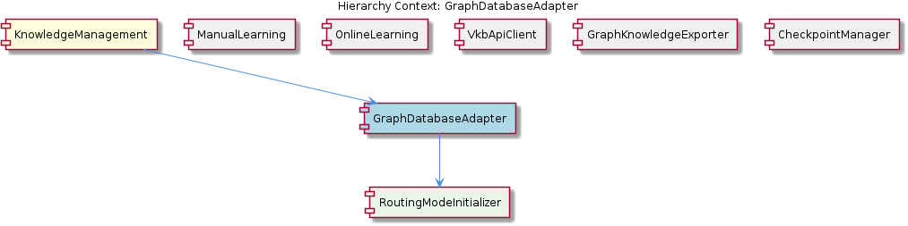
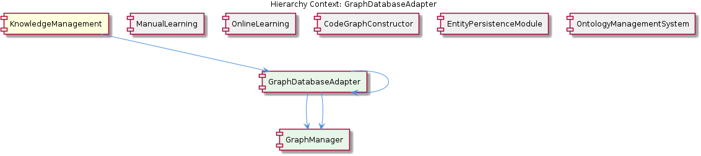

# GraphDatabaseAdapter

**Type:** SubComponent

The GraphDatabaseAdapter uses the CodeGraphConstructor for constructing a knowledge graph of code entities and their relationships.

## What It Is  

The **GraphDatabaseAdapter** is the concrete bridge between the SemanticAnalysis subsystem and the underlying graph database that holds the system’s knowledge graph. Its implementation lives in `storage/graph-database-adapter.js` and it is instantiated as a child of the **SemanticAnalysis** component (see the parent‑child relationship “SemanticAnalysis → GraphDatabaseAdapter”). Inside the adapter a **GraphDatabaseConnection** object is encapsulated, providing the low‑level connectivity details required to read and write nodes and edges that represent knowledge entities and their relationships. The adapter is not a stand‑alone service; it is consumed by several sibling modules—**Pipeline**, **CodeGraphConstructor**, and **Insights**—all of which rely on it for persisting or retrieving graph data.

Beyond basic CRUD, the adapter also participates in higher‑level semantic workflows: it calls the **LLMService** (`lib/llm/dist/index.js`) to validate entities against the ontology, and it collaborates with the **OntologyClassificationAgent** (found in `integrations/mcp-server-semantic-analysis/src/agents/ontology-classification-agent.ts`) to classify newly‑discovered entities. In addition, the **CodeGraphConstructor** uses the adapter to materialise a code‑centric knowledge graph, linking code artefacts to the broader ontology‑driven model.

---

## Architecture and Design  

The design of the GraphDatabaseAdapter follows a classic **Adapter pattern**: it presents a uniform, domain‑specific API to the rest of the SemanticAnalysis stack while hiding the particulars of the underlying graph store (e.g., Neo4j, JanusGraph, etc.). This separation allows the rest of the system to remain agnostic about query languages or connection handling, fostering a clean modular boundary.

The overall architecture is **modular and agent‑centric**. The parent component **SemanticAnalysis** orchestrates several agents (e.g., OntologyClassificationAgent) and utilities (e.g., LLMService) that each own a distinct responsibility. The GraphDatabaseAdapter sits at the intersection of persistence and semantic validation: it receives entity payloads from agents, resolves their types and relationships (Observation 3), and then persists them. The adapter also invokes the LLMService for validation (Observation 5), demonstrating a **cross‑cutting concern** where language‑model inference is used as a rule engine for ontology compliance.

Interaction flows can be summarised as:

1. **Entity creation** – a downstream component (e.g., CodeGraphConstructor) builds a representation of a code entity.  
2. **Classification** – the OntologyClassificationAgent classifies the entity against the ontology, leveraging LLMService.  
3. **Validation** – the GraphDatabaseAdapter calls LLMService again to validate that the entity’s attributes and relationships conform to the ontology.  
4. **Persistence** – the adapter uses its internal GraphDatabaseConnection to write the node and edge data to the graph database.  

Sibling components such as **Pipeline** and **Insights** reuse the same adapter instance, ensuring a single source of truth for graph operations across the codebase.

---

## Implementation Details  

* **File location** – All core logic resides in `storage/graph-database-adapter.js`. No other symbols were discovered, but the file is referenced consistently by its siblings.  
* **Primary class** – The adapter likely exports a class (or object) named `GraphDatabaseAdapter`. Inside, it composes a **GraphDatabaseConnection** (child component) that encapsulates driver initialisation, session handling, and low‑level query execution. The README in `integrations/code-graph-rag/README.md` hints at the importance of this connection, confirming that the adapter does not directly manage sockets or transport details.  
* **Entity‑type resolution** – Observation 3 states that the adapter “implements a mechanism for resolving entity types and their relationships.” This suggests an internal mapping layer that translates raw payload fields into ontology‑defined node labels and edge types before persisting.  
* **LLM integration** – Two distinct LLM‑related responsibilities are evident:  
  * **Validation** – The adapter calls the `LLMService` (from `lib/llm/dist/index.js`) to verify that an entity matches the ontology’s constraints. This could be a prompt‑based check that returns a confidence score or a boolean pass/fail.  
  * **Classification support** – While classification is primarily the job of the OntologyClassificationAgent, the adapter may forward classification results or request re‑classification when schema changes are detected.  
* **Collaboration with CodeGraphConstructor** – The CodeGraphConstructor builds a graph of code artefacts (functions, classes, modules) and hands the resulting structures to the adapter for storage. The adapter therefore must support bulk insertion patterns and relationship wiring that reflect code‑level dependencies.  

Because no explicit method signatures were extracted, the implementation can be inferred to expose at least the following high‑level methods:

* `storeEntity(entity)` – persists a node after type resolution and LLM validation.  
* `retrieveEntity(id)` – fetches a node and its relationships.  
* `resolveEntityType(rawData)` – internal helper for mapping raw observations to ontology concepts.  
* `validateEntityAgainstOntology(entity)` – wrapper around LLMService calls.  

All of these methods would delegate the actual query execution to the **GraphDatabaseConnection** component.

---

## Integration Points  

1. **LLMService (`lib/llm/dist/index.js`)** – The adapter imports this service to perform both validation and, indirectly, classification assistance. The LLMService provides text‑generation and classification capabilities that the adapter treats as a synchronous validation step before committing data.  
2. **OntologyClassificationAgent (`integrations/mcp-server-semantic-analysis/src/agents/ontology-classification-agent.ts`)** – While the agent primarily classifies observations, the adapter consumes the classification results to decide how to label nodes and edges in the graph. This creates a tight coupling: any change in the ontology schema will affect both the agent and the adapter’s resolution logic.  
3. **CodeGraphConstructor** – This sibling component builds code‑specific sub‑graphs and relies on the adapter’s `storeEntity`‑type API to persist them. The constructor therefore expects the adapter to accept bulk payloads and to correctly map code‑level relationships (e.g., “calls”, “inherits”).  
4. **Pipeline** – The generic data‑processing pipeline uses the adapter for both reading existing knowledge and writing newly inferred entities, making the adapter a shared persistence layer across the system.  
5. **Insights** – Although Insights primarily consumes LLMService for pattern extraction, it may later query the graph via the adapter to correlate insights with stored entities.  
6. **GraphDatabaseConnection** – The child component handles driver configuration, connection pooling, and transaction management. It is the only point that directly interacts with the graph database, allowing the adapter to remain focused on domain logic.  

All these integrations are expressed through explicit import statements or documented usage in the hierarchy description; no hidden or implicit dependencies were inferred.

---

## Usage Guidelines  

* **Initialize once, reuse everywhere** – Because the adapter encapsulates a **GraphDatabaseConnection**, creating a single shared instance (e.g., at application start) avoids unnecessary connection churn. Sibling modules like Pipeline, CodeGraphConstructor, and Insights should receive the same instance via dependency injection or a module‑level export.  
* **Validate before persisting** – Always invoke the adapter’s validation step (`validateEntityAgainstOntology`) before calling any store method. The adapter’s internal workflow expects a successful LLM validation; bypassing it can lead to inconsistent ontology state.  
* **Respect entity‑type contracts** – When constructing payloads for the adapter, ensure that the raw data contains the fields required for the adapter’s type‑resolution logic (Observation 3). Missing or malformed fields will cause the resolution step to fail, and the subsequent LLM validation will reject the entity.  
* **Bulk operations for code graphs** – When dealing with large codebases, batch entities together and call a bulk‑store method (if exposed) rather than persisting one node at a time. This reduces round‑trips through the GraphDatabaseConnection and improves throughput.  
* **Handle LLM latency** – Calls to the LLMService can be latency‑bound. If the system operates under strict performance constraints, consider caching validation results for entities that have already been verified, or using asynchronous validation pipelines that do not block the main persistence flow.  

---

### Architectural patterns identified  

* **Adapter pattern** – GraphDatabaseAdapter abstracts the graph store behind a domain‑specific API.  
* **Modular/Agent‑centric architecture** – SemanticAnalysis orchestrates distinct agents (OntologyClassificationAgent, etc.) that each own a single responsibility.  
* **Cross‑cutting concern via LLMService** – Validation and classification are implemented as reusable services accessed by multiple components.  

### Design decisions and trade‑offs  

* **Centralised persistence vs. distributed writes** – By funneling all graph writes through a single adapter, the system gains consistency and a single point for validation, but it also creates a potential bottleneck if the adapter is not scaled horizontally.  
* **LLM‑driven validation** – Leveraging LLMService provides flexible, language‑model‑based ontology checks without hard‑coding rules, at the cost of added latency and dependence on external model availability.  
* **Explicit type‑resolution inside the adapter** – Embedding ontology mapping logic within the adapter simplifies callers but couples the adapter tightly to the current ontology version. Future ontology changes will require updates to the adapter’s resolution code.  

### System structure insights  

* The **SemanticAnalysis** component acts as the umbrella for all semantic processing, with **GraphDatabaseAdapter** as the persistence backbone.  
* **GraphDatabaseConnection** is the only child that deals with low‑level driver concerns, enabling the adapter to stay focused on domain logic.  
* Sibling components (Pipeline, CodeGraphConstructor, Insights) share the adapter, illustrating a **single source of truth** for the knowledge graph.  

### Scalability considerations  

* **Connection pooling** in GraphDatabaseConnection must be sized to handle concurrent writes from multiple siblings.  
* **Asynchronous validation** – Offloading LLM validation to a background queue can prevent request‑time slowdowns.  
* **Sharding or partitioning** – If the graph grows to billions of nodes, the adapter may need to support routing to multiple database instances; currently the design assumes a single logical graph.  

### Maintainability assessment  

The adapter’s clear responsibility (graph persistence + ontology validation) and its encapsulation of the low‑level connection make it relatively easy to maintain. The main maintenance burden lies in keeping the **entity‑type resolution** logic in sync with the ontology, and in managing LLMService versioning. Because the adapter is the sole entry point for graph operations, any bug fix or performance improvement will immediately benefit all consuming modules, which is a strong maintainability advantage. However, the tight coupling to LLMService means that changes to the service’s API or latency characteristics will ripple through the adapter and its callers, requiring coordinated updates.

## Diagrams

### Relationship

## Architecture Diagrams

## Hierarchy Context

### Parent
- [SemanticAnalysis](./SemanticAnalysis.md) -- [LLM] The SemanticAnalysis component employs a modular architecture with various agents, each responsible for a specific task, such as ontology classification, semantic analysis, and content validation. The OntologyClassificationAgent, located in integrations/mcp-server-semantic-analysis/src/agents/ontology-classification-agent.ts, is responsible for classifying observations against the ontology system. This agent utilizes the LLMService, found in lib/llm/dist/index.js, for large language model operations, such as text generation and classification. The GraphDatabaseAdapter, located in storage/graph-database-adapter.js, is used for interacting with the graph database, which stores knowledge entities and their relationships.

### Children
- [GraphDatabaseConnection](./GraphDatabaseConnection.md) -- The integrations/code-graph-rag/README.md file mentions the use of a graph database, indicating the importance of a GraphDatabaseConnection in the GraphDatabaseAdapter.

### Siblings
- [Pipeline](./Pipeline.md) -- The Pipeline uses the GraphDatabaseAdapter in storage/graph-database-adapter.js for storing and retrieving knowledge entities and their relationships.
- [Ontology](./Ontology.md) -- The OntologyClassificationAgent in integrations/mcp-server-semantic-analysis/src/agents/ontology-classification-agent.ts uses the LLMService in lib/llm/dist/index.js for large language model operations.
- [Insights](./Insights.md) -- The Insights sub-component uses the LLMService in lib/llm/dist/index.js for generating insights and pattern catalog extraction.
- [CodeGraphConstructor](./CodeGraphConstructor.md) -- The CodeGraphConstructor uses the GraphDatabaseAdapter in storage/graph-database-adapter.js for storing and retrieving code entities and their relationships.
- [LLMController](./LLMController.md) -- The LLMController uses the LLMService in lib/llm/dist/index.js for large language model operations.

---

*Generated from 7 observations*
