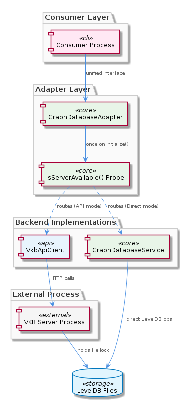

# GraphDatabaseAdapter

**Type:** SubComponent

The probe-once design is an explicit architectural choice to avoid LevelDB file-lock conflicts: if both a VKB server process and a direct-access client attempted to open the same LevelDB files concurrently, write failures or data corruption would result

# GraphDatabaseAdapter — Technical Insight Document

## What It Is

The `GraphDatabaseAdapter` is implemented in `storage/graph-database-adapter.ts` and serves as a unified abstraction layer over two fundamentally different graph storage backends: the `VkbApiClient` (HTTP-based access to a running VKB server) and the `GraphDatabaseService` (direct, in-process LevelDB operations). It is a SubComponent within the broader `KnowledgeManagement` parent component, sitting alongside siblings `ManualLearning`, `OnlineLearning`, and `KnowledgeMigration`—all of which ultimately funnel their graph reads and writes through this adapter.

The defining characteristic of the adapter is its **probe-once, route-always** lifecycle. On its first `initialize()` invocation, the adapter dynamically imports `VkbApiClient` and calls `isServerAvailable()` exactly once. The boolean outcome of that single probe permanently determines, for the entire lifetime of the adapter instance, whether subsequent operations are dispatched over HTTP to the VKB server or executed directly against the underlying LevelDB store. This routing decision is immutable; there is no re-evaluation, no hot-swap, and no per-operation detection.

## Architecture and Design

The architecture follows a classic **Adapter pattern** layered over a **runtime backend selector**, with two child sub-concepts cleanly carved out: `SingleProbeRoutingDecision` (encapsulating the one-shot `isServerAvailable()` call inside `initialize()`) and `LazyVkbClientImport` (encapsulating the dynamic `import()` of `VkbApiClient` so the module is never loaded when the VKB server is absent at startup). Together, these two children express the entire personality of the adapter: a deferred, minimal-cost probe that decides everything thereafter.

The most important architectural property is that the adapter is **lock-free by design**. LevelDB enforces a single-writer file-lock constraint: if both a VKB server process and an in-process direct-access client were to open the same LevelDB files concurrently, the result would be write failures or data corruption. The probe-once decision is the deliberate mechanism that prevents this race—by committing to exactly one backend before any operation runs, the adapter eliminates the possibility of contending file-lock holders without requiring any mutex, semaphore, or coordination primitive. This is a conscious trade: runtime adaptability is sacrificed in exchange for simplicity and correctness under LevelDB's hard constraints.

Because the adapter presents a unified interface over the two completely different backends, all callers are decoupled from which backend is active. This decoupling is what allows the sibling components to remain backend-agnostic: `ManualLearning` writes hand-crafted entries without knowing whether they travel over HTTP or land directly on disk, and `OnlineLearning`'s convergent batch pipeline (which fans in git history, LSL sessions, and code analysis into a single graph write path) does so through the adapter without branching on transport. The `KnowledgeMigration` sibling—exemplified by `scripts/migrate-graph-db-entity-types.js`, which consolidates entity types to the canonical `System`/`Project`/`Pattern` set—similarly relies on the adapter to abstract away the storage layer during retroactive schema migrations.

## Implementation Details

The implementation is concentrated in `storage/graph-database-adapter.ts`. The `initialize()` method is the only place where backend selection occurs. Inside it:

1. A dynamic `import()` statement loads the `VkbApiClient` module on demand. Because this is a lazy import rather than a static top-level `import`, environments without a VKB server pay zero load cost for the API client code path—this is the `LazyVkbClientImport` child entity made concrete.
2. The freshly imported client's `isServerAvailable()` is invoked exactly once. The boolean result is captured as the adapter instance's permanent routing flag—this is the `SingleProbeRoutingDecision` child entity made concrete.
3. From that moment forward, every read and write method on the adapter dispatches to either the `VkbApiClient` (HTTP) or directly to `GraphDatabaseService` (LevelDB) based on the captured flag, with no further probing.

The absence of any synchronization primitive is itself an implementation detail worth noting: there is no mutex around the routing flag, no atomic compare-and-swap, no coordination layer. The flag is written exactly once during `initialize()` and only read thereafter, so it is safe by construction. This minimalism is only sound because the design *forbids* mid-lifecycle changes; any attempt to add re-probing logic would require re-introducing the very locking complexity the architecture exists to avoid.

## Integration Points

The adapter integrates with two backends and one parent context:

- **Upstream (parent):** It is contained within `KnowledgeManagement`, which is the architectural surface through which all knowledge graph operations flow.
- **Downstream backend A:** `VkbApiClient`, accessed via the dynamic import in `initialize()`. Used when `isServerAvailable()` returns true.
- **Downstream backend B:** `GraphDatabaseService`, the direct LevelDB operations layer. Used when the probe returns false.
- **Sibling consumers:** `ManualLearning` routes all hand-crafted writes through the adapter; `OnlineLearning`'s batch analysis pipeline converges its three source channels (git history, LSL sessions, code analysis) into a single graph write path via the adapter; `KnowledgeMigration` (e.g., `scripts/migrate-graph-db-entity-types.js`) likewise depends on the adapter for its retroactive data work.

The contract with consumers is simple but strict: callers see a single uniform API regardless of backend, but they must accept that backend selection is fixed once `initialize()` has run.

## Usage Guidelines

Developers integrating with `GraphDatabaseAdapter` must internalize a small number of non-negotiable rules:

1. **The routing decision is immutable per adapter instance.** If the VKB server starts or stops after `initialize()` has been called, the adapter will not adapt. To switch from API-mode to direct-mode (or vice versa), the entire consumer process must be restarted. There is no hot-swap, no re-initialization path, and no API to force re-probing.

2. **Never open LevelDB directly while the VKB server is running.** The probe-once design exists precisely to prevent this. Bypassing the adapter to open the same LevelDB files that a running VKB server already holds will produce write failures or data corruption. Always go through the adapter.

3. **Expect the first `initialize()` call to incur the dynamic import cost.** `VkbApiClient` is loaded lazily; the first initialization will pay for both the module load and the `isServerAvailable()` network probe. Subsequent calls (if the adapter exposes idempotent initialization) should not repeat the work.

4. **Design consumers to be backend-agnostic.** Since the adapter unifies two completely different backends behind one interface, consumer code should never branch on transport. If a consumer finds itself needing to know whether HTTP or direct LevelDB is in use, that is usually a signal the abstraction is being violated.

5. **Plan deployment topology around the probe.** Because the probe runs once at startup, the operational decision of whether to run a VKB server must be made—and stable—before any adapter-using process initializes. Starting a server after consumers are already running will not cause them to migrate to API mode.

These guidelines, taken together, describe a component that deliberately trades flexibility for safety and simplicity, leaning hard on LevelDB's single-writer reality to justify a lock-free architecture that is correct precisely because it refuses to change its mind.

## Hierarchy Context

### Parent
- [KnowledgeManagement](./KnowledgeManagement.md) -- [LLM] The GraphDatabaseAdapter (storage/graph-database-adapter.ts) implements a lock-free dual-routing architecture that permanently commits to one of two execution paths at initialization time, never re-evaluating afterward. During its first `initialize()` call, the adapter dynamically imports VkbApiClient and invokes `isServerAvailable()`—a single probe that determines forever whether all subsequent reads and writes are routed to the VKB HTTP API or directly to the underlying GraphDatabaseService. This 'probe-once, route-always' design is deliberately lock-free: because LevelDB does not support multiple concurrent file-lock holders, having both the VKB server process and a direct-access client attempt to open the same LevelDB files simultaneously would cause write failures or corruption. By detecting server presence at startup and never switching paths mid-session, the adapter avoids the race conditions that would arise from per-operation detection. A developer integrating with this component must understand that the routing decision is immutable per adapter instance: if the VKB server starts or stops after initialization, the adapter will not adapt, and a restart of the consumer process is required to pick up the new routing path.

### Children
- [SingleProbeRoutingDecision](./SingleProbeRoutingDecision.md) -- storage/graph-database-adapter.ts calls isServerAvailable() exactly once during initialize(), making this the sole input to the routing decision for the adapter instance's lifetime — a deliberate design that trades adaptability for simplicity and predictability.
- [LazyVkbClientImport](./LazyVkbClientImport.md) -- storage/graph-database-adapter.ts uses a dynamic import (import()) for VkbApiClient inside initialize() rather than a static top-level import, so the VKB client module is never loaded in environments where the VKB server is absent at startup.

### Siblings
- [ManualLearning](./ManualLearning.md) -- ManualLearning entities are routed through GraphDatabaseAdapter, meaning all hand-crafted writes go either to the VKB HTTP API or directly to GraphDatabaseService depending on the probe-once initialization decision in storage/graph-database-adapter.ts
- [OnlineLearning](./OnlineLearning.md) -- OnlineLearning extraction runs as a batch analysis pipeline referencing git history, LSL sessions, and code analysis—three distinct source channels whose outputs converge into a single graph write path via GraphDatabaseAdapter in storage/graph-database-adapter.ts
- [KnowledgeMigration](./KnowledgeMigration.md) -- scripts/migrate-graph-db-entity-types.js consolidates entity types to a canonical three-value set (System/Project/Pattern), indicating the graph schema has undergone at least one breaking taxonomy change that required a retroactive data migration

---

*Generated from 5 observations*
