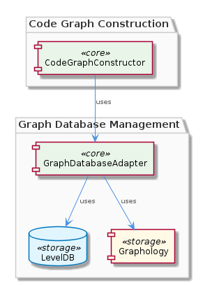
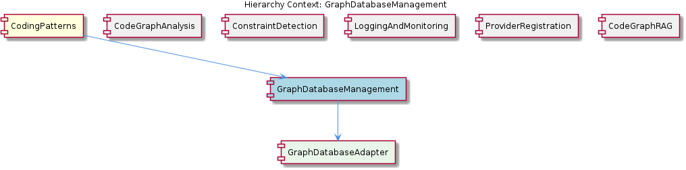

# GraphDatabaseManagement

**Type:** SubComponent

The CodeGraphConstructor relies on the GraphDatabaseAdapter for constructing and analyzing code graphs, as seen in integrations/mcp-server-semantic-analysis/src/agent/code-graph-agent.ts.

## What It Is  

**GraphDatabaseManagement** is the sub‑component responsible for persisting and manipulating graph‑structured data that underpins the code‑graph capabilities of the broader **CodingPatterns** system. Its core implementation lives in the file **`storage/graph-database-adapter.ts`**, where the class **`GraphDatabaseAdapter`** orchestrates two concrete technologies: **Graphology** (an in‑memory graph library) and **LevelDB** (a fast key‑value store) to provide a durable graph database layer.  

The adapter exposes a concise API for **creating**, **reading**, and **updating** graph entities. These operations are directly consumed by the **`CodeGraphConstructor`** (found in `integrations/mcp-server-semantic-analysis/src/agent/code-graph-agent.ts`) to build and analyse code graphs that represent the structure and relationships of source code. The tight coupling between the adapter and the constructor enables a streamlined pipeline from raw code to a persisted graph model, which is then leveraged by sibling sub‑components such as **CodeGraphAnalysis** and **CodeGraphRAG**.

---

## Architecture and Design  

The design of **GraphDatabaseManagement** follows an **Adapter**‑style architecture. The `GraphDatabaseAdapter` class acts as a façade that hides the intricacies of two disparate libraries—Graphology for graph manipulation and LevelDB for persistence—behind a unified, domain‑specific interface. This approach isolates the rest of the system from low‑level storage concerns while still exposing the rich graph‑API needed by the **CodeGraphConstructor**.

Interaction flow is straightforward:

1. **CodeGraphConstructor** invokes the adapter’s creation methods to insert nodes and edges that model the code base.  
2. The adapter translates these high‑level calls into Graphology operations, building an in‑memory graph.  
3. Upon commit or at defined checkpoints, the adapter serialises the Graphology structure and writes it to LevelDB, ensuring durability across restarts.  

Because the adapter is **tightly coupled** with the constructor (Observation 3), the two classes share a common data contract and often invoke each other’s internal helpers. This coupling accelerates development—there is no need for an additional translation layer—but it also means that changes to the adapter’s API ripple directly to the constructor.

The relationship diagram below visualises these connections, showing the parent **CodingPatterns** component, sibling sub‑components that also rely on the persisted graph, and the child **GraphDatabaseAdapter** itself.

---

## Implementation Details  

### Core Class – `GraphDatabaseAdapter`  

- **Location:** `storage/graph-database-adapter.ts`  
- **Responsibilities:**  
  - **Graphology integration:** Instantiates a Graphology graph object, exposing methods such as `addNode`, `addEdge`, `removeNode`, and query helpers.  
  - **LevelDB persistence:** Opens a LevelDB database (typically under a configurable data directory) and provides `saveGraph` / `loadGraph` routines that serialise the Graphology graph to a binary or JSON representation stored as LevelDB values.  
  - **CRUD API:** Public methods (`createGraph`, `readGraph`, `updateGraph`, `deleteGraph`) are used by external callers, most notably the **CodeGraphConstructor**.  

### Tight Coupling with `CodeGraphConstructor`  

- **Location of consumer:** `integrations/mcp-server-semantic-analysis/src/agent/code-graph-agent.ts`  
- The constructor calls the adapter’s `createGraph` method for each new code‑graph it builds, then repeatedly uses the adapter’s node/edge manipulation functions while traversing the source code AST.  
- Because the constructor expects the adapter to expose Graphology‑specific semantics (e.g., direct access to node attributes), the adapter does not hide the underlying library completely; instead it offers a thin wrapper that forwards calls.  

### Supporting Technologies  

- **Graphology:** Chosen for its rich set of graph algorithms and flexible data model, allowing the system to perform analyses such as reachability, clustering, and shortest‑path calculations without re‑implementing core graph logic.  
- **LevelDB:** Provides an embedded, high‑performance key‑value store that writes to disk with minimal overhead, suitable for the expected workload of persisting large but not massive code graphs.  

No additional helper classes or factories are mentioned in the observations, so the implementation appears to centre on the single `GraphDatabaseAdapter` class.

---

## Integration Points  

1. **CodeGraphConstructor (Sibling Sub‑Component)** – The primary consumer. It calls the adapter’s creation and manipulation methods to transform parsed source code into a persisted graph. This relationship is documented in both the parent component description and the sibling **CodeGraphAnalysis** context, which later reads the same persisted graph for analytical queries.  

2. **CodeGraphAnalysis** – Reads the persisted graph via the adapter’s `readGraph` method to perform static analysis, dependency tracing, and other semantic checks.  

3. **CodeGraphRAG** – A downstream retrieval‑augmented generation (RAG) system that queries the stored graph to provide context‑aware code assistance. It relies on the same persistence layer, ensuring consistency across the ecosystem.  

4. **Parent Component – CodingPatterns** – The parent aggregates the graph database capabilities with other patterns such as **ConstraintDetection**, **LoggingAndMonitoring**, and **ProviderRegistration**. While those siblings do not directly interact with the adapter, they share the same runtime environment and may benefit from the logging and monitoring infrastructure that records adapter operations.  

5. **External Dependencies** – The adapter imports Graphology and LevelDB packages, meaning that any upgrade or replacement of these libraries would affect the entire graph‑management pipeline.

---

## Usage Guidelines  

- **Prefer the Adapter API:** Direct interaction with Graphology or LevelDB should be avoided outside of `GraphDatabaseAdapter`. All graph operations must go through the adapter’s public methods to keep persistence semantics consistent.  

- **Lifecycle Management:** Initialise the adapter once at application start (e.g., in the server bootstrap) and reuse the same instance for all `CodeGraphConstructor` calls. This avoids opening multiple LevelDB handles, which can lead to file‑lock contention.  

- **Batch Writes:** When constructing large code graphs, accumulate node/edge additions in memory and invoke `saveGraph` only after a logical batch is complete. This reduces the number of synchronous LevelDB writes and improves throughput.  

- **Versioning & Migration:** Because the adapter serialises the entire Graphology graph into LevelDB, any schema change to node/edge attributes should be accompanied by a migration script that reads the old graph, transforms it, and rewrites it.  

- **Error Handling:** The adapter propagates LevelDB I/O errors. Consumers (e.g., `CodeGraphConstructor`) should catch these exceptions and implement retry or fallback logic, especially in environments where disk I/O may be intermittent.  

- **Testing:** Unit tests should mock both Graphology and LevelDB. Since the adapter is the sole integration point, mocking its public methods provides isolation for higher‑level components like `CodeGraphConstructor` and `CodeGraphAnalysis`.

---

### Architectural Patterns Identified  

- **Adapter / Façade Pattern:** `GraphDatabaseAdapter` abstracts Graphology and LevelDB behind a unified graph‑DB API.  
- **Tight Coupling (Intentional):** The constructor and adapter share a close contract to minimise translation overhead.  

### Design Decisions & Trade‑offs  

- **In‑Memory Graph + Persistent Store:** Combining Graphology (fast, in‑memory operations) with LevelDB (durable storage) yields high read/write performance but limits scalability to the memory capacity of the host process.  
- **Tight Coupling vs. Modularity:** The direct dependency speeds up development and reduces boilerplate but hampers independent evolution of the adapter or constructor. Refactoring to a more loosely coupled interface would improve testability at the cost of added indirection.  

### System Structure Insights  

- **Hierarchical Placement:** As a child of **CodingPatterns**, GraphDatabaseManagement serves as the data‑layer foundation for several sibling analytics and RAG components. Its single‑class implementation centralises graph persistence concerns, making it a natural focal point for any future extensions (e.g., sharding, alternative storage back‑ends).  

### Scalability Considerations  

- **Memory Limits:** Graphology holds the entire graph in RAM; extremely large codebases may exceed available memory, suggesting the need for streaming or partitioned graph representations.  
- **LevelDB Single‑Node:** LevelDB does not provide built‑in replication or clustering. Scaling horizontally would require either sharding the graph across multiple LevelDB instances or migrating to a distributed key‑value store.  

### Maintainability Assessment  

- **Positive Aspects:** The adapter encapsulates external library usage, providing a single location for updates to Graphology or LevelDB APIs. Its concise public surface makes it relatively easy to understand.  
- **Risks:** The tight coupling with `CodeGraphConstructor` creates a hidden dependency; changes to the adapter’s method signatures can break the constructor, increasing the maintenance burden. Introducing an interface or abstract base class could mitigate this risk.  

Overall, **GraphDatabaseManagement** delivers a pragmatic, performance‑focused solution for code‑graph persistence, with clear opportunities for future decoupling and scaling enhancements as the system evolves.

## Hierarchy Context

### Parent
- [CodingPatterns](./CodingPatterns.md) -- [LLM] The CodingPatterns component's architecture is heavily influenced by the GraphDatabaseAdapter class in storage/graph-database-adapter.ts, which provides methods for creating, reading, and manipulating graph data. This class utilizes Graphology and LevelDB for persistence, ensuring efficient data storage and retrieval. The CodeGraphConstructor sub-component, as seen in integrations/mcp-server-semantic-analysis/src/agent/code-graph-agent.ts, relies on the GraphDatabaseAdapter for constructing and analyzing code graphs. This tightly coupled relationship between the GraphDatabaseAdapter and CodeGraphConstructor enables the efficient creation and analysis of code graphs.

### Children
- [GraphDatabaseAdapter](./GraphDatabaseAdapter.md) -- The GraphDatabaseAdapter class is referenced in the parent context as being located in storage/graph-database-adapter.ts, indicating its importance in the overall architecture.

### Siblings
- [CodeGraphAnalysis](./CodeGraphAnalysis.md) -- The CodeGraphConstructor in integrations/mcp-server-semantic-analysis/src/agent/code-graph-agent.ts relies on the GraphDatabaseAdapter for constructing and analyzing code graphs.
- [ConstraintDetection](./ConstraintDetection.md) -- The ConstraintDetection sub-component uses the execute(input, context) pattern for detecting and monitoring constraints.
- [LoggingAndMonitoring](./LoggingAndMonitoring.md) -- The LoggingAndMonitoring sub-component uses async log buffering and flushing for logging and monitoring.
- [ProviderRegistration](./ProviderRegistration.md) -- The ProviderRegistration sub-component uses the ProviderRegistry class for registering new providers.
- [CodeGraphRAG](./CodeGraphRAG.md) -- The CodeGraphRAG sub-component is a graph-based RAG system for any codebases, as seen in integrations/code-graph-rag/README.md.

---

*Generated from 7 observations*
