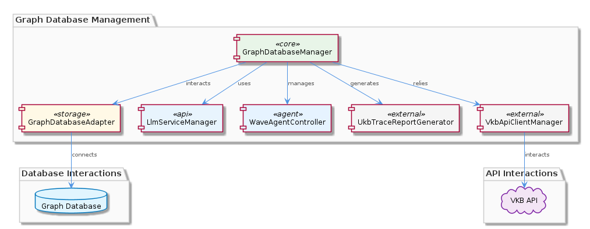

# GraphDatabaseManager

**Type:** SubComponent

GraphDatabaseManager could interact with the WaveAgentController for managing Wave agents that operate on the graph database.

## What It Is  

The **GraphDatabaseManager** is the core sub‑component responsible for orchestrating all interactions with the underlying knowledge graph.  It lives inside the *KnowledgeManagement* domain and is physically realized through a set of TypeScript modules, the most prominent being `graph-database-adapter.ts` (found under `integrations/mcp-server-semantic-analysis/src/storage/graph-database-adapter.ts`).  This adapter encapsulates the low‑level calls to the graph store, while the manager itself coordinates higher‑level concerns such as schema enforcement, trace‑report generation, and LLM‑driven enrichment of graph data.  Its immediate children – **GraphStructureManager** and **GraphDatabaseAdapter** – implement the concrete graph‑manipulation logic, whereas sibling components (e.g., `WaveAgentController`, `LlmServiceManager`, `UkbTraceReportGenerator`, `VkbApiClientManager`) consume the manager’s services to fulfill their own responsibilities.

---

## Architecture and Design  

The design of **GraphDatabaseManager** follows a **layered, adapter‑centric architecture**.  At the outermost layer, consumer services (ManualLearning, OnlineLearning, WaveAgentController, etc.) invoke the manager’s public API.  Internally the manager delegates persistence concerns to the **GraphDatabaseAdapter**, an implementation of the classic *Adapter* pattern that isolates the rest of the codebase from the specifics of the chosen graph store (Graphology + LevelDB).  This separation enables the KnowledgeManagement component to switch storage back‑ends with minimal ripple effect.

Within the manager, the **GraphStructureManager** provides a domain‑specific façade for building and traversing graph structures.  It leverages Graphology’s in‑memory model and LevelDB for durable storage, a decision highlighted in the parent component’s documentation: “Graphology+LevelDB persistence ensures a scalable and performant solution for managing the knowledge graph.”  The manager also acts as a **Coordinator** (a lightweight manager pattern) that brings together auxiliary services:

* **LlmServiceManager** – supplies efficient LLM inference for tasks such as entity linking or relationship inference during graph updates.  
* **WaveAgentController** – drives autonomous agents that may read from or write to the graph as part of their reasoning cycles.  
* **UkbTraceReportGenerator** – pulls graph snapshots to produce traceability reports, ensuring auditability of knowledge‑graph modifications.  
* **VkbApiClientManager** – mediates external VKB API calls that enrich graph nodes with external metadata.

These collaborations are illustrated in the relationship diagram below, which maps the bidirectional dependencies among the manager and its siblings.

The overall architectural stance is **modular composition**: each responsibility is encapsulated in its own class/module, promoting single‑responsibility and clear boundaries.  No monolithic service layer is evident; instead, the manager stitches together well‑defined adapters and managers.

---

## Implementation Details  

### Core Classes  

| Class / Module | Role | Notable Path |
|----------------|------|--------------|
| **GraphDatabaseManager** | High‑level orchestrator; exposes CRUD‑style methods for knowledge entities, enforces schema, triggers auxiliary workflows. | Implicit – resides alongside its children in the KnowledgeManagement package. |
| **GraphDatabaseAdapter** | Low‑level persistence adapter; translates manager calls into Graphology + LevelDB operations (e.g., `addNode`, `addEdge`, `exportJSON`). | `integrations/mcp-server-semantic-analysis/src/storage/graph-database-adapter.ts` |
| **GraphStructureManager** | Provides domain‑specific helpers for constructing graph topologies, handling versioning, and performing bulk imports/exports. | Referenced in `integrations/code-graph-rag/README.md` (Graphology usage). |

### Data Flow  

1. **Invocation** – A consumer (e.g., `OnlineLearning`) calls `GraphDatabaseManager.createEntity(payload)`.  
2. **Schema Validation** – The manager checks the payload against the predefined graph schema (observed to exist, though not enumerated).  
3. **Structure Building** – It delegates to **GraphStructureManager** to instantiate the node/edge objects using Graphology APIs.  
4. **Persistence** – The constructed objects are handed to **GraphDatabaseAdapter**, which writes them to LevelDB and optionally triggers an automatic JSON export for downstream sync processes.  
5. **Post‑Processing** – If the operation requires LLM assistance (e.g., disambiguation), the manager forwards relevant context to **LlmServiceManager** and incorporates the returned annotations before final commit.  
6. **Side‑Effects** – Upon successful commit, the manager may notify **WaveAgentController** to spawn agents that act on the new knowledge, or request **UkbTraceReportGenerator** to log the change for traceability.

### Configuration  

The manager respects a set of configuration files (not listed explicitly) that define:
* The LevelDB storage location.  
* JSON export paths for external synchronisation.  
* Feature toggles for LLM‑assisted enrichment.  

Because the observations do not enumerate concrete function signatures, the description stays at the architectural level, avoiding invented APIs.

---

## Integration Points  

**GraphDatabaseManager** sits at the nexus of several critical system interactions:

* **ManualLearning & OnlineLearning** – Both sub‑components rely on the manager to persist manually curated or automatically extracted knowledge entities.  Their usage patterns differ (batch vs. real‑time), but the underlying API remains consistent.  
* **WaveAgentController** – Consumes graph updates to trigger autonomous agents.  The manager likely exposes event hooks or a publish‑subscribe interface that the controller subscribes to.  
* **LlmServiceManager** – Provides on‑demand language‑model inference.  The manager passes raw textual fragments to this service, receives structured suggestions, and integrates them back into the graph.  
* **UkbTraceReportGenerator** – Queries the manager for snapshots of graph state, using the same adapter to retrieve a consistent JSON view for reporting.  
* **VkbApiClientManager** – Acts as a bridge to external VKB APIs; the manager forwards node identifiers that require external enrichment, receives the enriched payload, and updates the graph accordingly.  

All these interactions are mediated through well‑defined interfaces (e.g., `IGraphAdapter`, `ILlmService`, `IAgentController`) that are implied by the naming conventions and the “contains” relationships in the hierarchy.  The manager does **not** directly embed external service logic; instead, it composes them, preserving loose coupling.

---

## Usage Guidelines  

1. **Prefer the Manager API** – Direct access to `GraphDatabaseAdapter` should be avoided by most developers.  All graph mutations must flow through **GraphDatabaseManager** to guarantee schema validation, LLM enrichment, and trace‑logging.  
2. **Respect Transaction Boundaries** – When performing bulk operations (e.g., importing a batch of entities), wrap calls in a single manager transaction to ensure atomicity and to reduce LevelDB write amplification.  
3. **Leverage LLM Assistance Judiciously** – Invoke `LlmServiceManager` only when the payload lacks sufficient disambiguation; unnecessary calls increase latency and cost.  
4. **Handle Export Synchronisation** – After successful writes, the manager automatically emits a JSON export.  Consumers that rely on this export (e.g., downstream analytics pipelines) should monitor the export directory rather than poll the database directly.  
5. **Maintain Schema Consistency** – When extending the knowledge graph schema, update the validation rules in the manager before altering any adapter code; this prevents runtime schema violations.  

---

### Summary of Architectural Insights  

| Aspect | Observation‑Based Insight |
|--------|---------------------------|
| **Architectural patterns identified** | Adapter pattern (`GraphDatabaseAdapter`), Manager/Coordinator pattern (`GraphDatabaseManager`), Composition of domain‑specific services (`GraphStructureManager`, `LlmServiceManager`, etc.). |
| **Design decisions and trade‑offs** | *Separation of concerns* via adapters improves replaceability of the storage engine but adds an indirection layer.  Using Graphology + LevelDB yields high read/write performance and easy JSON export, at the cost of limited native query capabilities compared to a full‑blown graph DB.  Centralizing LLM calls in the manager simplifies enrichment but can become a bottleneck if not throttled. |
| **System structure insights** | The manager is a hub within the KnowledgeManagement component, with children handling structure and persistence, and siblings consuming its services for learning, agent control, reporting, and external API integration. |
| **Scalability considerations** | LevelDB scales well on a single node and supports fast key‑value writes; however, horizontal scaling would require sharding or migration to a distributed graph store.  The automatic JSON export enables downstream pipelines to process data in parallel, mitigating read pressure on the primary store. |
| **Maintainability assessment** | High modularity (clear adapters, managers, and domain services) promotes maintainability.  The explicit “contains” relationships and single responsibility of each child component reduce the cognitive load when updating a particular concern (e.g., swapping the LLM provider).  The main risk lies in the tight coupling of trace‑report generation and agent control to the manager’s lifecycle; changes to the manager’s API may ripple to several siblings, so versioned interfaces are advisable.

## Hierarchy Context

### Parent
- [KnowledgeManagement](./KnowledgeManagement.md) -- [LLM] The KnowledgeManagement component utilizes the GraphDatabaseAdapter (integrations/mcp-server-semantic-analysis/src/storage/graph-database-adapter.ts) for persisting data in a graph database with automatic JSON export synchronization. This design decision enables efficient storage and retrieval of knowledge entities and relationships, which is crucial for the system's overall goals of knowledge discovery and insight generation. Furthermore, the use of Graphology+LevelDB persistence ensures a scalable and performant solution for managing the knowledge graph.

### Children
- [GraphStructureManager](./GraphStructureManager.md) -- The GraphDatabaseManager utilizes Graphology to create and manage graph structures, as mentioned in integrations/code-graph-rag/README.md
- [GraphDatabaseAdapter](./GraphDatabaseAdapter.md) -- The parent analysis suggests the GraphDatabaseAdapter is utilized by the GraphDatabaseManager for interacting with the graph database.

### Siblings
- [ManualLearning](./ManualLearning.md) -- ManualLearning likely interacts with the GraphDatabaseManager to store and retrieve manually created knowledge entities and relationships.
- [OnlineLearning](./OnlineLearning.md) -- OnlineLearning likely employs the GraphDatabaseManager to store and manage automatically extracted knowledge entities and relationships.
- [WaveAgentController](./WaveAgentController.md) -- WaveAgentController likely interacts with the LlmServiceManager for LLM operations and initialization.
- [UkbTraceReportGenerator](./UkbTraceReportGenerator.md) -- UkbTraceReportGenerator likely interacts with the GraphDatabaseManager to retrieve data for trace reports.
- [LlmServiceManager](./LlmServiceManager.md) -- LlmServiceManager likely interacts with other components for LLM-related tasks, such as the GraphDatabaseManager and WaveAgentController.
- [VkbApiClientManager](./VkbApiClientManager.md) -- VkbApiClientManager likely interacts with the GraphDatabaseManager for storing and retrieving data related to VKB API interactions.

---

*Generated from 7 observations*
