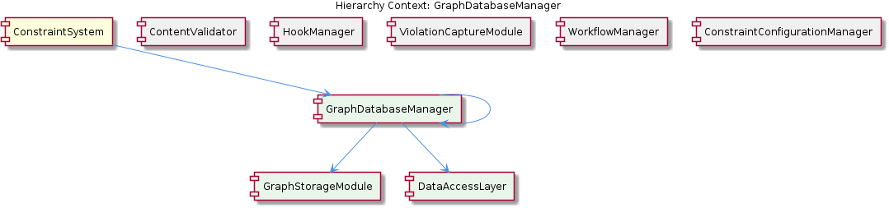
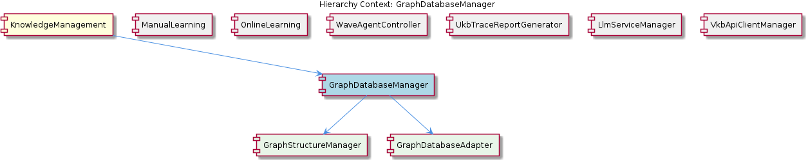

# GraphDatabaseManager

**Type:** SubComponent

The GraphDatabaseAdapter employs a lock-free architecture to prevent LevelDB lock conflicts, ensuring that GraphDatabaseManager can handle multiple concurrent requests without performance degradation.

## What It Is  

**GraphDatabaseManager** is the sub‑component responsible for exposing a clean, programmatic interface that stores and retrieves knowledge‑graph data for the broader **KnowledgeManagement** component. The manager lives alongside its sibling agents (e.g., **CodeAnalysisAgent**, **OntologyClassificationAgent**) and delegates all low‑level persistence work to the **GraphDatabaseAdapter** found at `storage/graph-database-adapter.ts`. By wrapping the adapter, GraphDatabaseManager shields the rest of the system from the intricacies of LevelDB‑based storage while still allowing higher‑level modules—such as manual‑learning pipelines or online‑learning processes—to interact with a unified graph‑database API.

The manager does not implement its own storage engine; instead, it acts as a façade that forwards calls to the adapter, which in turn handles the lock‑free LevelDB persistence and automatic JSON export synchronization described in the parent **KnowledgeManagement** documentation. Because the manager is designed to be reusable, other components (e.g., **CodeAnalysisAgent** for AST‑derived concepts or **OntologyClassificationAgent** for ontology‑based classifications) can invoke its methods without needing to understand the underlying database mechanics.

---

## Architecture and Design  

The observable architecture follows a classic **Adapter‑Facade** pattern. `GraphDatabaseAdapter` (the adapter) abstracts the concrete LevelDB implementation, providing a lock‑free interface that eliminates the usual LevelDB file‑locking contention. `GraphDatabaseManager` (the façade) builds on top of this adapter, offering domain‑specific CRUD operations that other components consume. This separation of concerns isolates persistence details from business logic, enabling each layer to evolve independently.

The lock‑free design mentioned in the observations is a deliberate scalability decision: by avoiding OS‑level file locks, the system can service many concurrent requests—such as simultaneous knowledge‑graph updates from **ManualLearning** and **OnlineLearning**—without the performance penalties typical of LevelDB’s default locking strategy. This architectural choice also simplifies deployment in containerised or multi‑process environments where lock contention could otherwise become a bottleneck.

Interaction flows are straightforward: a consumer (e.g., **CodeAnalysisAgent**) calls a method on GraphDatabaseManager → GraphDatabaseManager forwards the request to GraphDatabaseAdapter → the adapter performs a lock‑free write or read on LevelDB and, if configured, syncs a JSON export. The parent **KnowledgeManagement** component orchestrates these calls, ensuring that the graph‑database layer remains a single source of truth for entity persistence and knowledge‑decay tracking.

---

## Implementation Details  

* **Key Path**: `storage/graph-database-adapter.ts` houses the concrete adapter class. Although the source symbols are not listed, the observation confirms that this file implements a **lock‑free architecture** for LevelDB. The lock‑free mechanism likely relies on atomic operations or a write‑ahead log to sidestep traditional file‑locking semantics, thereby allowing parallel access.

* **GraphDatabaseManager** itself is not tied to a specific file in the supplied observations, but its responsibilities are clear: it provides an **interface for storing and retrieving data**. Typical methods would include `addNode`, `addEdge`, `getNodeById`, `querySubgraph`, etc., each delegating to the adapter’s corresponding low‑level calls.

* The manager can **leverage** two sibling agents:
  * **CodeAnalysisAgent** – uses AST‑based analysis to extract concepts from source code. The manager can accept these concepts as graph nodes/edges, persisting the structural knowledge that the agent discovers.
  * **OntologyClassificationAgent** – classifies entities against an ontology and returns confidence scores. The manager can store both the classification result and its confidence, enriching the graph with semantic metadata.

* The **automatic JSON export sync** mentioned in the parent component’s description implies that every successful write through the adapter triggers a serialization step. This ensures that a human‑readable snapshot of the graph is always available, which is useful for debugging or downstream analytics.

* Because no explicit functions are listed, the implementation likely follows a thin wrapper style: each public method on GraphDatabaseManager performs minimal validation, logs the operation, and then calls the adapter. Error handling is probably centralized in the adapter, which can translate LevelDB errors into domain‑specific exceptions.

---

## Integration Points  

* **Parent – KnowledgeManagement**: The manager is a core dependency of KnowledgeManagement, which relies on it for persistent graph storage, knowledge‑decay tracking, and entity persistence. KnowledgeManagement’s description explicitly states that it “utilizes a GraphDatabaseAdapter… to efficiently store and query knowledge graphs,” confirming that GraphDatabaseManager is the primary conduit for those operations.

* **Sibling – ManualLearning & OnlineLearning**: Both learning pipelines store extracted knowledge in the graph. They invoke GraphDatabaseManager’s API to persist entities generated from manual annotations or batch analysis of git history and LSL sessions.

* **Sibling – CodeAnalysisAgent**: When the agent parses code and builds an abstract syntax tree, it can pass the resulting concepts to GraphDatabaseManager for insertion into the knowledge graph, enabling downstream reasoning about code structure.

* **Sibling – OntologyClassificationAgent**: After classifying an entity, the agent can call GraphDatabaseManager to store the classification label together with its confidence score, enriching the graph’s semantic layer.

* **External – ContentValidationAgent, TraceReportGenerator**: While not directly mentioned as consumers, these agents could query the graph via GraphDatabaseManager to validate content against stored knowledge or to generate trace reports that reference graph relationships.

* **Storage Layer – LevelDB**: The adapter hides LevelDB specifics, but any component that needs to swap the storage backend would interact only with GraphDatabaseManager, preserving compatibility.

---

## Usage Guidelines  

1. **Always go through GraphDatabaseManager** – Direct access to `storage/graph-database-adapter.ts` should be avoided by application code. The manager encapsulates validation, logging, and any future business rules, ensuring a stable contract.

2. **Prefer bulk operations for high‑throughput scenarios** – Because the adapter is lock‑free, it can handle many concurrent writes, but batching inserts (e.g., adding a set of nodes in a single call) reduces the overhead of JSON export synchronization.

3. **Handle classification confidence explicitly** – When using **OntologyClassificationAgent**, store both the classification label and its confidence score via the manager’s API. This practice preserves the semantic richness needed for downstream reasoning.

4. **Synchronize with the JSON export** – If a component relies on the exported JSON snapshot (e.g., for external analytics), ensure that writes are completed before reading the file. The manager’s methods are synchronous with the export step, so awaiting the manager’s promise (or callback) guarantees consistency.

5. **Respect concurrency limits** – Although the lock‑free design removes traditional LevelDB lock contention, the underlying storage still has I/O limits. Monitor throughput and consider throttling if you observe saturation on disk I/O.

---

### Architectural Patterns Identified
* **Adapter Pattern** – `GraphDatabaseAdapter` abstracts LevelDB.
* **Facade Pattern** – `GraphDatabaseManager` provides a simplified domain‑level API.
* **Lock‑Free Concurrency** – Implemented in the adapter to avoid LevelDB file locks.

### Design Decisions and Trade‑offs
* **Lock‑free persistence** trades the simplicity of LevelDB’s default locking for higher concurrency; it requires careful handling of atomic writes and may increase implementation complexity.
* **Adapter‑Facade separation** isolates storage concerns, improving maintainability but adds an extra indirection layer that developers must understand.
* **Automatic JSON export** ensures visibility of graph state at the cost of extra I/O on each write.

### System Structure Insights
* GraphDatabaseManager sits centrally within **KnowledgeManagement**, acting as the persistence gateway for both learning pipelines and analysis agents.
* Sibling agents contribute data (concepts, classifications) that enrich the graph, while downstream agents (e.g., ContentValidationAgent) can query the same graph, creating a shared knowledge base.

### Scalability Considerations
* The lock‑free architecture enables horizontal scaling of request handling; multiple services can issue concurrent writes without blocking.
* Bulk operations and careful I/O monitoring are recommended to keep LevelDB and JSON export throughput within acceptable bounds as data volume grows.

### Maintainability Assessment
* Clear separation of concerns (adapter vs. manager) makes the codebase easier to evolve; swapping LevelDB for another store would mainly affect the adapter.
* The lack of exposed symbols in the current view suggests that documentation should be enriched with explicit method signatures and type definitions to aid future contributors.
* Centralizing error handling in the adapter reduces duplication, but developers must keep the façade’s contract up‑to‑date as the adapter evolves.

## Diagrams

### Relationship

## Architecture Diagrams

## Hierarchy Context

### Parent
- [KnowledgeManagement](./KnowledgeManagement.md) -- [LLM] The KnowledgeManagement component utilizes a GraphDatabaseAdapter for storing and managing knowledge graphs. This adapter, implemented in storage/graph-database-adapter.ts, enables Graphology+LevelDB persistence with automatic JSON export sync. By using this adapter, the component can efficiently store and query knowledge graphs, which are essential for entity persistence and knowledge decay tracking. Furthermore, the GraphDatabaseAdapter employs a lock-free architecture to prevent LevelDB lock conflicts, ensuring that the component can handle multiple concurrent requests without performance degradation.

### Siblings
- [ManualLearning](./ManualLearning.md) -- ManualLearning utilizes the GraphDatabaseAdapter in storage/graph-database-adapter.ts to store and manage knowledge graphs.
- [OnlineLearning](./OnlineLearning.md) -- OnlineLearning uses the batch analysis pipeline to extract knowledge from git history, LSL sessions, and code analysis.
- [CodeAnalysisAgent](./CodeAnalysisAgent.md) -- CodeAnalysisAgent uses AST-based techniques to analyze code structures and extract concepts.
- [OntologyClassificationAgent](./OntologyClassificationAgent.md) -- OntologyClassificationAgent uses ontology systems to classify entities and provide confidence scores for classifications.
- [ContentValidationAgent](./ContentValidationAgent.md) -- ContentValidationAgent uses various modes to validate content and provide validation reports.
- [TraceReportGenerator](./TraceReportGenerator.md) -- TraceReportGenerator generates detailed trace reports of UKB workflow runs, capturing data flow, concept extraction, and ontology classification.

---

*Generated from 5 observations*
