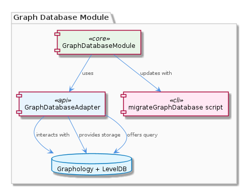
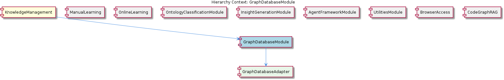

# GraphDatabaseModule

**Type:** SubComponent

GraphDatabaseModule relies on the migrateGraphDatabase script in scripts/migrate-graph-db-entity-types.js to update entity types in the live database.

## What It Is  

The **GraphDatabaseModule** lives inside the **KnowledgeManagement** component and is the primary façade for all interactions with the central knowledge graph. Its concrete implementation resides in the repository under the path **`integrations/mcp-server-semantic-analysis/src/storage/graph-database-adapter.ts`**, where the **`GraphDatabaseAdapter`** class is defined. The module does not contain its own storage logic; instead, it delegates every persistence and query operation to this adapter, which in turn talks to a **Graphology**‑based graph layered on top of **LevelDB**.  

In addition to the adapter, the module depends on a migration utility located at **`scripts/migrate-graph-db-entity-types.js`**. This script is invoked whenever the schema of the graph changes – for example, when new entity types are introduced – and it updates the live LevelDB/Graphology database to keep the stored data consistent with the current type definitions.  

A notable built‑in capability is the **automatic JSON export sync** provided by the adapter. Whenever the graph is mutated, the adapter serialises the affected sub‑graph to JSON and pushes it to a sync target, guaranteeing that external consumers (e.g., downstream analytics pipelines) always see a current view of the knowledge graph.

---

## Architecture and Design  

The design of the GraphDatabaseModule follows a classic **Adapter pattern**. The module itself acts as a thin orchestration layer, while the **`GraphDatabaseAdapter`** encapsulates the concrete details of talking to Graphology and LevelDB. This separation enforces a clear contract: any component that needs graph storage or query capabilities imports the module and never touches the underlying database directly.  

The overall architecture can be visualised in the diagram below, which shows the module at the centre of the KnowledgeManagement subtree, its child adapter, and the supporting migration script:

The **relationship diagram** highlights how GraphDatabaseModule fits among its siblings (ManualLearning, OnlineLearning, OntologyClassificationModule, etc.) and shares the migration script with ManualLearning, reinforcing a **shared‑utility** approach rather than duplicated code:

Key architectural choices evident from the observations include:

* **Separation of concerns** – storage (LevelDB), graph model (Graphology), and synchronization (JSON export) are each handled by distinct responsibilities inside the adapter.  
* **Centralised migration** – the single script `migrate-graph-db-entity-types.js` is the authoritative source for schema evolution, reducing the risk of divergent migrations across components.  
* **Implicit data‑consistency guarantee** – the automatic JSON export sync is baked into the adapter, meaning that any mutation performed through the GraphDatabaseModule automatically triggers a consistency action without additional developer effort.

These decisions collectively produce a modular, testable subsystem that can be evolved independently of the higher‑level KnowledgeManagement logic.

---

## Implementation Details  

### Core Classes and Files  

* **`GraphDatabaseAdapter`** – defined in `integrations/mcp-server-semantic-analysis/src/storage/graph-database-adapter.ts`. This class implements methods for **storage** (e.g., `addNode`, `addEdge`, `removeEntity`) and **query** (e.g., `findByType`, `traverseNeighbors`). Internally it opens a LevelDB instance, wraps it with Graphology’s in‑memory graph, and registers listeners that trigger the JSON export sync on every write operation.  

* **`migrateGraphDatabase` script** – located at `scripts/migrate-graph-db-entity-types.js`. The script reads the current entity‑type definitions from the codebase, compares them with the live LevelDB schema, and performs incremental updates (adding new node types, renaming properties, etc.). It is invoked manually during deployment or automatically as part of CI/CD pipelines that bump the knowledge graph version.  

### Data Flow  

1. **Client request** – A higher‑level component (e.g., InsightGenerationModule) calls a GraphDatabaseModule API such as `storeEntity(entity)` or `queryEntities(criteria)`.  
2. **Adapter delegation** – The module forwards the call to the corresponding method on `GraphDatabaseAdapter`.  
3. **Graphology interaction** – The adapter translates the request into Graphology operations (node/edge creation, property updates).  
4. **LevelDB persistence** – Graphology persists the mutated graph to LevelDB.  
5. **Automatic JSON export** – After a successful write, the adapter’s internal hook serialises the affected sub‑graph to JSON and pushes it to the configured sync destination (e.g., a remote storage bucket or a message queue).  

No additional business logic resides in the GraphDatabaseModule itself; all heavy lifting is performed by the adapter, which keeps the module lightweight and focused on exposing a stable API surface.

---

## Integration Points  

* **Parent – KnowledgeManagement** – The module is the persistence backbone for KnowledgeManagement. All other sub‑components that need durable graph data (ManualLearning, OntologyClassificationModule, InsightGenerationModule, etc.) ultimately rely on the GraphDatabaseModule’s API.  

* **Sibling – ManualLearning** – Shares the migration script `scripts/migrate-graph-db-entity-types.js`. Both modules invoke this script when they introduce new entity types, ensuring a unified migration path.  

* **Sibling – OnlineLearning, OntologyClassificationModule, InsightGenerationModule, AgentFrameworkModule, UtilitiesModule, BrowserAccess, CodeGraphRAG** – These components do not directly interact with the adapter but may consume the JSON export produced by the automatic sync, or query the graph via the GraphDatabaseModule to enrich their own processing pipelines.  

* **Child – GraphDatabaseAdapter** – Provides the concrete implementation of storage and query capabilities. Any future replacement of the underlying graph engine (e.g., swapping LevelDB for RocksDB) would be isolated to this adapter, leaving the GraphDatabaseModule’s public contract untouched.  

* **External sync target** – Although not explicitly named, the automatic JSON export sync implies an external consumer (e.g., a data lake, analytics service, or remote cache). The adapter’s configuration file (not listed in the observations) would hold the endpoint details, making the module extensible without code changes.

---

## Usage Guidelines  

1. **Always go through the GraphDatabaseModule API** – Direct access to `GraphDatabaseAdapter` or LevelDB is discouraged. The module guarantees that the automatic JSON export sync runs on every mutation, a behaviour that would be bypassed if the adapter were used directly.  

2. **Run the migration script after schema changes** – Whenever a new entity type or property is added to the knowledge graph, invoke `scripts/migrate-graph-db-entity-types.js` before deploying code that writes those entities. This prevents runtime schema mismatches and keeps the LevelDB store consistent.  

3. **Treat the JSON export as read‑only** – Consumers of the exported JSON should not attempt to write back to the file; any modifications must be performed through the GraphDatabaseModule to preserve the integrity of the sync mechanism.  

4. **Version control the migration script** – Because the script is shared with ManualLearning, keep it under source control together with the entity‑type definitions to avoid drift between components.  

5. **Monitor the sync process** – If the automatic JSON export fails (e.g., network outage to the sync target), the adapter logs an error but continues normal operation. Implement alerting on those logs to ensure eventual consistency is restored promptly.

---

### Architectural Patterns Identified  

* Adapter pattern (GraphDatabaseAdapter abstracts Graphology + LevelDB)  
* Single‑source migration utility (shared script for entity‑type updates)  
* Implicit consistency via automatic export (observer‑like hook inside the adapter)

### Design Decisions and Trade‑offs  

* **Encapsulation vs. flexibility** – By funneling all operations through the adapter, the design protects data consistency but limits direct low‑level optimisation by callers.  
* **Shared migration script** – Reduces duplication but creates a coupling between ManualLearning and GraphDatabaseModule; any change to the script must be coordinated.  
* **Automatic JSON export** – Guarantees up‑to‑date external views but adds runtime overhead on each write operation.

### System Structure Insights  

The GraphDatabaseModule sits at the heart of KnowledgeManagement, acting as the only gateway to the persistent graph. Its child adapter isolates storage technology, while sibling components either consume its exported data or rely on its query surface. The hierarchy is cleanly layered: **KnowledgeManagement → GraphDatabaseModule → GraphDatabaseAdapter → (Graphology + LevelDB)**.

### Scalability Considerations  

* **LevelDB** scales well for read‑heavy workloads but can become a bottleneck under high write concurrency; the adapter’s automatic JSON export may amplify this by adding I/O per mutation.  
* Horizontal scaling would require sharding the LevelDB store or replacing it with a distributed graph store; the adapter pattern eases such a transition because only the adapter implementation would need to change.  

### Maintainability Assessment  

The clear separation of concerns and the single migration script simplify maintenance: developers modify entity definitions in one place and run the script to propagate changes. However, the tight coupling of automatic export logic to every write operation means that bugs in the sync path can affect all callers. Regular testing of the migration script and monitoring of the export process are essential to keep the subsystem reliable.

## Hierarchy Context

### Parent
- [KnowledgeManagement](./KnowledgeManagement.md) -- [LLM] The KnowledgeManagement component utilizes a GraphDatabaseAdapter for persistence, which is implemented in the file integrations/mcp-server-semantic-analysis/src/storage/graph-database-adapter.ts. This adapter provides an interface for agents to interact with the central Graphology + LevelDB knowledge graph. The adapter also includes automatic JSON export sync, ensuring that the knowledge graph remains up-to-date. Furthermore, the migrateGraphDatabase script, located in scripts/migrate-graph-db-entity-types.js, is used to update entity types in the live LevelDB/Graphology database, demonstrating a clear focus on data consistency and integrity.

### Children
- [GraphDatabaseAdapter](./GraphDatabaseAdapter.md) -- The GraphDatabaseModule uses the GraphDatabaseAdapter to interact with the Graphology + LevelDB knowledge graph, as mentioned in the parent context.

### Siblings
- [ManualLearning](./ManualLearning.md) -- ManualLearning relies on the migrateGraphDatabase script in scripts/migrate-graph-db-entity-types.js to update entity types in the live LevelDB/Graphology database.
- [OnlineLearning](./OnlineLearning.md) -- OnlineLearning uses the Code Graph RAG system in integrations/code-graph-rag to extract knowledge from codebases.
- [OntologyClassificationModule](./OntologyClassificationModule.md) -- OntologyClassificationModule uses the OntologySystem to classify entities based on their types and properties.
- [InsightGenerationModule](./InsightGenerationModule.md) -- InsightGenerationModule uses the UKB trace report from the UtilitiesModule to generate insights.
- [AgentFrameworkModule](./AgentFrameworkModule.md) -- AgentFrameworkModule uses the agent development guide in integrations/copi/docs/hooks.md to provide a framework for agent development.
- [UtilitiesModule](./UtilitiesModule.md) -- UtilitiesModule uses the checkpoint system to track progress and ensure data consistency.
- [BrowserAccess](./BrowserAccess.md) -- BrowserAccess uses the browser access guide in integrations/browser-access/README.md to provide browser access to the MCP server.
- [CodeGraphRAG](./CodeGraphRAG.md) -- CodeGraphRAG uses the code-graph-rag guide in integrations/code-graph-rag/README.md to provide a graph-based RAG system.

---

*Generated from 5 observations*
