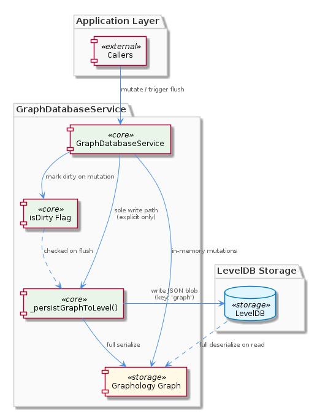
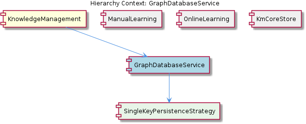

# GraphDatabaseService

**Type:** SubComponent

Because the full graph is deserialized on read and reserialized on write, GraphDatabaseService.js becomes a bottleneck for large graphs — every flush rewrites all nodes, edges, and metadata regardless of change set size

# GraphDatabaseService — Technical Insight Document

## What It Is

`GraphDatabaseService` is implemented in `src/knowledge-management/GraphDatabaseService.js` and serves as the primary persistence layer within the `KnowledgeManagement` parent component. Its responsibility is bridging the in-memory Graphology graph — containing all nodes, edges, and metadata — with durable storage via LevelDB. It does this through a deliberately simple, single-key strategy: the entire graph is serialized as one JSON blob and stored under the key `'graph'`. This design is encapsulated in its child component, `SingleKeyPersistenceStrategy`, which owns the mechanics of that overwrite-on-flush behavior.

## Architecture and Design

The dominant architectural decision in `GraphDatabaseService` is the **single-key persistence model**. Rather than decomposing the graph into per-node or per-edge LevelDB entries — which would enable partial reads, targeted updates, and atomic mutations at the entity level — the entire graph is treated as one opaque value. `SingleKeyPersistenceStrategy` implements this literally: every persist operation serializes the complete in-memory graph and overwrites whatever previously existed under `'graph'`. This trades storage granularity for implementation simplicity.

Layered on top of this is a **write-coalescing pattern** driven by the `isDirty` flag. Rather than writing to LevelDB on every mutation, `GraphDatabaseService` marks the in-memory state as dirty and defers the actual write until a flush is explicitly triggered via `_persistGraphToLevel()`. This means the system optimizes for read-heavy, batch-write workloads: the in-memory Graphology graph absorbs arbitrarily many mutations, and LevelDB sees only one write per flush cycle regardless of how many changes accumulated. This is a deliberate throughput optimization, but it introduces a durability gap.

The relationship between `GraphDatabaseService` and its siblings — `ManualLearning` and `OnlineLearning` — is structurally identical: both write into the Graphology graph, both rely on the `isDirty` flag being set, and neither automatically triggers `_persistGraphToLevel()`. This means the flush responsibility is externalized to callers, making `GraphDatabaseService` a passive persistence target rather than an active durability guarantor. `KmCoreStore`, the other sibling, sets an expectation that all graph entities carry UUIDv7 identifiers, which `GraphDatabaseService` propagates into storage without needing to manage ID generation itself.

## Implementation Details

The write path in `GraphDatabaseService` is narrow and deliberate. `_persistGraphToLevel()` is the **sole write path** to LevelDB and it performs a full serialize-and-overwrite on every invocation. There is no incremental patching, no diffing, and no partial write capability — a consequence of the single-key model in `SingleKeyPersistenceStrategy`. On the read side, the full blob under key `'graph'` is deserialized back into the Graphology in-memory representation. This means both reads and writes operate on the complete graph state, not subsets.

The `isDirty` flag is the only mechanism tracking whether the in-memory state diverges from what's persisted. Setting `isDirty = true` is the signal that a flush is warranted; however, the flag does not by itself schedule or trigger a flush. Any code path — whether originating from `ManualLearning`'s direct edits or `OnlineLearning`'s automated extraction pipelines — that modifies graph nodes or edges will set this flag, but the actual durability guarantee only materializes when a flush is explicitly invoked.

The scalability implication is direct: because `_persistGraphToLevel()` rewrites all nodes, edges, and metadata on every flush regardless of how many entities actually changed, `GraphDatabaseService` becomes an increasingly expensive operation as graph size grows. A graph with tens of thousands of nodes will serialize and write the entire structure even if only a single edge was added. This is the principal performance bottleneck in the current design.

## Integration Points

`GraphDatabaseService` sits at the center of `KnowledgeManagement`'s persistence contract. `ManualLearning` writes directly to the Graphology graph it manages, relying on the `isDirty`/flush cycle without triggering flushes itself. `OnlineLearning` does the same for automated extraction output. Neither sibling has a direct LevelDB dependency — that is fully encapsulated behind `GraphDatabaseService`. `KmCoreStore` implicitly shapes the data contract by requiring UUIDv7 identifiers on all graph entities, which flows through into whatever `GraphDatabaseService` ultimately serializes to `'graph'`.

The child `SingleKeyPersistenceStrategy` is where the LevelDB interaction is concretely implemented, handling the mechanics of writing to and reading from the `'graph'` key. `GraphDatabaseService` itself orchestrates when that strategy is invoked, but delegates the storage mechanics downward.

## Usage Guidelines

**Flush management is the developer's responsibility.** Any code that mutates the Graphology graph through `GraphDatabaseService` — whether adding nodes, removing edges, or updating metadata — must ensure that the flush cycle is explicitly triggered. There is no automatic persistence, no write-ahead log, and no crash recovery mechanism described in the current design. Silent data loss is the failure mode if a process terminates between a mutation and the next `_persistGraphToLevel()` call.

**Treat flushes as expensive operations at scale.** Because every flush rewrites the entire graph regardless of change set size, callers should batch mutations and flush once rather than flushing after each individual change. The `isDirty` flag exists precisely to support this batching pattern — accumulate changes, then flush once.

**Do not assume partial read capability.** The single-key design means there is no mechanism to read a subset of the graph from LevelDB. Any read operation deserializes the full blob. Design around this by relying on the in-memory Graphology graph for query and traversal operations, and treating LevelDB strictly as a durability layer rather than a query target.

**Scalability planning should account for full-graph serialization cost.** As the knowledge graph grows, flush latency will scale with total graph size, not with the size of the change set. If graph size becomes a concern, the `SingleKeyPersistenceStrategy` is the targeted place to revisit — replacing it with a per-entity key model would require a structural change to that child component but would leave the `isDirty`/flush interface in `GraphDatabaseService` largely intact.

## Hierarchy Context

### Parent
- [KnowledgeManagement](./KnowledgeManagement.md) -- [LLM] The primary persistence mechanism in KnowledgeManagement is a single-key LevelDB strategy implemented in `src/knowledge-management/GraphDatabaseService.js`. Rather than storing each graph entity as a separate LevelDB key (which would enable partial reads and atomic per-entity updates), the entire Graphology in-memory graph is serialized as one JSON blob stored under the key `'graph'`. This blob contains all nodes, edges, and metadata. Writes are deferred using an `isDirty` flag — mutations to the graph set `isDirty = true`, and `_persistGraphToLevel()` is only called when a flush is explicitly triggered. This design optimizes for read-heavy, batch-write workloads but creates a risk of data loss if the process crashes between mutations and the next flush. New developers should be aware that any code path that modifies graph nodes or edges must ensure the flush cycle is triggered, or changes will silently remain only in memory.

### Children
- [SingleKeyPersistenceStrategy](./SingleKeyPersistenceStrategy.md) -- Based on the parent context description, the LevelDB key 'graph' is the sole storage key, meaning every persist operation serializes the complete in-memory graph and overwrites the previous value entirely.

### Siblings
- [ManualLearning](./ManualLearning.md) -- Manual edits write directly to the Graphology in-memory graph via GraphDatabaseService.js, setting the isDirty flag but not automatically triggering _persistGraphToLevel(), meaning unsaved manual edits are at risk of loss if flush is not explicitly called
- [OnlineLearning](./OnlineLearning.md) -- Automated extraction pipelines write nodes and edges into the Graphology graph managed by GraphDatabaseService.js, relying on the isDirty/flush cycle for durability rather than per-write persistence
- [KmCoreStore](./KmCoreStore.md) -- All entities in the graph blob stored by GraphDatabaseService.js are expected to carry UUIDv7 identifiers, providing time-ordered, globally unique keys without a central ID authority

---

*Generated from 4 observations*
