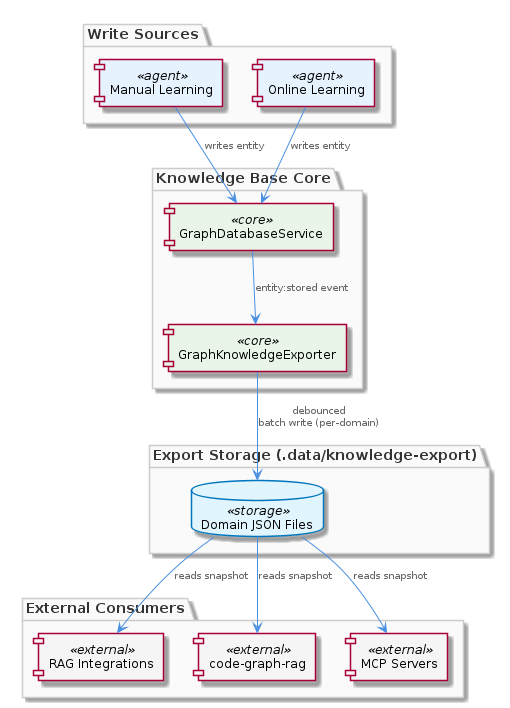
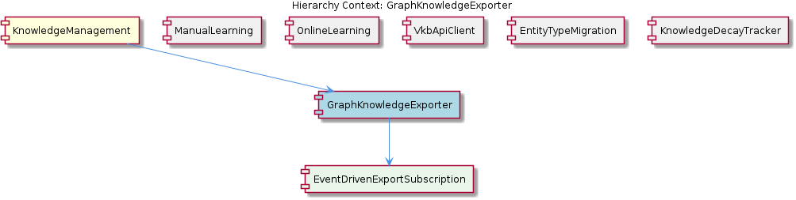

# GraphKnowledgeExporter

**Type:** SubComponent

The exporter's event-driven design means it is decoupled from both ManualLearning and OnlineLearning write paths — any write that triggers entity:stored will be reflected in exports regardless of origin

# GraphKnowledgeExporter — Technical Insight Document

## What It Is

GraphKnowledgeExporter is a SubComponent within the broader `KnowledgeManagement` component that materializes the in-memory Graphology knowledge graph as portable JSON snapshots on disk. It operates as an event-driven subscriber to `entity:stored` events emitted by `GraphDatabaseService`, writing partitioned per-domain JSON files into the `.data/knowledge-export` directory. Rather than acting as a synchronous step in the write path, it sits alongside it — observing storage events and projecting their effects into a file-based representation that external tools can consume.

Its purpose is twofold: (1) to provide an eventually consistent, portable snapshot of the knowledge graph that does not require a running VKB server to read, and (2) to decouple the costs of serialization and file I/O from the latency-sensitive write operations performed by callers like `ManualLearning` and `OnlineLearning`. Because it observes `entity:stored` rather than being called inline, any pathway that legitimately writes through `GraphDatabaseService` is automatically reflected in exports.

## Architecture and Design

The exporter follows an **event-driven, observer pattern** architecture. Its sole child entity, `EventDrivenExportSubscription`, encapsulates the subscription mechanism: GraphKnowledgeExporter registers as a listener on `entity:stored` events emitted by `GraphDatabaseService`, ensuring that exports happen asynchronously and never block the originating write. This is a deliberate **eventually-consistent** design choice — exports are guaranteed to converge with the underlying graph state, but they are not transactionally aligned with each individual write.

A second core pattern is **debouncing**. Rather than reacting to every `entity:stored` event with an immediate file write, the exporter batches rapid successive events into a single coalesced write. This protects the file system from write storms during bulk operations such as the batch analysis pipeline runs performed by `OnlineLearning`, where hundreds or thousands of entities may be stored in quick succession. The debouncing strategy trades fine-grained recency for I/O efficiency — a worthwhile trade since consumers of the export files are themselves typically batch processes (RAG indexers, graph analysis tools).

The third architectural choice is **partitioning by domain**. Instead of serializing the entire knowledge graph into a single monolithic JSON file, exports are split into multiple per-domain JSON files under `.data/knowledge-export`. This allows consumers to load only the slice of the graph that is relevant to their task, reducing memory pressure and parse time for tools that only care about, for example, one project's worth of entities.

## Implementation Details

The exporter's runtime behavior is anchored in its subscription to `entity:stored` events from `GraphDatabaseService`. When such an event arrives, the exporter does not immediately serialize the graph; instead, it schedules a debounced flush. Successive events arriving within the debounce window collapse into a single flush, at which point the affected per-domain JSON files are written to `.data/knowledge-export`. This means that during a heavy ingest cycle — for example, when the batch analysis pipeline described in `OnlineLearning` is ingesting git history, LSL sessions, and code analysis outputs — the exporter produces a small number of well-batched writes rather than one write per entity.

The per-domain partitioning logic implies the exporter must classify each entity by its domain (likely derived from the entity's ontology classification metadata, which is one of the rich metadata fields tracked by the parent `KnowledgeManagement` component). The canonical entity types used across the system — Project, Component, SubComponent, Pattern, Detail, System — are the same set used by siblings like `ManualLearning` and `OnlineLearning`, and consolidated by `EntityTypeMigration` via `scripts/migrate-graph-db-entity-types.js`. The exporter therefore relies on the same typed-node ontology that the rest of `KnowledgeManagement` enforces.

Because exports are plain JSON on disk, no special runtime is required to read them. External tools — RAG integrations, code-graph-rag, MCP servers — can open the files directly, without going through the VKB HTTP API exposed by `VkbApiClient` (located at `lib/ukb-unified/core/VkbApiClient.js`). This bypass is important: `VkbApiClient` is dynamically imported and may not be available if the server is not running, so the exported files act as a fallback knowledge surface that is always readable.

## Integration Points

The exporter's primary integration point is its event subscription to `GraphDatabaseService`, the LevelDB-backed graph store at the heart of `KnowledgeManagement`. Every write through that service — regardless of whether it originated in `ManualLearning` (human-authored entity additions) or `OnlineLearning` (automated batch analysis pipeline outputs) — emits an `entity:stored` event that the exporter consumes. This single subscription point is what gives the exporter its uniform coverage: it does not need to know about or be invoked by the various write paths.

On the consumer side, the exporter's integration surface is the file system itself. Anything that can read JSON from `.data/knowledge-export` is a valid downstream consumer. This includes RAG integrations that index the knowledge graph for retrieval, the external code-graph-rag tool, and MCP servers that expose the graph to LLM-driven workflows. Crucially, none of these consumers need a running VKB server — the exported files are entirely self-contained, complementing the direct LevelDB fallback pattern that `VkbApiClient` already supports.

The exporter is conceptually adjacent to siblings like `KnowledgeDecayTracker`, which also reads from entity state but embeds its information (staleness) directly in `EntityMetadata` rather than producing a side artifact. The contrast highlights the exporter's distinct role: it is the only sibling whose output is an external, portable file representation rather than an in-graph annotation.

## Usage Guidelines

Developers extending or relying on GraphKnowledgeExporter should respect its **eventual consistency** contract. The export files in `.data/knowledge-export` are not guaranteed to reflect the very latest write at the instant it completes; there is a debounce window during which a write has occurred in `GraphDatabaseService` but has not yet been flushed to disk. Code that requires strict read-your-write semantics must query `GraphDatabaseService` (or the VKB API) directly rather than reading from the exported files.

When adding new write paths into `GraphDatabaseService`, no special wiring to GraphKnowledgeExporter is needed — as long as the new path emits `entity:stored` events through the standard mechanism, exports will reflect the changes automatically. This is the central virtue of the event-driven design and the reason the exporter remains decoupled from `ManualLearning` and `OnlineLearning`. Conversely, any write path that bypasses the event emission will silently break export coverage, so emission discipline at the `GraphDatabaseService` layer is critical.

Consumers of the export should load only the per-domain JSON files they need, taking advantage of the partitioning rather than reassembling the full graph in memory. The partitioning is the exporter's primary scalability lever — as the graph grows, per-domain file sizes grow at the rate of their domain only, keeping consumer load times bounded for narrowly scoped use cases.

---

### Architectural Patterns Identified
- **Observer / event-driven subscription** via `entity:stored` on `GraphDatabaseService`
- **Debounce / write coalescing** to absorb bulk-write bursts
- **Domain partitioning** of serialized output across multiple JSON files
- **Side-artifact projection** — the graph is the source of truth; the export is a derived view

### Design Decisions and Trade-offs
- **Asynchronous, eventually consistent exports** trade strict recency for write-path latency isolation
- **Debouncing** trades fine-grained event-to-file alignment for I/O efficiency under burst load
- **Plain JSON on disk** trades richer query capability for portability and zero-runtime consumer access
- **Subscription to a single event stream** trades explicit per-caller wiring for uniform but emission-dependent coverage

### System Structure Insights
GraphKnowledgeExporter sits as a passive consumer at the edge of `KnowledgeManagement`'s write path. It owns one child concept — `EventDrivenExportSubscription` — which exists primarily to document and encapsulate the subscription mechanism. It is structurally peer to `ManualLearning`, `OnlineLearning`, `VkbApiClient`, `EntityTypeMigration`, and `KnowledgeDecayTracker`, but unlike them it neither writes to nor annotates the graph; it only observes and projects.

### Scalability Considerations
The combination of debouncing and per-domain partitioning gives the exporter graceful behavior under load. Write storms from the batch analysis pipeline collapse into single flushes, and consumers pay only for the domain slice they read. The main scalability risk is the size of a single domain partition — if one domain dominates the graph, its JSON file becomes a hot spot for both serialization cost and consumer parse cost. Future evolution might introduce sub-domain partitioning or incremental delta exports.

### Maintainability Assessment
The exporter's decoupling from write origins is its strongest maintainability property: new ingestion sources require no changes here. The maintenance burden is concentrated at two boundaries — (1) the `entity:stored` event contract on `GraphDatabaseService`, which must be honored by every write path, and (2) the per-domain JSON schema in `.data/knowledge-export`, which constitutes an implicit public interface to external consumers like RAG integrations, code-graph-rag, and MCP servers. Schema changes there are effectively API changes and should be versioned accordingly.

## Hierarchy Context

### Parent
- [KnowledgeManagement](./KnowledgeManagement.md) -- The KnowledgeManagement component provides graph-based knowledge storage, entity lifecycle management, and query capabilities for the Coding project. At its core it combines a Graphology in-memory graph with LevelDB persistent storage (via GraphDatabaseService), accessed either through a lock-free VKB HTTP API when the server is running or through direct file access as a fallback. The component manages typed entities (Project, Component, SubComponent, Pattern, Detail, System) with rich metadata including ontology classification, bi-temporal staleness tracking, embedding vectors, and hierarchy relationships.

### Children
- [EventDrivenExportSubscription](./EventDrivenExportSubscription.md) -- GraphKnowledgeExporter subscribes to entity:stored events emitted by GraphDatabaseService rather than being called inline, meaning file export is asynchronous and does not block the original write operation — a deliberate eventually-consistent design decision stated in the parent component description.

### Siblings
- [ManualLearning](./ManualLearning.md) -- ManualLearning entities are stored as typed nodes (Project, Component, SubComponent, Pattern, Detail, System) in the GraphDatabaseService-backed graph, using the same ontology classification fields as automated entities
- [OnlineLearning](./OnlineLearning.md) -- The batch analysis pipeline ingests git history, LSL sessions, and code analysis outputs, mapping findings to the canonical typed entity set (Project, Component, SubComponent, Pattern, Detail, System) before writing to GraphDatabaseService
- [VkbApiClient](./VkbApiClient.md) -- VkbApiClient is located at lib/ukb-unified/core/VkbApiClient.js and is dynamically imported at runtime, so callers must handle the case where the import fails (server not running) and fall back to direct LevelDB access
- [EntityTypeMigration](./EntityTypeMigration.md) -- scripts/migrate-graph-db-entity-types.js consolidates legacy entity type names into the canonical six-type set (Project, Component, SubComponent, Pattern, Detail, System), rewriting node attributes in the Graphology graph
- [KnowledgeDecayTracker](./KnowledgeDecayTracker.md) -- KnowledgeDecayTracker embeds staleness state directly in EntityMetadata rather than a separate store, so every entity read returns its own decay signal without additional <USER_ID_REDACTED>

---

*Generated from 5 observations*
