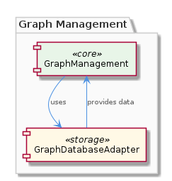
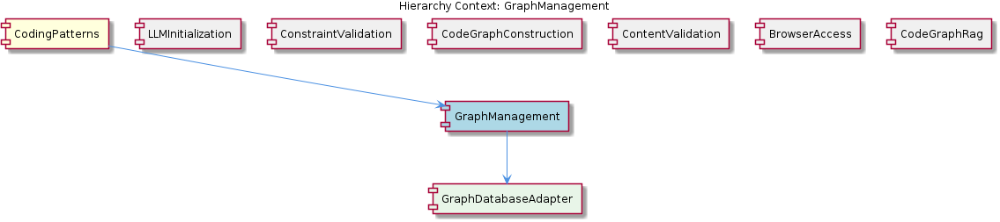

# GraphManagement

**Type:** SubComponent

The design decision to use the GraphDatabaseAdapter class enables seamless data synchronization and provides a robust foundation for the project's data management.

## What It Is  

**GraphManagement** is a sub‑component that concentrates on the core graph‑related business logic while delegating all persistence concerns to **GraphDatabaseAdapter**. The adapter lives in the file `storage/graph-database-adapter.ts` (as referenced from its parent, **CodingPatterns**), and it is the sole gateway for storing, retrieving, and synchronising graph data as JSON. By keeping the data‑access layer isolated, GraphManagement can remain lightweight and focused on its primary responsibilities, such as graph traversal, mutation, and validation, without being burdened by low‑level storage details.

## Architecture and Design  

The architecture follows a classic **Adapter / Facade** approach. GraphManagement depends on the **GraphDatabaseAdapter** class, which abstracts the underlying storage mechanism (presumably a file‑based JSON store or a graph database). This separation of concerns is intentional: GraphManagement handles domain‑specific operations, while the adapter encapsulates all I/O, serialization, and synchronization logic.  

The parent component **CodingPatterns** also consumes the same adapter (`storage/graph-database-adapter.ts`), indicating a shared persistence contract across sibling sub‑components. This reuse promotes consistency in how graph data is persisted throughout the system. The sibling components—**LLMInitialization**, **ConstraintValidation**, **CodeGraphConstruction**, **ContentValidation**, **BrowserAccess**, and **CodeGraphRag**—each implement distinct responsibilities (lazy LLM loading, rule‑based validation, graph construction, etc.) but they all sit at the same hierarchical level, allowing GraphManagement to interoperate with them via the common data model exposed by the adapter.

## Implementation Details  

The key class is **`GraphDatabaseAdapter`**, defined in `storage/graph-database-adapter.ts`. Its responsibilities, as captured in the observations, include:

* **Data storage and retrieval** – It reads and writes graph structures to a durable medium, most likely JSON files, enabling deterministic reconstruction of the graph state.  
* **Automatic JSON export sync** – Whenever the graph is mutated through GraphManagement, the adapter triggers an export routine that serialises the current graph into JSON and persists it, ensuring that external tools or downstream processes always see an up‑to‑date representation.  

GraphManagement itself does not expose any storage‑related methods; instead, it invokes the adapter’s API (e.g., `saveGraph(graph)`, `loadGraph()`) whenever persistence is required. This design makes the persistence layer interchangeable—if a future iteration swaps the JSON file for a true graph database, only the adapter would need to be rewritten, leaving GraphManagement untouched.

## Integration Points  

* **Parent – CodingPatterns**: The parent component imports the same `GraphDatabaseAdapter` to persist its own artefacts. This shared dependency means that any change to the adapter’s contract (e.g., method signatures, error handling) must be coordinated across both the parent and GraphManagement.  
* **Siblings**: While siblings do not directly call the adapter, they may consume the JSON artefacts produced by it. For instance, **CodeGraphConstruction** could read the exported JSON to rebuild a code graph, and **ContentValidation** might validate that the exported representation conforms to schema rules.  
* **Child – GraphDatabaseAdapter**: As the sole child, the adapter acts as a bridge to the external storage layer. Its public interface defines the integration surface for GraphManagement and any other component that requires graph persistence.

## Usage Guidelines  

1. **Never bypass the adapter** – All graph mutations performed by GraphManagement should be persisted through the adapter’s API. Direct file writes or manual JSON manipulation break the automatic sync contract and can lead to stale data.  
2. **Treat the adapter as a black box** – Developers should rely on the documented methods (`saveGraph`, `loadGraph`, etc.) without assuming internal storage formats. This preserves the ability to replace the underlying store later.  
3. **Handle adapter errors gracefully** – Since the adapter is responsible for I/O, callers must anticipate failures (e.g., disk full, permission errors) and implement retry or fallback logic where appropriate.  
4. **Leverage the automatic export** – The JSON export is intended for downstream consumption (e.g., debugging, external analytics). Ensure that any custom serialization settings remain compatible with the expected schema to avoid breaking sibling consumers.

---

### Architectural patterns identified  
* **Adapter / Facade pattern** – `GraphDatabaseAdapter` abstracts persistence details.  
* **Separation of Concerns** – GraphManagement focuses on domain logic; data management is isolated.  

### Design decisions and trade‑offs  
* **Centralised persistence** via a single adapter simplifies consistency but creates a single point of failure; robustness must be built into the adapter.  
* **Automatic JSON sync** guarantees up‑to‑date exports but may incur performance overhead on frequent graph updates.  

### System structure insights  
* The hierarchy (`CodingPatterns → GraphManagement → GraphDatabaseAdapter`) shows a clear vertical flow: high‑level patterns → functional sub‑component → storage layer.  
* Sibling components share the same level, each addressing a distinct cross‑cutting concern, which encourages modular evolution.  

### Scalability considerations  
* Because persistence is funneled through one adapter, scaling write throughput may require refactoring the adapter to batch updates or switch to a more scalable backend (e.g., a native graph DB).  
* The JSON export mechanism is suitable for moderate data volumes; very large graphs might need streaming or chunked serialization.  

### Maintainability assessment  
* The explicit separation and single responsibility of the adapter make the codebase easy to understand and modify.  
* Shared usage across parent and siblings mandates careful versioning of the adapter’s interface, but the clear contract mitigates accidental breakage.  
* Adding new persistence strategies is straightforward: implement a new adapter conforming to the same interface, leaving GraphManagement untouched.

## Hierarchy Context

### Parent
- [CodingPatterns](./CodingPatterns.md) -- [LLM] The CodingPatterns component utilizes the GraphDatabaseAdapter class in storage/graph-database-adapter.ts for persistence, allowing for automatic JSON export sync. This design decision enables seamless data synchronization and provides a robust foundation for the project's data management. The GraphDatabaseAdapter class is responsible for handling graph data storage and retrieval, making it a critical component of the project's architecture. By using this adapter, the CodingPatterns component can focus on its primary functionality, leaving data management to the GraphDatabaseAdapter.

### Children
- [GraphDatabaseAdapter](./GraphDatabaseAdapter.md) -- The parent analysis suggests the existence of a GraphDatabaseAdapter, which is a critical component of the project's architecture.

### Siblings
- [LLMInitialization](./LLMInitialization.md) -- LLMInitialization uses a lazy loading approach to initialize LLM agents, reducing computational overhead.
- [ConstraintValidation](./ConstraintValidation.md) -- ConstraintValidation uses a rules-based approach to validate constraints, ensuring system integrity.
- [CodeGraphConstruction](./CodeGraphConstruction.md) -- CodeGraphConstruction uses a graph-based approach to construct code graphs, enabling efficient data management.
- [ContentValidation](./ContentValidation.md) -- ContentValidation uses a rules-based approach to validate content, ensuring system integrity.
- [BrowserAccess](./BrowserAccess.md) -- BrowserAccess uses a browser-based approach to provide access to web-based interfaces.
- [CodeGraphRag](./CodeGraphRag.md) -- CodeGraphRag uses a graph-based approach to analyze code, providing a robust foundation for the project's functionality.

---

*Generated from 6 observations*
