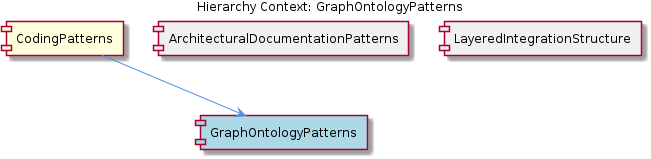

# GraphOntologyPatterns

**Type:** SubComponent

The relationship types CONTAINS_PACKAGE, CONTAINS_FOLDER, CONTAINS_FILE, CONTAINS_MODULE form a strict containment hierarchy in config/graph-database-config.json, encoding filesystem and module nesting as first-class graph edges

# GraphOntologyPatterns

## What It Is

GraphOntologyPatterns defines the formal vocabulary and structural rules governing how codebases are represented as graphs within the system. Its canonical definition lives in `config/graph-database-config.json`, which serves as the single source of truth for all relationship types, naming conventions, and ingestion parameters. Rather than treating graph schema as an implementation detail, the project elevates it to a first-class configuration artifact — a deliberate choice that makes the ontology inspectable, versioned, and queryable independently of the code that produces or consumes it.

This sub-component sits within CodingPatterns, which enforces a broader philosophy of explicit, convention-driven structure across the codebase. Where CodingPatterns as a whole governs how the layered integration architecture is organized (parsers, providers, services, tools, utils), GraphOntologyPatterns specifically governs the *semantic layer* — what entities exist, how they relate, and where boundaries are drawn between internal and external concerns.

## Architecture and Design

The ontology is built around a strict containment hierarchy expressed as first-class graph edges: `CONTAINS_PACKAGE → CONTAINS_FOLDER → CONTAINS_FILE → CONTAINS_MODULE`. This is a deliberate architectural decision to encode filesystem and module nesting directly into the graph topology rather than inferring it at query time. The practical consequence is that traversal <USER_ID_REDACTED> can navigate the codebase structure using the same mechanism they use to navigate semantic relationships — there is no impedance mismatch between "where does this file live?" and "what does this file define?"

The distinction between `DEFINES` and `DEFINES_METHOD` reflects a meaningful ontological choice: top-level symbol definition is structurally different from method membership within a class or module. This separation allows <USER_ID_REDACTED> to distinguish between "what symbols does this file introduce to the namespace?" and "what methods belong to this class?" without requiring predicate filtering on a single generic edge type. It is a normalization decision that trades a slightly larger edge vocabulary for significantly cleaner query semantics.

The `DEPENDS_ON_EXTERNAL` edge type is the most architecturally opinionated element of the schema. By creating a dedicated relationship for cross-boundary dependencies, the ontology enforces a hard structural distinction between the internal dependency graph and third-party references. This mirrors the same boundary-consciousness visible in the parent CodingPatterns architecture, where the layered integration structure (as documented in LayeredIntegrationStructure) enforces that each concern has exactly one home. Here, "external" is not a tag or property — it is a different kind of edge, making boundary violations structurally visible in graph <USER_ID_REDACTED> rather than requiring application-level enforcement.

## Implementation Details

The naming convention throughout `config/graph-database-config.json` uses `SCREAMING_SNAKE_CASE` for all relationship types. This is not merely stylistic — it creates an unambiguous visual and syntactic distinction between ontology terms and code identifiers in any query language (Cypher, GQL, etc.). When a developer writes a traversal, relationship type tokens are immediately identifiable as schema vocabulary rather than variable names or string values. This convention should be understood as a query ergonomics decision with long-term maintainability implications.

`MEMGRAPH_BATCH_SIZE` is documented as a configuration parameter alongside the ontology definition itself, which reveals something important about the design philosophy: the schema is not designed in isolation from operational concerns. Batch ingestion performance is treated as a first-class constraint at schema definition time. This suggests the graph is expected to be rebuilt or significantly updated in bulk (likely during full codebase re-indexing), and the schema designer anticipated that edge volume from the containment hierarchy alone — one edge per file-in-folder, per folder-in-package — would require tuned batch writes. The co-location of `MEMGRAPH_BATCH_SIZE` with the ontology config is a strong signal that schema changes should always be evaluated against their ingestion performance implications.

## Integration Points

GraphOntologyPatterns is consumed by any component that reads from or writes to the graph database — most directly the parsers and services layers within `integrations/code-graph-rag/codebase_rag/`, as established by LayeredIntegrationStructure. Parsers are responsible for emitting edges conforming to this ontology as they ingest source files; services consume those edges when answering semantic <USER_ID_REDACTED>. The ontology in `config/graph-database-config.json` is the contract between these two layers.

The `DEPENDS_ON_EXTERNAL` edge type is the primary integration surface between the internal graph and any tooling that reasons about third-party dependencies. Any MCP tool (living in the `tools/` layer per CodingPatterns conventions) that surfaces dependency information must respect this edge type boundary. Similarly, ArchitecturalDocumentationPatterns — the sibling sub-component — would rely on this ontology's containment hierarchy when generating PlantUML diagrams from graph traversals, since the `CONTAINS_*` edges are the structural backbone from which package and module diagrams would be derived.

## Usage Guidelines

**Extending the ontology** requires additions to `config/graph-database-config.json` and must follow the `SCREAMING_SNAKE_CASE` convention without exception. Introducing a new relationship type that is a semantic variant of an existing one (e.g., a more specific form of `DEFINES`) should be a conscious decision weighed against the query complexity it introduces versus the filtering burden it eliminates.

**Cross-boundary dependencies** must always use `DEPENDS_ON_EXTERNAL` rather than a generic dependency edge. Conflating internal and external dependencies into a single edge type would undermine the primary architectural guarantee this ontology provides — the ability to query the internal dependency graph in isolation.

**Schema changes should be evaluated against `MEMGRAPH_BATCH_SIZE`**. Because this parameter is co-located with the ontology, it signals that any change increasing edge volume (particularly in the containment hierarchy) must be benchmarked against ingestion performance before merging.

**New contributors** should treat `config/graph-database-config.json` as a read-before-you-write artifact. The ontology is the semantic contract for the entire graph layer, and changes to it have downstream effects on every parser, service, and tool in the codebase. Consistent with the broader CodingPatterns philosophy, the structure is designed so that violations are structurally visible rather than caught only at runtime.

## Hierarchy Context

### Parent
- [CodingPatterns](./CodingPatterns.md) -- [LLM] The project enforces a strict layered architecture within each integration, most visibly in integrations/code-graph-rag/codebase_rag/ which separates concerns into parsers/, providers/, services/, tools/, and utils/ subdirectories. This mirrors a classic hexagonal/ports-and-adapters style: parsers handle raw source ingestion, providers abstract data sources, services contain business logic, tools expose callable capabilities (likely as MCP tools), and utils hold shared helpers. A new developer adding a language parser would add only to parsers/, while a new MCP-exposed capability would live in tools/ — the structure enforces that each concern has exactly one home. This same pattern repeats in integrations/mcp-server-semantic-analysis/ and integrations/mcp-constraint-monitor/, suggesting the project treats this directory layout as a project-wide architectural standard rather than an incidental choice.

### Siblings
- [ArchitecturalDocumentationPatterns](./ArchitecturalDocumentationPatterns.md) -- The docs/puml/ directory is called out as the canonical home for PlantUML diagrams, establishing a convention that architecture diagrams live alongside but separate from prose documentation
- [LayeredIntegrationStructure](./LayeredIntegrationStructure.md) -- integrations/code-graph-rag/codebase_rag/ is the canonical reference implementation of the five-layer split, documented in the CONTRIBUTING.md as the expected structure for new contributors

---

*Generated from 5 observations*
