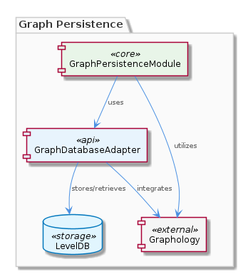
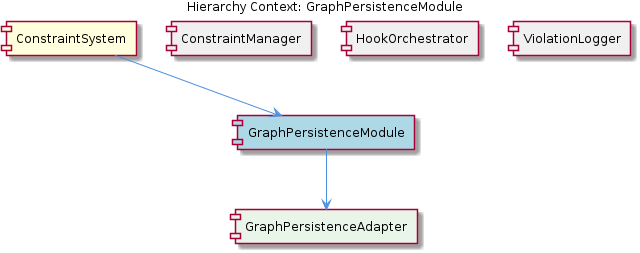

# GraphPersistenceModule

**Type:** SubComponent

The GraphPersistenceModule might be related to the GraphDatabaseAdapter, as it utilizes Graphology and LevelDB for persistence.

## What It Is  

The **GraphPersistenceModule** is a sub‑component that lives inside the **ConstraintSystem** package.  The concrete implementation is expected to be defined in a TypeScript file such as `graph‑persistence‑module.ts` (the exact file name is not listed in the source, but the naming convention follows the rest of the codebase).  Its primary responsibility is to provide a thin, purpose‑built layer that stores and retrieves graph‑structured data for the constraint engine.  The module leans on two well‑known libraries – **Graphology**, which supplies an in‑memory graph model, and **LevelDB**, which offers a fast, key‑value store on disk.  By coupling these two, the module can keep an operational graph in memory while persisting changes efficiently to LevelDB.

The module is not a stand‑alone persistence engine; rather, it acts as a bridge between the higher‑level **ConstraintSystem** logic and the lower‑level **GraphDatabaseAdapter** found in `storage/graph-database-adapter.ts`.  The adapter itself already knows how to translate constraint objects into graph operations, and the GraphPersistenceModule supplies the concrete storage backend for those operations.  This relationship is illustrated in the architecture diagram below.  



## Architecture and Design  

The design of the GraphPersistenceModule is rooted in the **Adapter pattern**.  The module contains a **GraphPersistenceAdapter** component that implements the contract expected by the surrounding constraint engine while internally delegating to Graphology for graph manipulation and LevelDB for durability.  This separation of concerns lets the rest of the system treat the persistence layer as a black box, swapping out the underlying storage technology without touching constraint logic.

Interaction flows as follows: the **ConstraintSystem** (parent) issues graph‑mutation requests (e.g., addNode, addEdge) to the **GraphPersistenceAdapter**.  The adapter translates those calls into Graphology API invocations, updates the in‑memory representation, and then serialises the affected portions into LevelDB key‑value pairs.  Retrieval works in reverse – LevelDB entries are read, deserialized, and re‑hydrated into Graphology structures.  Because LevelDB is an append‑only log‑structured store, write‑through persistence incurs minimal latency, which is essential for the real‑time validation paths used by agents such as `ContentValidationAgent` (found in `integrations/mcp-server-semantic-analysis/src/agents/content-validation-agent.ts`).

The module’s placement alongside sibling components **ConstraintManager**, **HookOrchestrator**, and **ViolationLogger** reflects a cohesive vertical slice: each sibling focuses on a distinct aspect of constraint handling (management, hook orchestration, violation logging), while the GraphPersistenceModule supplies the shared data‑persistence foundation they all rely on.  The relationship diagram makes these connections explicit.  



## Implementation Details  

Although the source contains “0 code symbols found”, the observations give enough concrete identifiers to outline the implementation skeleton:

* **File**: `graph-persistence-module.ts` (presumed location)  
* **Class**: `GraphPersistenceAdapter` – the concrete adapter that implements the persistence contract.  
* **Dependencies**:  
  * `graphology` – provides `Graph` objects, traversal utilities, and mutation methods.  
  * `levelup`/`leveldown` (LevelDB bindings) – used via a LevelDB instance created at a configurable path (e.g., `./data/graph-db`).  

Typical methods on `GraphPersistenceAdapter` likely include:  

```ts
class GraphPersistenceAdapter {
  private graph: Graph;
  private db: LevelUP;   // LevelDB instance

  constructor(dbPath: string) {
    this.graph = new Graph();
    this.db = levelup(leveldown(dbPath));
  }

  async addNode(id: string, attrs: Record<string, any>) {
    this.graph.addNode(id, attrs);
    await this.db.put(`node:${id}`, JSON.stringify(attrs));
  }

  async addEdge(source: string, target: string, attrs: Record<string, any>) {
    this.graph.addEdge(source, target, attrs);
    await this.db.put(`edge:${source}->${target}`, JSON.stringify(attrs));
  }

  async getNode(id: string) {
    const raw = await this.db.get(`node:${id}`);
    return JSON.parse(raw.toString());
  }

  // Additional bulk‑load, sync, and export functions …
}
```

The adapter also likely implements a **JSON export sync** routine, mirroring the capability described for the `GraphDatabaseAdapter`.  This routine would stream the entire LevelDB content into a JSON file, enabling downstream components (e.g., the `ContentValidationAgent`) to consume a snapshot without direct DB access.

## Integration Points  

* **Parent – ConstraintSystem**: The ConstraintSystem instantiates the GraphPersistenceAdapter during its startup sequence, passing configuration such as the LevelDB storage directory.  All constraint‑related operations funnel through this adapter, ensuring a single source of truth for graph data.  

* **Sibling – ConstraintManager**: When the manager creates, updates, or deletes constraints, it calls the adapter’s mutation methods.  Because the manager does not need to know whether data lives in memory or on disk, the adapter abstracts those details.  

* **Sibling – HookOrchestrator**: Hooks that react to graph changes (e.g., after a node is added) may subscribe to events emitted by the GraphPersistenceAdapter, allowing the orchestrator to trigger side‑effects without coupling to persistence logic.  

* **Sibling – ViolationLogger**: Violation records are often linked to graph nodes representing rule instances.  The logger reads node metadata via the adapter to enrich log entries with contextual information.  

* **Child – GraphPersistenceAdapter**: All concrete persistence work is encapsulated in this child class.  It implements the contract expected by the parent and exposes a clean API to the siblings.  

* **External – GraphDatabaseAdapter (`storage/graph-database-adapter.ts`)**: The GraphPersistenceModule re‑uses the same underlying libraries (Graphology, LevelDB) as the GraphDatabaseAdapter, enabling code sharing and consistent data formats across the system.  The adapter may also delegate certain bulk‑import/export tasks to the GraphPersistenceModule for consistency.

## Usage Guidelines  

1. **Instantiate Once, Share Widely** – Create a single `GraphPersistenceAdapter` instance at application bootstrap (e.g., in `ConstraintSystem`’s constructor) and inject it into all components that need graph access.  Multiple instances would lead to divergent LevelDB handles and potential data races.  

2. **Prefer Async API** – All LevelDB operations are asynchronous.  Callers (ConstraintManager, HookOrchestrator) should `await` mutation methods to guarantee that the in‑memory graph and the persisted state stay in sync.  

3. **Batch Writes for Performance** – When inserting large numbers of nodes or edges (e.g., during initial rule loading), use LevelDB’s batch API to group writes.  This reduces disk I/O and keeps the Graphology instance consistent.  

4. **Leverage the JSON Export Sync** – Periodic snapshots are useful for debugging or for feeding downstream analytics pipelines.  Trigger the export via a scheduled job in the ConstraintSystem or on demand through an admin endpoint.  

5. **Handle Corruption Gracefully** – LevelDB may encounter corruption on abrupt shutdowns.  The adapter should expose a recovery routine (e.g., `repairDB`) that can be called during system start‑up, ensuring the ConstraintSystem can recover without manual intervention.  

6. **Versioned Schema** – If the shape of node or edge attributes evolves, embed a version field in the persisted JSON payloads.  The adapter can then perform migration steps when loading older entries, preserving backward compatibility for sibling components.  

---

### Architectural Patterns Identified  
* **Adapter Pattern** – GraphPersistenceAdapter isolates the rest of the system from the concrete Graphology + LevelDB stack.  

### Design Decisions and Trade‑offs  
* **In‑Memory Graph + Disk Persistence** – Fast read/write for constraint evaluation, at the cost of higher memory usage.  
* **LevelDB as a Key‑Value Store** – Provides ordered writes and low latency, but lacks native graph query capabilities, requiring the adapter to translate graph traversals into key look‑ups.  

### System Structure Insights  
* The module sits at the intersection of constraint management (parent) and low‑level storage (child), acting as the data‑access layer for all sibling components.  

### Scalability Considerations  
* Because LevelDB scales vertically (single‑process), the current design is optimal for moderate graph sizes typical of constraint rule sets.  For massive graphs, a distributed graph database would be required, implying a future redesign of the adapter interface.  

### Maintainability Assessment  
* The clear separation of concerns (adapter, in‑memory model, persistence) promotes testability and easy replacement of the storage backend.  However, the lack of explicit type definitions in the observed code (e.g., missing interfaces) could increase the cognitive load for new contributors; adding TypeScript interfaces for the adapter contract would further improve maintainability.


## Hierarchy Context

### Parent
- [ConstraintSystem](./ConstraintSystem.md) -- [LLM] The ConstraintSystem component utilizes the GraphDatabaseAdapter for persistence, which is implemented in the storage/graph-database-adapter.ts file. This adapter enables the system to store and manage constraints in a graph database, utilizing Graphology and LevelDB for efficient data storage and retrieval. The adapter also features automatic JSON export sync, allowing for seamless data exchange between the graph database and other components. For example, the ContentValidationAgent, located in integrations/mcp-server-semantic-analysis/src/agents/content-validation-agent.ts, relies on the GraphDatabaseAdapter to retrieve and validate entity content against configured rules.

### Children
- [GraphPersistenceAdapter](./GraphPersistenceAdapter.md) -- The GraphPersistenceModule is related to the GraphDatabaseAdapter, as mentioned in the Hierarchy Context, indicating a strong connection between graph persistence and database adaptation.

### Siblings
- [ConstraintManager](./ConstraintManager.md) -- The ConstraintManager likely interacts with the GraphDatabaseAdapter in storage/graph-database-adapter.ts to store and manage constraints.
- [HookOrchestrator](./HookOrchestrator.md) -- The HookOrchestrator might be related to the Copi project in integrations/copi, which has documentation on hook functions and usage.
- [ViolationLogger](./ViolationLogger.md) -- The ViolationLogger might be related to the ConstraintManager, as it handles constraint violations.


---

*Generated from 4 observations*
