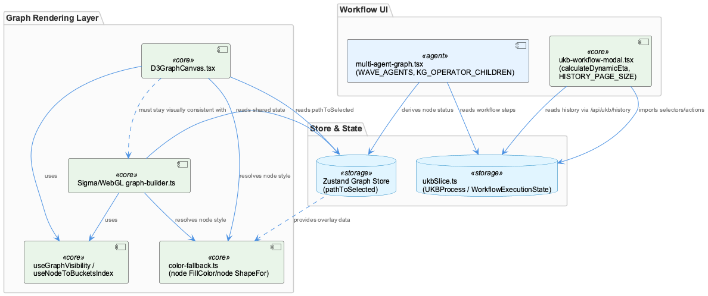
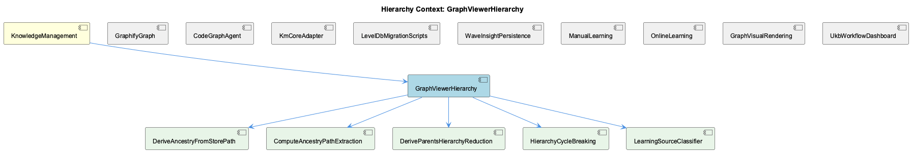

# GraphViewerHierarchy

**Type:** SubComponent

[Code References] integrations/unified-viewer/src/graph/D3GraphCanvas.tsx - deriveAncestryFromStorePath() reconciliation of inline BFS vs store pathToSelected; integrations/unified-viewer/src/graph/D3GraphCanvas.tsx - d3NodesRef and selectionSource restored narrowly for Layer 0→Layer 1 fit-to-bounds transition; integrations/unified-viewer/src/graph/color-fallback.ts - nodeFillColor() and nodeShapeFor() parent-walking resolvers, BATCH_PALETTE/ONLINE_PALETTE/SHAPE_PALETTE tables; integrations/unified-viewer/src/graph/color-fallback.ts - ONLINE_RING_COLOR ring-overlay design replacing prior fill-color conflation of learning provenance; integrations/system-health-dashboard/src/components/workflow/multi-agent-graph.tsx - WAVE_AGENTS and KG_OPERATOR_CHILDREN module-scope constants for useMemo stability; integrations/system-health-dashboard/src/store/slices/ukbSlice.ts - LLMState.perAgentOverrides and UKBProcess.llmMode optional tri-state design; integrations/system-health-dashboard/src/components/ukb-workflow-modal.tsx - calculateDynamicEta() blended ETA estimation with sanity clamping; integrations/system-health-dashboard/src/components/ukb-workflow-modal.tsx - calculateStepAwareEta() legacy delegate function; integrations/system-health-dashboard/src/components/ukb-workflow-modal.tsx - HISTORY_PAGE_SIZE constant and incident comment describing truncated history list

# GraphViewerHierarchy — Technical Insight Document

## What It Is

GraphViewerHierarchy is the subcomponent responsible for reconciling and rendering ontology-driven graph visualization state within the KnowledgeManagement domain, primarily implemented across `integrations/unified-viewer/src/graph/D3GraphCanvas.tsx` and `integrations/unified-viewer/src/graph/color-fallback.ts`. It is not a single class but a cohesive set of five child behaviors — DeriveAncestryFromStorePath, ComputeAncestryPathExtraction, DeriveParentsHierarchyReduction, HierarchyCycleBreaking, and LearningSourceClassifier — that together answer two recurring questions for the graph UI: "which nodes are on the currently selected ancestry path?" and "what color/shape/style does a given ontology class resolve to?" As a child of KnowledgeManagement, it sits downstream of GraphifyGraph's static `graph.json` artifact and KmCoreAdapter's entity/relationship taxonomy, consuming that structural knowledge to drive interactive visualization rather than producing knowledge itself.

## Architecture and Design

The dominant architectural pattern is **reconciliation between independently-derived state**, appearing twice in near-identical form. In D3GraphCanvas.tsx, `deriveAncestryFromStorePath()` (realized in child components DeriveAncestryFromStorePath and ComputeAncestryPathExtraction) reconciles the Zustand store's authoritative `pathToSelected` set against a locally re-run BFS (`computeAncestryPath()` from `./ancestry`). Rather than trusting one source, it applies a "writer's intent wins, but degrade gracefully" policy: store-only nodes get a synthetic max-depth slot so they still render dimly, BFS-only nodes are dropped, and edges are filtered to survivors. A fast path short-circuits when both sets agree in size and membership, avoiding the reconciliation cost on the common case.

This same duplication-of-a-hierarchy-walk pattern reappears in color-fallback.ts, where DeriveParentsHierarchyReduction implements nearly identical parent-walking loops in `nodeFillColor()` and `nodeShapeFor()` — each walking `cur = reg?.parent` until a registry override or static palette (`BATCH_PALETTE`, `SHAPE_PALETTE`) is found. HierarchyCycleBreaking is the guard embedded in both loops (`seen` set + `while (cur && !seen.has(cur))`) preventing a malformed cyclic ontology registry from hanging the render path — a structural echo of the ancestry reconciliation's dual-path caution, since both are effectively "derive X from ancestor chain, but don't trust the chain blindly." The codebase repeatedly solves this class of problem per-consumer rather than via one generic reducer, a maintainability trade-off worth noting for future refactors.

## Implementation Details

`deriveAncestryFromStorePath()` builds a `prunedNodeDepths` map and `prunedEdges` list, combining store truth with BFS-derived depth information for gradient rendering. Its narrow, carefully-scoped interaction with viewport behavior is documented via dated inline comments (a de facto decision log) describing a panning/centering feature that was added, retracted per operator feedback, then reintroduced only for Layer 0→Layer 1 transitions — never on drill/pop. The `selectionSource` subscription and `d3NodesRef` were restored specifically for this purpose but are deliberately excluded from the main render `useEffect`'s dependency array to honor "Locked Contract #3" in PATTERNS-LOCK.md, a viewport-stability guarantee.

color-fallback.ts implements UI-SPEC §14's five-rule fallback chain (overlay → class palette → ancestor walk → hardcoded default) governing color, shape, borderStyle, and pulseRule. `nodeFillColor()` encodes ontology depth via the DeriveParentsHierarchyReduction walk, while LearningSourceClassifier — realized through `isOnlineLearned()`, shared across D3GraphCanvas.tsx and color-fallback.ts — determines online-vs-batch provenance, deliberately demoted to a ring overlay (`ONLINE_RING_COLOR`) rather than a fill-color distinction after an earlier scheme conflated the two axes ("Insights are not purple"). Notably, `isOnlineLearned()` replaced a narrower `source === 'auto'` check because production data stamps ETM/consolidator output as "online" far more often than "auto" — the classifier absorbed real-world data drift post-hoc.

## Integration Points

GraphViewerHierarchy's color resolvers unify what were previously three divergent implementations across D3GraphCanvas, a Sigma-based `buildGraph` (graph-builder.ts), and `LegendPanel` — a consolidation pattern ("three implementations disagree, so build the one true function"). This directly supports the sibling relationship with GraphVisualRendering, since both D3 (SVG) and Sigma (WebGL) rendering engines must stay visually consistent against the same Zustand store state without a shared traversal implementation. Upstream, the hierarchy consumes ontology/class registry data ultimately sourced from GraphifyGraph's static `graph.json` and KmCoreAdapter's taxonomy, meaning any taxonomy migration (per LevelDbMigrationScripts' entity-type collapsing) has downstream implications for palette/registry lookups here. The UKB workflow dashboard's `multi-agent-graph.tsx` and `ukb-workflow-modal.tsx`, while architecturally separate, share the broader pattern of consuming centralized state (ukbSlice.ts) the way D3GraphCanvas consumes the Zustand graph store.

## Usage Guidelines

Developers modifying `deriveAncestryFromStorePath()` must preserve the "writer's intent wins" reconciliation semantics — do not simplify to trusting only `pathToSelected` or only the local BFS, as both exist to keep dual rendering engines synchronized. Any change to viewport-related refs (`selectionSource`, `d3NodesRef`) must respect Locked Contract #3 and must not enter the main render `useEffect`'s dependency list. When adding new ontology classes or palettes in color-fallback.ts, follow the established fallback order (overlay → palette → ancestor walk → default) and preserve the `seen`-set cycle guard in any new ancestor-walking logic — given the duplicated-loop pattern, a future refactor consolidating `nodeFillColor()`/`nodeShapeFor()`/`deriveAncestryFromStorePath()` into one generic ancestor-reduction utility would reduce this maintenance burden. Finally, treat learning-source classification (`isOnlineLearned()`) as a single shared utility, not a per-file string check, since its definition has already drifted once against real data.

## Hierarchy Context

### Parent
- [KnowledgeManagement](./KnowledgeManagement.md) -- [LLM] The GraphifyGraph reader (integrations/semantic-analysis/src/agents/graphify-graph.ts) represents a deliberate architectural simplification: rather than maintaining a live graph database connection (Memgraph via Cypher), the component now treats a static graph.json artifact produced by the graphify service as the source of truth for code-structure knowledge. This file, a NetworkX node-link JSON export, can be tens of megabytes, so GraphifyGraph implements mtime-based lazy caching — it stat()s the file and only re-parses when the mtime has changed since the last load. This pattern trades real-time graph mutation capability for drastically simpler deployment (no separate DB process) and fast repeated reads, at the cost of only picking up graph changes when the underlying analysis pipeline re-writes graph.json.

### Children
- [DeriveAncestryFromStorePath](./DeriveAncestryFromStorePath.md) -- [CGR] deriveAncestryFromStorePath (function) in D3GraphCanvas.tsx
- [ComputeAncestryPathExtraction](./ComputeAncestryPathExtraction.md) -- [LLM] The core of this component, `deriveAncestryFromStorePath()` in integrations/unified-viewer/src/graph/D3GraphCanvas.tsx, implements a fast-path/slow-path reconciliation between two independently-computed ancestry sets: the store's authoritative `pathToSelected` set (written by every selection writer — graph click, history click, timeline tick) and a local re-run of `computeAncestryPath()` (imported from './ancestry'). The fast path short-circuits when `inline.nodeDepths.size === storePath.size` and every inline key exists in `storePath`, avoiding the more expensive pruning logic on the common case where both traversals agree. When they disagree, the function does not simply trust one source — it builds a `prunedNodeDepths` map giving store-only nodes a synthetic `maxDepth` slot (so they render at the dimmest end of the gradient rather than being dropped), while dropping BFS-only nodes entirely and filtering `prunedEdges` down to edges whose endpoints both survive. This is a deliberate 'writer's intent wins, but degrade gracefully' policy rather than a simple source-of-truth swap.
- [DeriveParentsHierarchyReduction](./DeriveParentsHierarchyReduction.md) -- [LLM] The component's namesake operation is the parent-walking loop implemented twice, nearly identically, in integrations/unified-viewer/src/graph/color-fallback.ts — once in `nodeFillColor()` and once in `nodeShapeFor()`. Both functions take a `className`, a `ReadonlyMap<string, ClassRegistryEntry>` registry, and walk `cur = reg?.parent ?? undefined` in a `while (cur && !seen.has(cur))` loop, checking a registry override first, then a static palette (`BATCH_PALETTE`/`SHAPE_PALETTE`), before ascending to the parent. This is a hierarchy-reduction pattern: an entity's own ontology class is reduced to whichever ancestor is the nearest one carrying an actual color/shape assignment, so `LiveLoggingSystem` (a Component subtype) inherits Component's blue rather than falling through to a generic slate default. The duplication of the walk (two near-identical `while` loops differing only in what table they consult) is a direct structural echo of the reconciliation-duplication pattern already documented for `deriveAncestryFromStorePath()` in D3GraphCanvas.tsx — this codebase repeatedly solves 'derive X from ancestor chain' by writing a fresh loop per consumer rather than a single generic reducer.
- [HierarchyCycleBreaking](./HierarchyCycleBreaking.md) -- [LLM] The component's actual cycle-breaking logic lives in `nodeFillColor` and `nodeShapeFor` in integrations/unified-viewer/src/graph/color-fallback.ts, not in D3GraphCanvas.tsx. Both functions walk a registry parent chain (`cur = reg?.parent`) with an identical guard: `const seen = new Set<string>(); while (cur && !seen.has(cur)) { seen.add(cur); ... }`. Without this guard, a malformed ontology registry entry (e.g. class A declaring parent B, B declaring parent A) would infinite-loop the walk on every single node render using that class — since these are called per-node inside D3GraphCanvas's render path, a cyclic registry would hang the whole canvas, not just misrender one node.
- [LearningSourceClassifier](./LearningSourceClassifier.md) -- [LLM] The 'LearningSourceClassifier' concept is not embodied by a single dedicated file in the evidence provided but is realized as a distributed convention enforced across at least three files: `isOnlineLearned()` imported into D3GraphCanvas.tsx and color-fallback.ts, and referenced implicitly by the 'Learning Source' filter mentioned in useGraphVisibility comments. color-fallback.ts explicitly documents that this classifier replaced an earlier, narrower `source === 'auto'` string check because 'the data stamps ETM/consolidator output as online far more often than auto', meaning the classification logic itself absorbed real-world data drift rather than being fixed at design time.

### Siblings
- [GraphifyGraph](./GraphifyGraph.md) -- [LLM] GraphifyGraph (integrations/semantic-analysis/src/agents/graphify-graph.ts) inverts the conventional graph-database architecture by treating a flat, periodically-regenerated graph.json file as the system of record instead of a live queryable store. The mtime-based lazy-caching strategy — stat() the file, compare against the last-seen mtime, and only re-parse the (potentially tens-of-megabytes) NetworkX node-link export when it changes — is a classic read-heavy optimization, but it also means GraphifyGraph is fundamentally a batch-consistency component: it cannot see a code-structure change until the separate graphify analysis pipeline finishes a full re-write of the JSON artifact. This is architecturally similar to the mtime/staleness problem the dashboard integration explicitly worked around elsewhere in this codebase (system-health-dashboard's bind-mount VirtioFS caching required a forced container restart to invalidate a stale read) — both are instances of 'a file on disk is the API' trading real-time correctness for operational simplicity.
- [CodeGraphAgent](./CodeGraphAgent.md) -- [LLM] There is a concrete documentation-drift artifact visible in integrations/system-health-dashboard/src/components/workflow/multi-agent-graph.tsx: the `AGENT_SUBSTEPS['code_graph']` array still describes its `query` sub-step with `techNote: 'Cypher queries on Memgraph'` (multi-agent-graph.tsx, code_graph entry, 'query' id). This directly contradicts the parent-context claim that CodeGraphAgent now delegates every call to GraphifyGraph's static graph.json reader and no longer speaks Cypher to a live Memgraph instance. Because this dashboard copy is what renders in the UKB workflow visualization modal (ukb-workflow-modal.tsx via MultiAgentGraph), any operator inspecting the live workflow graph is shown stale technology labels for a component whose backend was already migrated — exactly the kind of subtle trap the parent observation warned about with `checkMemgraphConnection` being a preserved-but-stubbed method name.
- [KmCoreAdapter](./KmCoreAdapter.md) -- [LLM] The provided code files (ukb-workflow-modal.tsx, multi-agent-graph.tsx, ukbSlice.ts, D3GraphCanvas.tsx, color-fallback.ts) belong to system-health-dashboard and unified-viewer, not directly to the KmCoreAdapter/GraphifyGraph pipeline described in the parent observations. This suggests KmCoreAdapter's output (graph.json, entity types, relationship taxonomy) is consumed downstream by visualization layers like D3GraphCanvas and the AGENT_SUBSTEPS 'code_graph' definitions in multi-agent-graph.tsx, which explicitly reference 'Cypher queries on Memgraph' as a techNote — a stale artifact from before the GraphifyGraph migration described in the parent context, meaning the UI's descriptive text has not been updated to reflect the Memgraph-to-graphify strangler-fig migration.
- [LevelDbMigrationScripts](./LevelDbMigrationScripts.md) -- [LLM] The two migration scripts referenced in the parent context — migrate-graph-db-entity-types.js and migrate-leveldb-to-kmcore.mjs — represent sequential, non-idempotent phases of the same underlying transition: first a taxonomy simplification (collapsing TransferablePattern/WorkflowPattern/TechnicalIssue into System/Project/Pattern) performed in-place against the live Graphology in-memory graph, then a structural re-platforming that assigns UUIDv7 identifiers, a layer='evidence' classification, and a legacyId.system='B' backward-reference tag to every entity. Because the second script depends on entities already conforming to the three-category taxonomy (any code still testing for the old fine-grained type strings would silently fail), these scripts form an implicit ordering contract that is not enforced by any shared orchestration file — a developer running migrate-leveldb-to-kmcore.mjs before migrate-graph-db-entity-types.js has completed would migrate stale/incorrect type data into the new km-core shape with no runtime error to signal the mistake.
- [WaveInsightPersistence](./WaveInsightPersistence.md) -- [LLM] The 'persistence' entry in AGENT_SUBSTEPS (integrations/system-health-dashboard/src/components/workflow/multi-agent-graph.tsx) models WaveInsightPersistence as three explicit, sequential sub-steps — w1 ('Wave 1 Persist', L0 Project + L1 Component entities), w2 ('Wave 2 Persist', L2 SubComponent entities), and w3 ('Wave 3 Persist', L3 Detail entities plus operator-refined fields and embeddings). All three declare llmUsage: 'none' and techNote: 'GraphDB + LevelDB storage', confirming that persistence itself is a pure storage operation with no LLM calls — the LLM work (pattern discovery, entity extraction, classification) happens upstream in kg_operators/semantic_analysis/insight_generation, and persistence's job is purely to commit already-synthesized entities. Notably w3's techNote uniquely adds 'direct attribute merge', implying Wave 3 does not simply insert new nodes but merges operator-enriched fields (e.g. embeddings) onto entities that may already exist from earlier waves — a detail not present in w1/w2, suggesting Wave 3 is where duplicate-entity reconciliation actually happens rather than at insight-generation time.
- [ManualLearning](./ManualLearning.md) -- [LLM] The ukb-workflow-modal.tsx file documents its own evolution through inline comments rather than commit messages — the HISTORY_PAGE_SIZE constant carries a multi-paragraph comment explaining that raising it from 50 to 500 was 'close to free' because /api/ukb/history parses every report regardless of limit and only slices at the end. This is a case of manual/institutional learning being encoded directly in source as a durable artifact: a future maintainer who considers lowering this constant for 'performance' will read the comment and understand the tradeoff (response size vs. server work) before making that mistake again, effectively preventing regression of a fix that had no automated test to catch it.
- [OnlineLearning](./OnlineLearning.md) -- [LLM] The 'OnlineLearning' distinction is implemented as a data-driven color/shape overlay rather than a structural entity type: `integrations/unified-viewer/src/graph/color-fallback.ts` defines two parallel palettes, `BATCH_PALETTE` (teal/blue shades keyed by hierarchy depth: System/Project/Component/SubComponent/Detail) and `ONLINE_PALETTE` (red/pink shades for the same hierarchy levels), and `classColor()` picks between them purely based on whether `isOnlineLearned({ metadata: { source } })` returns true. This means 'online-learned' is not a first-class ontology class but a metadata flag (`source: 'auto'` or `'online'`) riding along on any entity, decoupled from what class/type that entity otherwise has.
- [GraphVisualRendering](./GraphVisualRendering.md) -- [LLM] The GraphVisualRendering surface is split across two independently-evolved implementations that never share code: `integrations/system-health-dashboard/src/components/workflow/multi-agent-graph.tsx` renders the UKB workflow pipeline as a fixed-topology SVG (`WAVE_AGENTS`, `KG_OPERATOR_CHILDREN`, `MULTI_AGENT_EDGES` from `./constants`), while `integrations/unified-viewer/src/graph/D3GraphCanvas.tsx` renders the knowledge graph itself as a force-directed D3 simulation (`d3.forceSimulation` + `d3.forceLink(150)` + `d3.forceManyBody(-500)`). The former is a static, hand-authored process diagram; the latter is a dynamic layout engine over live entity/relation data pulled through `useGraphData`. They happen to share the word 'graph' and the general shape of node/edge rendering, but there is no common rendering abstraction, color resolver, or type between them — any visual-consistency fix (e.g. dark-mode palette) has to be applied twice.
- [UkbWorkflowDashboard](./UkbWorkflowDashboard.md) -- [LLM] The HISTORY_PAGE_SIZE constant in ukb-workflow-modal.tsx (currently 500, previously 50) documents a concrete production incident in its own comment block: with the old cap, `/api/ukb/history` silently truncated the report list at 50 entries even though 119+ reports existed, making the single most important run — the batch-analysis run whose Pipeline Totals card shows commits/sessions/entity counts — permanently unreachable from the UI because it sat at position ~51. The fix works because the API route reads and parses every report on every call regardless of `limit`, slicing only at the very end, so raising the page size costs response payload size (roughly 13 header fields per report) rather than server-side work. This is a case where a UI paging constant silently created a data-loss illusion — the data was never lost, just permanently unreachable — and the comment functions as a postmortem note baked directly into source rather than a separate incident doc.

---

*Generated from 10 observations*
