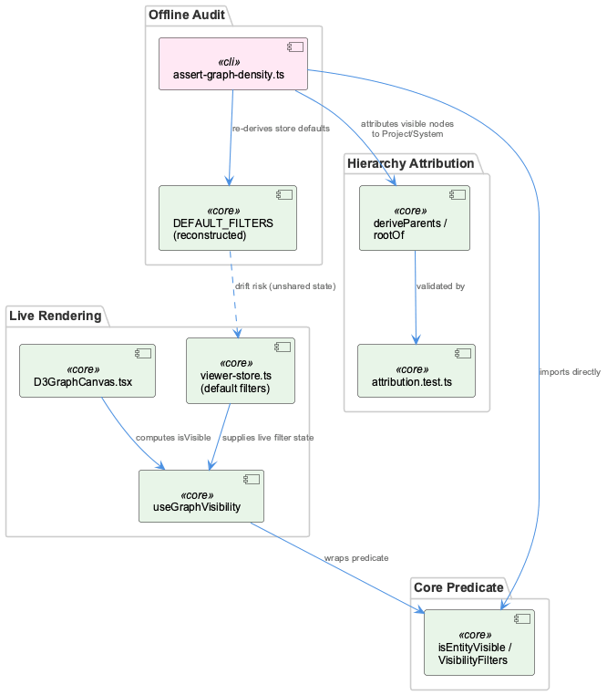
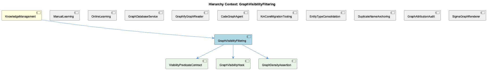

# GraphVisibilityFiltering

**Type:** SubComponent

## What It Is

GraphVisibilityFiltering is the umbrella component for the entity-visibility filtering surface in the unified-viewer graph system. Its actual predicate logic lives in `@/graph/visibility-predicate.ts` (exporting `isEntityVisible` and the `VisibilityFilters` type) and `@/graph/useGraphVisibility.ts`, neither of which appears in the supplied files — a gap the child components VisibilityPredicateContract and GraphVisibilityHook both flag explicitly. What is directly observable is the *consumer* side: `integrations/unified-viewer/src/graph/D3GraphCanvas.tsx`, which calls `useGraphVisibility()` to derive `isVisible` for live rendering, and `integrations/unified-viewer/scripts/assert-graph-density.ts` (the GraphDensityAssertion child component), which imports `isEntityVisible`/`VisibilityFilters` directly to replay filtering offline for CI budget checks. As parent, KnowledgeManagement frames this component within a broader concern about graph nodes not faithfully representing what the system has actually produced — the sibling insight-persistence incidents (ManualLearning, OnlineLearning, GraphDatabaseService) show that visibility filters are only as trustworthy as the nodes and edges upstream writers create.

## Architecture and Design

The design centers on a single shared predicate consumed by two very different surfaces: a React hook for interactive rendering and a standalone script for CI auditing. This predicate/hook extraction pattern (observation 8) avoids duplicating filter branching logic across surfaces, and D3GraphCanvas.tsx's own comments confirm this was a deliberate consolidation — eleven store subscriptions "used to be inlined separately in this file and were copied into two other consumers" before being unified behind `useGraphVisibility()`.

Layered beneath this predicate is a second concern, hierarchy attribution: `isEntityVisible` runs per-entity first, then `deriveParents`/`rootOf` (from `@/graph/hierarchy-parents` and `@/graph/attribution`) aggregate the surviving set per Project/System root. This separation of "is this node shown" from "which project does it belong to" is intentional and tested in `attribution.test.ts`'s `categoriseUnattributed`/`rootOf` coverage, and it mirrors the sibling GraphAttributionAudit concern.

The costliest trade-off is the seeded-default replication pattern: rather than importing the store's default filter state, `assert-graph-density.ts` manually reconstructs it as a `DEFAULT_FILTERS` literal covering fourteen-plus fields. This buys isolation from React/Zustand at the cost of documented drift risk.

## Implementation Details

`DEFAULT_FILTERS` in `assert-graph-density.ts` names at least fourteen fields — `searchQueryLowered`, `selectedTeams`, `learningSource`, `selectedLayers`, `hideDocNodes`, `showStale`, `selectedClasses`, `visibleLevels`, `lslFilterEntityIds`, `hiddenNodeTypes`, `expandedComponentIds`, `hierarchyParents`, `hierarchyClassOf`, `showDebugEntityTypes`, `hierarchySpine` — that the predicate reduces over. One field carries a documented semantic inversion: every other filter treats an empty collection as "nothing excluded" (show all), but `selectedClasses` treats an empty `Set` as "nothing visible," requiring the script to explicitly populate it with every ontology class present in the data, mirroring `UnifiedViewer.tsx:248-253`'s equivalent populate step.

GraphDensityAssertion composes the predicate with the attribution layer: it filters entities via `isEntityVisible`, then walks each surviving node through `deriveParents`/`rootOf` to attribute it to a Project or System root, deliberately rejecting a global total in favor of a per-project answer. Unrooted visible nodes are counted as failures rather than folded into a synthetic bucket — an earlier version silently dropped 43 unparented rows and produced a false PASS.

## Integration Points

The predicate is imported by both D3GraphCanvas.tsx (via the hook) and assert-graph-density.ts (directly, since scripts can't call React hooks). The attribution layer depends on correctly-scoped parent/child edges — the DuplicateNameAnchoring sibling's fix (threading `entityType` through `queryIncomingRelations`/`storeRelationship`) is directly relevant here, since name-only entity resolution previously caused a Detail-type node to inherit 24 incoming edges from an unrelated SubComponent, which would corrupt any root-walk attribution built atop those edges. Upstream, KnowledgeManagement's insight-persistence gap (73 insight documents with zero `Insight`-typed nodes) demonstrates that this filtering surface can only filter nodes that exist — a filter can't be "wrong" if the writer never created what it should have matched.

## Usage Guidelines

Any change to the production `VisibilityFilters` shape in `viewer-store.ts` must be mirrored in `assert-graph-density.ts`'s `DEFAULT_FILTERS`, and this cannot be caught mechanically: `scripts/` is excluded from `tsconfig`'s `include`, so `tsc` will not flag a missing or renamed field there. This gap has already caused two real incidents — the `hideArchived`→`hideRolledUp`+`showStale` split leaving the gate script filtering nothing (157 nodes over budget before detection), and a prior version copying the store's empty `selectedClasses` seed verbatim, causing the predicate to return zero nodes and a false PASS on a budget of 40. Developers modifying `VisibilityFilters` should treat `assert-graph-density.ts` (GraphDensityAssertion) as a second call site requiring manual review, and should preserve the `selectedClasses` empty-Set-means-nothing-visible inversion rather than "fixing" it to match the other fields. When adding new consumers of visibility filtering, prefer `useGraphVisibility()` over re-inlining store subscriptions, per the consolidation history in D3GraphCanvas.tsx.

## Work Record

What working sessions recorded about this entity — decisions taken, problems hit, and why things are the way they are:

- The Wave Insight Persistence work record establishes that the viewer's History sidebar filters strictly on `entityType == 'Insight'` when deciding whether to render a Batch badge, and that Wave 4 wrote 73 insight documents with zero corresponding `Insight`-typed graph nodes — meaning a downstream visibility/filtering surface (the History sidebar) can silently omit an entire completed run's output not because of a filter bug but because the upstream writer never created the node the filter looks for.

## Hierarchy Context

### Parent
- [KnowledgeManagement](./KnowledgeManagement.md) -- [SESSION] Wave Insight Persistence work record establishes that Wave 4 was writing 73 insight documents but zero corresponding Insight graph nodes, meaning the viewer's History sidebar (which filters strictly to entityType 'Insight') could never surface a Batch badge for that run's conclusions.

### Children
- [VisibilityPredicateContract](./VisibilityPredicateContract.md) -- [LLM] None of the supplied files contain the file the parent context names as the actual implementation — `@/graph/visibility-predicate.ts` (exporting `isEntityVisible` and `VisibilityFilters`) — nor `@/graph/useGraphVisibility.ts`. What is present is exclusively consumer-side evidence: `integrations/unified-viewer/scripts/assert-graph-density.ts` imports `isEntityVisible` and `type VisibilityFilters` and treats them as an external contract it must satisfy by hand-assembling a `DEFAULT_FILTERS` literal, and `integrations/unified-viewer/src/graph/D3GraphCanvas.tsx` calls `useGraphVisibility()` and reads its return value as `isVisible` without any visibility into the fourteen-plus fields the hook actually reduces over. Every comment in both files describes the predicate's behavior from the outside (e.g. 'the predicate reads `ontologyClass`', 'the predicate reads `!== 'intent'`'), which is consistent with black-box integration testing rather than with owning the logic.
- [GraphVisibilityHook](./GraphVisibilityHook.md) -- [LLM] The file explicitly named by this component — `@/graph/useGraphVisibility.ts` — is not among the supplied code files. What is present are two consumers that treat it as an opaque import: `integrations/unified-viewer/src/graph/D3GraphCanvas.tsx`, which calls `useGraphVisibility()` and assigns its return value to `isVisible`, and `integrations/unified-viewer/scripts/assert-graph-density.ts`, which bypasses the hook entirely and calls the lower-level `isEntityVisible`/`VisibilityFilters` pair from `@/graph/visibility-predicate` directly (since a script can't call a React hook). Any claim about the hook's internal branching, memoization strategy, or exact field list would be inference dressed as observation, not something grounded in these files.
- [GraphDensityAssertion](./GraphDensityAssertion.md) -- [LLM] `assert-graph-density.ts` in `integrations/unified-viewer/scripts/` IS the GraphDensityAssertion component itself, not a consumer of it — the file's own header explains it was renamed from `assert-aggregated-node-budget.ts` on 2026-09-25 specifically to stop conflating a node-count check with the repo's token/money budgets under Token Usage -> Cost. The env knobs were renamed alongside it (`GRAPH_MAX_NODES_PER_PROJECT`, `GRAPH_DETAIL_LEVEL`), which the file states explicitly rather than leaving as an inferred side effect of the rename.

### Siblings
- [ManualLearning](./ManualLearning.md) -- [SESSION] Wave Insight Persistence work record establishes that Wave 4 wrote 73 insight documents but zero corresponding Insight graph nodes, showing manually/human-curated conclusions can exist as documents without ever being anchored into the graph as entities.
- [OnlineLearning](./OnlineLearning.md) -- [SESSION] Wave Insight Persistence work record establishes that the History sidebar filters strictly to entityType 'Insight', so a Batch badge for a run's conclusions can only appear if the online pipeline actually writes Insight-typed graph nodes, not just insight documents.
- [GraphDatabaseService](./GraphDatabaseService.md) -- [SESSION] Wave Insight Persistence work record establishes that the persistence layer can silently accept writes to one representation (insight documents) while never receiving corresponding writes to another (Insight graph nodes), leaving the two out of sync with no error raised.
- [GraphifyGraphReader](./GraphifyGraphReader.md) -- [LLM] None of the supplied Code Files implement or reference a component named GraphifyGraphReader, nor do they import from or call into `integrations/semantic-analysis/src/agents/graphify-graph.ts`. The five files retrieved — `ukb-workflow-modal.tsx`, `assert-graph-density.ts`, `D3GraphCanvas.tsx`, `SigmaCanvas.tsx`, and `attribution.test.ts` — belong to `system-health-dashboard` and `unified-viewer`, two consumer-facing viewer packages that read graph data over HTTP from `obs-api` (port 12436), not the `semantic-analysis` agent layer where a 'GraphifyGraphReader' would plausibly live alongside `GraphifyGraph` and `CodeGraphAgent`.
- [CodeGraphAgent](./CodeGraphAgent.md) -- [LLM] The parent entity's own description characterizes CodeGraphAgent (integrations/semantic-analysis/src/agents/code-graph-agent.ts) as a compatibility shim: it preserves its full historical public interface — CodeEntity, CodeRelationship types, and the checkMemgraphConnection method — from an era when it queried a live Memgraph/Cypher backend, while internally delegating entirely to GraphifyGraph's static file-based reads. This is a Facade/Adapter pattern applied to a backend migration: callers written against the old contract, including guard clauses like `if (!connectionCheck.connected)`, continue to work unmodified even though the underlying 'connection' concept is now meaningless — a deliberate decoupling of consumer code changes from the storage-layer migration, at the cost of a permanently misleading method name in the API surface.
- [KmCoreMigrationTooling](./KmCoreMigrationTooling.md) -- [LLM] Every code file supplied for this analysis — integrations/system-health-dashboard/src/components/ukb-workflow-modal.tsx, integrations/unified-viewer/scripts/assert-graph-density.ts, integrations/unified-viewer/src/graph/D3GraphCanvas.tsx, integrations/unified-viewer/src/graph/SigmaCanvas.tsx, and integrations/unified-viewer/src/graph/attribution.test.ts — belongs to the dashboard/unified-viewer rendering layer (workflow progress UI, force-directed graph canvases, a node-count budget check, and an attribution-category test). None of them touch km-core's own migration surface: there is no reference in any of these files to LevelDB persistence, entity-type consolidation tables, or a Memgraph-to-file-store transition path.
- [EntityTypeConsolidation](./EntityTypeConsolidation.md) -- [LLM] None of the supplied files (ukb-workflow-modal.tsx, assert-graph-density.ts, D3GraphCanvas.tsx, SigmaCanvas.tsx, attribution.test.ts) implement entity-type consolidation logic. They concern workflow history pagination, graph density budgeting, and D3/Sigma rendering of already-typed entities — none touch a mapping table or type-folding migration.
- [DuplicateNameAnchoring](./DuplicateNameAnchoring.md) -- [SESSION] The Wave Insight Persistence work record documents that the anchor pass originally resolved entities by name only via `findEntityByName`, and because of that a newly created Detail-type node silently inherited 24 incoming edges belonging to an unrelated same-named SubComponent created weeks earlier. The record states the fix required threading entityType through both `queryIncomingRelations` and `storeRelationship` so entity lookups disambiguate by (name, type) pairs rather than name alone, with a fixed fallback `projectAnchorName = 'Coding'` introduced so nodes with no other resolvable parent attach to a known anchor instead of becoming orphans.
- [GraphAttributionAudit](./GraphAttributionAudit.md) -- [LLM+CGR] `categoriseUnattributed` (imported by `integrations/unified-viewer/scripts/assert-graph-density.ts` and exercised in `integrations/unified-viewer/src/graph/attribution.test.ts`) splits unrooted graph nodes into four mutually exclusive categories — `recordedParent`, `wrongClass`, `danglingRef`, `unclaimed` — instead of one generic 'unattributed' bucket. The test `'a recorded name that resolves to TWO rooted entities is NOT a suggestion'` shows why: when a `parentEntityName` string matches two same-named rooted entities (the comment notes 40 of 98 live roll-up parents share their child's name), the function refuses to guess and falls back to `unclaimed` rather than emitting a `suggestedParentId` that would be a coin flip presented as an answer.
- [SigmaGraphRenderer](./SigmaGraphRenderer.md) -- [LLM] SigmaCanvas.tsx implements the actual WebGL graph renderer via <SigmaContainer> and a nested GraphSetup component that builds a graphology Graph from useGraphData() output, runs graphology-layout-force as a polish pass over graph-builder's hierarchical seed positions, and wires click/hover events through makeEventHandlers(). This is the component most plausibly referred to as 'SigmaGraphRenderer' in the parent context, though no file in the supplied set literally bears that name.

---

*Generated from 10 observations*
