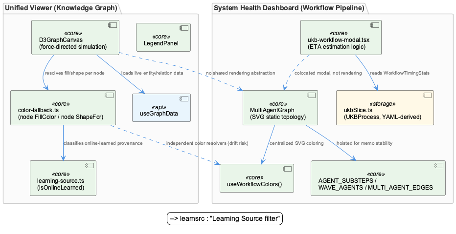
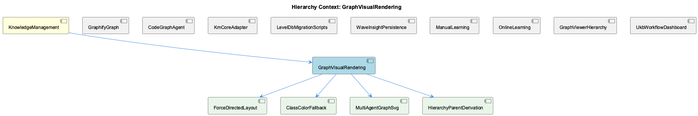

# GraphVisualRendering

**Type:** SubComponent

[Code References] integrations/system-health-dashboard/src/components/workflow/multi-agent-graph.tsx:34-40 - useWorkflowColors() central theme-aware palette import; integrations/system-health-dashboard/src/components/workflow/multi-agent-graph.tsx (AGENT_SUBSTEPS) - static per-agent substep schema for ~11 pipeline agents; integrations/system-health-dashboard/src/components/workflow/multi-agent-graph.tsx (WAVE_AGENTS, KG_OPERATOR_CHILDREN) - module-scope hoisting to preserve memo stability; integrations/system-health-dashboard/src/components/ukb-workflow-modal.tsx (calculateDynamicEta, getStepMedianDuration, calculateMedian) - ETA estimation logic colocated with graph modal; integrations/unified-viewer/src/graph/D3GraphCanvas.tsx (deriveAncestryFromStorePath) - reconciliation of inline BFS ancestry vs. store's pathToSelected; integrations/unified-viewer/src/graph/D3GraphCanvas.tsx (d3NodesRef, selectionSource subscription) - retracted-then-scoped viewport centering behavior; integrations/unified-viewer/src/graph/color-fallback.ts (nodeFillColor, nodeShapeFor) - canonical parent-walking color/shape resolver shared across render paths; integrations/unified-viewer/src/graph/color-fallback.ts (BATCH_PALETTE, ONLINE_PALETTE, ONLINE_RING_COLOR) - two-axis hierarchy/provenance visual encoding; integrations/unified-viewer/src/graph/color-fallback.ts (isOnlineSource, deprecated) vs ./learning-source isOnlineLearned - superseded classifier still retained for string-only callers; integrations/system-health-dashboard/src/store/slices/ukbSlice.ts (UKBProcess.batchPhaseStepCount) - YAML-derived value contrasted with hardcoded AGENT_SUBSTEPS

# GraphVisualRendering — Technical Insight Document

## What It Is

GraphVisualRendering is the umbrella SubComponent for two structurally distinct, code-independent graph-drawing implementations that live under `KnowledgeManagement`: a fixed-topology SVG pipeline diagram at `integrations/system-health-dashboard/src/components/workflow/multi-agent-graph.tsx`, and a dynamic force-directed knowledge-graph renderer at `integrations/unified-viewer/src/graph/D3GraphCanvas.tsx`. The former (child: `MultiAgentGraphSvg`) draws the UKB workflow process — a hand-authored, static topology built from `WAVE_AGENTS`, `KG_OPERATOR_CHILDREN`, and `MULTI_AGENT_EDGES` — while the latter (child: `ForceDirectedLayout`) lays out live entity/relation data pulled via `useGraphData` using `d3.forceSimulation` + `d3.forceLink(150)` + `d3.forceManyBody(-500)`. Supporting children `ClassColorFallback` and `HierarchyParentDerivation` describe, respectively, the canonical color/shape resolver (`color-fallback.ts`) and the ancestry-reconciliation logic that make the D3 canvas coherent under live selection changes. Both renderers exist under the same conceptual name "graph" purely by coincidence of domain, not by shared implementation.

## Architecture and Design

The dominant architectural fact about GraphVisualRendering is bifurcation without abstraction: `multi-agent-graph.tsx` and `D3GraphCanvas.tsx` solve genuinely different problems (fixed pipeline topology vs. open-ended knowledge graph) but share no common node/edge type, rendering utility, or color resolver. This is a deliberate-but-costly split — any visual-consistency fix, such as dark-mode palette correction, must be solved twice: once via `useWorkflowColors()` from `@/lib/colors` in the SVG diagram, and once via `nodeFillColor`/`nodeShapeFor` in `color-fallback.ts` for the D3 canvas.

Within each branch, however, a consistent architectural instinct recurs: convergence on a single canonical resolver function. `MultiAgentGraph` centralizes all SVG coloring through `useWorkflowColors()` specifically to avoid scattered `.dark .fill-*` CSS overrides. Independently, `color-fallback.ts`'s `nodeFillColor`/`nodeShapeFor` emerged after the team discovered that duplicated coloring logic across the D3 canvas, Sigma's `buildGraph`, and `LegendPanel` had drifted apart ("grey circles in the legend I don't see in the graph"). This is the strangler-style consolidation pattern also visible in `ClassColorFallback`'s dispatch on `isOnlineLearned()`, replacing a brittle `source === 'auto'` string check.

`D3GraphCanvas.tsx` additionally encodes a "locked contract" architecture: its main render `useEffect` dependency list is treated as Contract #3 (viewport-stability), and new selection-driven behaviors (like fit-to-bounds on Layer-0→Layer-1 transitions) must be implemented via separate, narrowly-scoped effects subscribing to `selectionSource` rather than by extending the primary effect. This is a rare case of an architectural constraint documented and enforced in-code rather than via a design doc.

## Implementation Details

`MultiAgentGraph` relies on module-scope constants — `WAVE_AGENTS`, `KG_OPERATOR_CHILDREN`, and `MULTI_AGENT_EDGES` from `./constants` — deliberately hoisted out of the component body. A comment documents why: declaring `KG_OPERATOR_CHILDREN` inside the component previously caused it to be rebuilt every render and become an unstable dependency of a status memo, defeating memoization entirely. This turns a previously-encountered performance bug into a durable, self-documenting convention. `AGENT_SUBSTEPS`, a ~230-line `Record<string, SubStep[]>` covering 11 pipeline agents (kg_operators through persistence), each with `llmUsage` tiers, is a hand-maintained UI-side shadow schema — unlike `batchPhaseStepCount`/`batchPhaseSteps` in `ukbSlice.ts`, which are explicitly derived from workflow YAML, nothing validates `AGENT_SUBSTEPS` against a backend source.

`color-fallback.ts` implements a two-axis visual encoding: FILL color (`nodeFillColor`) is class/hierarchy hue, deliberately source-independent, walking the ontology parent chain via `registry`/`BATCH_PALETTE`; online-learned provenance is rendered instead as a separate RING overlay (`ONLINE_RING_COLOR`), per `ClassColorFallback`'s documented "Hybrid" scheme decision after an earlier scheme conflated both axes into a single pink fill. The classifier `isOnlineLearned()` (from `./learning-source`) is now the single source of truth shared across the canvas, `LegendPanel`, the Learning Source filter, and the History sidebar, superseding the deprecated string-based `isOnlineSource()` still retained for bare-string callers.

`D3GraphCanvas.tsx` (implementing `ForceDirectedLayout`) is documented as a verbatim port of an earlier VKB component (`memory-visualizer/.../GraphVisualization.tsx`) — the exact force parameters (`forceLink(150)`, `forceManyBody(-500)`) were preserved rather than re-tuned because attempts to reproduce the reference visually using sigma + graphology-layout drifted. `HierarchyParentDerivation`'s `deriveAncestryFromStorePath()` reconciles an inline BFS (`computeAncestryPath`) against the Zustand store's authoritative `pathToSelected` set, favoring the store as "writer's intent" while still rendering unreachable-but-tagged nodes at reduced visual depth. The centering/selection behavior went through multiple documented revisions — added, retracted per operator feedback, then reintroduced narrowly scoped to Layer-0→Layer-1 transitions.

## Integration Points

GraphVisualRendering sits downstream of `GraphifyGraph` and `KmCoreAdapter` conceptually, though the reviewed files belong to `system-health-dashboard` and `unified-viewer` rather than the ingestion pipeline directly — meaning UI descriptive text can drift from backend reality. This is concretely visible: `AGENT_SUBSTEPS['code_graph']`'s `query` substep still carries `techNote: 'Cypher queries on Memgraph'`, contradicting `CodeGraphAgent`'s migration to `GraphifyGraph`'s static `graph.json` reader — a stale label surfaced directly in the UKB workflow modal via `MultiAgentGraph`.

`ukb-workflow-modal.tsx` colocates ETA-estimation logic (`calculateDynamicEta`, `getStepMedianDuration`, `calculateMedian`) with the `MultiAgentGraph` modal, both consuming `UKBProcess`/`WorkflowTimingStats` from `ukbSlice.ts` — illustrating a codebase pattern of bundling visualization with adjacent numeric-estimation logic rather than extracting it. The `persistence` entries in `AGENT_SUBSTEPS` (w1/w2/w3) model `WaveInsightPersistence`'s three-wave commit process, all `llmUsage: 'none'`, confirming persistence is rendered as pure storage after upstream LLM work in kg_operators/semantic_analysis/insight_generation. On the D3 side, `useGraphData` sources live entity/relation data, and color/shape resolution flows through `color-fallback.ts`, which is itself shared with `LegendPanel` and filter UI — making `ClassColorFallback` a cross-cutting dependency beyond the canvas itself.

## Usage Guidelines

Developers touching visual consistency (palettes, dark mode, node styling) must remember there is no shared rendering abstraction between `MultiAgentGraphSvg` and `ForceDirectedLayout` — fixes need to be applied in both `useWorkflowColors()` and `color-fallback.ts`. When modifying `multi-agent-graph.tsx`, module-scope constants like `WAVE_AGENTS`/`KG_OPERATOR_CHILDREN` must stay outside the component body; moving them inline risks silently defeating downstream memoization. Any backend change to workflow substep composition requires a manual, unchecked edit to `AGENT_SUBSTEPS` — including fixing the currently-stale Memgraph reference in the `code_graph` entry now that `CodeGraphAgent` delegates to `GraphifyGraph`.

For `D3GraphCanvas.tsx`, new selection/viewport features must respect Contract #3 by routing through separate effects (e.g., a `selectionSource` subscription) rather than extending the main render `useEffect`'s dependency list. When adding provenance-aware styling, use `isOnlineLearned()` exclusively — the deprecated `isOnlineSource()` string check exists only for legacy bare-string callers and should not be extended. Given the force-layout parameters are pinned to match a different codebase's (VKB's) visual reference rather than independently tuned, scaling unified-viewer's graphs significantly larger or denser may require revisiting `forceLink`/`forceManyBody` tuning rather than assuming current values generalize.

## Hierarchy Context

### Parent
- [KnowledgeManagement](./KnowledgeManagement.md) -- [LLM] The GraphifyGraph reader (integrations/semantic-analysis/src/agents/graphify-graph.ts) represents a deliberate architectural simplification: rather than maintaining a live graph database connection (Memgraph via Cypher), the component now treats a static graph.json artifact produced by the graphify service as the source of truth for code-structure knowledge. This file, a NetworkX node-link JSON export, can be tens of megabytes, so GraphifyGraph implements mtime-based lazy caching — it stat()s the file and only re-parses when the mtime has changed since the last load. This pattern trades real-time graph mutation capability for drastically simpler deployment (no separate DB process) and fast repeated reads, at the cost of only picking up graph changes when the underlying analysis pipeline re-writes graph.json.

### Children
- [ForceDirectedLayout](./ForceDirectedLayout.md) -- [LLM] D3GraphCanvas.tsx is documented as a deliberate 'port' of an earlier VKB component (integrations/memory-visualizer/.../GraphVisualization.tsx), preserving d3.forceSimulation + d3.forceLink(150) + d3.forceManyBody(-500) verbatim because prior attempts to reproduce the same look with sigma + graphology-layout drifted from the reference. This means the force-directed layout parameters here are not independently tuned for the unified-viewer's actual data shape — they are pinned to match a visual reference from a different codebase, which could make them brittle if unified-viewer's graphs grow substantially larger or denser than VKB's.
- [ClassColorFallback](./ClassColorFallback.md) -- [LLM] `classColor()` in `integrations/unified-viewer/src/graph/color-fallback.ts` implements a two-palette dispatch keyed on a boolean derived from `isOnlineLearned({ metadata: { source } })` (imported from `./learning-source`), choosing between `BATCH_PALETTE` (teal/blue hierarchy shades: Project #00897b, Component #1565c0, SubComponent #42a5f5, Detail #90caf9, System #00695c) and `ONLINE_PALETTE` (red/pink equivalents). The inline comment explicitly documents a prior bug class: the pre-2026-06-28 code checked `source === 'auto'` literally, which under-matched because 'the data stamps ETM/consolidator output as "online" far more often than "auto"', silently misclassifying most online-learned nodes into the wrong palette. This is a concrete example of a semantic classifier (`isOnlineLearned`) being extracted specifically to eliminate string-literal drift across call sites.
- [MultiAgentGraphSvg](./MultiAgentGraphSvg.md) -- [LLM] `MultiAgentGraph` in `integrations/system-health-dashboard/src/components/workflow/multi-agent-graph.tsx` hard-codes `AGENT_SUBSTEPS` as a ~230-line module-scope `Record<string, SubStep[]>` covering 11 agents (kg_operators through persistence), each substep carrying an `llmUsage` tier ('none'|'fast'|'standard'|'premium'). This is a UI-side shadow schema of the backend workflow's internal step composition. Unlike `batchPhaseSteps`/`batchPhaseStepCount` in `ukbSlice.ts`, which are explicitly commented as 'Derived from workflow YAML', nothing in this file indicates the substep data is generated or validated against a backend source — any backend-side change to an agent's substep list (e.g. adding a new kg_operators phase) requires a matching hand-edit here, with no compiler or runtime check to catch drift between the two.
- [HierarchyParentDerivation](./HierarchyParentDerivation.md) -- [LLM] The component's parent context describes a bifurcated rendering architecture where `multi-agent-graph.tsx` is a static, hand-authored SVG diagram driven by module-scope constants (`WAVE_AGENTS`, `KG_OPERATOR_CHILDREN`, `AGENT_SUBSTEPS`), while `D3GraphCanvas.tsx` is a dynamic force-directed simulation over live data (`useGraphData`, `d3.forceSimulation`). This is not an accidental duplication but a consequence of genuinely different problem domains — a fixed pipeline topology vs. an open-ended knowledge graph — yet the total absence of a shared rendering abstraction (no common node/edge type, no shared color resolver) means visual-consistency work like dark-mode theming must be independently re-solved in each: `useWorkflowColors()` in one, `nodeFillColor`/`nodeShapeFor` in `color-fallback.ts` in the other.

### Siblings
- [GraphifyGraph](./GraphifyGraph.md) -- [LLM] GraphifyGraph (integrations/semantic-analysis/src/agents/graphify-graph.ts) inverts the conventional graph-database architecture by treating a flat, periodically-regenerated graph.json file as the system of record instead of a live queryable store. The mtime-based lazy-caching strategy — stat() the file, compare against the last-seen mtime, and only re-parse the (potentially tens-of-megabytes) NetworkX node-link export when it changes — is a classic read-heavy optimization, but it also means GraphifyGraph is fundamentally a batch-consistency component: it cannot see a code-structure change until the separate graphify analysis pipeline finishes a full re-write of the JSON artifact. This is architecturally similar to the mtime/staleness problem the dashboard integration explicitly worked around elsewhere in this codebase (system-health-dashboard's bind-mount VirtioFS caching required a forced container restart to invalidate a stale read) — both are instances of 'a file on disk is the API' trading real-time correctness for operational simplicity.
- [CodeGraphAgent](./CodeGraphAgent.md) -- [LLM] There is a concrete documentation-drift artifact visible in integrations/system-health-dashboard/src/components/workflow/multi-agent-graph.tsx: the `AGENT_SUBSTEPS['code_graph']` array still describes its `query` sub-step with `techNote: 'Cypher queries on Memgraph'` (multi-agent-graph.tsx, code_graph entry, 'query' id). This directly contradicts the parent-context claim that CodeGraphAgent now delegates every call to GraphifyGraph's static graph.json reader and no longer speaks Cypher to a live Memgraph instance. Because this dashboard copy is what renders in the UKB workflow visualization modal (ukb-workflow-modal.tsx via MultiAgentGraph), any operator inspecting the live workflow graph is shown stale technology labels for a component whose backend was already migrated — exactly the kind of subtle trap the parent observation warned about with `checkMemgraphConnection` being a preserved-but-stubbed method name.
- [KmCoreAdapter](./KmCoreAdapter.md) -- [LLM] The provided code files (ukb-workflow-modal.tsx, multi-agent-graph.tsx, ukbSlice.ts, D3GraphCanvas.tsx, color-fallback.ts) belong to system-health-dashboard and unified-viewer, not directly to the KmCoreAdapter/GraphifyGraph pipeline described in the parent observations. This suggests KmCoreAdapter's output (graph.json, entity types, relationship taxonomy) is consumed downstream by visualization layers like D3GraphCanvas and the AGENT_SUBSTEPS 'code_graph' definitions in multi-agent-graph.tsx, which explicitly reference 'Cypher queries on Memgraph' as a techNote — a stale artifact from before the GraphifyGraph migration described in the parent context, meaning the UI's descriptive text has not been updated to reflect the Memgraph-to-graphify strangler-fig migration.
- [LevelDbMigrationScripts](./LevelDbMigrationScripts.md) -- [LLM] The two migration scripts referenced in the parent context — migrate-graph-db-entity-types.js and migrate-leveldb-to-kmcore.mjs — represent sequential, non-idempotent phases of the same underlying transition: first a taxonomy simplification (collapsing TransferablePattern/WorkflowPattern/TechnicalIssue into System/Project/Pattern) performed in-place against the live Graphology in-memory graph, then a structural re-platforming that assigns UUIDv7 identifiers, a layer='evidence' classification, and a legacyId.system='B' backward-reference tag to every entity. Because the second script depends on entities already conforming to the three-category taxonomy (any code still testing for the old fine-grained type strings would silently fail), these scripts form an implicit ordering contract that is not enforced by any shared orchestration file — a developer running migrate-leveldb-to-kmcore.mjs before migrate-graph-db-entity-types.js has completed would migrate stale/incorrect type data into the new km-core shape with no runtime error to signal the mistake.
- [WaveInsightPersistence](./WaveInsightPersistence.md) -- [LLM] The 'persistence' entry in AGENT_SUBSTEPS (integrations/system-health-dashboard/src/components/workflow/multi-agent-graph.tsx) models WaveInsightPersistence as three explicit, sequential sub-steps — w1 ('Wave 1 Persist', L0 Project + L1 Component entities), w2 ('Wave 2 Persist', L2 SubComponent entities), and w3 ('Wave 3 Persist', L3 Detail entities plus operator-refined fields and embeddings). All three declare llmUsage: 'none' and techNote: 'GraphDB + LevelDB storage', confirming that persistence itself is a pure storage operation with no LLM calls — the LLM work (pattern discovery, entity extraction, classification) happens upstream in kg_operators/semantic_analysis/insight_generation, and persistence's job is purely to commit already-synthesized entities. Notably w3's techNote uniquely adds 'direct attribute merge', implying Wave 3 does not simply insert new nodes but merges operator-enriched fields (e.g. embeddings) onto entities that may already exist from earlier waves — a detail not present in w1/w2, suggesting Wave 3 is where duplicate-entity reconciliation actually happens rather than at insight-generation time.
- [ManualLearning](./ManualLearning.md) -- [LLM] The ukb-workflow-modal.tsx file documents its own evolution through inline comments rather than commit messages — the HISTORY_PAGE_SIZE constant carries a multi-paragraph comment explaining that raising it from 50 to 500 was 'close to free' because /api/ukb/history parses every report regardless of limit and only slices at the end. This is a case of manual/institutional learning being encoded directly in source as a durable artifact: a future maintainer who considers lowering this constant for 'performance' will read the comment and understand the tradeoff (response size vs. server work) before making that mistake again, effectively preventing regression of a fix that had no automated test to catch it.
- [OnlineLearning](./OnlineLearning.md) -- [LLM] The 'OnlineLearning' distinction is implemented as a data-driven color/shape overlay rather than a structural entity type: `integrations/unified-viewer/src/graph/color-fallback.ts` defines two parallel palettes, `BATCH_PALETTE` (teal/blue shades keyed by hierarchy depth: System/Project/Component/SubComponent/Detail) and `ONLINE_PALETTE` (red/pink shades for the same hierarchy levels), and `classColor()` picks between them purely based on whether `isOnlineLearned({ metadata: { source } })` returns true. This means 'online-learned' is not a first-class ontology class but a metadata flag (`source: 'auto'` or `'online'`) riding along on any entity, decoupled from what class/type that entity otherwise has.
- [GraphViewerHierarchy](./GraphViewerHierarchy.md) -- [LLM] D3GraphCanvas.tsx (integrations/unified-viewer/src/graph/D3GraphCanvas.tsx) is an explicit, well-documented port of a Redux-based component (memory-visualizer's GraphVisualization.tsx) into a Zustand-store-driven architecture, but it does not simply swap state libraries — it re-derives a large amount of selection/ancestry logic to keep two independently-maintained rendering paths (this D3/SVG canvas and a parallel Sigma/WebGL canvas referenced in comments as 'graph-builder.ts') in sync. The `deriveAncestryFromStorePath()` function is the clearest evidence of this: rather than trusting either the store's `pathToSelected` set or its own inline `computeAncestryPath()` BFS in isolation, it runs both and reconciles them with a 'writer's intent wins' rule — nodes the store claims are in-path but the local BFS can't reach get a synthetic max-depth slot so they still render, while nodes the BFS finds but the store doesn't tag are dropped. This reconciliation is a symptom of maintaining two rendering engines against one shared selection model without a shared traversal implementation.
- [UkbWorkflowDashboard](./UkbWorkflowDashboard.md) -- [LLM] The HISTORY_PAGE_SIZE constant in ukb-workflow-modal.tsx (currently 500, previously 50) documents a concrete production incident in its own comment block: with the old cap, `/api/ukb/history` silently truncated the report list at 50 entries even though 119+ reports existed, making the single most important run — the batch-analysis run whose Pipeline Totals card shows commits/sessions/entity counts — permanently unreachable from the UI because it sat at position ~51. The fix works because the API route reads and parses every report on every call regardless of `limit`, slicing only at the very end, so raising the page size costs response payload size (roughly 13 header fields per report) rather than server-side work. This is a case where a UI paging constant silently created a data-loss illusion — the data was never lost, just permanently unreachable — and the comment functions as a postmortem note baked directly into source rather than a separate incident doc.

---

*Generated from 10 observations*
