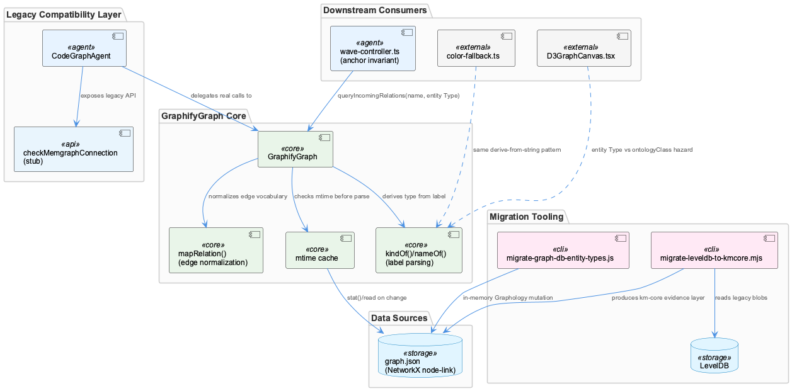
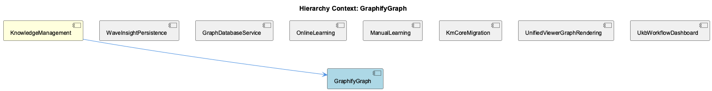

# GraphifyGraph

**Type:** SubComponent

# GraphifyGraph — Technical Insight Document

## What It Is

GraphifyGraph, implemented in `integrations/semantic-analysis/src/agents/graphify-graph.ts`, is the reader component that replaced a live Memgraph/Cypher graph database connection with a static, periodically-regenerated `graph.json` artifact as the system of record for code-structure knowledge. As a child of KnowledgeManagement, it inverts the conventional expectation of a graph-database-backed component: instead of issuing live queries, it parses a NetworkX node-link JSON export produced by the separate graphify analysis pipeline. This makes GraphifyGraph fundamentally a batch-consistency component — it cannot observe a code-structure change until that external pipeline finishes a full rewrite of the JSON file.

## Architecture and Design

The defining architectural decision is trading real-time mutation capability for deployment simplicity and fast repeated reads. This is realized through the child component GraphJsonCacheStrategy, which implements mtime-based lazy caching: `stat()` the file, compare against the last-seen mtime, and only re-parse the (potentially tens-of-megabytes) file when it changes. This is a specific instance of a broader "file on disk as system of record" pattern seen elsewhere in the codebase — analogous to the batch-read-all-then-slice philosophy behind `/api/ukb/history` (documented in ManualLearning's HISTORY_PAGE_SIZE comment) and to the stale-read problem system-health-dashboard worked around via forced container restarts on its bind-mounted VirtioFS cache.

Sitting alongside GraphifyGraph is CodeGraphAgent, a sibling that implements the Strangler Fig migration pattern: it shims the legacy Memgraph-era public API surface (CodeEntity/CodeRelationship types, `checkMemgraphConnection`) over GraphifyGraph's static-file backend, letting existing callers compile and run unmodified even though the underlying connection semantics no longer exist. This pairing — GraphifyGraph as the new read path, CodeGraphAgent as the compatibility façade — is the core structural relationship within this part of the system.

## Implementation Details

Within `graphify-graph.ts`, two functions — `kindOf()` and `nameOf()` — perform semantic derivation by parsing a `label` string from the node-link JSON, since graphify's export doesn't carry first-class type/name fields. This is implicit, unenforced schema coupling: any producer-side change to the label format silently breaks these parsing functions with no compiler-enforced contract. The same hazard recurs in `integrations/unified-viewer/src/graph/color-fallback.ts`'s `nodeFillColor()`/`nodeShapeFor()`, which walk an ontology parent chain, and in `D3GraphCanvas.tsx`'s D3Node interface, which explicitly distinguishes `entityType` from `ontologyClass`.

A second implementation detail is `mapRelation()`, which lossily normalizes graphify's fine-grained edge vocabulary (`indirect_call`, `re_exports`, etc.) down to six canonical CodeRelationship types (calls/imports/extends/implements/uses/defines). This mirrors the BATCH_PALETTE/ONLINE_PALETTE collapse in color-fallback.ts, trading precision for simpler downstream pattern-matching — once collapsed, the original signal is unrecoverable.

## Integration Points

GraphifyGraph's most direct consumer is CodeGraphAgent, which preserves `checkMemgraphConnection` as a stub returning synthetic success — a method name that now actively lies about its behavior, silently defeating any downstream health-check logic expecting a meaningful boolean. Upstream, the knowledge graph's evolving taxonomy is visible in sibling LevelDbMigrationScripts: `migrate-graph-db-entity-types.js` collapses legacy types to System/Project/Pattern in-memory, while `migrate-leveldb-to-kmcore.mjs` re-platforms into km-core's UUIDv7/`layer='evidence'`/`legacyId.system='B'` shape with a 5%-malformed-entity abort gate — these scripts form an implicit, unenforced ordering dependency. Downstream, WaveInsightPersistence's wave-controller.ts enforces graph connectivity procedurally via `queryIncomingRelations(e.name, e.entityType)` and `findBestParent(...)` falling back to the hardcoded `projectAnchorName = 'Coding'`, rather than through any storage-level constraint. Visualization consumers (D3GraphCanvas.tsx, color-fallback.ts under GraphViewerHierarchy/GraphVisualRendering) further derive class-based display attributes from the same kind of loosely-typed strings GraphifyGraph parses.

## Usage Guidelines

Developers should treat `graph.json` staleness as an expected condition rather than a bug: GraphifyGraph will only reflect a code change after the graphify pipeline completes a full rewrite, so callers requiring fresher data should trigger or await that pipeline rather than polling GraphifyGraph. Any code relying on `checkMemgraphConnection` via CodeGraphAgent should be audited, since it can no longer signal real connectivity failure. When modifying graphify's label or edge-type vocabulary, `kindOf()`, `nameOf()`, and `mapRelation()` must be updated in lockstep — there is no shared type definition enforcing this contract, echoing the same risk documented in color-fallback.ts and D3GraphCanvas.tsx. Finally, anyone adding new write paths that create Insights should explicitly invoke the anchoring logic pattern seen in wave-controller.ts, since orphan-prevention here is a procedural convention, not a database-enforced guarantee — and migration scripts operating on this data should respect the implicit ordering between taxonomy simplification and structural re-platforming, and consider whether an error-budget gate (as in `migrate-leveldb-to-kmcore.mjs`) is needed before running at scale.

## Hierarchy Context

### Parent
- [KnowledgeManagement](./KnowledgeManagement.md) -- [LLM] The GraphifyGraph reader (integrations/semantic-analysis/src/agents/graphify-graph.ts) represents a deliberate architectural simplification: rather than maintaining a live graph database connection (Memgraph via Cypher), the component now treats a static graph.json artifact produced by the graphify service as the source of truth for code-structure knowledge. This file, a NetworkX node-link JSON export, can be tens of megabytes, so GraphifyGraph implements mtime-based lazy caching — it stat()s the file and only re-parses when the mtime has changed since the last load. This pattern trades real-time graph mutation capability for drastically simpler deployment (no separate DB process) and fast repeated reads, at the cost of only picking up graph changes when the underlying analysis pipeline re-writes graph.json.

### Children
- [GraphJsonCacheStrategy](./GraphJsonCacheStrategy.md) -- [LLM] The GraphJsonCacheStrategy component (mtime-based stat/re-parse of graph.json in GraphifyGraph) is a specific instance of a broader 'file on disk as system of record' pattern that recurs across this codebase's dashboard layer. Nothing in the provided code files directly implements the cache, but the surrounding evidence — e.g. HISTORY_PAGE_SIZE's comment in ukb-workflow-modal.tsx describing how /api/ukb/history 'reads and parses EVERY report on every call regardless of limit' — shows the same batch-read-all-then-slice philosophy: correctness is achieved by re-reading the full artifact rather than maintaining an incrementally updated index.

### Siblings
- [CodeGraphAgent](./CodeGraphAgent.md) -- [LLM] There is a concrete documentation-drift artifact visible in integrations/system-health-dashboard/src/components/workflow/multi-agent-graph.tsx: the `AGENT_SUBSTEPS['code_graph']` array still describes its `query` sub-step with `techNote: 'Cypher queries on Memgraph'` (multi-agent-graph.tsx, code_graph entry, 'query' id). This directly contradicts the parent-context claim that CodeGraphAgent now delegates every call to GraphifyGraph's static graph.json reader and no longer speaks Cypher to a live Memgraph instance. Because this dashboard copy is what renders in the UKB workflow visualization modal (ukb-workflow-modal.tsx via MultiAgentGraph), any operator inspecting the live workflow graph is shown stale technology labels for a component whose backend was already migrated — exactly the kind of subtle trap the parent observation warned about with `checkMemgraphConnection` being a preserved-but-stubbed method name.
- [KmCoreAdapter](./KmCoreAdapter.md) -- [LLM] The provided code files (ukb-workflow-modal.tsx, multi-agent-graph.tsx, ukbSlice.ts, D3GraphCanvas.tsx, color-fallback.ts) belong to system-health-dashboard and unified-viewer, not directly to the KmCoreAdapter/GraphifyGraph pipeline described in the parent observations. This suggests KmCoreAdapter's output (graph.json, entity types, relationship taxonomy) is consumed downstream by visualization layers like D3GraphCanvas and the AGENT_SUBSTEPS 'code_graph' definitions in multi-agent-graph.tsx, which explicitly reference 'Cypher queries on Memgraph' as a techNote — a stale artifact from before the GraphifyGraph migration described in the parent context, meaning the UI's descriptive text has not been updated to reflect the Memgraph-to-graphify strangler-fig migration.
- [LevelDbMigrationScripts](./LevelDbMigrationScripts.md) -- [LLM] The two migration scripts referenced in the parent context — migrate-graph-db-entity-types.js and migrate-leveldb-to-kmcore.mjs — represent sequential, non-idempotent phases of the same underlying transition: first a taxonomy simplification (collapsing TransferablePattern/WorkflowPattern/TechnicalIssue into System/Project/Pattern) performed in-place against the live Graphology in-memory graph, then a structural re-platforming that assigns UUIDv7 identifiers, a layer='evidence' classification, and a legacyId.system='B' backward-reference tag to every entity. Because the second script depends on entities already conforming to the three-category taxonomy (any code still testing for the old fine-grained type strings would silently fail), these scripts form an implicit ordering contract that is not enforced by any shared orchestration file — a developer running migrate-leveldb-to-kmcore.mjs before migrate-graph-db-entity-types.js has completed would migrate stale/incorrect type data into the new km-core shape with no runtime error to signal the mistake.
- [WaveInsightPersistence](./WaveInsightPersistence.md) -- [LLM] The 'persistence' entry in AGENT_SUBSTEPS (integrations/system-health-dashboard/src/components/workflow/multi-agent-graph.tsx) models WaveInsightPersistence as three explicit, sequential sub-steps — w1 ('Wave 1 Persist', L0 Project + L1 Component entities), w2 ('Wave 2 Persist', L2 SubComponent entities), and w3 ('Wave 3 Persist', L3 Detail entities plus operator-refined fields and embeddings). All three declare llmUsage: 'none' and techNote: 'GraphDB + LevelDB storage', confirming that persistence itself is a pure storage operation with no LLM calls — the LLM work (pattern discovery, entity extraction, classification) happens upstream in kg_operators/semantic_analysis/insight_generation, and persistence's job is purely to commit already-synthesized entities. Notably w3's techNote uniquely adds 'direct attribute merge', implying Wave 3 does not simply insert new nodes but merges operator-enriched fields (e.g. embeddings) onto entities that may already exist from earlier waves — a detail not present in w1/w2, suggesting Wave 3 is where duplicate-entity reconciliation actually happens rather than at insight-generation time.
- [ManualLearning](./ManualLearning.md) -- [LLM] The ukb-workflow-modal.tsx file documents its own evolution through inline comments rather than commit messages — the HISTORY_PAGE_SIZE constant carries a multi-paragraph comment explaining that raising it from 50 to 500 was 'close to free' because /api/ukb/history parses every report regardless of limit and only slices at the end. This is a case of manual/institutional learning being encoded directly in source as a durable artifact: a future maintainer who considers lowering this constant for 'performance' will read the comment and understand the tradeoff (response size vs. server work) before making that mistake again, effectively preventing regression of a fix that had no automated test to catch it.
- [OnlineLearning](./OnlineLearning.md) -- [LLM] The 'OnlineLearning' distinction is implemented as a data-driven color/shape overlay rather than a structural entity type: `integrations/unified-viewer/src/graph/color-fallback.ts` defines two parallel palettes, `BATCH_PALETTE` (teal/blue shades keyed by hierarchy depth: System/Project/Component/SubComponent/Detail) and `ONLINE_PALETTE` (red/pink shades for the same hierarchy levels), and `classColor()` picks between them purely based on whether `isOnlineLearned({ metadata: { source } })` returns true. This means 'online-learned' is not a first-class ontology class but a metadata flag (`source: 'auto'` or `'online'`) riding along on any entity, decoupled from what class/type that entity otherwise has.
- [GraphViewerHierarchy](./GraphViewerHierarchy.md) -- [LLM] D3GraphCanvas.tsx (integrations/unified-viewer/src/graph/D3GraphCanvas.tsx) is an explicit, well-documented port of a Redux-based component (memory-visualizer's GraphVisualization.tsx) into a Zustand-store-driven architecture, but it does not simply swap state libraries — it re-derives a large amount of selection/ancestry logic to keep two independently-maintained rendering paths (this D3/SVG canvas and a parallel Sigma/WebGL canvas referenced in comments as 'graph-builder.ts') in sync. The `deriveAncestryFromStorePath()` function is the clearest evidence of this: rather than trusting either the store's `pathToSelected` set or its own inline `computeAncestryPath()` BFS in isolation, it runs both and reconciles them with a 'writer's intent wins' rule — nodes the store claims are in-path but the local BFS can't reach get a synthetic max-depth slot so they still render, while nodes the BFS finds but the store doesn't tag are dropped. This reconciliation is a symptom of maintaining two rendering engines against one shared selection model without a shared traversal implementation.
- [GraphVisualRendering](./GraphVisualRendering.md) -- [LLM] The GraphVisualRendering surface is split across two independently-evolved implementations that never share code: `integrations/system-health-dashboard/src/components/workflow/multi-agent-graph.tsx` renders the UKB workflow pipeline as a fixed-topology SVG (`WAVE_AGENTS`, `KG_OPERATOR_CHILDREN`, `MULTI_AGENT_EDGES` from `./constants`), while `integrations/unified-viewer/src/graph/D3GraphCanvas.tsx` renders the knowledge graph itself as a force-directed D3 simulation (`d3.forceSimulation` + `d3.forceLink(150)` + `d3.forceManyBody(-500)`). The former is a static, hand-authored process diagram; the latter is a dynamic layout engine over live entity/relation data pulled through `useGraphData`. They happen to share the word 'graph' and the general shape of node/edge rendering, but there is no common rendering abstraction, color resolver, or type between them — any visual-consistency fix (e.g. dark-mode palette) has to be applied twice.
- [UkbWorkflowDashboard](./UkbWorkflowDashboard.md) -- [LLM] The HISTORY_PAGE_SIZE constant in ukb-workflow-modal.tsx (currently 500, previously 50) documents a concrete production incident in its own comment block: with the old cap, `/api/ukb/history` silently truncated the report list at 50 entries even though 119+ reports existed, making the single most important run — the batch-analysis run whose Pipeline Totals card shows commits/sessions/entity counts — permanently unreachable from the UI because it sat at position ~51. The fix works because the API route reads and parses every report on every call regardless of `limit`, slicing only at the very end, so raising the page size costs response payload size (roughly 13 header fields per report) rather than server-side work. This is a case where a UI paging constant silently created a data-loss illusion — the data was never lost, just permanently unreachable — and the comment functions as a postmortem note baked directly into source rather than a separate incident doc.

---

*Generated from 9 observations*
