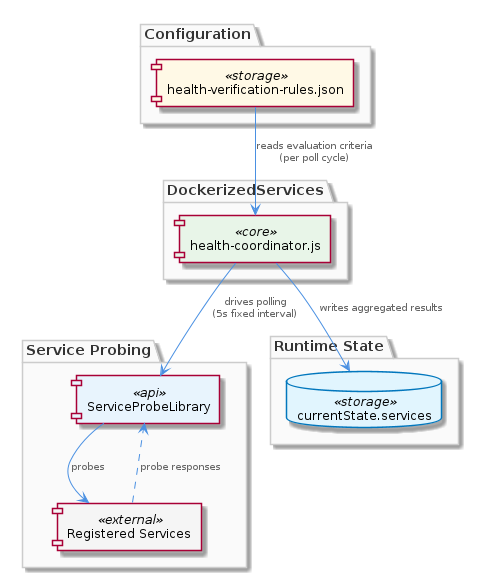
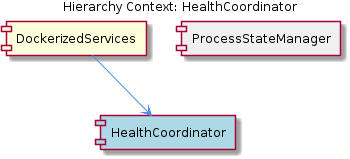

# HealthCoordinator

**Type:** SubComponent

The health-coordinator.js script reads evaluation criteria exclusively from config/health-verification-rules.json at runtime, meaning rule changes take effect on the next polling cycle without requiring a process restart.

# HealthCoordinator — Technical Insight Document

## What It Is

HealthCoordinator is a sub-component of **DockerizedServices**, implemented primarily in `scripts/health-coordinator.js`. It serves as the periodic health-evaluation engine for the containerized service fleet, transforming raw probe signals into aggregated service-state verdicts. Where the parent DockerizedServices layer provides the low-level probing primitives (via `lib/utils/service-probe.js`), HealthCoordinator sits above that layer and is responsible for orchestrating *when* probes run, *how* their results are interpreted, and *where* the resulting verdicts are stored.

The component operates on a fixed 5-second polling cadence. On every tick, it invokes the **ServiceProbeLibrary** to probe all registered services and writes the aggregated outcome into the `currentState.services` object. Its evaluation logic is not hardcoded — instead, it reads decision criteria from `config/health-verification-rules.json` at runtime, which means it acts as a configurable rules engine layered on top of the probe primitives.

## Architecture and Design

The architecture demonstrates a clean **layered separation of concerns** between probing (vocabulary: `'running'`, `'stopped'`, `'unknown'`) and verdict-rendering (vocabulary: health states determined by rules). This separation is enforced by the parent DockerizedServices' **SPEC R6** invariant, which forbids `lib/utils/service-probe.js` from ever returning `'healthy'`. HealthCoordinator is the direct architectural consumer of this invariant: it accepts the deliberately narrow probe vocabulary as input and is solely responsible for promoting raw liveness signals into application-layer readiness verdicts. This avoids conflating network-layer reachability with full service readiness.

Two design patterns are clearly evident from the observations. First, a **polling/scheduler pattern** with a fixed interval (5 seconds) acts as the temporal heartbeat of the health subsystem — there is no event-driven push from services, only consistent pull-based polling. Second, an **externalized rules / configuration-driven evaluation pattern** is employed via `config/health-verification-rules.json`. Because rules are read at runtime on each polling cycle, operators can adjust health criteria without restarting the process — a hot-reload behavior achieved simply through re-read semantics rather than through a complex file-watcher mechanism.

The interaction model places HealthCoordinator as the bridge between **ServiceProbeLibrary** (its dependency for raw signals) and the shared `currentState.services` object (its write target). Its sibling **ProcessStateManager** — also a sub-component of DockerizedServices — presumably consumes or coordinates with this same state object, though HealthCoordinator's specific contract is the production of aggregated probe results rather than process lifecycle management.

## Implementation Details

The core implementation lives in `scripts/health-coordinator.js`. On each 5-second tick, the script performs three logical steps: (1) enumerate all registered services, (2) call into the ServiceProbeLibrary to obtain probe results constrained to the SPEC R6 vocabulary of `'running'`, `'stopped'`, or `'unknown'`, and (3) evaluate those results against rules loaded from `config/health-verification-rules.json` before writing the aggregated outcome into `currentState.services`.

The rules file is read **exclusively at runtime** on each cycle rather than being cached in memory at process startup. This is a deliberate implementation choice with significant operational implications: any change to `config/health-verification-rules.json` is automatically picked up on the next polling tick — typically within 5 seconds — with no process restart required. This makes rule iteration fast and safe in production-like environments.

The probe-to-verdict mapping is the central piece of mechanical logic. Because probes return only `'running'`, `'stopped'`, or `'unknown'`, the rules file must translate combinations of these signals (potentially across services or across multiple consecutive ticks) into a richer health verdict. The probe vocabulary is intentionally minimal so that the *interpretation* responsibility lives entirely inside HealthCoordinator's rule evaluation, not inside the probe code.

## Integration Points

HealthCoordinator integrates with three principal external surfaces. First, it depends on **ServiceProbeLibrary** for all probe operations — including `probeHttpHealth()` and `probeTcpPort()` defined in `lib/utils/service-probe.js`. This dependency is bound by the SPEC R6 contract; modifications to `service-probe.js` that introduced a `'healthy'` return value would corrupt HealthCoordinator's decision logic. Second, it consumes `config/health-verification-rules.json` as its rules-of-record. Third, it writes its outputs into the shared `currentState.services` object, which serves as the integration channel to the rest of the system, likely including its sibling **ProcessStateManager**.

Within the broader hierarchy, HealthCoordinator's role inside DockerizedServices is complementary to ProcessStateManager: while ProcessStateManager (also a sub-component of DockerizedServices) is concerned with process state, HealthCoordinator focuses on the periodic re-evaluation of health from probe signals. They share the parent's architectural conventions and presumably converge through the same shared state object.

Downstream consumers of `currentState.services` — whatever alerting, restart-scheduling, or dependency-unblocking logic exists in the system — receive HealthCoordinator's verdicts indirectly through that shared state. This means HealthCoordinator does not need to know its consumers directly; it simply produces an authoritative health snapshot every 5 seconds.

## Usage Guidelines

Developers working with or extending HealthCoordinator should observe several conventions grounded in its current design. First, **do not modify `lib/utils/service-probe.js` to return `'healthy'`** or any vocabulary outside `'running'`, `'stopped'`, or `'unknown'`. Doing so violates SPEC R6 enforced at the DockerizedServices parent level and will corrupt the rule-evaluation logic inside `scripts/health-coordinator.js`. The probe vocabulary and the verdict vocabulary are intentionally distinct.

Second, **express health policy changes through `config/health-verification-rules.json`**, not through code edits to the coordinator. Because the rules file is re-read on every polling cycle, configuration changes take effect on the next tick (within 5 seconds) without a process restart. This is the supported, low-risk path for tuning health criteria.

Third, treat the 5-second polling interval as the system's effective resolution for health detection. Any verdict change cannot be observed faster than this cadence, so downstream consumers of `currentState.services` should not assume sub-5-second responsiveness. If finer granularity is ever required, the polling interval is the architectural lever — but changing it has fleet-wide implications for probe load on every registered service.

Finally, when reasoning about a service's reported state, always remember the layered semantics: a `'running'` probe result means the port responded, not that the service is fully initialized or production-ready. The promotion from "running" to "healthy" is performed by HealthCoordinator's rule evaluation, and that promotion is the meaningful event for orchestration concerns such as alerting, restart scheduling, or dependency unblocking.

## Hierarchy Context

### Parent
- [DockerizedServices](./DockerizedServices.md) -- [LLM] The DockerizedServices component enforces a strict probe-result invariant called SPEC R6, implemented in `lib/utils/service-probe.js`, which mandates that both `probeHttpHealth()` and `probeTcpPort()` may only return the string values `'running'`, `'stopped'`, or `'unknown'` — never `'healthy'`. This design decision is architecturally significant because it prevents a class of silent-degradation bugs where a container that technically responds to a health endpoint (e.g., returning HTTP 200 with an incomplete initialization state) could be incorrectly classified as production-ready. The distinction between 'running' (process is alive and responding) and 'healthy' (fully initialized, all dependencies satisfied) is deliberately kept outside the probe layer and left to higher-level orchestration logic.

This invariant is consumed by `scripts/health-coordinator.js`, which polls on 5-second ticks and evaluates probe results against rules defined in `config/health-verification-rules.json`. By separating the probe vocabulary from the health-verdict vocabulary, the system avoids conflating network-layer liveness (can I reach the port?) with application-layer readiness (is this service actually functioning correctly?). A new developer reading the codebase should understand that if they ever modify `service-probe.js` to return `'healthy'`, they risk corrupting the health-coordinator's decision logic, which presumably maps probe results to actions like alerting, restart scheduling, or dependency unblocking.

### Siblings
- [ProcessStateManager](./ProcessStateManager.md) -- ProcessStateManager is a sub-component of DockerizedServices

---

*Generated from 3 observations*
