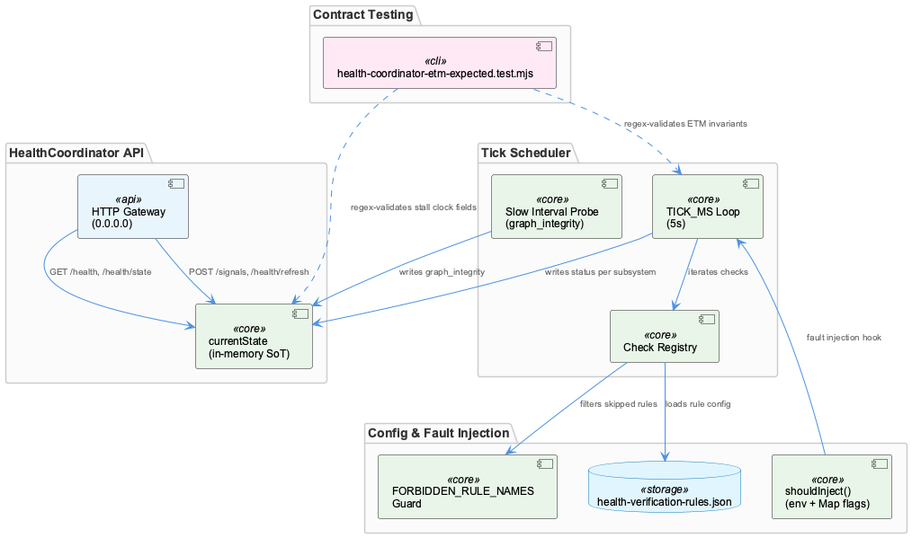
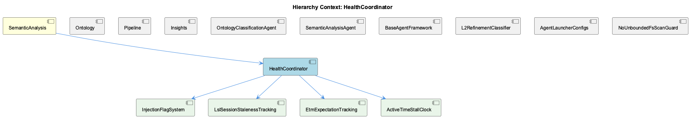

# HealthCoordinator

**Type:** SubComponent

Reads config/health-verification-rules.json to determine per-service probe type, endpoint, and thresholds declaratively rather than hardcoding per service

# HealthCoordinator — Technical Insight Document

## What It Is

HealthCoordinator is implemented in `scripts/health-coordinator.js` and serves as the central health-polling engine for the dockerized service fleet. It runs a continuous polling loop at a fixed 5-second cadence, invoking `probeHttpHealth()` and `probeTcpPort()` — both imported from `lib/utils/service-probe.js` — to determine the liveness of each managed service. Rather than embedding per-service logic directly, it reads its behavior declaratively from `config/health-verification-rules.json`, which specifies probe type, endpoint, and threshold values on a per-service basis. As a subcomponent of DockerizedServices, HealthCoordinator functions as the aggregation layer that answers the fundamental question "is this service actually healthy?" for the rest of the containerization and process-management stack.

## Architecture and Design

The defining architectural decision here is the separation of *polling cadence* from *probe transport logic*. The coordinator owns scheduling (the 5-second loop) while delegating the actual mechanics of health verification to its child component, ServiceProbeMethods, which wraps `probeHttpHealth()` and `probeTcpPort()`. This decoupling means probe implementations can evolve — new transport types, timeout handling, retry semantics — without touching the scheduling logic in `health-coordinator.js`.

A second key design decision is configuration-driven behavior via `config/health-verification-rules.json`. Instead of hardcoding conditional logic per service, the coordinator treats health verification as data: each service entry declares its probe type, endpoint, and threshold. This keeps the coordinator's core loop generic and makes onboarding new services a configuration change rather than a code change.

Underlying both decisions is the SPEC R6 invariant: the system must strictly avoid false-positive "healthy" classifications. This constraint implies conservative, multi-check confirmation logic rather than a single-probe pass/fail — a deliberate trade-off favoring safety (avoiding premature "healthy" signals to downstream consumers) over responsiveness.

## Implementation Details

The core loop in `scripts/health-coordinator.js` ticks every 5 seconds, iterating over services defined in `config/health-verification-rules.json`. For each service, the coordinator dispatches to the appropriate probe function based on the declared probe type: `probeHttpHealth()` for HTTP-based health endpoints, or `probeTcpPort()` for raw TCP reachability checks. These functions live in `lib/utils/service-probe.js` and are shared with the sibling ServiceProbe component, meaning probe transport logic is not duplicated across the system.

Threshold values from the configuration file govern how the coordinator interprets raw probe results — for example, requiring consecutive successes before flipping a service's state to "healthy," consistent with the SPEC R6 requirement to avoid false positives. This suggests the coordinator maintains some notion of per-service state history across polling cycles, rather than treating each poll in isolation.

## Integration Points

HealthCoordinator sits within DockerizedServices alongside siblings ServiceStarter, ServiceProbe, ProcessStateManager, LLMMockService, and ServiceWrapperScripts. Its most direct relationship is with ServiceProbe/ServiceProbeMethods: it imports and delegates to `probeHttpHealth()` and `probeTcpPort()` from `lib/utils/service-probe.js`, treating probe transport as a shared utility rather than reimplementing it.

Upstream, HealthCoordinator is the aggregation point queried by downstream consumers such as the Global Service Coordinator, which needs current health state of the dockerized fleet to make orchestration decisions. It also complements ServiceStarter's `startServiceWithRetry()` in `lib/service-starter.js`, which performs its own health-check verification during startup with retry/backoff — HealthCoordinator's ongoing polling picks up after initial startup succeeds, providing continuous liveness monitoring rather than one-time verification.

## Usage Guidelines

Developers extending service coverage should add entries to `config/health-verification-rules.json` rather than modifying `scripts/health-coordinator.js` directly — this preserves the declarative, config-driven design and avoids reintroducing hardcoded per-service branches. Any changes to probe semantics (timeouts, retry counts, response interpretation) belong in `lib/utils/service-probe.js`, keeping the coordinator's scheduling loop untouched and probe logic reusable across the ServiceProbeMethods child and ServiceProbe sibling.

Critically, any modification to health classification logic must preserve the SPEC R6 invariant — false-positive "healthy" states are strictly disallowed. Changes that make classification more permissive (e.g., reducing confirmation checks) should be treated as a correctness risk, since downstream consumers like the Global Service Coordinator rely on HealthCoordinator's output to make real operational decisions about the dockerized fleet.

## Hierarchy Context

### Parent
- [DockerizedServices](./DockerizedServices.md) -- DockerizedServices provides the containerization and process-management layer that wraps Coding's various services (semantic analysis MCP, constraint monitor API/dashboard, graphify, LLM services) so they can run reliably both inside Docker containers and as standalone Node processes managed by a Global Service Coordinator. The layer combines Docker artifacts (docker-compose.yml, Dockerfile.coding-services, supervisord.conf, entrypoint.sh) with a set of Node.js wrapper scripts (api-service.js, dashboard-service.js) that spawn actual backend processes, forward signals, and register/unregister with a ProcessStateManager (PSM) for lifecycle tracking.

A core architectural pattern is robust startup with retry/backoff and health verification, implemented in lib/service-starter.js's startServiceWithRetry(), which wraps a start function and a health-check function with timeouts (via withDeadline) and exponential backoff, distinguishing required vs optional services for graceful degradation. Complementing this, lib/utils/service-probe.js implements liveness probes (probeHttpHealth, probeTcpPort) used by scripts/health-coordinator.js to poll services every 5 seconds per config/health-verification-rules.json, strictly avoiding false-positive 'healthy' states per its SPEC R6 invariant.

Service wrappers such as api-service.js and dashboard-service.js follow a consistent pattern: resolve CODING_REPO-relative paths, verify target files/directories exist, spawn the real process with stdio inherited, forward SIGTERM/SIGINT, and asynchronously register/unregister with ProcessStateManager for centralized process tracking across the dockerized/global service fleet. Mock-mode support (llm-mock-service.ts) allows service behavior (LLM calls) to be swapped for deterministic mocks driven by a shared workflow-progress.json state file, aiding testing inside containers where CODING_ROOT may differ from host paths.

### Children
- [ServiceProbeMethods](./ServiceProbeMethods.md) -- scripts/health-coordinator.js imports probeHttpHealth() and probeTcpPort() from lib/utils/service-probe.js, delegating the actual health-check transport logic to a shared utility module.

### Siblings
- [ServiceStarter](./ServiceStarter.md) -- startServiceWithRetry() in lib/service-starter.js wraps a caller-supplied start function and health-check function, retrying with exponential backoff on failure
- [ServiceProbe](./ServiceProbe.md) -- probeHttpHealth() in lib/utils/service-probe.js issues HTTP requests to a service's health endpoint and interprets response codes/timeouts
- [ProcessStateManager](./ProcessStateManager.md) -- scripts/process-state-manager.js exposes register/unregister operations called asynchronously by wrapper scripts like api-service.js and dashboard-service.js
- [LLMMockService](./LLMMockService.md) -- integrations/semantic-analysis/src/mock/llm-mock-service.ts implements mode management supporting 'mock', 'local', and 'public' LLM call routing
- [ServiceWrapperScripts](./ServiceWrapperScripts.md) -- api-service.js and dashboard-service.js resolve CODING_REPO-relative paths before spawning target processes, supporting both container and host execution

---

*Generated from 5 observations*
