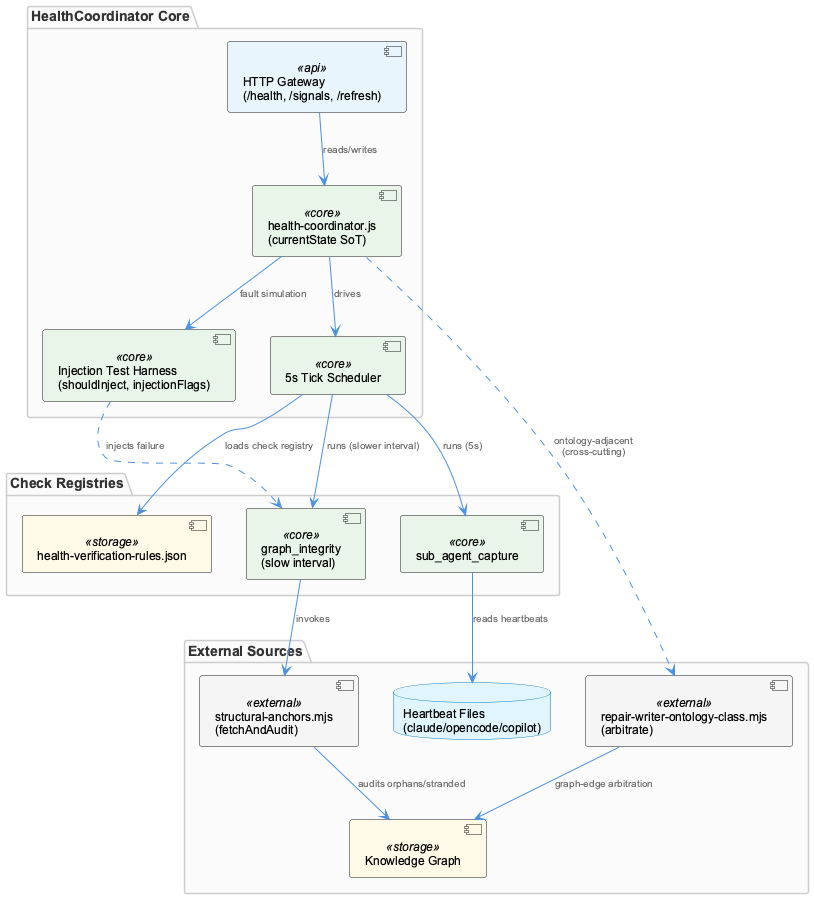
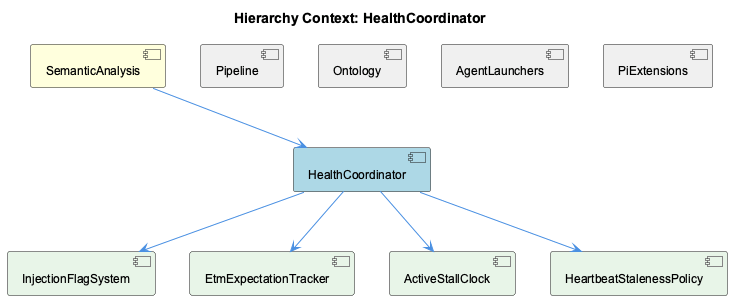

# HealthCoordinator

**Type:** SubComponent

# HealthCoordinator — Technical Insight Document

## What It Is

HealthCoordinator is implemented in `scripts/health-coordinator.js` as a single-owner, in-memory source of truth (`currentState`) for system health, exposed through an HTTP gateway with endpoints `GET /health`, `GET /health/state`, `POST /signals`, and `POST /health/refresh`. It sits under the SemanticAnalysis parent component alongside siblings Pipeline, Ontology, AgentLaunchers, and PiExtensions, but is functionally distinct from all of them — it is a health-monitoring daemon, not an ontology or pipeline mechanism. A 5-second tick scheduler drives most checks, iterating registries defined in `config/health-verification-rules.json`, while heavier checks run on separate, slower intervals.

## Architecture and Design

The dominant pattern is **single-owner SoT with HTTP read/write gateway**: `currentState` is the sole authoritative object, mutated only within the coordinator process and exposed via HTTP rather than shared memory or a distributed store. This design explicitly consolidates four legacy host daemons into one process — reducing surface area at the cost of centralizing failure risk in a single tick loop.

A second cross-cutting rule, **fail-to-unknown, never fail-to-healthy** (SPEC R6), governs every check slice: a throwing check tags its status `'unknown'`, and fields like `graph_integrity.status` and `sub_agent_capture`'s heartbeat evaluation are initialized to `'unknown'` rather than defaulting optimistically. This same discipline is mirrored in child component HeartbeatStalenessPolicy's PID/heartbeat cross-check logic and in ActiveStallClock's stall-tracking variables.

Heavy, graph-wide checks like `graph_integrity` are deliberately decoupled from the fast 5s tick — an architecture-wide tension between per-cycle cost and completeness that echoes a similar sequential-vs-batch tradeoff noted in the KB Injection A/B Experiment for the Pipeline sibling.

## Implementation Details

The `injectionFlags` Map and `shouldInject(kind)` function — the concrete logic behind child component InjectionFlagSystem — provide a fault-injection harness exercised via `POST /test/inject`, resolving in-memory flags first and falling back to the legacy env var `HEALTH_COORDINATOR_INJECT_THROW`. This dual-path exists because `launchctl setenv` was found unable to override plist-declared empty defaults on macOS Sequoia, forcing the in-memory path into production use.

`graph_integrity` calls `fetchAndAudit` from `lib/knowledge/structural-anchors.mjs`, distinguishing `'orphans'` (degree-0 entities) from `'stranded'` (provenance-only edges like `capturedBy`/`mentions`) — a fix for a prior conflation that hid ~81 stray entities behind a falsely low orphan count.

The `sub_agent_capture` block reads per-agent heartbeat files via a shared registry-reader helper, computing `'healthy'` if any of claude/opencode/copilot has a fresh heartbeat and `'degraded'` otherwise — the basis for HeartbeatStalenessPolicy.

Child EtmExpectationTracker's logic (`_etmExpected` Map, `ETM_MISSING_MS`, `ETM_SPAWN_INTERVAL_MS`) and ActiveStallClock's state (`_obsActiveStallMs`, `_obsStallAnchor`, `_obsStallPolledAt`) live inline in the tick loop rather than as separate modules — confirmed by `tests/integration/health-coordinator-etm-expected.test.mjs`, which asserts against regex-matched source text rather than importing the module.

## Integration Points

HealthCoordinator's `graph_integrity` check depends on `lib/knowledge/structural-anchors.mjs`. It is architecturally adjacent to `scripts/repair-writer-ontology-class.mjs`, which shares a `coding.lower.json`-backed registry and implements `arbitrate()` to resolve ontologyClass/entityType conflicts using graph edges (contains/parent-child vs has_insight) over `metadata.hierarchyLevel` — a documented case of graph-derived truth overriding stored metadata, reflecting the same distrust-of-cached-state ethos as the health checks. This is a separate cross-cutting tool, not a child, but conceptually linked. Note the unresolved CodingLowerOntologySource emission defect in parent SemanticAnalysis/Pipeline touches this same registry, making it a live cross-cutting risk.

## Usage Guidelines

Never let a check default to `'healthy'` on failure — always tag `'unknown'`; this is enforced structurally throughout `currentState`. Use `POST /test/inject` (InjectionFlagSystem) for fault simulation rather than the deprecated env var. Keep heavy, graph-wide checks off the 5s tick loop. When modifying EtmExpectationTracker or ActiveStallClock, update the regex-based tests in `health-coordinator-etm-expected.test.mjs` since they assert against literal source patterns, not module behavior — a maintainability caveat worth addressing given the single-file, inline-everything design.

## Code Evidence

Key code artifacts grounding this entity's analysis:

- The `sub_agent_capture` state block reads per-agent heartbeat files via a registry-reader helper shared with the statusline, and computes 'healthy' if any of claude/opencode/copilot has a fresh heartbeat, 'degraded' if all are stale/missing — mirroring the same never-default-healthy discipline applied elsewhere in currentState.

## Work Record

What working sessions recorded about this entity — decisions taken, problems hit, and why things are the way they are:

- The Pipeline CodingLowerOntologySource Emission Bug record documents an unresolved defect where the pipeline emits a CodingLowerOntologySource reference despite documentation forbidding it; this is architecturally adjacent to health-coordinator.js's own ontology-adjacent consumers (scripts/repair-writer-ontology-class.mjs references the same coding.lower.json-backed registry), suggesting the ontology-source contract violation is a live, unaddressed cross-cutting issue rather than isolated to one script.
- KB Injection A/B Experiment — Task Design and Discrimination Validity establishes that missing KB information is currently captured sequentially rather than in a single batch pass, a gap that parallels health-coordinator.js's own single 5s-tick design where heavy checks like graph_integrity are explicitly run on a separate slower interval because they are 'far too heavy for the 5s tick' — both reflect an architecture-wide tension between per-cycle cost and completeness.

## Hierarchy Context

### Parent
- [SemanticAnalysis](./SemanticAnalysis.md) -- [SESSION] Pipeline CodingLowerOntologySource Emission Bug documents an unresolved defect where the pipeline emits a CodingLowerOntologySource reference in output despite documentation stating this source type should never be produced

### Children
- [InjectionFlagSystem](./InjectionFlagSystem.md) -- [LLM] scripts/health-coordinator.js defines the InjectionFlagSystem itself: `injectionFlags` (a Map keyed by check kind) and `shouldInject(kind)`, which resolves in-memory flags first, then falls back to the legacy comma-separated env var `HEALTH_COORDINATOR_INJECT_THROW`. This dual-path lookup exists because Phase 33-12 empirically falsified `launchctl setenv`'s ability to override plist-declared empty defaults on macOS Sequoia, forcing the in-memory POST /test/inject path to become the production mechanism while the env var is kept only for dev-time convenience.
- [EtmExpectationTracker](./EtmExpectationTracker.md) -- [LLM] The test file tests/integration/health-coordinator-etm-expected.test.mjs asserts on the *source text* of scripts/health-coordinator.js (via regex against a whitespace-flattened string) rather than importing and exercising the module, indicating EtmExpectationTracker's actual logic (the `_etmExpected` Map, `ETM_MISSING_MS`, `ETM_SPAWN_INTERVAL_MS`) lives inline inside health-coordinator.js's tick loop rather than as a separate exported class or module.
- [ActiveStallClock](./ActiveStallClock.md) -- [LLM+CGR] The ActiveStallClock is directly implemented in tests/integration/health-coordinator-etm-expected.test.mjs's 'stall clock' test section, which asserts against literal source patterns in scripts/health-coordinator.js: `_obsActiveStallMs`, `_obsStallAnchor`, and `_obsStallPolledAt` are the actual state variables composing the clock, and the tests exist specifically to pin down its behavior against regression.
- [HeartbeatStalenessPolicy](./HeartbeatStalenessPolicy.md) -- [SESSION] Per the Multi-Agent Health Monitoring record, health-coordinator.js computes PID staleness from heartbeat file age and cross-checks PID liveness before marking a session degraded.

### Siblings
- [Pipeline](./Pipeline.md) -- [SESSION] Pipeline CodingLowerOntologySource Emission Bug tracks an unresolved defect where the pipeline emits a CodingLowerOntologySource reference in output despite documentation stating this source type should never be produced.
- [Ontology](./Ontology.md) -- [CGR] ontology (variable) in events.test.ts
- [AgentLaunchers](./AgentLaunchers.md) -- [LLM] None of the five retrieved files reference an entity, class, or module named 'AgentLaunchers', nor any launching/factory/dispatch mechanism for the pipeline agents named in the parent context (BaseAgent, OntologyClassificationAgent, SemanticAnalysisAgent). The retrieved set is dashboard UI (batch-progress.tsx), a health-monitoring daemon (health-coordinator.js), an ontology-class repair script (repair-writer-ontology-class.mjs), an ontology-system factory (src/ontology/index.ts), and an ETM lifecycle test — none of these instantiate, register, or invoke concrete Agent subclasses.
- [PiExtensions](./PiExtensions.md) -- [LLM] None of the five supplied source files implement or reference anything named 'PiExtensions'. batch-progress.tsx renders the UKB batch-processing dashboard tile (fetchProgress/fetchHistory against http://localhost:3033/api/batch/*), health-coordinator.js is the Phase 33 single-owner health SoT (currentState, shouldInject, the 5s tick scheduler), repair-writer-ontology-class.mjs repairs ontologyClass/entityType mismatches via arbitrate(), src/ontology/index.ts wires createOntologySystem() around a km-core OntologyRegistry, and health-coordinator-etm-expected.test.mjs asserts ETM-expectation lifecycle invariants. None of these touch a pi-agent extension surface, a plugin/extension registry, or anything with 'Pi' in its name — the retrieval appears to have surfaced the parent SubComponent's general neighborhood (ontology/health/batch machinery) rather than PiExtensions' own implementation.

---

*Generated from 10 observations*
