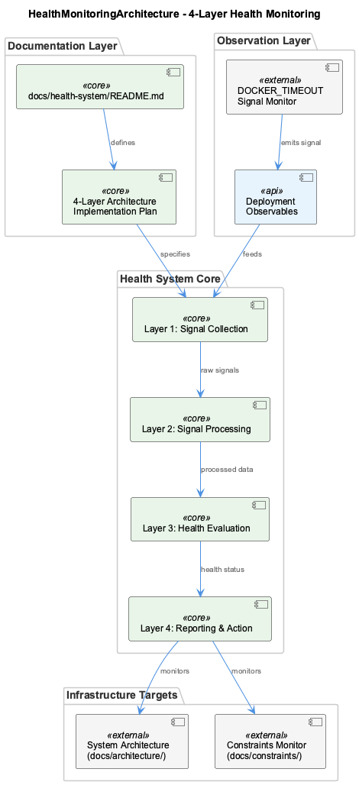
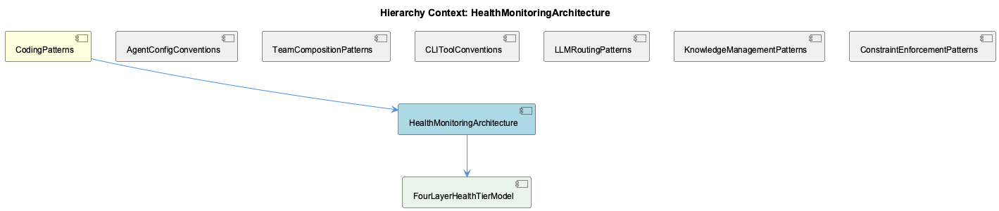

# HealthMonitoringArchitecture

**Type:** SubComponent

The implementation plan document (4-layer-architecture-implementation-plan.md) implies the health system was planned and built incrementally, with each layer having defined interfaces to the layer above and below

# HealthMonitoringArchitecture

## What It Is

HealthMonitoringArchitecture is a dedicated infrastructure-level subsystem documented under `docs/health-system/`, a directory that sits as a peer to `docs/architecture/` and `docs/constraints/` in the project's documentation hierarchy. This placement is deliberate and meaningful: rather than being embedded within individual agent configurations or scattered across component-level concerns, the health system occupies its own top-level documentation domain, signaling that it monitors the overall system rather than any single constituent part.

The subsystem is introduced via `docs/health-system/README.md`, which serves as the entry point overview — consistent with the project's broader convention of self-documenting directories. The core design is codified in `docs/health-system/4-layer-architecture-implementation-plan.md`, which names and defines the **4-Layer Health Monitoring Architecture** and its child model, FourLayerHealthTierModel.

Within CodingPatterns — the architectural catch-all that also houses AgentConfigConventions, LLMRoutingPatterns, KnowledgeManagementPatterns, and other structural patterns — HealthMonitoringArchitecture represents the system's operational self-awareness. Where sibling patterns like AgentConfigConventions govern how agents are registered and CLIToolConventions govern how developers interact with the system, HealthMonitoringArchitecture governs how the system monitors its own runtime health.

## Architecture and Design

The defining architectural decision is decomposition into four responsibility tiers, as named explicitly in `4-layer-architecture-implementation-plan.md`. This is not a monolithic health check but a layered model where each tier has defined interfaces to the layer above and below it — a design that enforces separation of concerns vertically through the monitoring stack. The child component FourLayerHealthTierModel is the direct expression of this decomposition.

The choice of a four-layer model reflects a deliberate trade-off: more layers than a simple pass/fail probe, but bounded enough to remain comprehensible and maintainable. Each layer presumably handles a different granularity or type of health signal, though the specific tier responsibilities are owned by FourLayerHealthTierModel. The implementation plan document implies the system was constructed incrementally, with each layer's interfaces stabilized before the next was built — a bottom-up construction strategy that reduces integration risk.

The infrastructure-level positioning means HealthMonitoringArchitecture observes the system from outside its components rather than from within them. This is architecturally significant: it avoids coupling health logic to agent internals, just as LLMRoutingPatterns externalizes routing decisions and KnowledgeManagementPatterns externalizes memory into GraphKMStore.

## Implementation Details

At the implementation level, the observable signals the health system monitors include at minimum Docker deployment timeouts, evidenced by the `DOCKER_TIMEOUT` environment variable documented at the project level. This is a concrete, grounded detail: the health system is wired to observe deployment-layer behavior, not just application-layer behavior. Docker timeout as a monitored signal suggests the system is concerned with availability and responsiveness at the infrastructure boundary — the point where the system either starts successfully or fails to initialize.

Beyond `DOCKER_TIMEOUT`, the implementation mechanics are defined within FourLayerHealthTierModel, which owns the tier-by-tier specification. The implementation plan document (`4-layer-architecture-implementation-plan.md`) is the authoritative source for inter-layer interface contracts. No code symbols were surfaced in analysis, which suggests the health system's implementation may be primarily expressed in documentation, configuration, and shell-level tooling consistent with the project's bin/-centric CLI conventions.

## Integration Points

The health system's primary integration surface is the Docker deployment layer, where `DOCKER_TIMEOUT` provides a timeout signal. As a peer-level concern to the architecture and constraints documentation, it implicitly monitors everything those documents describe: agent configurations in `config/agents/`, team topologies in `config/teams/`, and the LLM proxy routing governed by `LLM_PROXY_URL`, `RAPID_LLM_PROXY_URL`, and `LLM_CLI_PROXY_URL`.

Within CodingPatterns, HealthMonitoringArchitecture is the only pattern explicitly concerned with runtime state — all sibling patterns (AgentConfigConventions, TeamCompositionPatterns, CLIToolConventions, LLMRoutingPatterns, KnowledgeManagementPatterns, ConstraintEnforcementPatterns) are concerned with static structure or configuration-time decisions. This makes HealthMonitoringArchitecture the operational complement to those structural patterns.

## Usage Guidelines

Developers extending or modifying the health system should treat `docs/health-system/README.md` as the canonical entry point and `docs/health-system/4-layer-architecture-implementation-plan.md` as the authoritative design document. Any new health signals or monitoring concerns should be assigned to an appropriate tier within FourLayerHealthTierModel rather than added as ad-hoc checks, preserving the layered separation that is the system's core design principle.

When adding new infrastructure signals (similar to `DOCKER_TIMEOUT`), document them at the project level as environment variables and ensure they are explicitly wired into the appropriate health tier. The pattern established by `DOCKER_TIMEOUT` suggests environment variables are the integration mechanism between deployment infrastructure and the health monitoring layer. New agents registered via `config/agents/` or new team topologies added to `config/teams/` should be considered in terms of what health signals they expose and how those signals map to existing tiers before creating new monitoring logic.

## Hierarchy Context

### Parent
- [CodingPatterns](./CodingPatterns.md) -- CodingPatterns serves as the architectural catch-all component for the Coding project, capturing general programming wisdom, design patterns, and conventions that permeate the codebase. Based on the repository structure, the project follows a consistent agent-abstraction pattern where AI agents (Claude, Copilot, Mastra, OpenCode) are configured via config/agents/ shell scripts and unified under config/agent-profiles.json, enabling agent-agnostic workflows. The system demonstrates strong separation of concerns through layered architecture: bins for CLI entrypoints, config for declarative configuration, docs for architecture documentation, and docker for deployment.

### Children
- [FourLayerHealthTierModel](./FourLayerHealthTierModel.md) -- docs/health-system/4-layer-architecture-implementation-plan.md explicitly names a '4-Layer Health Monitoring Architecture', indicating the system is not monolithic but organized into four responsibility tiers with separate concerns at each level.

### Siblings
- [AgentConfigConventions](./AgentConfigConventions.md) -- config/agents/ directory holds per-agent shell scripts that declare environment-specific setup, with docs/architecture/adding-new-agent.md codifying the step-by-step convention for registering a new provider
- [TeamCompositionPatterns](./TeamCompositionPatterns.md) -- config/teams/ directory is the canonical location for team topology manifests, mirroring the per-agent config/agents/ pattern but at the group level
- [CLIToolConventions](./CLIToolConventions.md) -- docs/getting-started.md references bin/ tools as the primary interaction layer, indicating CLI scripts are the intended entrypoints rather than imported libraries
- [LLMRoutingPatterns](./LLMRoutingPatterns.md) -- Three distinct proxy URL environment variables—LLM_PROXY_URL, RAPID_LLM_PROXY_URL, and LLM_CLI_PROXY_URL—are documented as project-wide constants, indicating tiered routing where different latency/cost profiles are selected by context
- [KnowledgeManagementPatterns](./KnowledgeManagementPatterns.md) -- GraphKMStore is explicitly named in project documentation as the graph-based knowledge storage component, with docs/architecture/memory-systems.md describing its Graph-Based Knowledge Storage Architecture
- [ConstraintEnforcementPatterns](./ConstraintEnforcementPatterns.md) -- docs/constraints/README.md titled 'Constraints - Code <USER_ID_REDACTED> Enforcement' establishes a dedicated subsystem for enforcing coding standards, separate from agent config or CLI conventions

---

*Generated from 5 observations*
