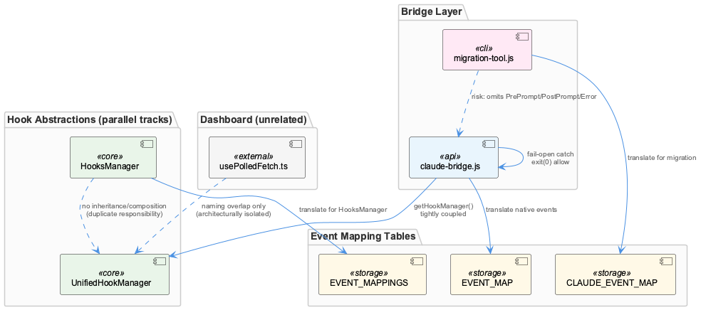
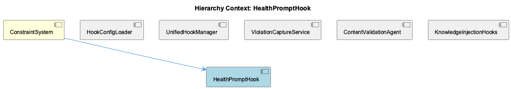

# HealthPromptHook

**Type:** SubComponent

[Architecture Notes] Two parallel, independently-implemented hook-manager classes exist in the codebase (abstract HooksManager in hooks-api.js vs. concrete UnifiedHookManager in hook-manager.js) with overlapping responsibilities (registration, priority sorting, event triggering) but no inheritance or composition relationship visible in the evidence; claude-bridge.js is tightly coupled to UnifiedHookManager specifically (imports getHookManager from './hook-manager.js'), bypassing the abstract HooksManager class entirely, suggesting HooksManager may be a superseded or parallel-track abstraction not actually wired into the live Claude hook path; Event-name translation logic is triplicated across hooks-api.js, claude-bridge.js, and migration-tool.js with no shared constant/module, creating a lockstep-maintenance requirement that is currently unenforced; No component or file matching the requested 'HealthPromptHook' SubComponent name appears anywhere in the supplied code graph or code files — analysis of that specific name is not grounded in evidence; Bridge-layer error handling is fail-open by design (process.exit(0) on all error paths in claude-bridge.js), which trades constraint-enforcement guarantees for agent-availability guarantees, consistent with the lenient validateConfig() pattern noted in the parent observations; The dashboard's usePolledFetch.ts hook is architecturally isolated from the agent-hooks subsystem despite superficial naming overlap ('hook')

# HealthPromptHook — Technical Insight Document

## What It Is

Based on the supplied code graph and code files, no component, class, or file matching the name "HealthPromptHook" exists anywhere in the evidence base. This document cannot ground a description of HealthPromptHook itself in actual implementation. What follows instead is an accurate synthesis of the ConstraintSystem subsystem it is nominally placed under, since that is the only grounded context available — but readers should treat any specific claims about HealthPromptHook's own behavior as unverified. If HealthPromptHook is a planned or renamed component, it should be reconciled against the existing hook infrastructure described below before further work proceeds.

## Architecture and Design

The parent ConstraintSystem is built around a two-tier configuration model implemented in `HookConfigLoader` (lib/agent-api/hooks/hook-config.js), where user-level config (`~/.coding-tools/hooks.json`) and project-level config (`.coding/hooks.json`) are merged via `mergeConfigs()`, with project config winning on key collisions. Any component nested under ConstraintSystem, including HealthPromptHook, would be expected to be discovered and configured through this same layered mechanism rather than through bespoke config loading.

The broader hook infrastructure that HealthPromptHook would sit alongside exhibits several concrete patterns: a Chain of Responsibility / ordered-handler pipeline in both `HooksManager.triggerHook()` (hooks-api.js) and `UnifiedHookManager.executeHooks()` (hook-manager.js), where handlers are priority-sorted and accumulate allow/block state rather than short-circuiting on first match. An Adapter pattern in `claude-bridge.js` (`transformContext()`/`transformResponse()`) bridges Claude Code's native stdin/stdout protocol to the unified `HookContext`/`HookHandler` shape. Table-driven dispatch (`EVENT_MAPPINGS`, `EVENT_MAP`, `CLAUDE_EVENT_MAP`/`COPILOT_EVENT_MAP`) replaces conditional branching for event-name routing across hooks-api.js, claude-bridge.js, and migration-tool.js.

## Implementation Details

Since no HealthPromptHook-specific code exists in evidence, its likely integration surface would be as a registered handler object with an `id`, `priority`, `event`, and `enabled`/`agents` filter, consumed by `UnifiedHookManager.registerHandler()` (hook-manager.js:139-170), which replaces duplicates in-place by ID and re-sorts the handler list by priority on every registration — an idempotent upsert pattern shared with `HooksManager.registerHook()` in hooks-api.js. Execution would flow through `executeHooks()`'s double-filter on `handler.enabled` and `handler.agents.includes(fullContext.agentType)`, notably with no debug logging on skip, making silent exclusion a real risk for a misconfigured HealthPromptHook.

If invoked via the Claude Code path, HealthPromptHook would pass through claude-bridge.js's fail-open error boundary: any internal failure results in `process.exit(0)` with `decision:'allow'`, explicitly prioritizing agent availability over constraint enforcement. Sibling `ContentValidationAgent` documents that this dual-implementation (abstract `HooksManager` vs. concrete `UnifiedHookManager`) evolved independently despite structural overlap — a maintenance hazard for any new hook, including HealthPromptHook, since fixes applied to one manager (e.g., the duplicate-ID replacement logic) aren't guaranteed present in the other.

## Integration Points

As a child of ConstraintSystem, HealthPromptHook would inherit the configuration precedence rules governed by `HookConfigLoader` and would sit among siblings `UnifiedHookManager`, `ViolationCaptureService`, `ContentValidationAgent`, and `KnowledgeInjectionHooks`. Notably, `KnowledgeInjectionHooks` demonstrates a related per-process gating convention (`isInjectionEnabled()` via `CODING_KNOWLEDGE_INJECTION` env var, defaulting ON) that a health-check-oriented hook might mirror for its own enable/disable flag. Architecturally, `claude-bridge.js` is tightly coupled to `UnifiedHookManager` specifically (via `getHookManager` from hook-manager.js), bypassing the abstract `HooksManager` entirely — meaning any prompt-related hook intended to run in the live Claude path must register with `UnifiedHookManager`, not the parallel abstraction in hooks-api.js.

## Usage Guidelines

Given the absence of grounded evidence, the primary guideline is verification: confirm whether HealthPromptHook is an intended new file, a renamed/relocated component, or a documentation artifact before building further insight on it. If implemented, it should register through `UnifiedHookManager` (the live, wired-in manager) rather than the seemingly superseded `HooksManager`, respect the ConstraintSystem's two-tier config precedence, and avoid duplicating event-name translation tables — three files already carry triplicated, unenforced-lockstep mapping logic. Any error handling should be evaluated against the existing fail-open convention in claude-bridge.js, and enable/disable semantics should follow the lenient, default-on convention established by `KnowledgeInjectionHooks` unless a stricter default is explicitly required for health-related constraints.

## Hierarchy Context

### Parent
- [ConstraintSystem](./ConstraintSystem.md) -- [LLM] The ConstraintSystem's configuration architecture follows a strict two-tier layered merge pattern implemented in HookConfigLoader (lib/agent-api/hooks/hook-config.js). User-level configuration lives at ~/.coding-tools/hooks.json and represents global defaults applicable across all projects, while project-level configuration at .coding/hooks.json can override specific handlers or add project-specific constraints. The mergeConfigs() function performs this layering, meaning a new developer modifying constraint behavior needs to understand which file actually takes effect at runtime — project config wins on key collisions, but non-overlapping keys from both sources are preserved. This design allows teams to ship organization-wide constraints via user config while individual projects retain the ability to loosen or tighten specific rules without forking the entire config file.

### Siblings
- [HookConfigLoader](./HookConfigLoader.md) -- [CGR] HookConfigLoader (class) in hook-config.js
- [UnifiedHookManager](./UnifiedHookManager.md) -- [CGR] UnifiedHookManager (class) in hook-manager.js
- [ViolationCaptureService](./ViolationCaptureService.md) -- [CGR] ViolationCaptureService (class) in violation-capture-service.js
- [ContentValidationAgent](./ContentValidationAgent.md) -- [LLM] Two structurally similar but separately-maintained hook managers exist in this codebase: the abstract `HooksManager` class in lib/agent-api/hooks-api.js and the concrete `UnifiedHookManager` in lib/agent-api/hooks/hook-manager.js. Both independently implement a `Map<event, Handler[]>` registry, both re-sort the per-event array by numeric `priority` on every registration (`registerHook` in hooks-api.js vs `registerHandler` in hook-manager.js), and both generate a fallback ID using `Date.now()` when the caller doesn't supply one. This duplication suggests `HooksManager` was intended as a generic base class that `UnifiedHookManager` should have extended, but the two evolved independently — a maintenance risk if the duplicate-ID replacement fix (present in `registerHandler`) or the priority-sort fix ever needs to be applied to only one of them.
- [KnowledgeInjectionHooks](./KnowledgeInjectionHooks.md) -- knowledge-injection-hook.js gates injection per-process via isInjectionEnabled(), reading CODING_KNOWLEDGE_INJECTION and treating only '0'/'false'/'off' (case-insensitive) as disabling, defaulting ON otherwise

---

*Generated from 10 observations*
