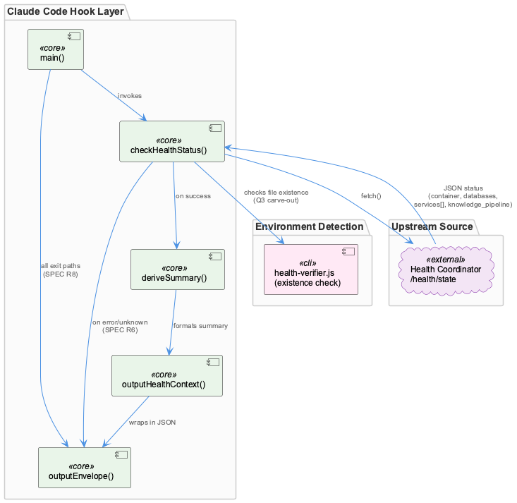
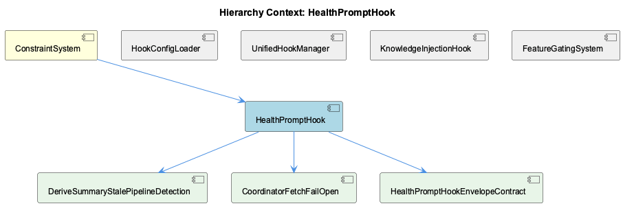

# HealthPromptHook

**Type:** SubComponent

# HealthPromptHook — Technical Insight Document

## What It Is

HealthPromptHook is implemented as a standalone Node script at `scripts/health-prompt-hook.js`, registered as a Claude `UserPromptSubmit` hook. It reads stdin and writes a JSON envelope to stdout, performing exactly one HTTP fetch per invocation with no persistent state between runs. As a child of ConstraintSystem, it sits alongside siblings HookConfigLoader, UnifiedHookManager, ViolationCaptureService, and KnowledgeInjectionHook as one of several hook-style subcomponents, but it is distinctly scoped to health status injection rather than knowledge injection, config loading, or violation capture.

Its purpose is to fetch state from a host health-coordinator and inject a compact, human-readable health summary into Claude's prompt context, ensuring that any coordinator degradation is surfaced as informational text without ever blocking the interaction.

## Architecture and Design

The design is built around a fail-open/fail-soft contract: every exit path in `main()` — the inner try/catch, the outer `.catch()`, and even the fallback `outputEnvelope('')` — converges on `process.exit(0)` and a well-formed envelope. The header comment states this as a hard rule: "The hook MUST always process.exit(0) so Claude never blocks on errors." This makes hook failure incapable of interrupting the prompt pipeline; it can only degrade the informational string emitted.

Three child components decompose the script's responsibilities cleanly: CheckHealthStatusCoordinatorFetch (`checkHealthStatus()`) handles environment detection and the coordinator fetch; DeriveSummaryHealthReducer (`deriveSummary()`) performs allow-listed field projection into a summary shape; and SpecR8OutputEnvelope (`outputEnvelope()`) guarantees every call path emits the identical `{ hookSpecificOutput: { hookEventName: 'UserPromptSubmit', additionalContext } }` shape structurally, not by convention.

A notable heuristic is the "Q3 carve-out" in `checkHealthStatus()`: it calls `existsSync(VERIFIER_SCRIPT)` to check for `scripts/health-verifier.js` sitting beside this file, purely as a boolean gate for detecting whether the hook is running inside the coding repo. No content of that script is read or spawned — its mere presence/absence drives behavior, meaning relocating or renaming `health-verifier.js` would silently alter out-of-repo behavior with no explicit code linkage.

## Implementation Details

`deriveSummary()`, embodied by DeriveSummaryHealthReducer, extracts only five allow-listed fields from the coordinator's `/health/state` response — `container.healthcheck`, `databases.status`, `services[]`, `lsl_by_project`, and `knowledge_pipeline.status` — converting each into a fixed-format string. The header comment labels this "no unsanitised passthrough (T-33-05-02 mitigation)," meaning new coordinator fields are invisible until this function is explicitly edited.

The function applies deliberately asymmetric status handling: among six possible `knowledge_pipeline.status` values, only `'stalled'` produces an issue; `'stale'`, `'busy'`, `'unreachable'`, `'disabled'`, and `'healthy'` fall through silently. This mirrors `OK_SERVICE_STATUSES = new Set(['running', 'busy'])`, applied identically to `state.services`, both guarding against misreporting a working-but-blocked event loop as a stopped service. When phrasing a stall, the function deliberately uses `activeStallMs` rather than raw wall-clock age (`Math.floor(activeMs / 3600000)`), avoiding false alarms from quiet nights or weekends — this requires the upstream coordinator to have already computed active-time separately from age.

`outputHealthContext()` maps overall status to emoji/string output (⚪/⚠️/✅), while `outputEnvelope()` is the sole convergence point for the SPEC R8 shape across the Q3 no-op branch, the normal flow, and both catch blocks in `main()`.

## Integration Points

The hook's single external dependency is an HTTP GET to `HEALTH_COORDINATOR_URL` (default `localhost:3034`) `/health/state` — no other file or service supplies health data. It is coupled to `health-coordinator.js`'s internal logic (`pollKnowledgePipeline`, `reclassifyBusyService`, `OBS_STALL_MS`) only by contract/comment reference, with no direct code import.

Critically, the fixed string vocabulary emitted (e.g., "observations stalled (Nh of active work unrecorded)", service status strings, LSL project status) functions as a de facto cross-application contract: the HealthDashboard work record establishes this hook as a shared aggregator consumed by two independently built and deployed dashboards — a Next.js constraint-monitor dashboard and a Vite-based system-health-dashboard. Changing phrasing or shape risks breaking parsing logic in both frontends.

The upstream data itself has known accuracy gaps: obs-api's coverage-metric bug counts 'observations' and 'digests' entity types in a ratio denominator that should exclude them, per the obs-api Service Lifecycle work record — an unresolved issue upstream of this hook's consumption path, not yet localized to a specific function.

## Usage Guidelines

Because `deriveSummary()` is module-private and untestable via direct import, the test suite (`tests/integration/health-prompt-hook-stall.test.mjs`, via `hookSays()`) drives the script as a subprocess against a real one-shot HTTP server and asserts on the literal output string — any change to phrasing must be validated this way, and cross-checked against both consuming dashboards given the shared-contract risk.

Developers extending `deriveSummary()` must explicitly add new allow-listed fields; passthrough of arbitrary coordinator JSON is intentionally disallowed. Status-set gating (`OK_SERVICE_STATUSES`) should be extended consistently across both service and pipeline status paths if new benign-but-busy states are introduced. Finally, the fail-open contract (`process.exit(0)` on every path) must be preserved in any modification — this hook must never become a blocking point in the prompt pipeline, only a potentially less-informative one.

## Work Record

What working sessions recorded about this entity — decisions taken, problems hit, and why things are the way they are:

- obs-api Service Lifecycle and Dev Workflow Resumption record notes a related coverage-metric bug in obs-api counting 'observations' and 'digests' entity types in a ratio denominator that should exclude them, showing this hook's upstream data source has known accuracy gaps
- The 'obs-api Service Lifecycle and Dev Workflow Resumption' work record, filed against this component, documents an open, unresolved bug: a coverage metric in obs-api computes a ratio whose denominator should exclude 'observations' and 'digests' entity types but currently includes them, skewing the reported coverage value. This is distinct from anything in the reviewed source — it establishes a known-bad calculation elsewhere in the pipeline this hook consumes from, not yet located to a specific function.
- The 'HealthDashboard — Performance/System-Health/Token-Cost Dashboards' work record establishes that health-prompt-hook.js acts as a shared aggregator consumed by two architecturally separate, independently-built-and-deployed dashboard stacks — a Next.js constraint-monitor dashboard and a Vite-based system-health-dashboard. This means the fixed string vocabulary this hook emits (e.g. 'observations stalled (Nh of active work unrecorded)', 'service X status', 'LSL project status') is a de facto cross-application contract: changing its phrasing or shape risks breaking parsing logic in two independently maintained frontends rather than one.

## Hierarchy Context

### Parent
- [ConstraintSystem](./ConstraintSystem.md) -- [SESSION] Statusline Click-Report Feature record establishes that clicking the 'constraints' field in the tmux statusline opens or focuses the constraint-monitor dashboard tab, tying HookManagementSystem's violation data to a click-driven UX surface

### Children
- [DeriveSummaryHealthReducer](./DeriveSummaryHealthReducer.md) -- [LLM+CGR] The component maps to `deriveSummary()` in scripts/health-prompt-hook.js, a pure reducer that folds the coordinator's `/health/state` JSON into a `{ overallStatus, issues, generated_at }` shape. It only reads five allow-listed fields — `container.healthcheck`, `databases.status`, `services[]`, `lsl_by_project`, and `knowledge_pipeline.status` — and the header comment labels this restriction 'no unsanitised passthrough (T-33-05-02 mitigation)'. Any new coordinator field is invisible to the hook until this function is explicitly edited to extract it, making the reducer a narrow, versioned contract rather than a general formatter.
- [CheckHealthStatusCoordinatorFetch](./CheckHealthStatusCoordinatorFetch.md) -- [LLM] checkHealthStatus() (scripts/health-prompt-hook.js) is the literal implementation this component name describes: a single fetch to the health-coordinator, gated by a repo-detection heuristic. Before any network call it checks `existsSync(VERIFIER_SCRIPT)` — the presence of `scripts/health-verifier.js` next to this file — and short-circuits to `{ servicesAvailable: false, exists: false, isStale: false, shouldBlock: false, status: null }` when absent. This is the Q3 carve-out: the function's very first branch has nothing to do with coordinator health and everything to do with deciding whether the hook is even running inside the coding repo.
- [SpecR8OutputEnvelope](./SpecR8OutputEnvelope.md) -- [LLM] outputEnvelope() in scripts/health-prompt-hook.js constructs the literal SPEC R8 shape `{ hookSpecificOutput: { hookEventName: 'UserPromptSubmit', additionalContext } }` and is the single function through which every call path — the Q3 no-op branch, the normal outputHealthContext() flow, and both catch blocks in main() and the outer .catch() — must pass, meaning the envelope's shape is guaranteed structurally rather than by convention at each call site.

### Siblings
- [HookConfigLoader](./HookConfigLoader.md) -- [CGR] HookConfigLoader (class) in hook-config.js
- [UnifiedHookManager](./UnifiedHookManager.md) -- [CGR] UnifiedHookManager (class) in hook-manager.js
- [ViolationCaptureService](./ViolationCaptureService.md) -- [SESSION] Statusline Click-Report Feature record establishes that clicking the 'constraints' field in the tmux statusline opens or focuses the constraint-monitor dashboard tab, tying this service's persisted violation history to a click-driven UX surface
- [KnowledgeInjectionHook](./KnowledgeInjectionHook.md) -- [LLM] None of the supplied code files implement or reference a component named 'KnowledgeInjectionHook'. scripts/health-prompt-hook.js implements a UserPromptSubmit hook that injects *health* status text into Claude's context via the SPEC R8 envelope (`{ hookSpecificOutput: { hookEventName: 'UserPromptSubmit', additionalContext } }`), which is structurally the kind of thing a knowledge-injection hook would also do (inject a context string ahead of a prompt), but it is a distinct, named component (health, not knowledge) with its own test file (tests/integration/health-prompt-hook-stall.test.mjs). The other two files, integrations/system-health-dashboard/src/components/workflow/hooks.ts and integrations/system-health-dashboard/src/hooks/usePolledFetch.ts, are React hooks for dashboard data-fetching (useWorkflowDefinitions, useRecentCalls, usePolledFetch) and have no relationship to knowledge injection at all — they surfaced only because the retrieval matched the generic term 'hooks'.

---

*Generated from 11 observations*
