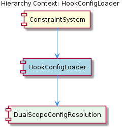

# HookConfigLoader

**Type:** SubComponent

The HookConfigLoader is implemented in the lib/agent-api/hooks/hook-config.js file, which suggests a modular design for loading and merging hook configurations.

## What It Is  

`HookConfigLoader` is a **sub‑component** that lives in the file **`lib/agent-api/hooks/hook-config.js`**.  Its sole responsibility is to obtain hook configuration data from one or more sources, reconcile those fragments into a single, coherent configuration object, and make that object available to the surrounding **ConstraintSystem**.  The placement of the file under `lib/agent-api/hooks/` signals a deliberately modular design: the loader is isolated from the rest of the agent‑API implementation, which allows the rest of the system (for example, the sibling **ContentValidationAgent** and the **ConstraintConfiguration** documentation) to treat hook configuration as a black‑box service.  By being a child of **ConstraintSystem**, the loader supplies the configuration that the constraint engine later validates and enforces.

## Architecture and Design  

The observations point to a **modular loading‑and‑merging** architecture.  `HookConfigLoader` acts as an adaptor that abstracts the details of where hook definitions originate—whether they are required via CommonJS `require()`, imported with ES‑module `import()`, or fetched from other runtime locations.  This abstraction follows a **Facade**‑style pattern: callers (the ConstraintSystem) interact with a single, well‑defined API rather than dealing with the intricacies of file I/O, module resolution, or validation.  

A second design element is the **merging strategy**.  The loader combines multiple configuration fragments into one object, suggesting an internal **Strategy**‑like mechanism where the merge algorithm (e.g., shallow‑object spread, deep‑merge, or custom conflict resolution) can be swapped or tuned without affecting callers.  The presence of **caching** hints at a **Memoization** pattern: once a particular set of hook files has been loaded and merged, the result is stored so that subsequent requests can be served quickly, reducing I/O and computation overhead.  

Error handling is explicitly mentioned, indicating that the component guards against malformed or missing configurations.  This defensive stance is typical of a **Robust Adapter** that validates inputs before they propagate downstream, thereby protecting the ConstraintSystem from cascading failures.

## Implementation Details  

Although the source file contains no explicit symbols in the provided observations, the described responsibilities imply a small set of core functions inside **`lib/agent-api/hooks/hook-config.js`**:

1. **Loading** – a routine that iterates over a list of configured hook sources, invoking `require()` or dynamic `import()` for each path.  The loader likely normalizes the result into a plain JavaScript object or array, the canonical internal representation for hook configurations.  

2. **Merging** – a dedicated method that takes the array of raw configurations and combines them.  The merge may use native object spread (`{...a, ...b}`) for shallow merges or a recursive algorithm for nested structures.  The design choice here balances simplicity (shallow merge) against flexibility (deep merge) and dictates how conflicting hook definitions are resolved.  

3. **Validation / Normalization** – before a merged configuration is handed to the ConstraintSystem, the loader probably runs a validation step that checks required fields, data types, and possibly schema compliance.  Normalization would convert legacy or shorthand forms into the canonical shape expected by downstream components.  

4. **Caching** – the loader likely maintains an in‑memory cache (e.g., a module‑scoped map keyed by a hash of the source list) that stores the final merged configuration.  Subsequent calls check the cache first, returning the stored object unless a source file has changed (detected via timestamps or explicit invalidation).  

5. **Error Propagation** – any failure during loading, merging, or validation is captured and re‑thrown as a domain‑specific error (e.g., `HookConfigError`).  This keeps the error surface consistent for the ConstraintSystem, which can decide whether to abort, fallback, or log the issue.

The component’s internal state is therefore limited to the cache and possibly a list of source descriptors, keeping the implementation lightweight and focused.

## Integration Points  

`HookConfigLoader` sits directly under **ConstraintSystem**, which consumes the final configuration to drive the constraint evaluation pipeline.  The loader does not appear to expose a public class hierarchy; instead, it likely exports a singleton instance or a set of functions that the ConstraintSystem imports.  Its dependencies are limited to Node’s module system (`require`/`import`) and any file‑system utilities needed to locate hook definition files.  Because the loader normalizes configurations into plain objects, it can be consumed by any other sub‑components that need hook metadata, though the current architecture only mentions the ConstraintSystem as the primary consumer.

Sibling components such as **ContentValidationAgent** (implemented in `integrations/mcp-server-semantic-analysis/src/agents/content-validation-agent.ts`) and **ConstraintConfiguration** (documented in `integrations/mcp-constraint-monitor/docs/constraint-configuration.md`) operate alongside the loader but do not appear to depend on it directly.  This separation reinforces a clear boundary: the loader handles *configuration acquisition*, while the agents handle *runtime validation* and the documentation defines *configuration schema*.  Should a future feature require dynamic hook updates, the loader’s caching layer would be the natural integration point for a watcher or hot‑reload mechanism.

## Usage Guidelines  

Developers integrating with the ConstraintSystem should treat `HookConfigLoader` as a **read‑only service**.  The loader’s public API is expected to provide a method such as `getMergedConfig()` (or an equivalent) that returns the fully resolved hook configuration.  Calls should be made **after** any application‑level configuration (e.g., environment variables that point to custom hook directories) has been established, ensuring that the loader sees the correct source list.  

When adding new hook definition files, place them in locations that the loader’s source list references; avoid mutating the files at runtime unless you also trigger a cache invalidation.  If a custom merge behavior is required, consider extending the loader’s merge function rather than rewriting it, preserving the existing error handling and validation pipeline.  

Because error handling is built into the loader, callers should be prepared to catch `HookConfigError` (or the generic error type the loader throws) and decide whether to abort the constraint checks or fall back to a safe default configuration.  Finally, keep hook configuration objects **pure data structures** (objects or arrays) without embedding executable code; this aligns with the loader’s validation expectations and maintains the separation of concerns between configuration and execution logic.

---

### Architectural Patterns Identified
* **Facade / Adapter** – provides a single, stable API for loading, merging, and validating hook configs.  
* **Strategy (Merge Algorithm)** – encapsulates the merge logic, allowing different conflict‑resolution policies.  
* **Memoization / Caching** – stores the merged result to avoid repeated I/O and processing.  

### Design Decisions and Trade‑offs
* **Modular isolation** (loader in its own file) improves testability and limits coupling but adds an extra indirection for callers.  
* **Caching** boosts performance at the cost of potential staleness; requires explicit invalidation logic.  
* **Error‑centric design** protects the ConstraintSystem but may increase the surface area of error handling for developers.  

### System Structure Insights
`HookConfigLoader` is a leaf node under **ConstraintSystem**, with siblings that handle validation and documentation.  Its sole responsibility is configuration synthesis, reinforcing a clean separation of concerns across the constraint monitoring stack.  

### Scalability Considerations
The loader’s caching mechanism and lightweight merge algorithm enable it to handle an increasing number of hook sources with minimal latency.  Should the number of sources grow dramatically, the merge strategy may need to shift from a shallow to a more efficient deep‑merge implementation, and cache invalidation mechanisms may require more sophisticated change detection (e.g., file watchers).  

### Maintainability Assessment
The component’s narrow focus, clear file location, and reliance on standard Node module loading make it **highly maintainable**.  Adding new hook sources or tweaking merge rules involves localized changes within `lib/agent-api/hooks/hook-config.js` without rippling effects on the rest of the system.  The explicit error handling and validation steps further reduce the risk of silent failures, supporting long‑term reliability.

## Diagrams

### Relationship

## Architecture Diagrams

## Hierarchy Context

### Parent
- [ConstraintSystem](./ConstraintSystem.md) -- [LLM] The ConstraintSystem component's architecture is designed to be modular and scalable, with multiple sub-components working together to validate code actions and file operations. For example, the ContentValidationAgent (integrations/mcp-server-semantic-analysis/src/agents/content-validation-agent.ts) is responsible for validating entity content against the current codebase, while the HookConfigLoader (lib/agent-api/hooks/hook-config.js) loads and merges hook configurations from multiple sources. This modular design allows for easy maintenance and extension of the system.

### Siblings
- [ContentValidationAgent](./ContentValidationAgent.md) -- The ContentValidationAgent utilizes the integrations/mcp-server-semantic-analysis/src/agents/content-validation-agent.ts file to perform validation tasks.
- [ConstraintConfiguration](./ConstraintConfiguration.md) -- The ConstraintConfiguration is likely defined in the integrations/mcp-constraint-monitor/docs/constraint-configuration.md documentation.

---

*Generated from 7 observations*
