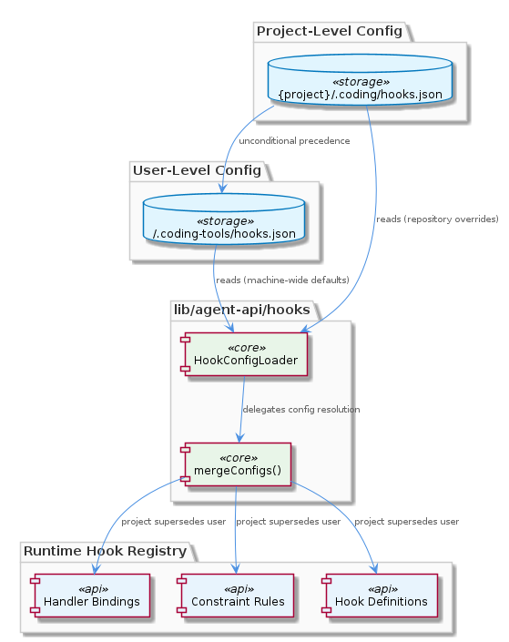

# HookConfigLoader

**Type:** SubComponent

The merge strategy means any handler, constraint rule, or hook binding defined at project scope supersedes the equivalent user-scope definition, enabling repositories to enforce stricter constraints without requiring changes to a developer's global setup

# HookConfigLoader — Technical Insight Document

## What It Is

`HookConfigLoader` is implemented at `lib/agent-api/hooks/hook-config.js` and serves as the sole entry point for reading hook configuration files in the codebase. It is responsible for loading and merging two distinct configuration scopes: the user-level file at `~/.coding-tools/hooks.json` and the project-level file at `{project}/.coding/hooks.json`. As a SubComponent of the broader `ConstraintSystem`, it provides the foundational configuration-resolution layer that downstream constraint enforcement and hook-binding logic depends on.

The loader exists to reconcile two different audiences of configuration: individual developers who want machine-wide defaults shared across all Claude Code sessions, and repository maintainers who need to enforce per-project conventions. By centralizing this responsibility in a single module, `HookConfigLoader` ensures consistent merge semantics across the system and prevents ad-hoc configuration access from other modules.

## Architecture and Design

The architectural approach embodied by `HookConfigLoader` is a **two-tier layered configuration pattern** with strict precedence semantics. The loader treats user-level config (`~/.coding-tools/hooks.json`) as the base layer and project-level config (`{project}/.coding/hooks.json`) as an override layer. Its `mergeConfigs()` method is the critical seam where these two layers combine: project configuration is applied on top of user configuration with full, unconditional precedence over user-level defaults.

This design follows a **single-entry-point pattern** — the child entity `DualScopeConfigResolution` makes explicit that no other module in the codebase reads either `hooks.json` file directly. All access flows through `HookConfigLoader`, which gives the system a single chokepoint for any future changes to merge semantics, file location resolution, or schema validation. This funneling discipline is what makes the merge behavior predictable across the system.

The design decision to grant project config unconditional precedence reflects a deliberate trade-off favoring **team-level enforcement over individual-level guarantees**. A repository can ratchet stricter constraints onto contributors without requiring those contributors to change their global setup. The downside, made explicit in the parent `ConstraintSystem` context, is that there is no "lock" mechanism — user config cannot mark fields as non-overridable. This means a malicious or misconfigured `.coding/hooks.json` can bypass globally-defined compliance constraints, a security boundary that `HookConfigLoader` does not enforce by design.

## Implementation Details

The core mechanic is the `mergeConfigs()` method on `HookConfigLoader`. It receives the parsed contents of both configuration files and produces a unified configuration object. Its semantics are straightforward: for every handler, constraint rule, or hook binding defined at project scope, the project-level definition supersedes the equivalent user-level definition. There is no field-level merging strategy that would let user config protect specific keys.

The two filesystem paths the loader knows about are hard-coded conventions of the broader system:
- `~/.coding-tools/hooks.json` — machine-wide defaults available across all Claude Code sessions on a developer's machine
- `{project}/.coding/hooks.json` — repository-scoped overrides resolved relative to the active project root

Because the loader is the sole reader of these files (per the `DualScopeConfigResolution` child entity), any caller seeking hook configuration must obtain it through this module. This consolidation means changes to file format, path conventions, or merge strategy can be implemented in one place without coordinating with other consumers.

## Integration Points

`HookConfigLoader` sits inside the `ConstraintSystem`, which is its parent component and the primary consumer of the merged configuration it produces. The constraint system relies on the loader to deliver an authoritative, already-reconciled view of what handlers, constraint rules, and hook bindings should be active for a given session. The loader does not enforce constraints itself — it only resolves and merges configuration that constraint enforcement code further down the stack will apply.

Its sole child entity, `DualScopeConfigResolution`, is the conceptual encoding of the two-scope resolution policy. Together they form a tight unit: `HookConfigLoader` is the physical module at `lib/agent-api/hooks/hook-config.js`, while `DualScopeConfigResolution` is the documented contract that all hook-config access is funneled through this single loader. There are no sibling components listed under `ConstraintSystem` for this entity to coordinate with directly — the loader's outputs feed into whatever downstream constraint and hook-binding machinery the parent system maintains.

## Usage Guidelines

Developers extending or interacting with the hook system should treat `HookConfigLoader` as the canonical access point for hook configuration. Direct file reads against `~/.coding-tools/hooks.json` or `{project}/.coding/hooks.json` should be avoided — they would bypass the merge semantics and create inconsistent views of configuration state, undermining the single-entry-point discipline that `DualScopeConfigResolution` formalizes.

When deciding *where* to define a hook, constraint rule, or handler, the precedence model should guide placement:
- Put settings in `~/.coding-tools/hooks.json` when they represent personal preferences or developer-wide defaults that any project should be free to override.
- Put settings in `{project}/.coding/hooks.json` when the repository must enforce them consistently across all contributors, with the understanding that this scope wins every conflict.

Teams should be especially aware of the security boundary the loader does **not** enforce. Because `mergeConfigs()` gives project config unconditional precedence and provides no lock mechanism for user-level fields, any compliance constraint defined globally can be silently bypassed by a `.coding/hooks.json` in a repository. When evaluating an unfamiliar repository, treat its `.coding/hooks.json` as trusted code — it can effectively disable or replace any user-level hook binding. If stricter guarantees are needed in the future, they would have to be added as new logic inside `HookConfigLoader` itself, since it is the only place where such a policy could be uniformly enforced.

Finally, when modifying `HookConfigLoader` itself, preserve the sole-entry-point invariant. Any new code that needs hook configuration should be routed through this loader rather than reading the JSON files directly, ensuring that future changes to merge strategy or path resolution propagate consistently across the `ConstraintSystem`.

## Hierarchy Context

### Parent
- [ConstraintSystem](./ConstraintSystem.md) -- [LLM] The ConstraintSystem implements a two-level configuration hierarchy through `HookConfigLoader` (lib/agent-api/hooks/hook-config.js) that distinguishes between user-wide defaults and project-specific overrides. User-level configuration lives at `~/.coding-tools/hooks.json`, making it available across all Claude Code sessions on the machine, while project-level configuration resides at `{project}/.coding/hooks.json`, enabling per-repository constraint customization. The `mergeConfigs()` method is the critical integration point: it applies project configuration on top of user configuration, meaning any handler, constraint rule, or hook binding defined at the project level supersedes or augments what the user has set globally. This design has a meaningful implication for teams: a repository can enforce stricter or more specific constraints than a developer's personal defaults without requiring them to change their global setup. However, because the merge strategy gives project config full precedence, there is no mechanism for user config to 'lock' a setting that cannot be overridden by a project — a security boundary that new developers should be aware of when assessing whether globally-defined compliance constraints can be bypassed by a malicious or misconfigured `.coding/hooks.json`.

### Children
- [DualScopeConfigResolution](./DualScopeConfigResolution.md) -- lib/agent-api/hooks/hook-config.js is explicitly designated the 'sole entry point' for hook configuration, meaning no other module in the codebase directly reads either hooks.json file — all access is funneled through this one loader.

---

*Generated from 5 observations*
