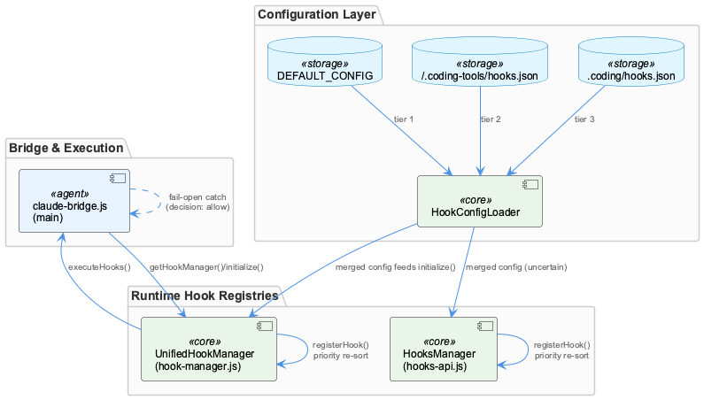
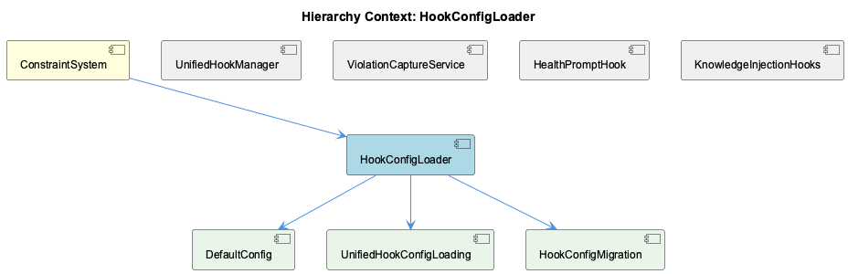

# HookConfigLoader

**Type:** SubComponent

Handler entries are validated implicitly by destructuring with fallbacks (type='script', args=[], priority=100, enabled!==false, agents=[]) in registerHandler, so a partially-specified handler object never breaks registration.

# HookConfigLoader — Technical Insight Document

## What It Is

HookConfigLoader is implemented as a class in `lib/agent-api/hooks/hook-config.js`, and it serves as the dedicated configuration-parsing and structural-validation layer within the broader ConstraintSystem. While its sibling, UnifiedHookManager (in `hook-manager.js`), owns runtime dispatch orchestration, HookConfigLoader owns the concerns of reading, merging, and validating the settings/hooks blocks that define how hook handlers behave. It also defines `DEFAULT_CONFIG`, a canonical default-settings shape that is imported directly by `migration-tool.js` to seed migrated configuration output — making HookConfigLoader the single source of truth for what a "default" hook configuration looks like, shared across both migration tooling and live runtime loading.

## Architecture and Design

The defining architectural trait of HookConfigLoader is defensive, non-throwing validation: malformed or unrecognized entries are logged and skipped rather than causing the entire configuration file to fail loading. This is exemplified by the handling of unknown event names in a config's hooks block, where each offending entry triggers `logger.warn('Unknown hook event in config')` followed by a `continue`, allowing the rest of the file to load successfully. This "warn and continue" philosophy reflects a design trade-off favoring system availability and graceful degradation over strict fail-fast correctness — appropriate for a constraint/enforcement subsystem where an entirely broken hook config would be worse than a partially-degraded one.

Within its own boundary, HookConfigLoader contains two identified sub-behaviors: ConfigSettingsOverride and TwoTierConfigLoading. TwoTierConfigLoading reflects the two-tier precedence model used by the parent ConstraintSystem — user-level configuration (`~/.coding-tools/hooks.json`) is loaded first, followed by project-level configuration (`.coding/hooks.json`), with later loads able to override earlier ones. ConfigSettingsOverride governs the finer-grained mechanics of exactly which settings get overridden during that merge.

## Implementation Details

The override mechanics are implemented through explicit `!== undefined` checks: `loadConfig()` in `hook-manager.js` only applies `config.settings.enableLogging`, `stopOnError`, and `timeout` when they are explicitly defined in the loaded file, otherwise preserving whatever defaults were already set by the constructor. This pattern (ConfigSettingsOverride) ensures that a sparse or partial config file cannot accidentally null-out previously established defaults — each setting is independently and conditionally merged.

A similar defensiveness appears at the handler level: rather than performing explicit schema validation, handler entries are validated implicitly through destructuring with fallback values — `type='script'`, `args=[]`, `priority=100`, `enabled !== false`, and `agents=[]` — inside `registerHandler`. This means a partially-specified handler object can never break registration; missing fields simply resolve to sane defaults rather than throwing.

Performance and control-flow efficiency are also considered at the I/O layer: before attempting an asynchronous `fs.readFile`, the loader checks `fsSync.existsSync(configPath)` synchronously. This avoids relying on an exception-driven control path for the very common case where no project-level config yet exists, trading a small synchronous check for cleaner, non-exceptional control flow.

## Integration Points

HookConfigLoader sits directly beneath ConstraintSystem, alongside sibling subcomponents HookManager, ViolationCaptureService, KnowledgeInjectionHooks, and HealthPromptHook. Its most direct integration is with HookManager: `UnifiedHookManager.initialize(projectPath)` drives the two-tier loading sequence, calling `loadConfig(userConfigPath, 'user')` first and then `loadConfig(projectConfigPath, 'project')`, relying on HookConfigLoader's merge semantics to give project-level entries precedence via later overwrite.

Beyond the hook subsystem, HookConfigLoader's `DEFAULT_CONFIG` is consumed externally by `migration-tool.js`, establishing a dependency where migration tooling relies on the loader's canonical shape rather than duplicating default values — reducing drift risk between migrated and freshly-loaded configurations.

## Usage Guidelines

Developers extending hook configuration should preserve the "warn, don't throw" convention: new validation checks added to the hooks-block parsing should log via `logger.warn` and skip the offending entry rather than aborting the whole file load, consistent with the unknown-event-name handling. Similarly, new settings fields should follow the `!== undefined` conditional-override pattern used for `enableLogging`, `stopOnError`, and `timeout`, so that partial config files don't clobber constructor defaults. When adding new handler fields, prefer destructuring with defaults (as `registerHandler` does) over strict up-front schema validation, to preserve the tolerance for partially-specified entries. Any change to `DEFAULT_CONFIG` should be treated as a shared-contract change, since `migration-tool.js` depends on it directly — updates here ripple into migration output, not just runtime behavior.

## Code Evidence

Key code artifacts grounding this entity's analysis:

**Structural:**
- HookConfigLoader (class) in hook-config.js

## Hierarchy Context

### Parent
- [ConstraintSystem](./ConstraintSystem.md) -- The ConstraintSystem provides rule-based validation and enforcement of code actions and file operations during Claude Code sessions, spanning hook configuration loading, hook dispatch orchestration, and violation capture/persistence. It is built around a unified hook architecture that merges user-level (~/.coding-tools/hooks.json) and project-level (.coding/hooks.json) configurations, with project config taking precedence, and dispatches events (pre-tool, post-tool, pre-prompt, post-prompt, startup, shutdown, error) to registered handlers of type script, command, or module.

Core orchestration lives in UnifiedHookManager (lib/agent-api/hooks/hook-manager.js), which maintains a Map of event names to sorted handler arrays (by priority), supports duplicate-ID overwrite semantics, and exposes registerHandler/unregisterHandler APIs bridging agent-native hook systems to a common HookEvent enum. Configuration parsing and structural validation is handled separately by HookConfigLoader (lib/agent-api/hooks/hook-config.js), which loads, merges, and validates settings/hooks blocks, logging warnings (not throwing) on malformed entries.

Violation detection results are captured and persisted via ViolationCaptureService (scripts/violation-capture-service.js), which writes JSONL violation records to .mcp-sync/session-violations.jsonl and maintains an aggregated violation-history.json with session tracking and computed statistics (severity breakdowns, most common constraint, average violations per session) for dashboard consumption. Sensitive parameter values are redacted before being written to logs, and history is capped at 1000 entries to bound file growth.

### Children
- [ConfigSettingsOverride](./ConfigSettingsOverride.md) -- hook-manager.js loadConfig() checks `if (config.settings.enableLogging !== undefined)` before overwriting `this.config.enableLogging`, and repeats the same pattern for stopOnError and timeout
- [TwoTierConfigLoading](./TwoTierConfigLoading.md) -- initialize() in hook-manager.js first calls `await this.loadConfig(this.config.userConfigPath, 'user')` then conditionally `await this.loadConfig(this.config.projectConfigPath, 'project')` if a projectPath was supplied

### Siblings
- [HookManager](./HookManager.md) -- UnifiedHookManager.initialize(projectPath) loads user config first via loadConfig(userConfigPath, 'user') then project config via loadConfig(projectConfigPath, 'project'), giving project-level entries precedence through later overwrite.
- [ViolationCaptureService](./ViolationCaptureService.md) -- Per architecture description, ViolationCaptureService writes JSONL violation records to .mcp-sync/session-violations.jsonl, separating an append-only raw log from a computed aggregate file.
- [KnowledgeInjectionHooks](./KnowledgeInjectionHooks.md) -- knowledge-injection-hook.js's isInjectionEnabled() reads process.env.CODING_KNOWLEDGE_INJECTION and treats only '0'/'false'/'off' (case-insensitive) as disabling, defaulting to enabled for unset values.
- [HealthPromptHook](./HealthPromptHook.md) -- checkHealthStatus() uses existsSync(VERIFIER_SCRIPT) as a heuristic to detect 'outside the coding repo' and returns servicesAvailable:false rather than attempting a network call in that case (Q3 carve-out).

---

*Generated from 6 observations*
