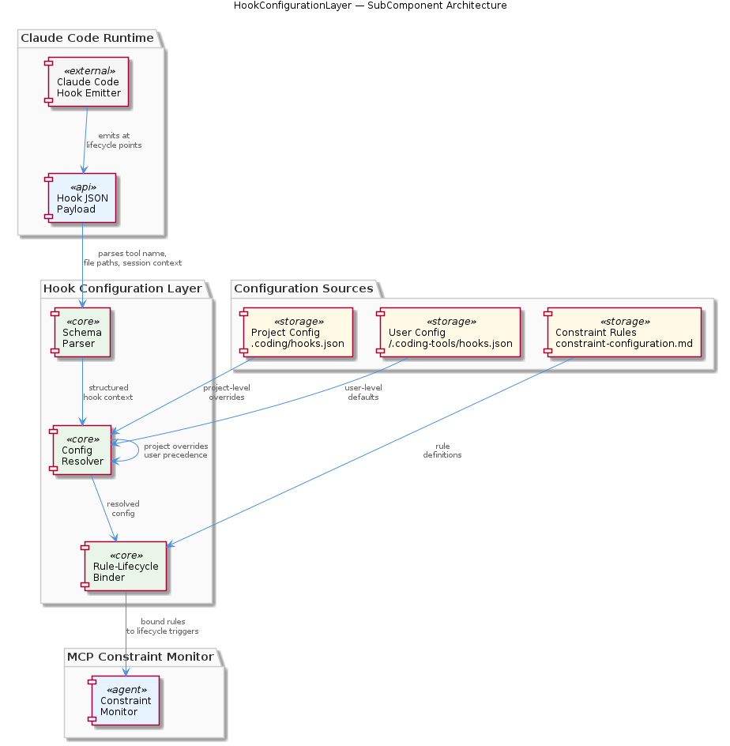
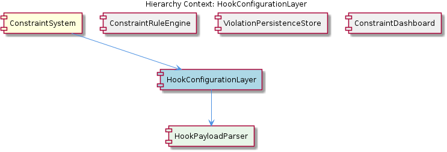

# HookConfigurationLayer

**Type:** SubComponent

integrations/mcp-constraint-monitor/docs/constraint-configuration.md defines how constraint rules are expressed in config files, meaning the hook configuration layer serves as the binding point between rule definitions and lifecycle trigger points

# HookConfigurationLayer

## What It Is

The HookConfigurationLayer is a SubComponent of the ConstraintSystem, residing within the `integrations/mcp-constraint-monitor/` integration package. It functions as the **binding point** between two distinct concerns: the constraint rule definitions (expressed in configuration files as documented in `integrations/mcp-constraint-monitor/docs/constraint-configuration.md`) and the lifecycle trigger points at which those rules must be evaluated. In other words, it is the component that answers the question: *given a hook event from Claude Code, which constraints apply, and what context is needed to evaluate them?*

Rather than being purely a configuration reader or purely a payload processor, the HookConfigurationLayer occupies the seam between configuration resolution and runtime execution. It must understand both the shape of incoming hook events and the shape of configured rules, translating between the two so the ConstraintRuleEngine can perform actual evaluation without needing to concern itself with either config file precedence or payload parsing mechanics.

## Architecture and Design

The most consequential design decision visible in the observations is the **dual-level configuration resolution model** described in `integrations/mcp-constraint-monitor/README.md`. Configuration is resolved from two locations:

- **User-level**: `~/.coding-tools/hooks.json` — a global baseline applicable across all projects
- **Project-level**: `.coding/hooks.json` — a per-project override that takes explicit precedence

This precedence model (project overrides user) reflects a deliberate trade-off: it prioritizes local specificity over global consistency. A project can tighten or loosen constraints relative to the user's default posture without requiring changes to the shared user-level config. The architectural implication is that the HookConfigurationLayer must perform a **merge or override resolution pass** at initialization time, producing an effective configuration that downstream components — particularly the ConstraintRuleEngine — consume without needing awareness of where rules originated.

The relationship between HookConfigurationLayer and its child component HookPayloadParser reveals a clean separation of concerns: parsing the raw hook event is delegated entirely to HookPayloadParser, while the configuration layer focuses on rule binding and context assembly. This keeps the JSON schema parsing logic (governed by `integrations/mcp-constraint-monitor/docs/CLAUDE-CODE-HOOK-FORMAT.md`) isolated from configuration resolution logic, making each independently testable and replaceable.

## Implementation Details

The HookPayloadParser child component is responsible for deserializing the JSON payloads that Claude Code emits at each hook lifecycle point (pre-tool, post-tool, and related phases). The authoritative schema for these payloads is documented in `integrations/mcp-constraint-monitor/docs/CLAUDE-CODE-HOOK-FORMAT.md`, which specifies the fields available at each lifecycle stage — including tool name, file paths involved, and session context. The HookConfigurationLayer consumes the parsed output of HookPayloadParser to perform its core function: determining which configured constraint rules are relevant to the current hook event.

The binding logic that `constraint-configuration.md` implies works roughly as follows: constraint rules are defined with conditions that reference tool names, file path patterns, or session attributes. When a hook fires, the HookConfigurationLayer matches the structured payload fields (extracted by HookPayloadParser) against the effective rule set (resolved from the dual-level config) to produce a scoped set of constraints for the ConstraintRuleEngine to evaluate. This means the HookConfigurationLayer is stateful with respect to configuration (it holds the resolved effective config) but stateless with respect to individual hook events (each event is processed independently).

No code symbols were identified in the current analysis, which means the specific class names, function signatures, and internal data structures of the HookConfigurationLayer are not yet observable. The implementation details described here are inferred from the documentation and schema contracts in the referenced files.

## Integration Points

The HookConfigurationLayer's primary upstream dependency is Claude Code's native hook mechanism itself — specifically the JSON payloads defined in `CLAUDE-CODE-HOOK-FORMAT.md`. This document functions as an external contract: if Claude Code changes its hook payload schema, HookPayloadParser (and by extension the HookConfigurationLayer) must adapt.

Downstream, the HookConfigurationLayer feeds directly into the ConstraintRuleEngine sibling component. The ConstraintRuleEngine, which uses semantic (meaning-aware) constraint detection as described in `integrations/mcp-constraint-monitor/docs/semantic-constraint-detection.md`, relies on the HookConfigurationLayer to have already resolved the applicable rules and extracted the relevant context from the payload. This division means the ConstraintRuleEngine need not parse config files or hook payloads — it receives a pre-bound, ready-to-evaluate input.

The HookConfigurationLayer does not directly interact with ViolationPersistenceStore or ConstraintDashboard. Violations that the ConstraintRuleEngine identifies flow to ViolationPersistenceStore for durable storage, and surface eventually to ConstraintDashboard (architecturally separated in `integrations/mcp-constraint-monitor/dashboard/`). The HookConfigurationLayer's responsibility ends when it has bound rule context to a hook event and handed it off.

Within the parent ConstraintSystem, the HookConfigurationLayer sits at the **entry point of every constraint evaluation cycle**: no constraint check can occur without a hook event being parsed and matched to a configuration, making this component a single point of coupling between the external Claude Code environment and the internal constraint evaluation machinery.

## Usage Guidelines

**Configuration file placement is load-bearing.** Developers working on projects that integrate the ConstraintSystem must understand that placing a `.coding/hooks.json` at the project root will fully override the user-level configuration for any keys it defines. There is no deep merge by default implied by the "overrides" language in the README — developers should treat the project-level config as taking responsibility for any constraints it mentions, rather than assuming user-level fallbacks remain active for undefined keys.

**The hook payload schema is an external contract.** Because `CLAUDE-CODE-HOOK-FORMAT.md` documents a schema emitted by Claude Code (an external tool), changes to that schema are not within the control of this codebase. Any upgrade to Claude Code that alters hook payload structure must be reflected in HookPayloadParser before the HookConfigurationLayer can correctly bind rules to events. Treating `CLAUDE-CODE-HOOK-FORMAT.md` as the single source of truth for payload structure — rather than inferring schema from runtime observation — is the correct discipline here.

**Rule definitions must align with payload fields.** Since the HookConfigurationLayer binds constraint rules (from `constraint-configuration.md`) to hook payloads (from `CLAUDE-CODE-HOOK-FORMAT.md`), rules that reference fields not present in the payload at a given lifecycle point will silently fail to match or trigger errors. Developers authoring constraint configurations should cross-reference both documents to ensure the fields they condition on are actually available at the lifecycle points where their rules are intended to fire.

## Hierarchy Context

### Parent
- [ConstraintSystem](./ConstraintSystem.md) -- The ConstraintSystem is a monitoring and enforcement layer that validates code actions and file operations against configured rules during Claude Code sessions. It operates through a hook-based architecture where constraint checks are triggered at key lifecycle points (pre-tool, post-tool, etc.) and violations are captured, persisted, and surfaced to dashboards. The system integrates with Claude Code's native hook mechanism via configuration files at user-level (~/.coding-tools/hooks.json) and project-level (.coding/hooks.json), with project config overriding user config.

### Children
- [HookPayloadParser](./HookPayloadParser.md) -- integrations/mcp-constraint-monitor/docs/CLAUDE-CODE-HOOK-FORMAT.md documents the exact JSON schema Claude Code emits at each hook lifecycle point, serving as the authoritative contract for payload parsing

### Siblings
- [ConstraintRuleEngine](./ConstraintRuleEngine.md) -- integrations/mcp-constraint-monitor/docs/semantic-constraint-detection.md describes a semantic layer for detecting constraint violations that uses meaning-aware matching rather than literal rule comparison
- [ViolationPersistenceStore](./ViolationPersistenceStore.md) -- integrations/mcp-constraint-monitor/README.md describes violations being persisted and surfaced to dashboards, implying a durable store separate from in-memory hook execution state
- [ConstraintDashboard](./ConstraintDashboard.md) -- integrations/mcp-constraint-monitor/dashboard/README.md is a dedicated sub-directory README, indicating the dashboard is architecturally separated from the core constraint engine

---

*Generated from 3 observations*
