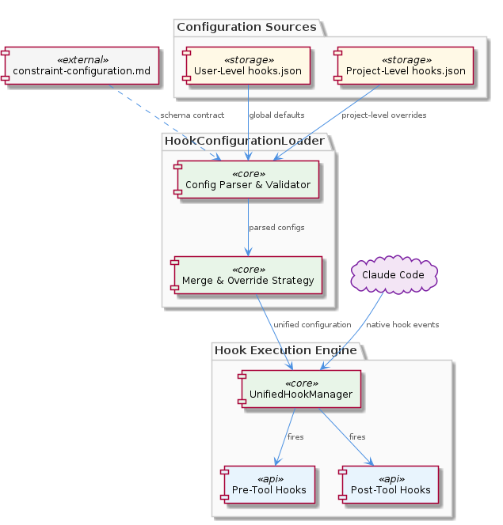
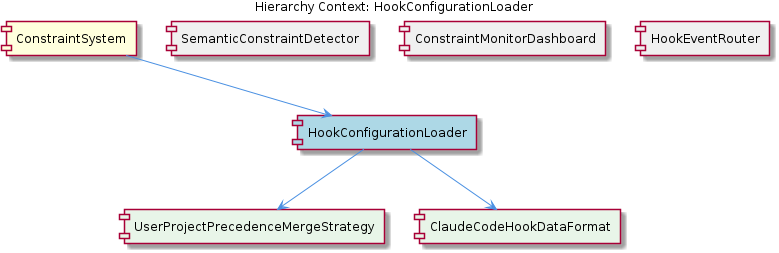

# HookConfigurationLoader

**Type:** SubComponent

The two-level configuration model (user-level and project-level hooks.json) is documented in integrations/mcp-constraint-monitor/README.md, establishing a clear precedence/merge strategy between global and per-project rules

# HookConfigurationLoader — Technical Insight Document

## What It Is

The `HookConfigurationLoader` is a SubComponent of the `ConstraintSystem` responsible for discovering, parsing, and merging hook configuration files that drive the constraint monitoring and enforcement subsystem. Its behavioral contract and configuration model are documented across two key references within the `integrations/mcp-constraint-monitor/` integration: the top-level `README.md` (which establishes the two-level configuration model) and `docs/constraint-configuration.md` (which defines the constraint configuration schema that the loader must parse and validate).

Operationally, the loader resolves configuration from two well-known sources: a user-level file at `~/.coding-tools/hooks.json` that acts as a global baseline applicable to all Claude Code sessions, and a project-level file at `.coding/hooks.json` that contains per-project rules. These two sources are combined according to a documented precedence and merge strategy, producing the unified configuration object consumed by downstream hook machinery.

Because no code symbols are catalogued for this SubComponent, the authoritative descriptions live in the README and `constraint-configuration.md` documentation, which together serve as the specification the loader implements.

## Architecture and Design

The architectural approach is a layered configuration resolver sitting at the boundary between the file system and the runtime hook subsystem. The design follows a classic *cascading configuration* pattern: a global/user layer provides defaults, and a project layer can augment or override those defaults. This is implemented through the child component `UserProjectPrecedenceMergeStrategy`, which encapsulates the precedence rules between `~/.coding-tools/hooks.json` and `.coding/hooks.json`. By isolating the merge semantics in its own sub-entity, the loader keeps file discovery and parsing concerns separate from the policy of how layers combine.

A second child component, `ClaudeCodeHookDataFormat`, defines the authoritative schema for the hook event envelope itself — fully documented in `integrations/mcp-constraint-monitor/docs/CLAUDE-CODE-HOOK-FORMAT.md`. This separation matters because the loader is not only producing configuration for the constraint engine; it must also produce configuration that is compatible with the data envelope Claude Code emits at runtime. The pairing of `UserProjectPrecedenceMergeStrategy` and `ClaudeCodeHookDataFormat` cleanly divides "how do we combine sources" from "what shape must the result take."

Within the broader `ConstraintSystem`, the loader is the first link in a chain that includes sibling components `HookEventRouter`, `SemanticConstraintDetector`, and `ConstraintMonitorDashboard`. The loader's output feeds the unified hook manager, which in turn dispatches into the `HookEventRouter` for individual pre-tool, post-tool, startup, and shutdown events. This means configuration loading is a strict prerequisite: no hooks can fire until the loader has resolved a valid, merged configuration tree.

## Implementation Details

While no specific code symbols are exposed for `HookConfigurationLoader`, the observations make the implementation contract explicit. The loader must:

1. **Discover** configuration files at the two canonical paths — `~/.coding-tools/hooks.json` (user level) and `.coding/hooks.json` (project level).
2. **Parse** each file according to the constraint configuration schema documented in `integrations/mcp-constraint-monitor/docs/constraint-configuration.md`.
3. **Validate** that parsed content conforms to the schema, since the loader is the gatekeeper before configuration enters the runtime hook manager.
4. **Merge** the two layers via the `UserProjectPrecedenceMergeStrategy`, applying project-level entries on top of user-level defaults.
5. **Expose** the unified result to the hook manager in a form aligned with the `ClaudeCodeHookDataFormat` schema so downstream components can correlate configuration entries with incoming hook events.

The two child components serve as named seams in the implementation. `UserProjectPrecedenceMergeStrategy` is the locus for any future evolution in merge semantics — for example, whether arrays of constraints concatenate or replace, or whether project-level disablement can suppress user-level rules. `ClaudeCodeHookDataFormat` anchors the loader to the same hook envelope used by the sibling `HookEventRouter`, ensuring the two never drift.

## Integration Points

The loader has three principal integration surfaces. **Upstream**, it integrates with the file system at the two documented paths and with the schema described in `docs/constraint-configuration.md`. Any tooling that writes or generates these files — whether manually edited by users or produced by configuration UIs — must conform to that schema for the loader to accept the input.

**Downstream**, the loader feeds the unified hook manager that intercepts Claude Code's native hook events. This makes it a hard dependency of every sibling within the `ConstraintSystem`: the `HookEventRouter` cannot route events without a configuration to consult, the `SemanticConstraintDetector` (documented in `integrations/mcp-constraint-monitor/docs/semantic-constraint-detection.md` and `semantic-detection-design.md`) cannot apply semantic rules without knowing which constraints to evaluate, and the `ConstraintMonitorDashboard` (the self-contained UI sub-project under `integrations/mcp-constraint-monitor/dashboard/`) cannot display rule metadata without a loaded configuration.

**Laterally**, the loader's `ClaudeCodeHookDataFormat` child shares its schema reference (`docs/CLAUDE-CODE-HOOK-FORMAT.md`) with the `HookEventRouter` sibling, which must parse the same envelope for each hook type. This shared format is what allows configuration entries loaded at startup to be matched against runtime hook events by the router.

## Usage Guidelines

Developers integrating with or modifying `HookConfigurationLoader` should observe several conventions. First, treat `~/.coding-tools/hooks.json` as a *baseline* — rules placed there apply across all projects unless explicitly overridden by a project's `.coding/hooks.json`. This precedence relationship is described in the README and enforced by `UserProjectPrecedenceMergeStrategy`; do not bypass it by reading either file directly from downstream components.

Second, any change to the configuration schema must be reflected in `integrations/mcp-constraint-monitor/docs/constraint-configuration.md`, which is the contract the loader implements. Schema drift between the documentation and the loader's validation logic will cause silent acceptance of invalid configurations or unjustified rejections of valid ones.

Third, because the loader is a prerequisite for all hook firing, its failure modes have system-wide impact. A malformed `hooks.json` should fail fast and visibly rather than degrade silently, since downstream siblings (`HookEventRouter`, `SemanticConstraintDetector`, `ConstraintMonitorDashboard`) assume the configuration they receive has already been validated.

**Architectural patterns identified:** Cascading/layered configuration resolution; separation of merge policy (`UserProjectPrecedenceMergeStrategy`) from data shape (`ClaudeCodeHookDataFormat`); schema-driven validation with external documentation as contract.

**Design decisions and trade-offs:** The choice of two fixed paths (`~/.coding-tools/hooks.json` and `.coding/hooks.json`) trades flexibility for predictability — users always know where to look, but multi-config-file scenarios are not supported. Isolating merge semantics in a dedicated child component trades a small amount of indirection for the ability to evolve precedence rules without touching the loader's discovery or parsing code.

**System structure insights:** The loader is a structural choke point within `ConstraintSystem` — every sibling depends on its output, but it depends on no sibling. This makes it an ideal place to centralize validation and an inappropriate place to introduce runtime coupling back into the hook pipeline.

**Scalability considerations:** Scalability is bounded by the size of the two configuration files rather than by traffic, since loading is a startup-time concern feeding a runtime hook manager. The merge strategy's complexity is the main per-load cost.

**Maintainability assessment:** Maintainability is supported by the explicit documentation anchors (`README.md`, `constraint-configuration.md`, `CLAUDE-CODE-HOOK-FORMAT.md`) that pin down each responsibility of the loader. The named child components provide clear extension points, and the schema-as-contract approach means future changes can be reviewed against documentation rather than reverse-engineered from code.

## Hierarchy Context

### Parent
- [ConstraintSystem](./ConstraintSystem.md) -- The ConstraintSystem is a constraint monitoring and enforcement subsystem that validates code actions and file operations against configured rules during Claude Code sessions. It operates through a hook-based architecture where Claude Code's native hook events (pre-tool, post-tool, startup, shutdown, etc.) are intercepted and routed through a unified hook manager that loads configuration from both user-level (~/.coding-tools/hooks.json) and project-level (.coding/hooks.json) sources. The system captures violations in real time, persists them for dashboard display, and supports semantic constraint detection beyond simple pattern matching.

### Children
- [UserProjectPrecedenceMergeStrategy](./UserProjectPrecedenceMergeStrategy.md) -- The two-level configuration model is explicitly documented in integrations/mcp-constraint-monitor/README.md, establishing that a user-level hooks.json acts as a global baseline that applies across all projects absent project-specific overrides.
- [ClaudeCodeHookDataFormat](./ClaudeCodeHookDataFormat.md) -- The format is fully documented in integrations/mcp-constraint-monitor/docs/CLAUDE-CODE-HOOK-FORMAT.md ('Claude Code Hook Data Format'), making it the authoritative schema reference the loader uses to interpret incoming hook payloads.

### Siblings
- [SemanticConstraintDetector](./SemanticConstraintDetector.md) -- Documented in integrations/mcp-constraint-monitor/docs/semantic-constraint-detection.md and semantic-detection-design.md, indicating the detection logic is substantial enough to warrant both a user-facing doc and an internal design doc
- [ConstraintMonitorDashboard](./ConstraintMonitorDashboard.md) -- Lives in integrations/mcp-constraint-monitor/dashboard/ with its own README.md, indicating it is a self-contained UI sub-project within the broader mcp-constraint-monitor integration
- [HookEventRouter](./HookEventRouter.md) -- Claude Code hook data format is documented in integrations/mcp-constraint-monitor/docs/CLAUDE-CODE-HOOK-FORMAT.md, defining the event envelope the router must parse for each hook type

---

*Generated from 4 observations*
