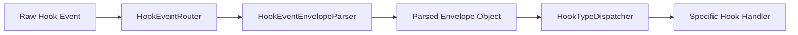

# HookEventEnvelopeParser

**Type:** Detail

The parent context states the document defines 'the event envelope the router must parse for each hook type,' implying the parser handles a shared outer wrapper structure common to all hook types rather than per-type-only schemas.

## What It Is  

**HookEventEnvelopeParser** is the dedicated parsing component that interprets the *event envelope* defined in the contract file  

```
integrations/mcp-constraint-monitor/docs/CLAUDE-CODE-HOOK-FORMAT.md
```  

The markdown document – titled **“Claude Code Hook Data Format”** – is the authoritative schema that describes the JSON (or similar) wrapper surrounding every hook payload that the **HookEventRouter** receives.  The parser lives conceptually inside the router (the parent component) and is the first step in the processing pipeline: it extracts the common envelope fields (e.g., `hookId`, `timestamp`, `type`, `payload`) and produces a normalized in‑memory representation that downstream components (most notably **HookTypeDispatcher**) can work with.  

Because the repository does not expose the concrete source file for the parser, the analysis is based on the documented contract and the explicit dependency declared by **HookEventRouter**.  The parser therefore implements a *single, shared* outer‑wrapper schema that is common to *all* hook types, rather than a per‑type schema.  

---

## Architecture and Design  

The architecture follows a classic **router‑parser‑dispatcher** pipeline:

1. **HookEventRouter** receives raw hook events (e.g., HTTP requests, message queue entries).  
2. It delegates the first‑level decoding to **HookEventEnvelopeParser**, which knows the envelope contract from *CLAUDE-CODE-HOOK-FORMAT.md*.  
3. After the envelope is parsed, the router hands the extracted `type` field to **HookTypeDispatcher**, which routes the inner payload to the appropriate handler for that specific hook type.

This design isolates **parsing concerns** from **routing concerns**, enabling each component to evolve independently. The parser acts as a **boundary component** that enforces the contract, while the dispatcher embodies a **strategy‑like** selection mechanism based on the `type` attribute.  

The only explicit design pattern we can confirm is the **Parser** pattern (a focused component that transforms external data into an internal model).  The surrounding router/dispatcher relationship hints at a **Chain of Responsibility**‑style flow, where each stage passes control to the next after completing its responsibility.  

A high‑level diagram (Mermaid) illustrates the interaction:



---

## Implementation Details  

While no source symbols are listed, the implementation can be inferred from the contract file and the component relationships:

* **Schema Alignment** – The parser reads the **Claude Code Hook Data Format** markdown, which enumerates required envelope fields (e.g., `hookId`, `eventTime`, `hookType`, `payload`).  The parser likely uses a schema‑validation library (JSON Schema, Avro, etc.) to guarantee that incoming events conform to this specification before further processing.

* **Normalization** – After validation, the parser builds a lightweight domain object (perhaps `HookEnvelope`) that exposes strongly‑typed properties.  This object abstracts away raw JSON quirks (e.g., stringified timestamps) and presents a consistent API to the router.

* **Error Handling** – Given the contract’s role as a gatekeeper, the parser must surface parsing errors back to **HookEventRouter**.  The router can then decide whether to reject the event, log a diagnostic, or trigger a fallback path.

* **Extensibility** – Because the envelope is *shared* across all hook types, adding a new hook type does **not** require changes to the parser; only the dispatcher and downstream handlers need to be extended.  This separation reduces the parser’s change surface.

* **Statelessness** – The parser is expected to be stateless – it receives an event, returns a parsed envelope, and holds no mutable internal state.  This enables safe reuse across concurrent router instances and simplifies testing.

---

## Integration Points  

1. **HookEventRouter (Parent)** – The router instantiates or injects **HookEventEnvelopeParser**.  The router’s documentation explicitly cites *CLAUDE-CODE-HOOK-FORMAT.md* as the source of truth for parsing, making the parser a mandatory dependency.

2. **HookTypeDispatcher (Sibling)** – After the parser produces the envelope, the router forwards the envelope (or at least the `hookType` field) to the dispatcher.  The dispatcher then selects the appropriate handler based on the type value extracted by the parser.

3. **External Event Sources** – The parser ultimately consumes data that originates from external systems (e.g., Claude Code webhook callbacks, message bus events).  Its contract ensures that any upstream changes to the envelope format must be reflected in the markdown spec, otherwise parsing will fail.

4. **Logging / Monitoring** – Although not explicitly mentioned, the parser’s validation step is a natural place to emit metrics (e.g., “envelope parse failures”) that feed into the broader observability stack of the **mcp-constraint-monitor** integration.

---

## Usage Guidelines  

* **Never bypass the parser** – All hook events must pass through **HookEventEnvelopeParser** before any business logic runs.  Directly accessing raw payloads risks schema violations and undermines the contract enforced by *CLAUDE-CODE-HOOK-FORMAT.md*.

* **Treat the parsed envelope as immutable** – Since the parser is designed to be stateless, downstream components (router, dispatcher, handlers) should not mutate the envelope object.  If transformation is needed, create a new data structure.

* **Update the contract first** – When a change to the envelope format is required (e.g., adding a new field), modify the markdown file *CLAUDE-CODE-HOOK-FORMAT.md* before adjusting any validation logic.  This ensures the contract remains the single source of truth.

* **Handle parsing errors explicitly** – The router should capture any exception or error code returned by the parser and decide on a consistent failure path (e.g., reject the webhook, send a dead‑letter event, or log for manual review).

* **Unit‑test against the spec** – Tests for the parser should load the markdown schema and verify that both valid and intentionally malformed events are processed as expected.  This guards against drift between implementation and documentation.

---

### Architectural patterns identified  

1. **Parser pattern** – Dedicated component that translates external data into an internal model.  
2. **Chain of Responsibility (implicit)** – Event flows from router → parser → dispatcher → handler, each stage handling a distinct concern.  

### Design decisions and trade‑offs  

* **Single shared envelope** – Centralizing common fields in one envelope reduces duplication across hook types, simplifying validation and future extensions. The trade‑off is that any change to the envelope impacts *all* hook types, requiring careful coordination.  
* **Stateless parser** – Enables high concurrency and easy testing but means any contextual information (e.g., request metadata) must be passed explicitly rather than stored internally.  

### System structure insights  

* The **HookEventRouter** is the orchestration hub; it owns the parser and the dispatcher.  
* **HookEventEnvelopeParser** is a leaf component with a single responsibility: enforce the contract defined in *CLAUDE-CODE-HOOK-FORMAT.md*.  
* **HookTypeDispatcher** acts as a sibling that depends on the parser’s output to perform type‑based routing, illustrating a clean separation between *structural* parsing and *behavioral* dispatch.  

### Scalability considerations  

* Because the parser is stateless, it can be instantiated multiple times or shared across threads without contention, supporting high‑throughput webhook ingestion.  
* Validation against a schema can be computationally cheap; however, if the envelope grows large, consider caching compiled schema objects to avoid repeated parsing overhead.  

### Maintainability assessment  

* **High maintainability** – The contract lives in a single markdown file, and the parser’s sole purpose is to enforce that contract.  Adding new hook types does not affect the parser, limiting the surface area for change.  
* **Risk of drift** – The biggest maintenance risk is divergence between the markdown spec and the parser implementation.  Enforcing a build‑time check (e.g., schema generation step) would mitigate this.  
* **Clear boundaries** – With the router, parser, and dispatcher each owning distinct responsibilities, developers can locate bugs or add features without navigating tangled code.  

---  

*This insight document captures the current design of **HookEventEnvelopeParser** as derived from the available observations. It should serve as a reference for future development, testing, and architectural reviews.*


## Hierarchy Context

### Parent
- [HookEventRouter](./HookEventRouter.md) -- Claude Code hook data format is documented in integrations/mcp-constraint-monitor/docs/CLAUDE-CODE-HOOK-FORMAT.md, defining the event envelope the router must parse for each hook type

### Siblings
- [HookTypeDispatcher](./HookTypeDispatcher.md) -- The parent context explicitly describes HookEventRouter as handling 'each hook type,' confirming that multiple distinct hook types exist and must be dispatched separately — this multiplicity is the dispatcher's reason for existence.


---

*Generated from 3 observations*
