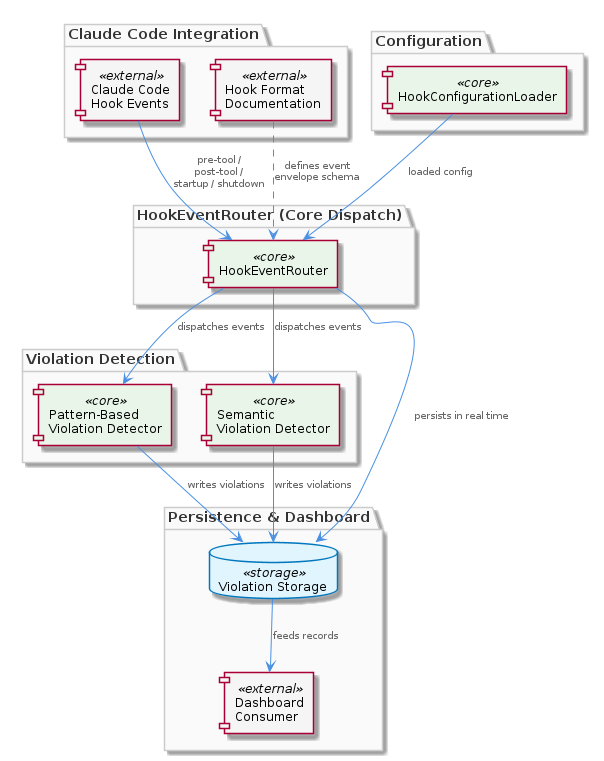
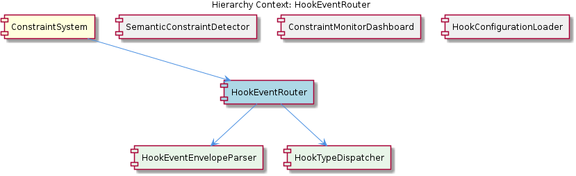

# HookEventRouter

**Type:** SubComponent

Supports at minimum pre-tool and post-tool events plus startup/shutdown lifecycle hooks, as described in the ConstraintSystem parent component description and reflected by the CLAUDE-CODE-HOOK-FORMAT.md doc

# HookEventRouter — Technical Insight Document

## What It Is

The `HookEventRouter` is a SubComponent of the `ConstraintSystem`, residing within the `integrations/mcp-constraint-monitor/` integration. It functions as the central dispatch point that receives raw hook events emitted by Claude Code and routes them through the constraint monitoring pipeline. The contract it operates against — the shape of the incoming hook payloads — is formally specified in `integrations/mcp-constraint-monitor/docs/CLAUDE-CODE-HOOK-FORMAT.md` ("Claude Code Hook Data Format"), which serves as the authoritative schema document for every event the router handles.

At minimum, the router supports pre-tool and post-tool events as well as the startup and shutdown lifecycle hooks described in the parent `ConstraintSystem` component. These four event categories represent distinct points in the Claude Code session lifecycle: tool execution boundaries (pre/post) and session boundaries (startup/shutdown). The router is the single entry point that normalizes, classifies, and forwards these heterogeneous events to the appropriate downstream handlers.

Beyond simple forwarding, the router carries a real-time persistence responsibility: violations detected during routing must be written to durable storage *before* control is returned to Claude Code. This synchronous persistence guarantees that the `ConstraintMonitorDashboard` sibling component always has a complete, up-to-the-moment record of detected violations to display.

## Architecture and Design

The `HookEventRouter` is composed of two child SubComponents — `HookEventEnvelopeParser` and `HookTypeDispatcher` — which together implement a clean two-stage pipeline: **parse, then dispatch**. This separation reflects a deliberate architectural decision to decouple the *shape* of incoming data from the *behavior* triggered by it.

The `HookEventEnvelopeParser` is responsible for interpreting the envelope schema defined in `CLAUDE-CODE-HOOK-FORMAT.md`. By isolating envelope parsing in its own subcomponent, the router localizes the impact of any future changes to Claude Code's hook payload format — only the parser needs to evolve, while the dispatcher and downstream consumers remain stable. The `HookTypeDispatcher`, in turn, exists explicitly because multiple distinct hook types (pre-tool, post-tool, startup, shutdown, and potentially more) require separate handling paths. The multiplicity of hook types is the dispatcher's *raison d'être*, as reflected in the parent context's description of the router handling "each hook type."

The overall pattern is best characterized as a **front-controller dispatch** architecture: a single ingress point (`HookEventRouter`) parses the request, classifies it, and delegates to type-specific logic. This is a well-suited choice for a system that must uniformly observe every hook event for monitoring and persistence purposes while still applying differentiated logic per hook type.

## Implementation Details

Operationally, the router executes a fixed sequence for each inbound event. First, the `HookEventEnvelopeParser` consumes the raw hook payload and produces a typed, validated representation according to the schema in `integrations/mcp-constraint-monitor/docs/CLAUDE-CODE-HOOK-FORMAT.md`. Any malformed envelope is rejected here, before any downstream component is invoked, ensuring detectors and persistence layers only ever see well-formed data.

Second, the `HookTypeDispatcher` inspects the parsed event's type field and routes it to the corresponding handler chain. Pre-tool and post-tool events flow into the constraint detection pipeline, while startup and shutdown events invoke lifecycle handlers. The router connects the parsed event with two distinct detection mechanisms: **pattern-based detectors** (simple rule matching) and **semantic detectors** (more sophisticated analysis provided by the `SemanticConstraintDetector` sibling component, documented in `semantic-constraint-detection.md` and `semantic-detection-design.md`).

Third — and critically — when any detector reports a violation, the router persists the violation record synchronously, before returning control to Claude Code. This blocking write is what makes real-time dashboard consumption possible without race conditions or eventual-consistency gaps. The configuration that drives which constraints are evaluated comes from the `HookConfigurationLoader` sibling, which merges user-level (`~/.coding-tools/hooks.json`) and project-level (`.coding/hooks.json`) configuration before handing the resulting ruleset to the router.

## Integration Points

The router sits at the intersection of four collaborating entities. Upstream, it ingests events emitted by Claude Code, with the envelope contract specified in `CLAUDE-CODE-HOOK-FORMAT.md`. Configuration-wise, it consumes the merged ruleset produced by `HookConfigurationLoader`, inheriting the two-level precedence model (user-level then project-level `hooks.json` files) documented in `integrations/mcp-constraint-monitor/README.md`.

Downstream, the router fans out to two detector families: the pattern-based detectors (presumably co-located within the same integration) and the `SemanticConstraintDetector`, which performs more advanced constraint analysis. The router does not implement detection itself — it orchestrates these detectors and consolidates their outputs. After detection, the router writes violations into a durable store, and that store is the read source for the `ConstraintMonitorDashboard` sub-project (`integrations/mcp-constraint-monitor/dashboard/`), enabling the dashboard's live view.

Internally, the router exposes its two children — `HookEventEnvelopeParser` and `HookTypeDispatcher` — as a natural seam: the parser interfaces with the Claude Code hook format spec, while the dispatcher interfaces with the per-type handler implementations. As a member of the `ConstraintSystem`, the router is the binding agent that makes the system's hook-based architecture coherent end-to-end.

## Usage Guidelines

Developers extending or maintaining this component should respect the parse-then-dispatch separation. New hook types added by Claude Code should be reflected first in `CLAUDE-CODE-HOOK-FORMAT.md`, then implemented in `HookEventEnvelopeParser`, and finally given a dispatch branch in `HookTypeDispatcher`. This order preserves the documentation-first contract that the parser depends on.

When introducing new detection logic, prefer adding it to the appropriate detector family (pattern-based or semantic, via `SemanticConstraintDetector`) rather than embedding logic inside the router. The router's job is dispatch and persistence, not detection — keeping it free of business rules preserves its role as a stable orchestration point.

Because violation persistence is synchronous and blocks the return to Claude Code, contributors must be mindful of latency in the write path. Slow storage operations directly impact Claude Code's perceived responsiveness during tool invocations. Any change that introduces additional work in the post-detection persistence step should be evaluated against this real-time guarantee.

Finally, configuration changes should always flow through `HookConfigurationLoader` rather than being hard-coded into the router. This keeps the user-level/project-level precedence semantics intact and ensures that both global defaults and per-project overrides behave consistently across all hook types the router dispatches.

---

### Summary Findings

1. **Architectural patterns identified:** Front-controller dispatch, parse-then-dispatch pipeline, composition over inheritance (router composed of `HookEventEnvelopeParser` + `HookTypeDispatcher`), and a documentation-driven contract (`CLAUDE-CODE-HOOK-FORMAT.md`) between the external producer and the parser.

2. **Design decisions and trade-offs:** Synchronous violation persistence trades latency for real-time dashboard consistency. Separating envelope parsing from dispatch trades a small amount of indirection for strong resilience to upstream format changes. Externalizing detection into pattern-based and semantic detectors keeps the router lean but introduces an orchestration responsibility.

3. **System structure insights:** The router is the connective tissue of the `ConstraintSystem`. Its siblings (`HookConfigurationLoader`, `SemanticConstraintDetector`, `ConstraintMonitorDashboard`) each occupy a distinct concern — configuration, detection, presentation — while the router handles ingress, classification, and persistence.

4. **Scalability considerations:** The blocking write before returning to Claude Code is the principal scalability constraint. Throughput is bounded by storage latency. Horizontal scaling is not naturally supported by the current design since events originate from a single Claude Code session; vertical optimization of the persistence path is the primary lever.

5. **Maintainability assessment:** Maintainability is strong due to clear separation of concerns: envelope schema changes are localized to `HookEventEnvelopeParser`, new hook types are localized to `HookTypeDispatcher`, and detection evolution is localized to the detector siblings. The authoritative schema doc and the two-level configuration model further reduce the surface area for accidental coupling.

## Hierarchy Context

### Parent
- [ConstraintSystem](./ConstraintSystem.md) -- The ConstraintSystem is a constraint monitoring and enforcement subsystem that validates code actions and file operations against configured rules during Claude Code sessions. It operates through a hook-based architecture where Claude Code's native hook events (pre-tool, post-tool, startup, shutdown, etc.) are intercepted and routed through a unified hook manager that loads configuration from both user-level (~/.coding-tools/hooks.json) and project-level (.coding/hooks.json) sources. The system captures violations in real time, persists them for dashboard display, and supports semantic constraint detection beyond simple pattern matching.

### Children
- [HookEventEnvelopeParser](./HookEventEnvelopeParser.md) -- The event envelope schema is formally specified in integrations/mcp-constraint-monitor/docs/CLAUDE-CODE-HOOK-FORMAT.md ('Claude Code Hook Data Format'), which serves as the authoritative contract this parser must implement.
- [HookTypeDispatcher](./HookTypeDispatcher.md) -- The parent context explicitly describes HookEventRouter as handling 'each hook type,' confirming that multiple distinct hook types exist and must be dispatched separately — this multiplicity is the dispatcher's reason for existence.

### Siblings
- [SemanticConstraintDetector](./SemanticConstraintDetector.md) -- Documented in integrations/mcp-constraint-monitor/docs/semantic-constraint-detection.md and semantic-detection-design.md, indicating the detection logic is substantial enough to warrant both a user-facing doc and an internal design doc
- [ConstraintMonitorDashboard](./ConstraintMonitorDashboard.md) -- Lives in integrations/mcp-constraint-monitor/dashboard/ with its own README.md, indicating it is a self-contained UI sub-project within the broader mcp-constraint-monitor integration
- [HookConfigurationLoader](./HookConfigurationLoader.md) -- The two-level configuration model (user-level and project-level hooks.json) is documented in integrations/mcp-constraint-monitor/README.md, establishing a clear precedence/merge strategy between global and per-project rules

---

*Generated from 4 observations*
