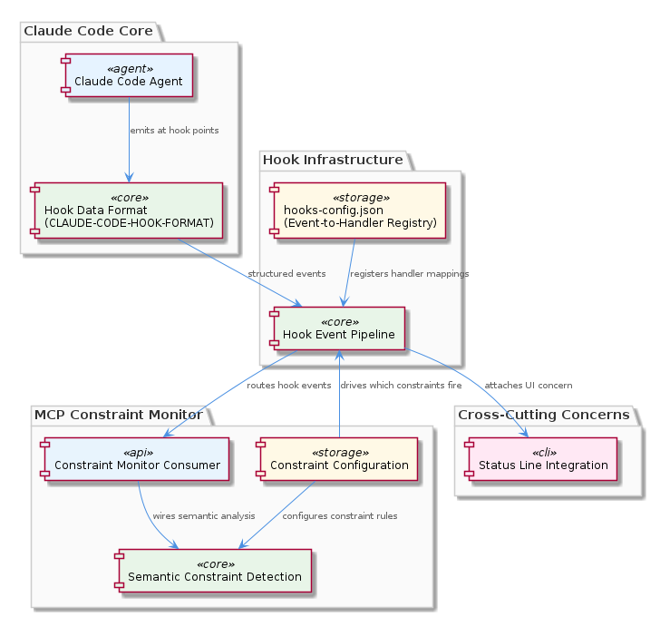
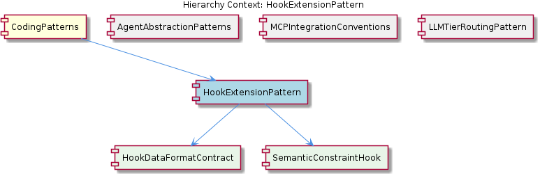

# HookExtensionPattern

**Type:** SubComponent

integrations/mcp-constraint-monitor/docs/semantic-constraint-detection.md and docs/semantic-detection-design.md describe how semantic analysis is wired into the hook pipeline without modifying core agent code, exemplifying the cross-cutting injection intent

## What It Is

HookExtensionPattern is a cross-cutting concern injection mechanism implemented primarily through `hooks-config.json` and the hook infrastructure within `integrations/mcp-constraint-monitor/`. It enables attaching behavior—constraint monitoring, semantic analysis, UI status display—to agent hook points without modifying core agent code. The authoritative data contract is specified in `integrations/mcp-constraint-monitor/docs/CLAUDE-CODE-HOOK-FORMAT.md`.

## Architecture and Design

The pattern follows an inversion-of-control approach: agents emit hook events with a defined payload structure (HookDataFormatContract), and external handlers registered in `hooks-config.json` consume those events. This registry acts as the sole mapping between hook points and handler implementations, meaning new cross-cutting concerns require only a configuration entry and a handler—no changes to existing agent code.

This complements the sibling MCPIntegrationConventions by leveraging the same integration directory structure, and respects the parent CodingPatterns' lifecycle conventions—hooks fire during agent execution phases established by the lazy-initialization pattern documented in AgentAbstractionPatterns.

## Implementation Details

The hook pipeline has three layers:

1. **Data contract** (HookDataFormatContract): `CLAUDE-CODE-HOOK-FORMAT.md` specifies the exact JSON structure emitted at hook points, establishing producer/consumer decoupling.

2. **Handler registration**: `hooks-config.json` maps event names to handler implementations. Constraint behavior is driven by external configuration (`integrations/mcp-constraint-monitor/docs/constraint-configuration.md`), not hardcoded logic.

3. **Concrete hooks**: SemanticConstraintHook (`integrations/mcp-constraint-monitor/docs/semantic-constraint-detection.md`) wires semantic analysis into the pipeline. Status-line display (`integrations/mcp-constraint-monitor/docs/status-line-integration.md`) attaches UI concerns similarly.

## Integration Points

- **Agents**: Emit hook events per the data format contract; no awareness of consumers
- **Configuration**: `hooks-config.json` and `constraint-configuration.md` drive all wiring externally
- **MCP constraint monitor**: Primary consumer, housing both semantic detection and status-line hooks
- **Sibling LLMTierRoutingPattern**: Could potentially be invoked via hooks for model selection at constraint evaluation time

## Usage Guidelines

To add a new cross-cutting concern: define a handler, register it in `hooks-config.json`, and ensure payloads conform to `CLAUDE-CODE-HOOK-FORMAT.md`. Never embed hook-consumer logic inside agent code. Configuration-driven activation (per `constraint-configuration.md`) is mandatory—behavior must be toggleable without code changes.

## Hierarchy Context

### Parent
- [CodingPatterns](./CodingPatterns.md) -- [LLM] Agent Lazy-Initialization Pattern: Across the Coding project's agent implementations, a consistent lazy-initialization idiom is applied where LLM client setup is deferred until actual execution rather than performed at construction time. This pattern is documented in docs/puml/agent-integration-flow.puml and docs/puml/agent-abstraction-architecture.puml. The motivation is to avoid paying the cost of LLM connection setup (which may involve network calls, credential validation, and model loading) when an agent object is instantiated—particularly important in systems where many agent types are registered but only a subset are invoked per workflow. A new developer working on an agent should expect a two-phase lifecycle: a lightweight constructor that stores configuration references, followed by an initialize() or setup() method (or equivalent lazy property) that establishes the actual LLM connection on first use. Violating this convention by eagerly connecting in the constructor would break the startup performance characteristics that the rest of the system assumes.

### Children
- [HookDataFormatContract](./HookDataFormatContract.md) -- integrations/mcp-constraint-monitor/docs/CLAUDE-CODE-HOOK-FORMAT.md is the authoritative specification for hook payload structure, titled 'Claude Code Hook Data Format'
- [SemanticConstraintHook](./SemanticConstraintHook.md) -- integrations/mcp-constraint-monitor/docs/semantic-constraint-detection.md documents the semantic detection hook behavior and its role in evaluating constraints at hook points

### Siblings
- [AgentAbstractionPatterns](./AgentAbstractionPatterns.md) -- docs/puml/agent-abstraction-architecture.puml documents the base agent interface enforcing the constructor/initialize() split, ensuring all concrete agent types adhere to the same lifecycle contract
- [MCPIntegrationConventions](./MCPIntegrationConventions.md) -- integrations/mcp-server-semantic-analysis/ follows the canonical MCP integration directory structure with subdirectories docs/architecture/, docs/api/, docs/installation/, and docs/configuration.md, establishing the expected layout new integrations must mirror
- [LLMTierRoutingPattern](./LLMTierRoutingPattern.md) -- integrations/mcp-server-semantic-analysis/docs/TIERED-MODEL-PROPOSAL.md documents the formal proposal for tiered model selection, establishing the rationale and design that llm-providers.yaml implements

---

*Generated from 5 observations*
