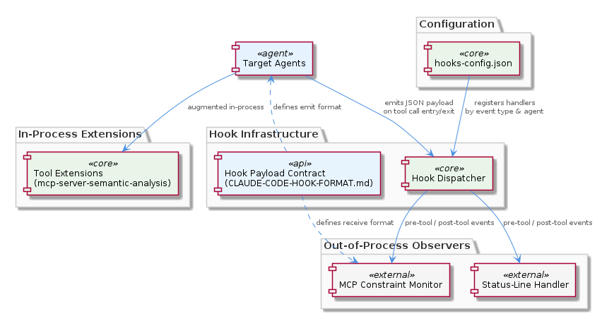
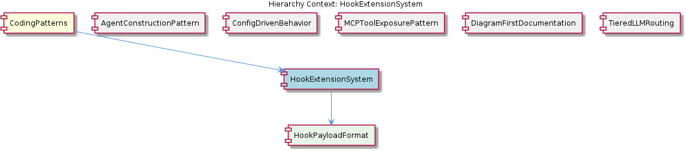

# HookExtensionSystem

**Type:** SubComponent

integrations/mcp-server-semantic-analysis/docs/architecture/tools.md describes Tool Extensions as the in-process complement to hooks, clarifying that hooks handle out-of-process observers while tool extensions handle in-process augmentation

# HookExtensionSystem — Technical Insight Document

## What It Is

The HookExtensionSystem is the project's primary extension mechanism for out-of-process observation and instrumentation of agent tool calls. It is anchored by three concrete artifacts: `config/hooks-config.json`, which registers hook handlers by event type and target agent; `integrations/mcp-constraint-monitor/docs/CLAUDE-CODE-HOOK-FORMAT.md`, which specifies the exact JSON payload contract emitted on each tool call entry and exit; and `integrations/mcp-constraint-monitor/docs/status-line-integration.md`, which demonstrates a concrete hook handler implementation. Together, these files define a contract-driven, config-registered observer system that allows cross-cutting concerns — constraint monitoring, status-line updates, and similar instrumentation — to be added without modifying agent source code.

As a child of CodingPatterns, the HookExtensionSystem is a concrete embodiment of the parent's **Externalized Configuration as Runtime Behavior Control** philosophy: handler registration occurs in `config/hooks-config.json` rather than through imperative wiring in TypeScript or Python. The system contains exactly one documented child, HookPayloadFormat, which is the canonical specification of the JSON envelope that flows between producers (agents) and consumers (hook handlers).

## Architecture and Design

The HookExtensionSystem implements an **observer pattern with externalized registration**. Agents emit lifecycle events — specifically `pre-tool` and `post-tool` events — at well-defined points in their tool-call lifecycle, and any number of handlers can subscribe to those events by being declared in `config/hooks-config.json`. This is fundamentally a publish-subscribe arrangement where the broker is the configuration file itself, and the message envelope is formalized in `CLAUDE-CODE-HOOK-FORMAT.md`.

A critical architectural distinction is drawn in `integrations/mcp-server-semantic-analysis/docs/architecture/tools.md`: hooks are the **out-of-process observer mechanism**, while Tool Extensions are the **in-process augmentation mechanism**. This separation of concerns is deliberate. Hooks are appropriate when an observer needs to react to tool activity without intervening in or modifying the call itself (e.g., logging, status reporting, monitoring). Tool Extensions are appropriate when behavior must be modified synchronously, in the same process and call stack. A developer choosing between the two should ask: "Do I need to change what the tool does, or do I just need to know that it happened?"

The architecture is **non-invasive by convention**. As `integrations/mcp-constraint-monitor/README.md` makes clear, the entire constraint enforcement subsystem operates as a hook consumer — meaning no agent code is aware of, or needs to be modified for, constraint monitoring to be added or removed. This is a strong architectural guarantee: extension mechanisms must be additive at the configuration layer, never invasive at the source layer.

## Implementation Details

The implementation centers on three artifacts working in concert. First, `config/hooks-config.json` serves as the registration manifest. New instrumentation is added by editing this file to declare a handler keyed by event type (`pre-tool` or `post-tool`) and target agent. This eliminates the alternative of inserting hook-invocation code into each agent — a single declarative entry suffices.

Second, `CLAUDE-CODE-HOOK-FORMAT.md` (which is the documentation backing the HookPayloadFormat child entity) specifies the exact JSON payload format that hooks emit on tool call entry and exit. This document is the canonical source of truth for any hook producer or consumer; treating it as anything less risks silent compatibility breakage when payload fields evolve. The format defines the contract surface between agents (producers) and monitors (consumers).

Third, concrete handler implementations such as the one described in `status-line-integration.md` show the pattern in practice: the status-line update feature is implemented **purely as a hook handler**, with no special coupling to the agents whose activity it reports. This is the canonical reference implementation a new developer should study when building a new handler — it demonstrates that even visible, user-facing features can be implemented entirely through the hook mechanism without touching agent code.

## Integration Points

The HookExtensionSystem integrates upward with its parent CodingPatterns by being a direct realization of the externalized-configuration philosophy that ConfigDrivenBehavior (a sibling) also exemplifies. Where ConfigDrivenBehavior uses `config/agent-profiles.json` to parameterize agents, HookExtensionSystem uses `config/hooks-config.json` to parameterize cross-cutting instrumentation. The two patterns are complementary: one configures what agents *are*, the other configures who *watches* them.

The system's most prominent downstream consumer is the constraint monitor at `integrations/mcp-constraint-monitor/`, whose entire architecture is predicated on being a hook consumer. This integration is loose by design — the monitor depends only on the JSON payload contract, not on agent internals. Similarly, the status-line subsystem integrates exclusively through the hook channel.

Relative to its siblings, HookExtensionSystem also relates to MCPToolExposurePattern: tools exposed via MCP (as in `integrations/code-graph-rag/`) and the hooks that observe their invocation operate on different planes — MCP defines how capabilities are exposed for invocation, while hooks define how those invocations are observed. The child entity HookPayloadFormat is the interface artifact that makes this loose coupling possible; any consumer that adheres to its specification can participate without further coordination.

## Usage Guidelines

When adding new cross-cutting functionality (logging, metrics, enforcement, UI updates tied to agent activity), developers should default to implementing it as a hook handler registered in `config/hooks-config.json` rather than modifying agent source. The status-line integration is the reference example to follow. If, however, the new functionality must synchronously alter tool behavior or return values, the correct mechanism is a Tool Extension as described in `tools.md`, not a hook.

Hook producers and consumers must conform strictly to the payload format in `CLAUDE-CODE-HOOK-FORMAT.md`. This file should be treated as the source of truth — changes to the payload shape are interface changes and should be coordinated across all consumers (notably the constraint monitor). New consumers should validate incoming payloads against this specification rather than assuming field presence.

Registration changes in `config/hooks-config.json` should specify both the event type (`pre-tool` or `post-tool`) and the target agent. This scoped registration allows handlers to be selectively activated, supporting per-agent instrumentation without global side effects. Because the registration is declarative and external, enabling or disabling a hook handler is a configuration change — not a code change — which makes incident response (e.g., disabling a noisy handler) fast and reviewable.

---

## Synthesis: Patterns, Trade-offs, and <USER_ID_REDACTED> Attributes

**Architectural patterns identified:** Observer/publish-subscribe with externalized broker (the config file), contract-first interface design (the JSON payload format as canonical specification), and separation of in-process vs. out-of-process extension planes (Tool Extensions vs. Hooks).

**Design decisions and trade-offs:** The decision to make hooks out-of-process observers means handlers cannot directly modify tool behavior — this is a deliberate trade-off favoring non-invasiveness and isolation over expressive power. The decision to register handlers in a config file rather than via decorators or imperative subscription trades discoverability (you must read the config to see what is hooked) for additive, code-free extensibility.

**System structure insights:** The system exhibits a clean three-layer structure — producers (agents emitting events), contract (HookPayloadFormat), and consumers (handlers like the constraint monitor and status-line updater). The contract is the load-bearing element; everything else can vary independently as long as the JSON format is honored.

**Scalability considerations:** New consumers can be added without modifying existing producers or other consumers, supporting linear growth in instrumentation. Because hooks are out-of-process observers, a misbehaving or slow handler should not block agent execution — though the observations do not detail the dispatch mechanism, this isolation is implied by the out-of-process classification.

**Maintainability assessment:** Maintainability is strong. The non-invasive convention means agent code remains free of instrumentation clutter; the declarative registration in `config/hooks-config.json` means changes are reviewable as configuration diffs; and the canonical payload specification provides a single point of coordination for cross-component changes. The principal maintenance risk is drift between the payload specification and actual emitted payloads — disciplined adherence to `CLAUDE-CODE-HOOK-FORMAT.md` as the source of truth is the mitigation.

## Hierarchy Context

### Parent
- [CodingPatterns](./CodingPatterns.md) -- [LLM] **Externalized Configuration as Runtime Behavior Control**: The project enforces a strict separation between behavior and code through a suite of JSON/YAML configuration files under config/. Files such as config/agent-profiles.json, config/health-verification-rules.json, config/llm-providers.yaml, config/knowledge-management.json, and config/hooks-config.json collectively replace what would otherwise be scattered hard-coded logic. A new developer should understand that adding a new agent profile, adjusting an LLM provider's model tier, or modifying a health rule does not require touching TypeScript or Python source files — only the relevant config file. This pattern means that operational changes (e.g., switching a task class from a lightweight to a heavyweight model, or disabling a health rule during an incident) are achievable at runtime or deploy time without code review cycles. The convention also implies that any new subsystem added to the project is expected to declare its configurable parameters in a corresponding config file rather than using environment variables alone or embedding defaults in source.

### Children
- [HookPayloadFormat](./HookPayloadFormat.md) -- Documented in integrations/mcp-constraint-monitor/docs/CLAUDE-CODE-HOOK-FORMAT.md (listed as 'Claude Code Hook Data Format' in Project Documentation), this file is the canonical specification for the hook payload — a new developer should treat it as the source of truth for any hook consumer or producer.

### Siblings
- [AgentConstructionPattern](./AgentConstructionPattern.md) -- integrations/mcp-server-semantic-analysis/docs/architecture/agents.md documents the agent architecture showing each agent follows a constructor + lazy-init + execute() lifecycle rather than eager initialization at import time
- [ConfigDrivenBehavior](./ConfigDrivenBehavior.md) -- config/agent-profiles.json defines per-agent behavioral parameters (e.g., which LLM tier to use, concurrency limits) so adding a new agent type requires only a new JSON entry, not a code change
- [MCPToolExposurePattern](./MCPToolExposurePattern.md) -- integrations/code-graph-rag/README.md describes the code-graph-rag system exposing its graph query capabilities as MCP tools, not as a Python library import or REST API
- [DiagramFirstDocumentation](./DiagramFirstDocumentation.md) -- docs/puml/_standard-style.puml provides shared color palette, font, and stereotype definitions imported by all other diagrams, ensuring visual consistency across subsystem diagrams
- [TieredLLMRouting](./TieredLLMRouting.md) -- integrations/mcp-server-semantic-analysis/docs/TIERED-MODEL-PROPOSAL.md formally proposes and documents the tiered model selection approach, classifying tasks into complexity buckets before provider assignment

---

*Generated from 5 observations*
