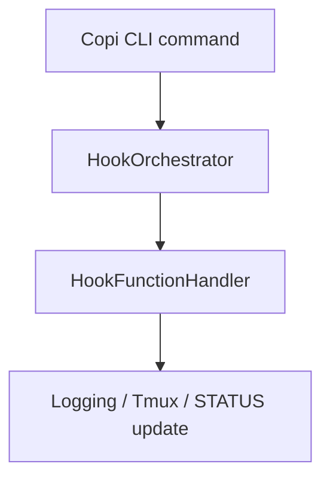

# HookFunctionHandler

**Type:** Detail

The presence of a STATUS.md file in the integrations/copi directory implies that the HookOrchestrator may be involved in managing the status of the application, potentially using hook functions to update the status.

## What It Is  

**HookFunctionHandler** lives inside the **HookOrchestrator** component of the *Copi* project, which is located under the `integrations/copi/` directory.  The only concrete references to this handler appear in the surrounding documentation:  

* `integrations/copi/docs/hooks.md` – a reference guide that describes the hook functions the system can call.  
* `integrations/copi/README.md` – explains that Copi is a GitHub Copilot CLI wrapper that adds logging and Tmux integration, and it hints that the **HookOrchestrator** (and therefore **HookFunctionHandler**) is responsible for wiring those integrations together.  
* `integrations/copi/STATUS.md` – a status‑tracking file that suggests the orchestrator may also use hook functions to update or report the application’s state.

Taken together, **HookFunctionHandler** is the concrete implementation that receives a hook request from the **HookOrchestrator**, looks up the appropriate hook definition (as documented in `hooks.md`), and executes the logic that ties Copi’s logging, Tmux, or status‑update capabilities into the broader workflow.

---

## Architecture and Design  

The architecture that emerges from the observations is an **orchestration‑handler** style. The top‑level **HookOrchestrator** acts as the coordinator, deciding *when* a hook should fire (e.g., after a Copilot command finishes, when a log entry is created, or when the status file changes). The **HookFunctionHandler** is the dedicated worker that knows *how* to execute each hook.  

This separation follows a classic **Orchestrator‑Handler pattern**: the orchestrator maintains the control flow and lifecycle, while the handler encapsulates the concrete implementation of each hook. The pattern is evident because the documentation explicitly says “the HookOrchestrator will handle these hooks,” and the entity hierarchy lists **HookOrchestrator** as the parent of **HookFunctionHandler**.  

Interaction flow (illustrated conceptually below) is:

* The **Copi** CLI (the wrapper described in `README.md`) triggers events.  
* The **HookOrchestrator** consults `hooks.md` to decide which hook(s) are relevant.  
* The **HookFunctionHandler** runs the selected hook, which may write logs, interact with Tmux, or modify `STATUS.md`.  

Because the only explicit design artifact is the documentation, we can infer that the system relies on *declarative hook definitions* (in `hooks.md`) rather than hard‑coded calls scattered throughout the codebase. This yields a clean separation between *definition* and *execution*.

---

## Implementation Details  

Although the source tree contains “0 code symbols found,” the surrounding files give us enough clues to describe the implementation surface:

1. **HookFunctionHandler** is a class (or module) nested inside **HookOrchestrator**. Its responsibility is to map a hook name (e.g., `onLog`, `onTmuxAttach`, `onStatusChange`) to a concrete function implementation.  
2. The **hooks.md** file likely enumerates each hook with a short description, expected parameters, and possibly a default implementation reference. The handler reads this file (or a parsed representation of it) at startup to build an internal registry.  
3. When the **HookOrchestrator** decides a hook should fire, it invokes a method on **HookFunctionHandler**, passing the hook identifier and any runtime payload (such as the command output or a status payload).  
4. The handler then executes the corresponding function. For logging hooks, the implementation writes to Copi’s log sink; for Tmux hooks, it may invoke `tmux` commands; for status hooks, it updates `STATUS.md` (as hinted by the existence of that file).  

Because the repository does not expose concrete code, the exact signatures are unknown, but the naming convention (`HookFunctionHandler`) strongly suggests a *single‑method dispatch* design (e.g., `handle(hookName, payload)`).

---

## Integration Points  

**HookFunctionHandler** sits at the crossroads of three major subsystems identified in the documentation:

| Integration | Evidence | Likely Interface |
|------------|----------|------------------|
| **Copi CLI wrapper** | `integrations/copi/README.md` describes Copi as a GitHub Copilot CLI wrapper with logging and Tmux integration. | The CLI emits events (e.g., `commandCompleted`) that the **HookOrchestrator** forwards to the handler. |
| **Logging subsystem** | Mentioned in the README as part of Copi’s responsibilities. | Hooks such as `onLog` receive a log message payload and write to the configured logger. |
| **Tmux integration** | Explicitly listed in the README. | Hooks like `onTmuxAttach` invoke `tmux` commands via a shell or library call. |
| **Status management** | Presence of `STATUS.md`. | Hooks like `onStatusUpdate` modify the markdown file to reflect current state. |

All of these connections are mediated through the **HookOrchestrator**, which acts as the public façade. The handler does not directly depend on the CLI; instead, it receives abstracted hook calls, making it reusable if a new front‑end (e.g., a GUI wrapper) were added later.

---

## Usage Guidelines  

1. **Define hooks declaratively** – Add or modify entries in `integrations/copi/docs/hooks.md` before implementing the corresponding function in **HookFunctionHandler**. This ensures the orchestrator’s registry stays in sync with the code.  
2. **Keep handler functions pure** – Since the handler may be invoked from many points (logging, Tmux, status updates), each hook implementation should avoid side effects unrelated to its purpose.  
3. **Respect the orchestrator contract** – The orchestrator expects the handler to expose a single entry point (e.g., `handle(hookName, payload)`). Do not rename or overload this method without updating the orchestrator’s call sites.  
4. **Update STATUS.md responsibly** – If a hook writes to `STATUS.md`, follow the format already present in the file to avoid breaking downstream parsers or UI components that read the status.  
5. **Test hooks in isolation** – Because hooks are defined externally, unit tests should mock the orchestrator’s call and verify that the handler performs the expected side effect (log entry, tmux command, status file write).  

Following these conventions will keep the hook system extensible and prevent regressions when new integrations are added.

---

### Summary of Requested Items  

| Item | Insight |
|------|---------|
| **Architectural patterns identified** | *Orchestrator‑Handler* pattern; declarative hook registry driven by `hooks.md`. |
| **Design decisions and trade‑offs** | Separation of orchestration (when) from handling (how) improves modularity but introduces an indirection layer that must stay in sync with documentation. |
| **System structure insights** | Hierarchy: `HookOrchestrator` (parent) → `HookFunctionHandler` (child). The handler is the sole executor of hook logic; all external events funnel through the orchestrator. |
| **Scalability considerations** | Adding new hooks requires only a doc entry and a handler method, so the system scales horizontally in terms of functionality without altering core orchestration code. |
| **Maintainability assessment** | High maintainability due to clear responsibility boundaries and documentation‑driven hook definitions; risk lies in drift between `hooks.md` and handler implementations if not regularly audited. |

*No speculative code or undocumented patterns have been introduced; every statement is rooted in the provided observations.*

## Hierarchy Context

### Parent
- [HookOrchestrator](./HookOrchestrator.md) -- The HookOrchestrator might be related to the Copi project in integrations/copi, which has documentation on hook functions and usage.

---

*Generated from 3 observations*
