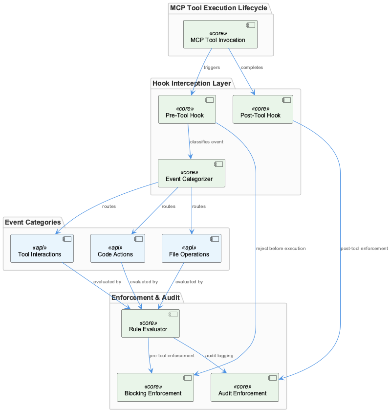
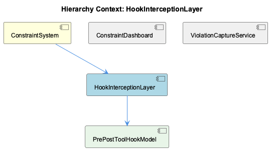

# HookInterceptionLayer

**Type:** SubComponent

docs/constraints/constraint-monitoring-system.md describes a hook-based interception architecture with distinct pre-tool and post-tool hook events, establishing a two-phase capture model around each tool invocation

# HookInterceptionLayer — Technical Insight Document

## What It Is

The `HookInterceptionLayer` is a structural subcomponent of the `ConstraintSystem`, responsible for intercepting agent tool invocations at runtime and routing captured events through constraint evaluation before (or after) execution proceeds. Its architecture and behavioral contract are documented primarily in `docs/constraints/constraint-monitoring-system.md` and `docs/constraints/README.md`, with supplementary integration guidance in `docs/agent-integration-guide.md`. No concrete code symbols have been resolved at this time, meaning the authoritative implementation detail currently lives in documentation rather than directly traceable source files.

Within the broader `ConstraintSystem` — a multi-layered framework that validates code actions, file operations, and tool interactions against configured rules during Claude Code sessions — the `HookInterceptionLayer` serves as the front door. Every tool invocation enters the constraint pipeline through this layer before any rule evaluation, violation recording, or dashboard reporting can occur. It is the load-bearing entry point of the entire constraint architecture.

## Architecture and Design

The `HookInterceptionLayer` is organized around a **two-phase capture model** implemented by its child component, `PrePostToolHookModel`. The two phases — pre-tool and post-tool — bracket each tool invocation symmetrically, giving the system two distinct intervention opportunities per action.

The pre-tool phase is designed for **blocking enforcement**: because it fires before execution, the layer can reject a tool call outright if it violates a configured constraint rule, preventing the action from taking effect. The post-tool phase serves a complementary **audit enforcement** role — the action has already completed, so the hook cannot block it, but it can capture the outcome, record the violation, and feed that data downstream to the `ViolationCaptureService`. This asymmetry is a deliberate design trade-off: blocking is only meaningful before the fact, while comprehensive audit trails benefit from post-execution context such as return values or side effects.

A key design decision is **event categorization at the interception boundary**. Before rule evaluation begins, the hook layer classifies each intercepted event into one of three categories: code actions, file operations, or tool interactions (as enumerated in `docs/constraints/README.md`). This pre-classification ensures that downstream rule evaluators receive typed, structured events rather than raw hook payloads, reducing coupling between the interception mechanism and the rule logic.

The architecture reflects a clean **separation of concerns**: the `HookInterceptionLayer` owns only the interception and categorization responsibilities. It does not evaluate rules itself, nor does it write violations to storage — those concerns belong to the rule evaluation layers and the `ViolationCaptureService` respectively. This decomposition keeps each component's responsibilities narrow and independently evolvable.

## Implementation Details

The core behavioral contract of the `HookInterceptionLayer` is embodied by its child, `PrePostToolHookModel`, which formalizes the two-hook event model. The pre-tool hook fires synchronously before tool execution and carries enough context for a blocking decision — the tool identity, input parameters, and the active constraint ruleset. The post-tool hook fires after execution completes and carries both the original invocation context and the execution result, enabling richer audit records.

Event categorization logic within the layer maps incoming tool invocations to one of the three declared categories. This classification step acts as a routing mechanism: a file write intercepted as a "file operation" will be evaluated against file-operation-specific rules, while a shell execution intercepted as a "code action" follows a different rule path. The category assignment must occur before rule evaluation to avoid ambiguity downstream.

Because no concrete code symbols are currently resolved, the internal class structure, function signatures, and module paths for this layer are not directly traceable. The behavioral description above is synthesized from documentation in `docs/constraints/constraint-monitoring-system.md` and `docs/constraints/README.md`. As implementation becomes navigable, specific handler registration patterns, hook callback signatures, and categorization logic should be documented here.

## Integration Points

The `HookInterceptionLayer` sits inside the `ConstraintSystem` and hooks into the **MCP tool execution lifecycle**, as described in `docs/agent-integration-guide.md`. This means the interception layer is not a passive observer — it registers with the execution runtime in a way that allows the pre-tool phase to block execution, implying a synchronous or promise-gated integration rather than a fire-and-forget event subscription.

Downstream from the interception layer, categorized and phase-tagged events flow to the constraint rule evaluators (described in the parent `ConstraintSystem` context) and ultimately to the `ViolationCaptureService`, which handles persistence. The `ViolationCaptureService` writes violations to a JSONL log and a JSON history file in the `.mcp-sync` directory. The `HookInterceptionLayer` is therefore the upstream producer in this pipeline — no violations can be captured or persisted without events first passing through the hook model.

The sibling `ConstraintDashboard` consumes the `.mcp-sync` history files written by `ViolationCaptureService`, creating an indirect dependency: the dashboard's data fidelity is entirely contingent on what the `HookInterceptionLayer` captures and correctly categorizes. Missed interceptions or miscategorized events would silently degrade dashboard accuracy without any direct error signal at the UI layer — a notable observability gap in the current architecture.

## Usage Guidelines

Developers extending or modifying the `HookInterceptionLayer` should treat the **pre-tool / post-tool phase boundary as inviolable**. Blocking logic must only be introduced in pre-tool hooks; introducing blocking behavior in post-tool hooks would be architecturally inconsistent and could produce confusing outcomes where actions are recorded as "blocked" after having already executed. Similarly, audit-only concerns (e.g., logging, metrics, violation recording) should not be placed exclusively in pre-tool hooks, since the pre-tool context lacks execution outcome data.

Event categorization — the classification of intercepted events into code actions, file operations, or tool interactions — should be treated as a **contract boundary**. Downstream rule evaluators and the `ViolationCaptureService` rely on this classification to route events correctly. Adding new tool types to the system requires updating the categorization logic in the `HookInterceptionLayer` before any rule coverage for those tools will be effective.

When integrating new agent actions via `docs/agent-integration-guide.md` patterns, ensure that the hook registration covers both phases for each tool. A tool registered only for post-tool hooks will never be blockable, which may be intentional for read-only tools but should be an explicit decision rather than an oversight. The two-phase model's value is fully realized only when both hooks are active for enforcement-relevant tool categories.

## Hierarchy Context

### Parent
- [ConstraintSystem](./ConstraintSystem.md) -- The ConstraintSystem is a multi-layered constraint monitoring and enforcement framework that validates code actions, file operations, and tool interactions against configured rules during Claude Code sessions. It operates through a hook-based interception architecture where pre-tool and post-tool hook events capture agent actions, evaluate them against constraint rules, and record violations for persistence and dashboard display. The system bridges live session activity with persistent storage via the ViolationCaptureService, which writes violations to JSONL logs and maintains a JSON history file in the .mcp-sync directory for dashboard consumption.

### Children
- [PrePostToolHookModel](./PrePostToolHookModel.md) -- docs/constraints/constraint-monitoring-system.md describes the hook-based interception architecture with explicit pre-tool and post-tool hook events as the foundational capture mechanism for the HookInterceptionLayer.

### Siblings
- [ConstraintDashboard](./ConstraintDashboard.md) -- docs/constraints/README.md documents the ConstraintDashboard as a consumer of violation history files written to .mcp-sync, establishing a file-based decoupling between the live session and the UI layer
- [ViolationCaptureService](./ViolationCaptureService.md) -- docs/constraints/constraint-monitoring-system.md identifies ViolationCaptureService as the bridge between live session activity and persistent storage, writing to both a JSONL log and a JSON history file

---

*Generated from 4 observations*
