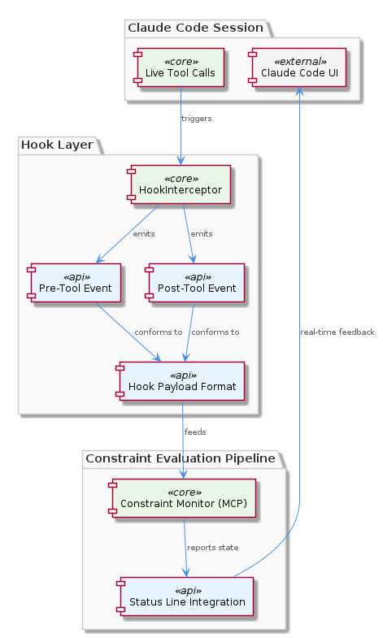
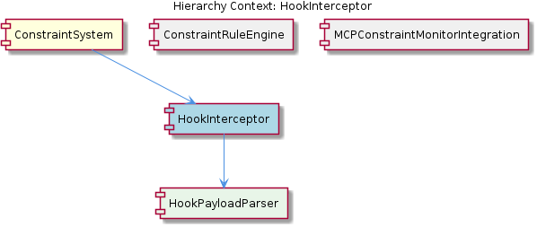

# HookInterceptor

**Type:** SubComponent

integrations/mcp-constraint-monitor/docs/CLAUDE-CODE-HOOK-FORMAT.md defines the wire format for hook payloads exchanged between Claude Code and the constraint monitor, covering pre-tool and post-tool event structures

## What It Is

HookInterceptor is a subcomponent of the ConstraintSystem that serves as the primary entry point for all constraint checks during active Claude Code sessions. It bridges live session tool calls into the constraint evaluation pipeline by intercepting pre-tool and post-tool events. Its wire format is documented in `integrations/mcp-constraint-monitor/docs/CLAUDE-CODE-HOOK-FORMAT.md`.

## Architecture and Design

HookInterceptor sits between Claude Code's tool execution lifecycle and the ConstraintRuleEngine. When a tool call occurs, the interceptor captures the event, delegates parsing to its child component HookPayloadParser, and routes the structured payload into the constraint evaluation pipeline.

The design follows an intercept-parse-evaluate pattern: hooks registered with Claude Code fire on pre-tool and post-tool events, the HookPayloadParser deserializes the wire format into structured data, and the result is forwarded to the ConstraintRuleEngine for rule matching. This separation keeps wire-format concerns isolated from evaluation logic.

Real-time status feedback flows back to the Claude Code UI via status-line integration (`integrations/mcp-constraint-monitor/docs/status-line-integration.md`), indicating active constraint enforcement state to the user during sessions.

## Implementation Details

The interceptor handles two distinct event types: pre-tool (before execution, enabling blocking) and post-tool (after execution, enabling violation recording). The HookPayloadParser handles the distinct payload structures for each, as defined in the hook format documentation. The parsed payloads are then passed to the sibling ConstraintRuleEngine for evaluation against configured rules.

## Integration Points

- **Upstream:** Receives hook events from Claude Code's tool execution lifecycle
- **Downstream:** Feeds parsed payloads to ConstraintRuleEngine for constraint evaluation
- **UI feedback:** Pushes enforcement state to Claude Code's status line display
- **Parent system:** Operates within ConstraintSystem, alongside MCPConstraintMonitorIntegration which exposes the broader monitoring capability as an MCP server

## Usage Guidelines

Developers extending hook handling should reference the wire format in `integrations/mcp-constraint-monitor/docs/CLAUDE-CODE-HOOK-FORMAT.md` as the canonical specification. Pre-tool hooks are the enforcement boundary for blocking actions; post-tool hooks serve audit/recording purposes. Status-line integration should remain lightweight to avoid UI latency during constraint checks.

## Hierarchy Context

### Parent
- [ConstraintSystem](./ConstraintSystem.md) -- The ConstraintSystem is a constraint monitoring and enforcement system that validates code actions and file operations against configured rules during Claude Code sessions. It operates primarily through a hook-based architecture where hooks intercept agent tool calls (pre-tool, post-tool events) and evaluate them against constraint rules, capturing any violations for persistence and dashboard display. The system integrates with the MCP (Model Context Protocol) infrastructure via the mcp-constraint-monitor integration, and bridges live session activity with persistent violation history storage.

### Children
- [HookPayloadParser](./HookPayloadParser.md) -- The wire format is documented in integrations/mcp-constraint-monitor/docs/CLAUDE-CODE-HOOK-FORMAT.md, which defines distinct payload structures for pre-tool and post-tool hook events exchanged between Claude Code and the constraint monitor.

### Siblings
- [ConstraintRuleEngine](./ConstraintRuleEngine.md) -- integrations/mcp-constraint-monitor/docs/constraint-configuration.md provides the full configuration schema for defining constraint rules, including rule types, scopes, and enforcement modes
- [MCPConstraintMonitorIntegration](./MCPConstraintMonitorIntegration.md) -- integrations/mcp-constraint-monitor/README.md describes the integration package that wraps constraint monitoring as an MCP-compatible server component

---

*Generated from 3 observations*
