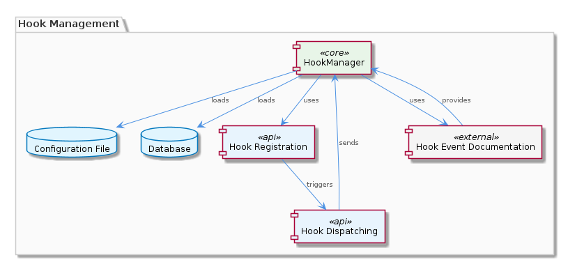
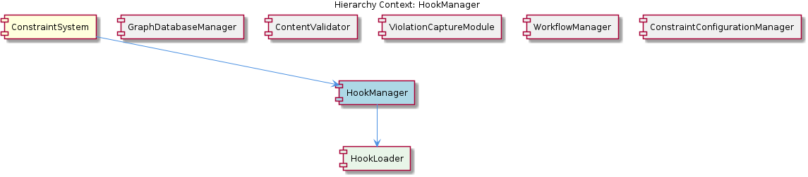

# HookManager

**Type:** SubComponent

HookManager works with the integrations/copi/docs/hooks.md file to provide hook event documentation.

## What It Is  

`HookManager` is the sub‑component that lives inside the **ConstraintSystem** package. It is responsible for the complete lifecycle of hook events – from loading their definitions (either from a configuration file or a database) to dispatching those events to the handlers that have registered interest. The component’s documentation is anchored in the file **integrations/copi/docs/hooks.md**, which serves both as a reference for developers and as a source of metadata that the manager consumes at runtime. Internally, `HookManager` delegates the low‑level loading work to its child component **HookLoader**, while exposing a registration API that other parts of the system can use to plug in custom handlers.

## Architecture and Design  

The design of `HookManager` follows a clear separation of concerns. The **loading** concern is isolated in the **HookLoader** child, allowing the manager to remain focused on **registration** and **dispatch**. This modular split is evident in the hierarchy: *ConstraintSystem → HookManager → HookLoader*. By keeping the loader distinct, the system can evolve the source of hook definitions (e.g., switching from a flat file to a database) without impacting the dispatch logic.

`HookManager` implements a **registration‑dispatch** workflow. Handlers first invoke a registration mechanism to express interest in specific hook events. The manager maintains an internal registry that maps event identifiers to the set of subscribed handlers. When an event is triggered—either because the loader read it from the configuration or because another component raised it—`HookManager` uses its **hook dispatching mechanism** to iterate over the registry and invoke each handler in turn. This approach ensures loose coupling: handlers do not need to know about each other, and the manager does not need to know the concrete implementation details of any handler.

The component also integrates documentation tightly with runtime behavior. By consulting **integrations/copi/docs/hooks.md** both for human‑readable reference and for loading hook metadata, `HookManager` guarantees that the runtime view of available hooks stays synchronized with the documented contract. This dual‑use of the same file reduces the risk of drift between code and documentation.

## Implementation Details  

* **Hook Loading** – The process begins with `HookLoader`, which reads hook definitions from either a configuration file or a database. Although the exact class name for the loader is not listed, the observation that “HookManager contains HookLoader” tells us that the loader is instantiated and invoked by the manager during initialization. The loader likely parses the **integrations/copi/docs/hooks.md** file to extract hook signatures, descriptions, and any default parameters.

* **Registration Mechanism** – `HookManager` exposes an API (e.g., `registerHandler(eventName, handler)`) that lets external modules add their handler functions to the internal registry. The registry is a data structure—most probably a map from event identifiers to an array of handler callbacks. Because the manager “relies on the integrations/copi/docs/hooks.md file for hook event documentation,” registration may include validation against the documented schema to prevent mismatched event names.

* **Dispatching Mechanism** – When a hook event occurs, the manager looks up the corresponding handler list and invokes each handler in sequence (or possibly in parallel, though the observations do not specify concurrency). The dispatch flow is described as “utilizes a hook dispatching mechanism to send events to registered handlers,” indicating a dedicated routine that abstracts the iteration and error handling for each handler invocation.

* **Lifecycle Management** – Beyond registration and dispatch, `HookManager` “is responsible for managing the lifecycle of hook events and handlers.” This suggests that it may also provide facilities for deregistering handlers, pausing/resuming event propagation, and cleaning up resources when the parent **ConstraintSystem** shuts down.

* **Documentation Coupling** – The repeated mention that `HookManager` “works with the integrations/copi/docs/hooks.md file to provide hook event documentation” implies that the manager may expose a method to retrieve the documentation programmatically (e.g., `getHookDocs()`), enabling UI components or API consumers to present up‑to‑date hook information.

## Integration Points  

`HookManager` sits directly under **ConstraintSystem**, making it a core service for any component that needs to react to system‑wide events. Its siblings—**GraphDatabaseManager**, **ContentValidator**, **ViolationCaptureModule**, **WorkflowManager**, and **ConstraintConfigurationManager**—share the same parent and therefore have similar access patterns to the broader configuration and persistence layers. For example, just as **WorkflowManager** loads workflow definitions from a configuration source, `HookManager` loads hook definitions from a similar source, hinting at a consistent configuration‑loading strategy across the subsystem.

External modules register their callbacks with `HookManager` through the registration API. Because the manager does not prescribe how a handler implements its logic, any component (including the sibling modules) can become a hook consumer. Conversely, when `HookManager` dispatches an event, the payload may include references to entities managed by other siblings (e.g., a graph node from **GraphDatabaseManager** or a validation result from **ContentValidator**), enabling cross‑component coordination without tight coupling.

The child **HookLoader** is the only direct implementation dependency inside the manager. Should the source of hook definitions change (e.g., moving from a static markdown file to a dynamic database table), only `HookLoader` would need to be updated, leaving the registration and dispatch logic untouched.

## Usage Guidelines  

1. **Register Early, Deregister When Done** – Handlers should register their interest during component initialization and explicitly deregister when the component is disposed. This prevents stale callbacks from lingering after a module has been unloaded.

2. **Validate Against Documentation** – When registering, developers should verify that the event name matches one documented in **integrations/copi/docs/hooks.md**. This practice avoids runtime mismatches and keeps the system’s contract clear.

3. **Keep Handlers Lightweight** – Since the dispatch mechanism iterates over all registered handlers, long‑running or blocking operations inside a handler can delay other listeners. If heavy work is required, handlers should off‑load to background jobs or async queues.

4. **Leverage the Documentation API** – If a UI or external API needs to expose available hooks, use the manager’s documentation retrieval functions (if exposed) rather than parsing the markdown file directly. This ensures the view stays in sync with the runtime loader.

5. **Respect Lifecycle Hooks** – `HookManager` may emit lifecycle events (e.g., “hookLoaded”, “hookDisposed”). Components that need to perform setup or teardown should listen for these rather than relying on external timing.

---

### Architectural patterns identified  
* Separation of concerns between loading (HookLoader) and event management (HookManager).  
* Registration‑dispatch workflow that decouples producers (event sources) from consumers (handlers).  

### Design decisions and trade‑offs  
* **File‑based documentation as source of truth** – Guarantees alignment between code and docs but ties the runtime to the presence and format of a markdown file.  
* **Child loader component** – Improves modularity and testability; however, adds an extra indirection that may affect startup latency if loading is heavyweight.  

### System structure insights  
* `HookManager` is a leaf sub‑component of **ConstraintSystem** and a sibling to other configuration‑driven managers, suggesting a cohesive design where each manager handles a distinct domain (hooks, workflows, constraints, etc.).  

### Scalability considerations  
* The current registration‑dispatch model scales linearly with the number of handlers per event. If the system grows to hundreds of listeners, dispatch latency could increase; introducing batching or asynchronous dispatch could mitigate this.  

### Maintainability assessment  
* Strong coupling to a single documentation file simplifies maintenance—updates to hook definitions are made in one place.  
* The clear division between loader and manager, together with the explicit registration API, makes the component easy to test and evolve independently of its siblings.

## Hierarchy Context

### Parent
- [ConstraintSystem](./ConstraintSystem.md) -- [LLM] The ConstraintSystem component utilizes a GraphDatabaseAdapter for persistence, which is implemented in the storage/graph-database-adapter.ts file. This adapter enables the system to store and retrieve graph structures using Graphology and LevelDB, with automatic JSON export sync. The use of Graphology allows for efficient graph operations, while LevelDB provides a robust and scalable storage solution. The GraphDatabaseAdapter class in storage/graph-database-adapter.ts is responsible for managing the graph database, including creating and deleting graphs, as well as handling graph queries. The automatic JSON export sync feature ensures that the graph data is consistently updated and available for other components to access.

### Children
- [HookLoader](./HookLoader.md) -- The integrations/copi/docs/hooks.md file provides a reference for hook functions, indicating the importance of hook loading in the overall system.

### Siblings
- [GraphDatabaseManager](./GraphDatabaseManager.md) -- GraphDatabaseManager uses the GraphDatabaseAdapter class in storage/graph-database-adapter.ts to manage graph database operations.
- [ContentValidator](./ContentValidator.md) -- ContentValidator checks entity content against predefined validation rules to ensure accuracy and consistency.
- [ViolationCaptureModule](./ViolationCaptureModule.md) -- ViolationCaptureModule captures constraint violations from tool interactions and stores them in a database.
- [WorkflowManager](./WorkflowManager.md) -- WorkflowManager loads workflow definitions from a configuration file or database.
- [ConstraintConfigurationManager](./ConstraintConfigurationManager.md) -- ConstraintConfigurationManager loads constraint configurations from a configuration file or database.

---

*Generated from 7 observations*
