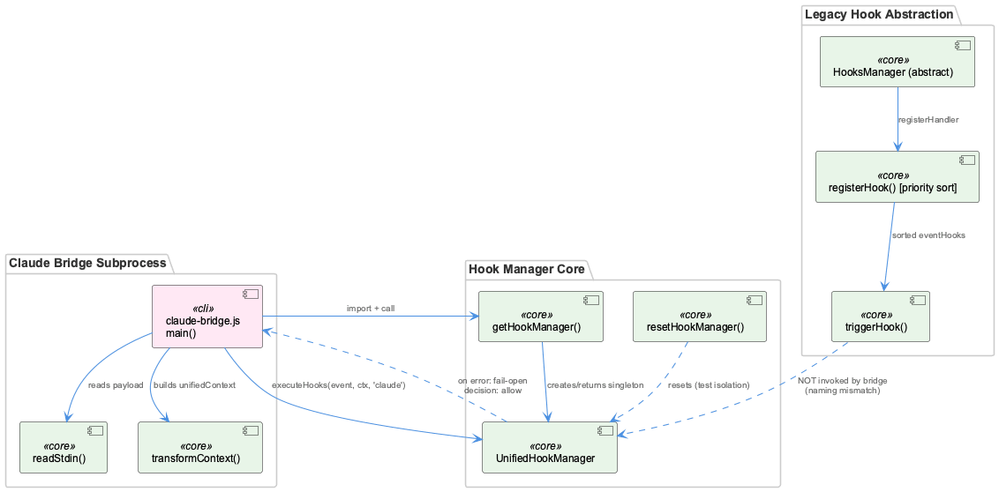
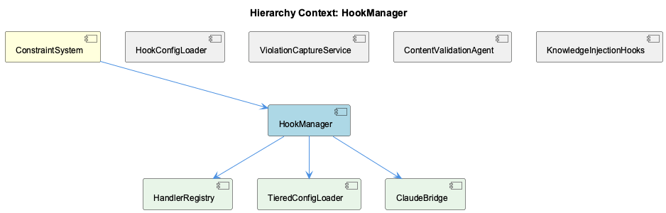

# HookManager

**Type:** SubComponent

claude-bridge.js acts as the agent-native entry point: it reads stdin JSON, calls transformContext() to map Claude's PreToolUse/PostToolUse etc. into the unified event names, then lazily imports getHookManager() from hook-manager.js and calls manager.initialize(projectPath) only if not already initialized.

# HookManager — Technical Insight Document

## What It Is

HookManager is implemented primarily as `UnifiedHookManager` in `lib/agent-api/hooks/hook-manager.js`, alongside the module-level factory functions `getHookManager()` and `resetHookManager()` that manage its lifecycle. As a SubComponent of ConstraintSystem, it serves as the central dispatch and registration engine for the coding-tools hook architecture — the mechanism by which user-level and project-level configuration entries are merged and turned into an ordered, queryable set of event handlers. It is not merely a config loader; it is the orchestration layer that bridges agent-native hook systems (like Claude Code) into a common internal event model.

## Architecture and Design

The core design pattern is a **layered configuration override with deterministic dispatch ordering**. `initialize(projectPath)` loads user configuration first via `loadConfig(userConfigPath, 'user')`, then project configuration via `loadConfig(projectConfigPath, 'project')`, so project-level entries always take precedence by virtue of loading — and thus overwriting — after user entries. This mirrors the same two-phase pattern implemented independently in `UnifiedHookManagerConfigLoader`, which computes `projectConfigPath` as `path.join(projectPath, '.coding', 'hooks.json')` and performs the identical user-then-project sequencing.

Internally, the manager uses a **pre-populated Map keyed by the HookEvent enum** (imported from hooks-api.js), initialized in the constructor with an empty array for every event value. This is a deliberate defensive design choice: it eliminates null-checking at lookup time, trading a small amount of upfront memory for simplified, safer dispatch code paths.

Handler registration follows an **idempotent upsert pattern** rather than naive appending: `registerHandler()` generates a fallback ID (`${event}-${handler.type}-${Date.now()}`) when none is provided, then searches `eventHandlers` by ID to overwrite existing entries in place. Combined with an eager `sort((a, b) => a.priority - b.priority)` executed on every registration, this guarantees handlers are always stored in priority order, pushing the sorting cost to write-time rather than read/dispatch-time — an explicit space/time trade-off favoring fast, predictable dispatch.

Error handling follows a **fail-soft philosophy**: `loadConfig()` swallows non-ENOENT errors by logging them via `logger.error` instead of throwing, so malformed `hooks.json` degrades gracefully to "no hooks loaded." This same philosophy propagates outward into the ClaudeBridge child component.

## Implementation Details

The class `UnifiedHookManager` [CGR] anchors hook-manager.js, exposing `initialize(projectPath)`, `registerHandler()`, and implicitly `unregisterHandler()` (per parent architecture description). Module-level helpers `getHookManager()` [CGR] and `resetHookManager()` [CGR] provide singleton-style access and test/reset support, consistent with claude-bridge.js's usage pattern of lazily importing `getHookManager()` and calling `manager.initialize(projectPath)` only if not already initialized — avoiding redundant config reloads across repeated invocations.

Configuration application is conservative: settings like `enableLogging`, `stopOnError`, and `timeout` are applied only when explicitly defined (`!== undefined` checks), as implemented in the sibling HookConfigLoader, preserving constructor defaults otherwise. This ensures partial config files don't inadvertently reset established behavior.

Duplicate handling logic (`findIndex(h => h.id === id)`) and the fallback ID generation scheme together form a de facto handler identity system without requiring a separate registry structure — the array itself doubles as the lookup and storage mechanism per event.

## Integration Points

HookManager sits under ConstraintSystem as the orchestration core, working alongside sibling components: HookConfigLoader (structural validation and settings merge logic), ViolationCaptureService (persists dispatch outcomes to JSONL and aggregate history), KnowledgeInjectionHooks, and HealthPromptHook, all of which register into the unified handler model.

Its child components implement or consume specific facets of this design: **ClaudeBridge** (claude-bridge.js) acts as the agent-native entry point, reading stdin JSON, using `EVENT_MAP` to translate Claude's `PreToolUse`/`PostToolUse` events into unified names (`pre-tool`/`post-tool`) via `transformContext()`, then invoking the manager. **HooksApiInterface** enforces an abstract base contract (`HooksManager` throws if instantiated directly), ensuring proper subclassing discipline. **HookMigrationTool** provides CLI-driven migration (`--dry-run`, `--no-backup`, `--force`, `--source`, `--project`) for transitioning configurations into the unified format. **UnifiedHookManagerConfigLoader** duplicates/implements the initialize sequencing logic described above, forming the config-loading half of the manager's responsibilities.

## Usage Guidelines

Developers extending HookManager should register handlers with explicit, stable IDs where duplicate-overwrite semantics matter — relying on the auto-generated timestamp-based ID makes handlers effectively non-overwritable across calls unless the same event/type collide within the same millisecond. Priority values should be treated as the sole dispatch-order mechanism since sorting happens automatically on registration; no manual sort step is needed or should be added downstream.

Because `loadConfig()` never throws on malformed JSON (aside from ENOENT), consumers should rely on `logger.error` output — not exceptions — to detect configuration issues; the system is designed to degrade to "no hooks loaded" rather than block execution. This fail-soft posture is amplified in ClaudeBridge, which is explicitly fail-open: any thrown error during bridge execution is caught in `main()` and still emits `{decision:'allow', ...}` with exit code 0, ensuring a broken bridge never blocks Claude Code — a critical guideline for anyone modifying bridge or manager initialization logic, since introducing a hard failure there would violate this core safety guarantee.

## Code Evidence

Key code artifacts grounding this entity's analysis:

**Structural:**
- UnifiedHookManager (class) in hook-manager.js
- getHookManager (function) in hook-manager.js
- resetHookManager (function) in hook-manager.js

## Hierarchy Context

### Parent
- [ConstraintSystem](./ConstraintSystem.md) -- The ConstraintSystem provides rule-based validation and enforcement of code actions and file operations during Claude Code sessions, spanning hook configuration loading, hook dispatch orchestration, and violation capture/persistence. It is built around a unified hook architecture that merges user-level (~/.coding-tools/hooks.json) and project-level (.coding/hooks.json) configurations, with project config taking precedence, and dispatches events (pre-tool, post-tool, pre-prompt, post-prompt, startup, shutdown, error) to registered handlers of type script, command, or module.

Core orchestration lives in UnifiedHookManager (lib/agent-api/hooks/hook-manager.js), which maintains a Map of event names to sorted handler arrays (by priority), supports duplicate-ID overwrite semantics, and exposes registerHandler/unregisterHandler APIs bridging agent-native hook systems to a common HookEvent enum. Configuration parsing and structural validation is handled separately by HookConfigLoader (lib/agent-api/hooks/hook-config.js), which loads, merges, and validates settings/hooks blocks, logging warnings (not throwing) on malformed entries.

Violation detection results are captured and persisted via ViolationCaptureService (scripts/violation-capture-service.js), which writes JSONL violation records to .mcp-sync/session-violations.jsonl and maintains an aggregated violation-history.json with session tracking and computed statistics (severity breakdowns, most common constraint, average violations per session) for dashboard consumption. Sensitive parameter values are redacted before being written to logs, and history is capped at 1000 entries to bound file growth.

### Children
- [ClaudeBridge](./ClaudeBridge.md) -- EVENT_MAP in claude-bridge.js maps native events like 'PreToolUse' and 'PostToolUse' to unified names 'pre-tool' and 'post-tool'.
- [HooksApiInterface](./HooksApiInterface.md) -- HooksManager's constructor throws if instantiated directly ('HooksManager is abstract and cannot be instantiated directly'), enforcing subclassing.
- [HookMigrationTool](./HookMigrationTool.md) -- parseArgs() supports --dry-run, --no-backup, --force, --source, and --project flags for controlling migration behavior.
- [UnifiedHookManagerConfigLoader](./UnifiedHookManagerConfigLoader.md) -- initialize(projectPath) first calls loadConfig(this.config.userConfigPath, 'user') then, if a projectPath is given, sets projectConfigPath to path.join(projectPath, '.coding', 'hooks.json') and calls loadConfig(..., 'project'), so project config loads and registers after user config.

### Siblings
- [HookConfigLoader](./HookConfigLoader.md) -- loadConfig() in hook-manager.js applies config.settings.enableLogging, stopOnError, and timeout only when explicitly defined in the file (`!== undefined` checks), preserving constructor defaults otherwise.
- [ViolationCaptureService](./ViolationCaptureService.md) -- Per architecture description, ViolationCaptureService writes JSONL violation records to .mcp-sync/session-violations.jsonl, separating an append-only raw log from a computed aggregate file.
- [KnowledgeInjectionHooks](./KnowledgeInjectionHooks.md) -- knowledge-injection-hook.js's isInjectionEnabled() reads process.env.CODING_KNOWLEDGE_INJECTION and treats only '0'/'false'/'off' (case-insensitive) as disabling, defaulting to enabled for unset values.
- [HealthPromptHook](./HealthPromptHook.md) -- checkHealthStatus() uses existsSync(VERIFIER_SCRIPT) as a heuristic to detect 'outside the coding repo' and returns servicesAvailable:false rather than attempting a network call in that case (Q3 carve-out).

---

*Generated from 10 observations*
