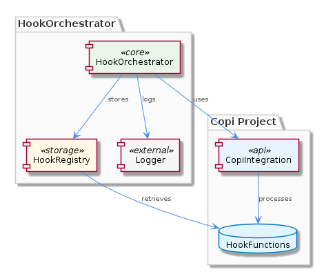
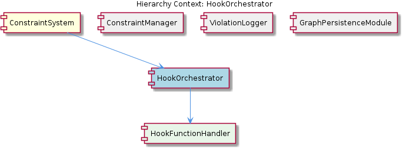

# HookOrchestrator

**Type:** SubComponent

The HookOrchestrator might be related to the Copi project in integrations/copi, which has documentation on hook functions and usage.

## What It Is  

The **HookOrchestrator** is a sub‑component that lives inside the **ConstraintSystem**.  The most likely source file is `hook-orchestrator.ts` (the exact path is not enumerated in the observations, but the naming convention matches the surrounding code base).  Its primary responsibility is to manage *hook functions* that are defined for the **Copi** integration (see `integrations/copi/docs/hooks.md`).  Hook functions are registered with the orchestrator, stored in an internal collection, and later invoked in a deterministic order when the surrounding constraint‑evaluation workflow requires them.  The orchestrator also owns a child component, **HookFunctionHandler**, which encapsulates the concrete execution logic for each hook.

---

## Architecture and Design  

The design of HookOrchestrator follows an **Observer‑style** arrangement.  The component acts as a central registry where hook providers (e.g., the Copi integration) *subscribe* their callbacks.  When a relevant event occurs within the ConstraintSystem, the orchestrator *notifies* all registered hooks, preserving the order defined at registration time.  

The internal data structure is inferred to be a **map or array** that pairs a hook identifier with its handler function.  This choice enables O(1) lookup for a specific hook while still supporting ordered iteration.  Execution ordering is hinted to be managed by a **queue or stack**‑like mechanism, ensuring that hooks run either FIFO (typical for pipeline processing) or LIFO (if later hooks must override earlier ones).  

A lightweight **logging subsystem** is also part of the design.  Each hook execution is logged, and any errors thrown by a hook are captured and recorded.  This logging serves two purposes: debugging the hook pipeline and providing observability for the ConstraintSystem’s higher‑level diagnostics.  

The component sits directly under **ConstraintSystem**, sharing the same architectural layer as its siblings **ConstraintManager**, **ViolationLogger**, and **GraphPersistenceModule**.  While those siblings focus on constraint storage, validation, and violation reporting, HookOrchestrator supplies the extensibility point that allows custom logic to be injected into the constraint workflow.  

---

## Implementation Details  

* **Registration API** – Although the exact method signatures are not listed, the presence of a map/array suggests an API such as `registerHook(name: string, fn: HookFunction)`.  The key (`name`) would be used by **HookFunctionHandler** to retrieve the appropriate function at execution time.  

* **Storage Structure** – The orchestrator likely holds a private member like `private hooks: Map<string, HookFunction>` or `private hooks: HookFunction[]`.  A map gives quick access by name, while an array preserves insertion order, which aligns with the observed need for ordered execution.  

* **Execution Engine** – When the ConstraintSystem triggers a hook phase, the orchestrator iterates over the stored collection.  The iteration could be implemented with a simple `for...of` loop (array) or `for (const [name, fn] of this.hooks)` (map).  If a queue is used, the orchestrator may `dequeue` each hook before invoking it, guaranteeing FIFO processing.  A stack alternative would `pop` hooks, yielding LIFO semantics.  

* **Error Handling & Logging** – Each invocation is wrapped in a `try / catch` block.  On success, a log entry such as `Hook [name] executed successfully` is emitted.  On failure, the error is logged (e.g., `Hook [name] threw error: ${err}`) and the orchestrator may decide whether to continue with subsequent hooks or abort the pipeline, a design decision that balances robustness against early‑failure detection.  

* **HookFunctionHandler** – This child component abstracts the low‑level details of calling a hook, possibly normalizing arguments, handling async returns, and translating hook‑specific errors into a common format for the orchestrator’s logger.  By delegating to HookFunctionHandler, the orchestrator remains focused on orchestration rather than execution minutiae.  

* **File Location** – The most plausible location for this implementation is `integrations/copi/src/hook-orchestrator.ts` (or a similarly named path).  The proximity to the Copi documentation (`integrations/copi/docs/hooks.md`) reinforces the idea that HookOrchestrator is the runtime counterpart to the documented hook contracts.  

---

## Integration Points  

* **Parent – ConstraintSystem** – HookOrchestrator is instantiated and owned by ConstraintSystem.  When ConstraintSystem evaluates constraints, it calls into the orchestrator to run any registered hooks that may augment or react to the evaluation results.  

* **Sibling Components** – While **ConstraintManager** handles CRUD operations on constraint definitions, **ViolationLogger** records any breaches, and **GraphPersistenceModule** persists the graph‑based constraint model, HookOrchestrator provides the *extensibility* hook layer that can be used by any of these siblings.  For example, a hook could enrich a violation event before ViolationLogger records it, or modify a constraint payload before GraphPersistenceModule writes it.  

* **Child – HookFunctionHandler** – All concrete hook invocations pass through HookFunctionHandler.  This tight coupling means any change to the handler’s signature (e.g., adding a new context object) will ripple up to the orchestrator’s registration contract.  

* **External Documentation – Copi Hooks** – The `integrations/copi/docs/hooks.md` file enumerates the contract for each hook (name, expected parameters, return type).  Developers implementing new hooks must adhere to this contract, ensuring the orchestrator can invoke them without type mismatches.  

* **Potential Dependencies** – The orchestrator may depend on a generic logging library (e.g., `winston` or a project‑specific logger) and on TypeScript’s type system for defining the `HookFunction` type.  No direct database access is indicated; instead, it operates in‑memory, delegating persistence concerns to its siblings.  

---

## Usage Guidelines  

1. **Register Early, Register Once** – Hooks should be registered during application bootstrap (e.g., in the same module that initializes ConstraintSystem).  Registering after the constraint evaluation cycle has begun can lead to missed executions.  

2. **Respect Execution Order** – Because the orchestrator executes hooks in the order they were added (or via an explicit queue/stack), developers must be mindful of side‑effects.  If a later hook depends on the outcome of an earlier one, document this dependency clearly in `hooks.md`.  

3. **Handle Errors Gracefully** – Hook implementations must catch their own errors or allow them to propagate so the orchestrator can log them.  Throwing uncaught exceptions will be logged, but may also halt subsequent hooks depending on the orchestrator’s error‑policy configuration.  

4. **Keep Hooks Pure When Possible** – To maintain predictability, hooks should avoid mutating global state unless explicitly required.  Pure functions simplify reasoning about the constraint pipeline and aid testing.  

5. **Leverage HookFunctionHandler** – When adding a new hook, use the helper methods exposed by HookFunctionHandler (e.g., argument normalization utilities) rather than re‑implementing common logic.  This reduces duplication and aligns the new hook with the orchestrator’s error‑handling strategy.  

---

### Summary of Architectural Insights  

| Item | Insight |
|------|---------|
| **Architectural patterns identified** | Observer‑style registration & notification, possible Queue/Stack for ordered execution, centralized logging. |
| **Design decisions and trade‑offs** | Map vs. array for hook storage (lookup speed vs. guaranteed order), FIFO vs. LIFO execution (predictability vs. override capability), eager logging (observability) vs. potential performance overhead. |
| **System structure insights** | HookOrchestrator sits under ConstraintSystem, shares the same layer as ConstraintManager, ViolationLogger, and GraphPersistenceModule, and delegates execution to its child HookFunctionHandler. |
| **Scalability considerations** | In‑memory hook registry scales with the number of hooks; a very large hook set could increase iteration latency.  Using a map preserves O(1) registration but still requires linear traversal at execution time.  Logging volume grows with hook count, so log level configurability is advisable. |
| **Maintainability assessment** | Clear separation between orchestration (HookOrchestrator) and execution (HookFunctionHandler) aids maintainability.  The reliance on a single registration API and documented hook contracts (`hooks.md`) provides a stable surface for future extensions.  However, the lack of explicit type definitions in the observations suggests that adding strong TypeScript interfaces would further improve maintainability. |

These insights are derived directly from the supplied observations and the documented relationships within the codebase.

## Hierarchy Context

### Parent
- [ConstraintSystem](./ConstraintSystem.md) -- [LLM] The ConstraintSystem component utilizes the GraphDatabaseAdapter for persistence, which is implemented in the storage/graph-database-adapter.ts file. This adapter enables the system to store and manage constraints in a graph database, utilizing Graphology and LevelDB for efficient data storage and retrieval. The adapter also features automatic JSON export sync, allowing for seamless data exchange between the graph database and other components. For example, the ContentValidationAgent, located in integrations/mcp-server-semantic-analysis/src/agents/content-validation-agent.ts, relies on the GraphDatabaseAdapter to retrieve and validate entity content against configured rules.

### Children
- [HookFunctionHandler](./HookFunctionHandler.md) -- The integrations/copi/docs/hooks.md file provides a reference for hook functions, indicating that the HookOrchestrator will handle these hooks.

### Siblings
- [ConstraintManager](./ConstraintManager.md) -- The ConstraintManager likely interacts with the GraphDatabaseAdapter in storage/graph-database-adapter.ts to store and manage constraints.
- [ViolationLogger](./ViolationLogger.md) -- The ViolationLogger might be related to the ConstraintManager, as it handles constraint violations.
- [GraphPersistenceModule](./GraphPersistenceModule.md) -- The GraphPersistenceModule might be related to the GraphDatabaseAdapter, as it utilizes Graphology and LevelDB for persistence.

---

*Generated from 6 observations*
