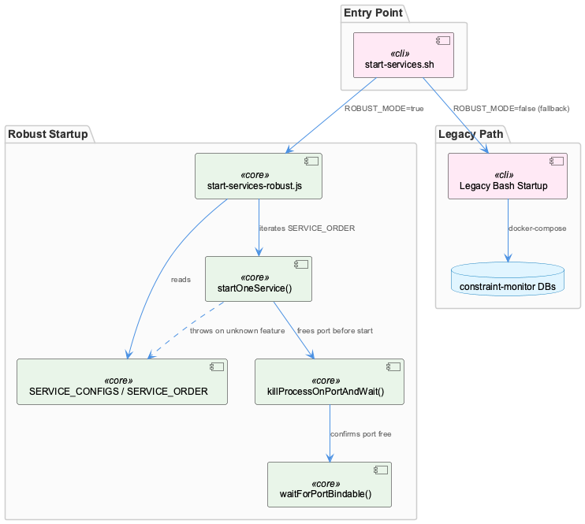
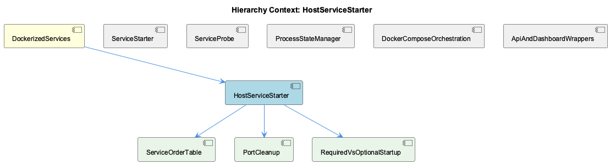

# HostServiceStarter

**Type:** SubComponent

start-services.sh's ROBUST_MODE flag (default true) chooses between exec'ing start-services-robust.js or falling back to a legacy bash-only startup path with manual docker-compose calls for constraint-monitor databases

# HostServiceStarter — Technical Insight Document

## What It Is

HostServiceStarter is the host-process (non-container) counterpart of DockerizedServices' service lifecycle management, implemented primarily in `scripts/start-services-robust.js`, with an entry-point wrapper in `start-services.sh`. It defines the two data structures that drive host-side orchestration — `SERVICE_CONFIGS` and `SERVICE_ORDER` — and the runtime functions that start, retry, and port-clean services running directly on the host machine rather than inside Docker. Its behavior is exercised end-to-end by `tests/features/service-gating.test.mjs`, which treats the test suite itself as a structural contract on the configuration, not merely a functional check.

`start-services.sh` acts as the dispatcher: a `ROBUST_MODE` flag (default `true`) decides whether to exec the robust JS orchestrator or fall back to a legacy bash-only path that issues manual `docker-compose` calls for constraint-monitor databases. This dual-path design signals that HostServiceStarter is a deliberate rewrite/hardening layer over an older, more fragile bash startup script, kept alive as a fallback rather than deleted outright.

## Architecture and Design

The dominant architectural pattern is **structural contract enforcement via tests** rather than purely runtime validation. The child component ServiceOrderTable embodies this: `SERVICE_ORDER.map(o => o.key).sort()` must exactly equal `Object.keys(SERVICE_CONFIGS).sort()`, and every config entry's `feature` field must exist in `FEATURE_IDS` from `lib/features/catalogue.cjs`. This closes a named failure mode from the test docstring — "ten hand-written start blocks were ten chances to forget a gate" — converting a class of runtime surprises into CI-time failures.

A second pattern is **fail-loud over fail-silent**: `startOneService()` throws on an unknown feature name (e.g., `'unknown feature nope'`) instead of skipping it quietly, contrasting with the fail-open philosophy documented in sibling DockerComposeOrchestration's `entrypoint.sh`, where unknown feature keys resolve to enabled. This divergence is notable — the host-side starter is intentionally stricter than the container-side gating layer, reflecting that host startup errors are easier to see/debug interactively than container boot failures.

The child RequiredVsOptionalStartup component implements a **required-vs-optional degradation model**: `transcriptMonitor` and `liveLoggingCoordinator` are `required: true` (with `maxRetries: 3`, `timeout: 20000`), while `observationsApi` and `llmCliProxy` are optional and degrade gracefully. A required service's exhausted retries set `out.blocked = true`, which the test suite confirms actually halts downstream `SERVICE_ORDER` progression — required-ness is enforced behavior, not just a label.

## Implementation Details

The child PortCleanup component's `killProcessOnPortAndWait()` implements a two-phase escalation for freeing a bound port: it enumerates PIDs via `lsof -ti:<port>`, sends `SIGTERM`, then polls `checkPortInUse()` on a `pollIntervalMs` cadence. Escalation to `SIGKILL` occurs once `Date.now() - startTime > maxWaitMs / 2` — but because this check lives inside the polling loop, `SIGKILL` is re-sent on every tick past the halfway point, not just once. This is intentionally imprecise ("no later than half the timeout" rather than "exactly at half"), and harmless against already-dead processes since `process.kill` throws and is silently caught.

Complementing this, `waitForPortBindable()` avoids relying on `isPortListening()` alone; instead it proves actual bindability by attempting a throwaway `net.createServer().listen()`. This sidesteps wasting retry slots on `EADDRINUSE` races that a passive listening-check could misreport.

The test harness itself contains an implementation nuance worth preserving: because a required service's real retry cost is "six seconds of exponential waiting" at `maxRetries: 3`, `service-gating.test.mjs` deliberately overrides `maxRetries` to 1 when testing the blocking behavior, trading fidelity for test speed.

## Integration Points

HostServiceStarter sits directly under DockerizedServices, sharing its parent's core principle — deployment-mode-agnostic service lifecycle logic — but instantiated for bare-host execution rather than container orchestration. It shares conceptual DNA with sibling ServiceStarter's `startServiceWithRetry()` (probe/retry agnosticism) and with sibling ServiceProbe's fail-open TCP checks, though HostServiceStarter's own gating (fail-loud) diverges from that fail-open posture found in ServiceProbe and DockerComposeOrchestration.

The `feature` field in each `SERVICE_CONFIGS` entry ties HostServiceStarter into the shared feature catalogue (`lib/features/catalogue.cjs`, via `FEATURE_IDS`), the same catalogue referenced by sibling DockerComposeOrchestration's `PROGRAM_FEATURES` mapping — meaning host and container gating both draw from a common feature vocabulary, even though their enforcement philosophies differ.

## Usage Guidelines

Any new service added to `SERVICE_CONFIGS` must simultaneously receive an entry in `SERVICE_ORDER` and a valid `feature` reference — omitting either will fail `service-gating.test.mjs` by design, and this should be treated as intentional friction, not a bug to work around. Developers relying on `ROBUST_MODE=false` should understand they are exercising the legacy bash fallback with manual `docker-compose` calls, a path that likely receives less attention than the robust JS path. When marking a service `required: true`, expect that its failure will legitimately block all downstream services in `SERVICE_ORDER` — this is tested behavior, not incidental. Finally, when writing tests against retry-heavy paths, follow the precedent of overriding `maxRetries` to avoid unnecessarily paying real exponential-backoff costs in CI.

## Hierarchy Context

### Parent
- [DockerizedServices](./DockerizedServices.md) -- [LLM] The DockerizedServices component enforces a strict separation between 'containerized' and 'host-process' deployment modes while sharing a single codebase for service lifecycle management. This is achieved via lib/service-starter.js's startServiceWithRetry(), which is deployment-mode agnostic: it doesn't care whether the service it's starting is a Docker container or a local Node process, it just needs a start function and a health probe callback. This design lets scripts/api-service.js and scripts/dashboard-service.js be used identically whether the orchestrator is docker-compose (via docker/docker-compose.yml and supervisord.conf) or a bare host machine running `npm start`. New developers should understand that the abstraction boundary is the probe/retry contract, not the process spawning mechanism itself — this is what allows the same health-check logic to apply uniformly across deployment targets.

### Children
- [ServiceOrderTable](./ServiceOrderTable.md) -- [LLM] The gating contract in scripts/start-services-robust.js is enforced structurally, not just behaviorally: tests/features/service-gating.test.mjs asserts that `SERVICE_ORDER.map(o => o.key).sort()` exactly equals `Object.keys(SERVICE_CONFIGS).sort()`, and separately that every `SERVICE_CONFIGS` entry declares a `feature` field that exists in `FEATURE_IDS` (imported from `lib/features/catalogue.cjs`). This closes a specific failure mode called out in the test file's own docstring — 'ten hand-written start blocks were ten chances to forget a gate' — by making an un-gated or orphaned service a test failure rather than a runtime surprise. The mirrored idea appears in docker/entrypoint.sh's `PROGRAM_FEATURES` string, which `tests/features/container-gating.test.mjs` (referenced in the shell script's comments) checks against the `[program:...]` sections of supervisord.conf — the same exactly-covers-each-other invariant applied to the container's process list instead of the host's service list.
- [PortCleanup](./PortCleanup.md) -- [LLM] killProcessOnPortAndWait() in scripts/start-services-robust.js implements a two-phase escalation strategy: it first sends SIGTERM to all PIDs found via `lsof -ti:<port>`, then polls checkPortInUse() every pollIntervalMs, and only escalates to SIGKILL after `Date.now() - startTime > maxWaitMs / 2` has elapsed inside the same polling loop. This means the SIGKILL escalation is re-issued on every poll tick past the halfway mark (not just once), which is harmless for an already-dead process (process.kill throws and is silently caught) but means the function is deliberately imprecise about exactly when force-kill happens — it guarantees 'no later than half the timeout' rather than 'exactly at half the timeout'.
- [RequiredVsOptionalStartup](./RequiredVsOptionalStartup.md) -- [LLM] scripts/start-services-robust.js defines two classes of services via the `required` boolean in SERVICE_CONFIGS — transcriptMonitor and liveLoggingCoordinator are `required: true` with `maxRetries: 3` and `timeout: 20000`, while services like observationsApi and llmCliProxy are optional and degrade gracefully. The service-gating test in tests/features/service-gating.test.mjs ('a required failure blocks, so downstream services do not start') proves this isn't just a config label — startOneService() actually sets `out.blocked = true` on exhausted retries for a required service, and the test harness deliberately overrides `maxRetries` to 1 before testing this to avoid paying the real 3-attempt exponential backoff cost (documented inline as 'the real value costs six seconds of exponential waiting').

### Siblings
- [ServiceStarter](./ServiceStarter.md) -- startServiceWithRetry() in lib/service-starter.js accepts a startFn and healthCheckFn as parameters, making it agnostic to whether the underlying process is a Docker container or a Node child process
- [ServiceProbe](./ServiceProbe.md) -- [LLM] docker/entrypoint.sh's wait_for_service() function (lines defining `wait_for_service()`) implements the same epistemic-humility contract described for lib/utils/service-probe.js at the bash layer: it uses `timeout 2 bash -c "echo >/dev/tcp/$host/$port"` to prove only that a TCP socket accepted a connection, then explicitly returns 0 even after exhausting `max_attempts` with a `WARNING: ... continuing anyway` message and the comment `# Don't fail - let supervisord handle it`. This is a deliberate fail-open probe: the script never asserts 'healthy' or blocks container startup on a probe failure, deferring the actual liveness judgment to supervisord's own process management, which mirrors the SPEC R6 distinction between 'running/reachable' and 'functioning correctly' at a completely different layer of the stack (container boot vs. in-process service management).
- [ProcessStateManager](./ProcessStateManager.md) -- [CGR] ProcessStateManager (class) in process-state-manager.js
- [DockerComposeOrchestration](./DockerComposeOrchestration.md) -- [LLM] docker/entrypoint.sh implements a fail-open feature-gating override rather than a rewrite of docker/supervisord.conf: it reads a flat host-written snapshot at /coding/.coding/runtime/features.json (mounted read-only) and, for each entry in the PROGRAM_FEATURES mapping (e.g. 'semantic-analysis:knowledge', 'constraint-monitor:constraints', 'health-dashboard-frontend:health'), shells out to `node -e` (not jq, which the comment notes isn't installed in the image) to check `snap.features?.[feature]`. Any program whose feature reads `false` gets an autostart=false stanza written into /etc/supervisor/features.d/disabled.conf, which supervisord includes alongside the main config. Critically, an unknown/missing feature key resolves to 'true' by design ('a snapshot written by an older host cannot silently switch a program off'), and a missing/unreadable snapshot file leaves the entire features.d directory empty, starting every program — the pre-existing historical behavior. This directly implements the DockerizedServices principle from the parent context that supervisord.conf is the single source of truth for in-container processes, while this script is merely an additive filter over it.
- [ApiAndDashboardWrappers](./ApiAndDashboardWrappers.md) -- [LLM] docker/entrypoint.sh implements a feature-gating override layer that sits ON TOP of supervisord.conf rather than replacing it: it reads a host-written flat snapshot (`/coding/.coding/runtime/features.json`, mounted read-only) and, for each entry in the hardcoded `PROGRAM_FEATURES` mapping (e.g. `constraint-monitor:constraints`, `health-dashboard:health`), generates a `/etc/supervisor/features.d/disabled.conf` with `autostart=false` stanzas. This is a deliberate override-not-rewrite design: supervisord.conf remains the single place where a program's command/logging is defined, while the generated conf only flips autostart. The script explicitly documents a fail-open philosophy: a missing/unreadable snapshot, or a feature name absent from the JSON, both resolve to 'enabled' — the comment states this is because 'a container that silently ran nothing because a JSON file was late would be far harder to diagnose than one that ran too much.' This is a real architectural risk: PROGRAM_FEATURES must be kept in sync with supervisord.conf's `[program:...]` sections and with the features catalogue by hand, and only `tests/features/container-gating.test.mjs` (referenced but not shown here) catches drift.

---

*Generated from 6 observations*
