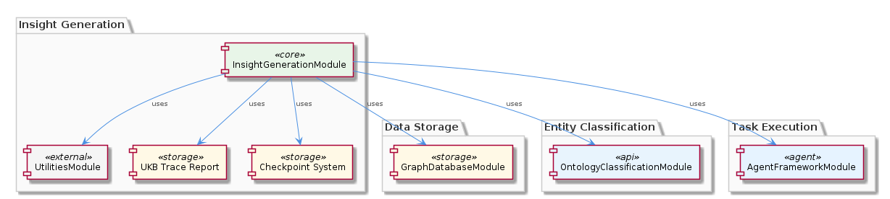
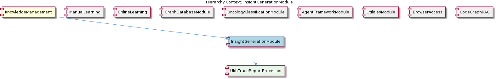

# InsightGenerationModule

**Type:** SubComponent

InsightGenerationModule interacts with the OntologyClassificationModule to classify entities before generating insights.

## What It Is  

The **InsightGenerationModule** lives inside the **KnowledgeManagement** component and is the engine that turns raw trace data into actionable insights. Its entry point is the `UkbTraceReportProcessor`, a child component that consumes the UKB trace report supplied by the **UtilitiesModule**. The module does not expose its own source files in the current snapshot, but its logical placement is clear from the hierarchy:  

```
KnowledgeManagement
└─ InsightGenerationModule
   └─ UkbTraceReportProcessor
```  

All processing is orchestrated through the **AgentFrameworkModule**, which runs the insight‑generation tasks as agents. The module also leans on the **GraphDatabaseModule** for persisting and querying the entity graph that underpins the insight logic, and it calls the **OntologyClassificationModule** to ensure entities are correctly typed before insights are derived. Progress is tracked via the checkpoint system that originates in **UtilitiesModule**, guaranteeing that long‑running insight jobs can be resumed safely.



---

## Architecture and Design  

The design of **InsightGenerationModule** follows a **modular, layered architecture** in which each responsibility is delegated to a dedicated sibling module. The module itself acts as a coordinator: it receives a UKB trace report, passes the raw data to the `UkbTraceReportProcessor`, invokes the **OntologyClassificationModule** to enrich entities with type information, stores the enriched entities in the graph through the **GraphDatabaseModule**, and finally triggers an agent from the **AgentFrameworkModule** to perform the insight generation logic.  

This separation of concerns manifests several implicit design patterns:

1. **Facade / Coordinator Pattern** – InsightGenerationModule presents a single façade that hides the complexity of interacting with utilities, graph storage, ontology services, and agents.  
2. **Adapter‑like Interaction** – The module communicates with the graph via the `GraphDatabaseAdapter` located at `integrations/mcp-server-semantic-analysis/src/storage/graph-database-adapter.ts`, which abstracts the underlying Graphology + LevelDB implementation.  
3. **Checkpoint/Resume Pattern** – By leveraging the checkpoint system from **UtilitiesModule**, the module can pause and resume insight jobs, a design choice that improves robustness for long‑running analyses.  

The architecture diagram above visualises these layers, showing how the module sits between data ingestion (UKB trace), classification, persistence, and execution. No explicit event‑driven or micro‑service mechanisms are mentioned, so the system appears to operate as an in‑process, tightly‑coupled set of libraries within the same runtime.

---

## Implementation Details  

### Core Processor – `UkbTraceReportProcessor`  
The child component `UkbTraceReportProcessor` is responsible for parsing the UKB trace report. Although the concrete class definition is not listed, its role is evident: it transforms the raw report into a collection of entities that can be stored in the graph.  

### Ontology Classification  
Once entities are extracted, InsightGenerationModule calls into **OntologyClassificationModule**. This sibling module “uses the OntologySystem to classify entities based on their types and properties,” ensuring each node in the graph carries the correct semantic tags before insight algorithms run.  

### Graph Persistence  
All entity data is persisted through the **GraphDatabaseModule**, which itself relies on the `GraphDatabaseAdapter` (`integrations/mcp-server-semantic-analysis/src/storage/graph-database-adapter.ts`). The adapter offers a JSON export sync and automatic migration support via the `scripts/migrate-graph-db-entity-types.js` script, guaranteeing that the graph schema stays aligned with evolving entity definitions.  

### Agent Execution  
The actual insight generation is performed by agents provided by **AgentFrameworkModule**. The module “uses the agent development guide in integrations/copi/docs/hooks.md to provide a framework for agent development,” indicating that InsightGenerationModule registers a specific insight‑generation hook that the framework executes.  

### Checkpoint Management  
Progress tracking is handled by the checkpoint system from **UtilitiesModule**. This system records intermediate states, enabling the module to resume from the last successful checkpoint if a failure occurs. The checkpoint data is likely stored alongside other utility artifacts, though exact file locations are not enumerated.



---

## Integration Points  

1. **UtilitiesModule** – Supplies two critical services: the UKB trace report (the raw input) and the checkpoint mechanism (state persistence). The module reads the trace file via the utilities’ I/O helpers and writes checkpoint metadata back to the same utility layer.  

2. **GraphDatabaseModule** – Acts as the persistence backbone. InsightGenerationModule calls the module’s API (exposed through the GraphDatabaseAdapter) to insert or update entity nodes, and later to run graph queries that support insight derivation.  

3. **OntologyClassificationModule** – Provides the `classifyEntity` (or similar) function that tags each entity with ontology types. This classification step is mandatory before any insight logic runs, ensuring semantic consistency across the knowledge graph.  

4. **AgentFrameworkModule** – Registers an insight‑generation agent. The module passes a configuration object that includes references to the processed entities and any checkpoint data, allowing the agent to execute its task in a controlled environment.  

5. **Parent – KnowledgeManagement** – The parent component aggregates all these sub‑components, exposing InsightGenerationModule as part of its public API. The parent also supplies the GraphDatabaseAdapter implementation, which the module consumes indirectly through the GraphDatabaseModule.  

No additional external services (e.g., message queues, external APIs) are mentioned, keeping the integration surface relatively narrow and well‑defined.

---

## Usage Guidelines  

* **Input Preparation** – Always provide a UKB trace report that conforms to the format expected by `UkbTraceReportProcessor`. The report should be placed where the UtilitiesModule can locate it (e.g., the standard trace‑input directory defined by the utilities configuration).  

* **Checkpoint Configuration** – When launching an insight generation job, enable the checkpoint flag supplied by UtilitiesModule. This ensures that long‑running jobs can be resumed after interruptions without re‑processing the entire trace.  

* **Entity Classification First** – Do not bypass the OntologyClassification step. Classification must complete successfully before any graph writes or agent execution, otherwise downstream insight logic may encounter untyped or mis‑typed nodes.  

* **Graph Schema Alignment** – If you modify entity properties, run the `scripts/migrate-graph-db-entity-types.js` migration script (as used by ManualLearning) to keep the LevelDB/Graphology schema in sync. This prevents schema drift that could break insight queries.  

* **Agent Registration** – Register insight‑generation agents through the AgentFrameworkModule’s hook mechanism (`integrations/copi/docs/hooks.md`). Follow the hook signature exactly; deviating from the expected input shape will cause the agent to fail silently.  

* **Monitoring** – Use the checkpoint logs from UtilitiesModule to monitor progress. Successful checkpoint creation indicates that the module has persisted intermediate state and can safely continue after a restart.  

* **Testing** – Unit‑test the `UkbTraceReportProcessor` in isolation with representative trace samples. Mock the GraphDatabaseAdapter and OntologyClassification services to verify that the module correctly orchestrates the workflow without requiring a live graph instance.  

---

### Architectural patterns identified  
* Facade / Coordinator pattern for high‑level orchestration.  
* Adapter pattern via `GraphDatabaseAdapter`.  
* Checkpoint/Resume pattern for fault‑tolerant processing.  

### Design decisions and trade‑offs  
* **Modular separation** keeps responsibilities clear but introduces runtime coupling between sibling modules.  
* **In‑process agent execution** simplifies deployment but may limit horizontal scalability compared to a distributed task queue.  
* **Checkpointing** adds resilience at the cost of additional I/O overhead and state management complexity.  

### System structure insights  
InsightGenerationModule is a child of KnowledgeManagement and a peer to modules that each provide a single, well‑defined service (graph access, ontology, agents, utilities). This promotes a clean, layered system where each layer can evolve independently as long as the contracts remain stable.  

### Scalability considerations  
Scalability hinges on the underlying GraphDatabaseModule and the agent framework. Because insight generation runs as an agent within the same process, scaling out would require spawning multiple agent instances or partitioning trace inputs. The checkpoint system helps distribute work by allowing independent chunks of a trace to be processed in parallel, provided the graph can handle concurrent writes.  

### Maintainability assessment  
The clear module boundaries and use of adapters make the codebase relatively maintainable. Changes to the graph storage layer are isolated to the adapter, while ontology updates stay within OntologyClassificationModule. However, the tight coupling through direct module calls means that any change to a sibling’s API will ripple through InsightGenerationModule, so versioned interfaces and thorough integration tests are essential for long‑term stability.

## Hierarchy Context

### Parent
- [KnowledgeManagement](./KnowledgeManagement.md) -- [LLM] The KnowledgeManagement component utilizes a GraphDatabaseAdapter for persistence, which is implemented in the file integrations/mcp-server-semantic-analysis/src/storage/graph-database-adapter.ts. This adapter provides an interface for agents to interact with the central Graphology + LevelDB knowledge graph. The adapter also includes automatic JSON export sync, ensuring that the knowledge graph remains up-to-date. Furthermore, the migrateGraphDatabase script, located in scripts/migrate-graph-db-entity-types.js, is used to update entity types in the live LevelDB/Graphology database, demonstrating a clear focus on data consistency and integrity.

### Children
- [UkbTraceReportProcessor](./UkbTraceReportProcessor.md) -- The UKB trace report is used as input for the InsightGenerationModule, as mentioned in the project context.

### Siblings
- [ManualLearning](./ManualLearning.md) -- ManualLearning relies on the migrateGraphDatabase script in scripts/migrate-graph-db-entity-types.js to update entity types in the live LevelDB/Graphology database.
- [OnlineLearning](./OnlineLearning.md) -- OnlineLearning uses the Code Graph RAG system in integrations/code-graph-rag to extract knowledge from codebases.
- [GraphDatabaseModule](./GraphDatabaseModule.md) -- GraphDatabaseModule uses the GraphDatabaseAdapter to interact with the Graphology + LevelDB knowledge graph.
- [OntologyClassificationModule](./OntologyClassificationModule.md) -- OntologyClassificationModule uses the OntologySystem to classify entities based on their types and properties.
- [AgentFrameworkModule](./AgentFrameworkModule.md) -- AgentFrameworkModule uses the agent development guide in integrations/copi/docs/hooks.md to provide a framework for agent development.
- [UtilitiesModule](./UtilitiesModule.md) -- UtilitiesModule uses the checkpoint system to track progress and ensure data consistency.
- [BrowserAccess](./BrowserAccess.md) -- BrowserAccess uses the browser access guide in integrations/browser-access/README.md to provide browser access to the MCP server.
- [CodeGraphRAG](./CodeGraphRAG.md) -- CodeGraphRAG uses the code-graph-rag guide in integrations/code-graph-rag/README.md to provide a graph-based RAG system.

---

*Generated from 5 observations*
