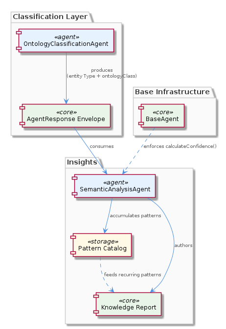

# Insights

**Type:** SubComponent

The integrations/mcp-server-semantic-analysis/docs/architecture/agents.md file distinguishes SemanticAnalysisAgent's role from classification, positioning it as the insight-producing agent in the coordinator chain

## What It Is

Insights is a SubComponent of SemanticAnalysis responsible for deriving structured knowledge artifacts from classified graph data. It sits at the tail end of the agent pipeline — after OntologyClassificationAgent has resolved `entityType` and `ontologyClass` fields on every `AgentResponse` envelope — and transforms that enriched output into confidence-scored insight records, pattern catalog entries, and a final knowledge report. While no source files were directly resolved during analysis, the architectural documentation at `integrations/mcp-server-semantic-analysis/docs/architecture/agents.md` explicitly positions `SemanticAnalysisAgent.process()` as the entry point for this work, distinguishing it from the classification phase that precedes it.

The component owns three distinct sub-concerns: consuming classified `AgentResponse` envelopes (delegated to its child, AgentResponseInsightConsumer), accumulating recurring entity patterns into a pattern catalog, and authoring the structured knowledge report artifact. Together these concerns form a coherent output layer for the SemanticAnalysis pipeline.

---

## Architecture and Design

Insights inherits the same foundational contract as every other agent in the system: the six-step template-method `execute()` sequence enforced by `BaseAgent<TInput,TOutput>` in `src/agents/base-agent.ts`. This means that even though `SemanticAnalysisAgent.process()` is where domain-specific insight logic lives, the steps `calculateConfidence()`, `detectIssues()`, `generateRouting()`, `applyCorrections()`, and `buildMetadata()` are guaranteed to execute afterward in fixed order. The practical consequence is that **every insight carries a confidence score before it is ever written into the knowledge report** — not as an optional field, but as a structural guarantee imposed by the base class. This uniform <USER_ID_REDACTED> signal is one of the more deliberate design decisions in the pipeline, as it allows downstream consumers to make trust-based routing decisions without needing to understand how any individual insight was produced.

The separation of pattern catalog extraction as a distinct sub-concern reflects a catalog accumulation model: patterns are not one-off derivations but recurring entity signatures that build up across pipeline runs. This suggests the pattern catalog is a stateful or persistent data structure, not a transient in-memory object, though its backing store is not directly evidenced in the current observations.

The knowledge report is explicitly separated from its generation logic — the report schema is a first-class artifact, not just a serialized dump of intermediate state. This schema/generation separation is a meaningful design boundary: it means the report format can evolve independently of the rules that produce it, and it establishes the report as the canonical output contract for the Insights component.

---

## Implementation Details

`SemanticAnalysisAgent.process()` is the primary entry point for insight derivation. It operates on graph data that has already been classified — meaning the expensive entity resolution work performed by `OntologyClassificationAgent` is a precondition, not a concurrent concern. The agent applies semantic rules on top of the classified graph, which implies a rule-evaluation model rather than a purely generative one: insights emerge from pattern-matching and semantic inference over structured input, not from freeform analysis.

The child component AgentResponseInsightConsumer handles the intake side of this pipeline step. Its role is scoped to consuming `AgentResponse` envelopes that carry populated `entityType` and `ontologyClass` fields — it does not re-classify or re-resolve entities. This strict sequencing dependency means AgentResponseInsightConsumer can be implemented with the assumption that classification is already complete and correct, simplifying its internal logic considerably.

Pattern catalog extraction accumulates recurring entity patterns, suggesting that `SemanticAnalysisAgent` (or a collaborator it delegates to) maintains a catalog data structure that is updated incrementally as entities flow through the pipeline. The fact that this is called out as a distinct sub-concern suggests it has its own logic path within the agent, separate from the per-entity insight derivation work.

The knowledge report authoring step produces the final structured artifact. The schema is separated from the generation logic, which implies at minimum two distinct objects: a report builder or authoring class, and a report schema or model class. This boundary would allow the report format to be validated, versioned, or consumed by external systems without coupling those consumers to the internal generation mechanics.

---

## Integration Points

Insights sits in a strict upstream dependency on OntologyClassificationAgent. No insight generation begins until `entityType` and `ontologyClass` are populated on the `AgentResponse` envelope — this is the handoff contract between the Ontology sibling component and Insights. The coordinator chain documented in `integrations/mcp-server-semantic-analysis/docs/architecture/agents.md` makes this sequencing explicit: `SemanticAnalysisAgent` is positioned after the classification agent, not alongside it.

The `BaseAgent` contract defined in `src/agents/base-agent.ts` is the shared structural dependency Insights shares with its siblings Pipeline, Ontology, OntologyRegistry, and KmCoreAdapter. All agents in the system return the same `AgentResponse` envelope format, which is what makes AgentResponseInsightConsumer's intake logic straightforward — the envelope shape is guaranteed regardless of which upstream agent produced it.

The knowledge report artifact is the primary output interface Insights exposes to the rest of the system. Its separated schema design means external consumers — such as KmCoreAdapter, which centralizes entity write paths via `storage/km-core-adapter.ts` — can depend on a stable report contract without being coupled to insight generation internals. Whether KmCoreAdapter actually consumes the knowledge report is not directly evidenced, but the write-path centralization pattern it implements makes it the natural candidate for persisting report output.

---

## Usage Guidelines

Developers extending or modifying Insights should treat `SemanticAnalysisAgent.process()` as the single authoritative entry point for new insight logic. Adding insight types outside this method — for instance, by injecting logic into `calculateConfidence()` or `buildMetadata()` — would violate the template-method contract and produce inconsistently ordered side effects. The six-step sequence is not advisory; it cannot be short-circuited without throwing exceptions, as the parent context makes clear.

Because `calculateConfidence()` always runs after `process()`, any insight produced by `SemanticAnalysisAgent` will have a confidence score attached before it reaches the report stage. Developers should rely on this guarantee rather than defensively checking for confidence scores downstream. Insights that cannot be meaningfully scored should surface that uncertainty through the confidence value itself (e.g., a low or sentinel score) rather than omitting the field.

Pattern catalog additions should be treated as cumulative state mutations. If the catalog accumulates across pipeline runs, any logic that writes to it needs to handle concurrent or repeated runs gracefully — deduplication and idempotency are implicit requirements given the accumulation model described in the observations.

The schema/generation separation on the knowledge report should be preserved. New report fields belong in the report schema definition; new derivation rules belong in the generation logic. Collapsing these two concerns — for instance, by building the schema dynamically inside the generator — would undermine the report's utility as a stable external contract and make the report harder to validate or version independently.

---

## Architectural Patterns Identified

| Pattern | Where Applied |
|---|---|
| Template Method | `BaseAgent.execute()` enforces fixed six-step sequence across all agents |
| Pipeline / Chain of Responsibility | Coordinator sequences OntologyClassificationAgent → SemanticAnalysisAgent |
| Schema/Generator Separation | Knowledge report schema decoupled from authoring logic |
| Catalog Accumulation | Pattern catalog builds incrementally across pipeline runs |
| Uniform Envelope | `AgentResponse` provides consistent input contract for AgentResponseInsightConsumer |

**Key trade-off:** The template-method design guarantees uniform <USER_ID_REDACTED> signals (confidence scores, metadata) at the cost of mandatory overhead on every agent invocation, even when insights are trivially simple. For Insights specifically, this overhead is acceptable because insight derivation is inherently a heavyweight semantic operation — the fixed steps add marginal cost relative to the core `process()` work.

## Hierarchy Context

### Parent
- [SemanticAnalysis](./SemanticAnalysis.md) -- [LLM] The SemanticAnalysis pipeline is structured around a coordinator pattern where specialized agents each extend BaseAgent<TInput,TOutput> defined in src/agents/base-agent.ts. This base class implements a strict template-method execute() that sequences six steps in order: process(), calculateConfidence(), detectIssues(), generateRouting(), applyCorrections(), and buildMetadata(). Every agent—CodeGraphAgent, SemanticAnalysisAgent, OntologyClassificationAgent, ContentValidationAgent—inherits this contract and returns a uniform AgentResponse envelope. This design means a new developer adding an agent only needs to implement the domain-specific process() logic; confidence scoring, issue detection, and metadata construction are guaranteed to run in a consistent order regardless of which agent is invoked. The tradeoff is that the template method imposes overhead steps even when an agent's output is trivially simple, and agents cannot short-circuit the sequence without throwing exceptions.

### Children
- [AgentResponseInsightConsumer](./AgentResponseInsightConsumer.md) -- Based on parent context, insight generation is explicitly sequenced after OntologyClassificationAgent, consuming envelopes with entityType and ontologyClass fields already populated — establishing a strict pipeline dependency

### Siblings
- [Pipeline](./Pipeline.md) -- BaseAgent<TInput,TOutput> in src/agents/base-agent.ts enforces a six-step template-method execute() sequence (process, calculateConfidence, detectIssues, generateRouting, applyCorrections, buildMetadata) that all pipeline agents must follow without short-circuiting
- [Ontology](./Ontology.md) -- OntologyClassificationAgent extends BaseAgent and implements domain-specific process() logic for entity type resolution while relying on the base class for confidence scoring and metadata construction
- [OntologyRegistry](./OntologyRegistry.md) -- LegacyOntologyAdapter implements the strangler-facade pattern, exposing the old ontology-loading interface while delegating internally to km-core OntologyRegistry
- [KmCoreAdapter](./KmCoreAdapter.md) -- storage/km-core-adapter.ts is the canonical file for this component, centralizing all entity write paths that were previously split across GraphDatabaseAdapter and PersistenceAgent

---

*Generated from 6 observations*
