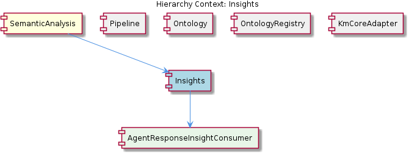
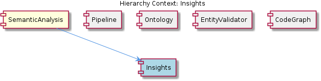

# Insights

**Type:** SubComponent

The Insights sub-component employs the GraphDatabaseAdapter in storage/graph-database-adapter.js for storing and retrieving insight entities and their relationships.

## What It Is  

The **Insights** sub‑component lives primarily in the **SemanticAnalysis** domain and is realised through a set of concrete modules that sit under the repository root.  The core logic that powers Insight generation lives in the **InsightGenerator** child (see the *InsightGenerator* entity) and relies on two shared libraries:  

* **LLMService** – the large‑language‑model façade located at `lib/llm/dist/index.js`.  
* **GraphDatabaseAdapter** – the persistence façade located at `storage/graph-database-adapter.js`.  

Together these pieces enable the sub‑component to **extract pattern catalogs**, **rank the resulting insights**, and **persist both raw insights and higher‑level knowledge reports** in a graph database.  The sub‑component also collaborates with the **CodeGraphConstructor** (which builds a knowledge graph of code entities) to enrich the insight graph with structural context.

---

## Architecture and Design  

The observations reveal a **modular, adapter‑driven architecture**.  The **Insights** sub‑component does not embed its own persistence or LLM logic; instead it **adapts** two existing services:

1. **Adapter pattern** – `GraphDatabaseAdapter` abstracts the underlying graph database (likely Neo4j or a similar property‑graph store).  All CRUD operations for *insight entities* and *knowledge reports* funnel through this adapter, mirroring the way sibling components such as **Pipeline**, **CodeGraphConstructor**, and **Ontology** also interact with the graph store.  This creates a single point of change if the storage engine is swapped.

2. **Service façade** – `LLMService` (in `lib/llm/dist/index.js`) is a façade over one or more large‑language‑model back‑ends.  Insight generation, pattern catalog extraction, and any downstream LLM‑driven classification all call into this façade, exactly as the **OntologyClassificationAgent** and **LLMController** do.  The reuse of this service enforces a consistent LLM contract across the system.

The sub‑component follows a **pipeline‑style flow**:  
`InsightGenerator → LLMService (generation) → ranking logic → GraphDatabaseAdapter (store) → KnowledgeReport creation`.  The **CodeGraphConstructor** supplies a pre‑built code‑entity graph that the Insight engine can traverse when scoring relevance, tying the insight graph back to concrete code artefacts.

Because **Insights** is a child of **SemanticAnalysis**, it inherits the parent’s “modular agent” philosophy: each responsibility (generation, ranking, storage) is encapsulated in its own class or function, making the sub‑component composable with other agents inside the parent.

---

## Implementation Details  

### Core Classes / Functions  

* **InsightGenerator** – the concrete class that orchestrates LLM calls.  It invokes methods from `lib/llm/dist/index.js` to **generate raw insight text** and **extract pattern catalogs**.  The generator likely exposes a `generateInsights(source: CodeGraph): Insight[]` method, though the exact signature is not listed in the observations.  

* **LLMService (lib/llm/dist/index.js)** – provides methods such as `generateText(prompt)` and `extractPatterns(text)`.  The Insights sub‑component reuses these methods for both free‑form insight synthesis and structured pattern extraction, mirroring how the **OntologyClassificationAgent** uses the same service for classification.

* **GraphDatabaseAdapter (storage/graph-database-adapter.js)** – implements `saveNode`, `saveRelationship`, `query`, and other CRUD operations.  Insights uses it twice: first to **persist each generated Insight entity** (including its ranking score and metadata) and second to **store the aggregated KnowledgeReport** that summarises a collection of insights.  The adapter abstracts away the graph query language, allowing the Insight code to remain database‑agnostic.

* **Ranking Mechanism** – while no file path is given, the observations note a “mechanism for ranking insights based on relevance and importance.”  This is most likely a deterministic function that consumes the LLM‑generated confidence scores, pattern frequency, and graph‑centrality metrics (derived from the **CodeGraphConstructor** graph) to compute a numeric rank.

* **Knowledge Report Builder** – after ranking, the sub‑component assembles a **knowledge report**.  This report aggregates the highest‑ranked insights, attaches contextual code‑graph references, and stores the final artefact via the same `GraphDatabaseAdapter`.

### Interaction Flow  

1. **Graph Construction** – The **CodeGraphConstructor** builds a knowledge graph of code entities and relationships (e.g., classes, functions, imports).  
2. **Insight Generation** – `InsightGenerator` feeds relevant code‑graph slices to `LLMService`, receiving natural‑language insights and extracted patterns.  
3. **Ranking** – A ranking routine evaluates each insight against relevance heuristics (pattern match count, graph centrality, LLM confidence).  
4. **Persistence** – Both the raw insights and the synthesized KnowledgeReport are written to the graph database through `GraphDatabaseAdapter`.  
5. **Retrieval** – Down‑stream consumers (e.g., UI dashboards, further analysis agents) query the graph database to surface insights to users.

---

## Integration Points  

* **Parent – SemanticAnalysis** – As a child of **SemanticAnalysis**, Insights participates in the broader semantic pipeline.  The parent component’s modular agent architecture means that Insights can be invoked as an “agent” alongside the **OntologyClassificationAgent** and other analysis agents.  This placement enables the parent to orchestrate a single end‑to‑end run that first classifies ontology terms, then generates insights, and finally persists the combined knowledge.

* **Sibling – Pipeline** – The **Pipeline** component also uses `GraphDatabaseAdapter` for storing generic knowledge entities.  This common persistence layer ensures that insights can be consumed directly by the pipeline for further processing (e.g., exporting to downstream services or triggering alerts).

* **Sibling – Ontology** – The **OntologyClassificationAgent** shares the same `LLMService`.  Consequently, any configuration change to the LLM (model version, temperature, token limits) propagates uniformly to both ontology classification and insight generation, preserving behavioural consistency.

* **Sibling – CodeGraphConstructor** – Insights depends on the code graph produced here.  The constructor’s output becomes the context for LLM prompts, meaning that changes in the graph schema (additional node types, relationship semantics) will directly affect insight relevance and ranking.

* **Child – InsightGenerator** – All generation logic lives inside this child.  It is the only class that directly calls `LLMService`; therefore, any future extension (e.g., adding a new prompt template or supporting multi‑modal LLMs) should be confined to this component, preserving the thin‑wrapper design of the parent Insights module.

* **External – LLMController** – Although not directly referenced, the **LLMController** also uses `LLMService`.  If the system exposes an API for on‑demand insight generation, the controller could forward HTTP requests to the same service, ensuring a single source of truth for LLM configuration.

---

## Usage Guidelines  

1. **Never bypass the GraphDatabaseAdapter** – All persistence of insights and knowledge reports must go through `storage/graph-database-adapter.js`.  Direct database calls break the abstraction and make future storage swaps painful.

2. **Treat LLM prompts as immutable contracts** – The prompts used by `InsightGenerator` are part of the insight quality guarantee.  If a prompt is altered, re‑run existing tests that validate ranking scores and report completeness, because even minor wording changes can shift LLM output dramatically.

3. **Rank after full generation** – The ranking mechanism assumes a complete set of raw insights.  Developers should avoid incremental ranking (e.g., ranking a single insight as soon as it is generated) because the relevance heuristics often rely on global statistics such as pattern frequency.

4. **Keep the code graph up‑to‑date** – Since insight relevance is tied to the graph constructed by **CodeGraphConstructor**, any change in source code must trigger a fresh graph build before running the Insights pipeline; otherwise, the ranking may be based on stale relationships.

5. **Configuration centralisation** – LLM model selection, temperature, and token limits are defined in the `LLMService` configuration file (not listed but implied).  Adjust these values in one place; the change will automatically affect **Insights**, **OntologyClassificationAgent**, and **LLMController**.

---

### Summary of Requested Items  

1. **Architectural patterns identified**  
   * Adapter pattern (`GraphDatabaseAdapter`)  
   * Service façade (`LLMService`)  
   * Modular agent pipeline (parent **SemanticAnalysis** orchestrates agents)  

2. **Design decisions and trade‑offs**  
   * Reusing a single LLM façade reduces duplication but couples all agents to the same model version.  
   * Storing insights in a graph database enables rich relationship queries at the cost of requiring graph‑specific query expertise.  
   * Ranking after full generation provides higher quality relevance scores but introduces a latency spike for large codebases.  

3. **System structure insights**  
   * **Insights** sits as a child of **SemanticAnalysis**, with **InsightGenerator** as its sole child.  
   * It shares two core services with siblings (**Pipeline**, **Ontology**, **CodeGraphConstructor**, **LLMController**).  
   * Persistence and LLM interaction are fully abstracted, promoting reuse across the domain.  

4. **Scalability considerations**  
   * Graph database scaling (sharding, read replicas) will be the primary bottleneck for large insight volumes.  
   * LLM calls are external and may need rate‑limiting or batching; consider asynchronous job queues if insight generation becomes a heavy background task.  
   * Ranking logic should be designed to run in a streaming fashion or be parallelised when the insight set grows beyond a few thousand items.  

5. **Maintainability assessment**  
   * High maintainability thanks to clear separation of concerns: generation (LLM), ranking, and storage are isolated.  
   * Centralised adapters mean updates to storage or LLM configuration propagate automatically, reducing duplicated code.  
   * The only potential maintenance hotspot is the prompt/template management inside **InsightGenerator**; version‑controlling prompts and providing automated regression tests will mitigate drift.

## Diagrams

### Relationship

## Architecture Diagrams

## Hierarchy Context

### Parent
- [SemanticAnalysis](./SemanticAnalysis.md) -- [LLM] The SemanticAnalysis component employs a modular architecture with various agents, each responsible for a specific task, such as ontology classification, semantic analysis, and content validation. The OntologyClassificationAgent, located in integrations/mcp-server-semantic-analysis/src/agents/ontology-classification-agent.ts, is responsible for classifying observations against the ontology system. This agent utilizes the LLMService, found in lib/llm/dist/index.js, for large language model operations, such as text generation and classification. The GraphDatabaseAdapter, located in storage/graph-database-adapter.js, is used for interacting with the graph database, which stores knowledge entities and their relationships.

### Children
- [InsightGenerator](./InsightGenerator.md) -- The Insights sub-component uses the LLMService in lib/llm/dist/index.js for generating insights and pattern catalog extraction, indicating a key integration point.

### Siblings
- [Pipeline](./Pipeline.md) -- The Pipeline uses the GraphDatabaseAdapter in storage/graph-database-adapter.js for storing and retrieving knowledge entities and their relationships.
- [Ontology](./Ontology.md) -- The OntologyClassificationAgent in integrations/mcp-server-semantic-analysis/src/agents/ontology-classification-agent.ts uses the LLMService in lib/llm/dist/index.js for large language model operations.
- [CodeGraphConstructor](./CodeGraphConstructor.md) -- The CodeGraphConstructor uses the GraphDatabaseAdapter in storage/graph-database-adapter.js for storing and retrieving code entities and their relationships.
- [LLMController](./LLMController.md) -- The LLMController uses the LLMService in lib/llm/dist/index.js for large language model operations.
- [GraphDatabaseAdapter](./GraphDatabaseAdapter.md) -- The GraphDatabaseAdapter uses the graph database for storing and retrieving knowledge entities and their relationships.

---

*Generated from 6 observations*
