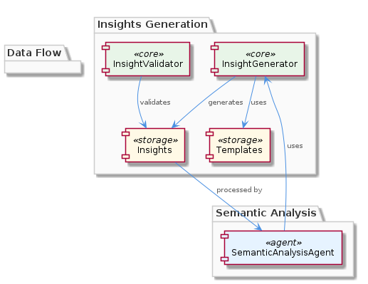

# Insights

**Type:** SubComponent

The insights are generated based on the output of the pipeline and the ontology, as seen in the integrations/mcp-server-semantic-analysis/src/insights/insight-generator.ts file.

## What It Is  

The **Insights** sub‑component lives in the *semantic‑analysis* integration and is implemented primarily in the following files:  

* `integrations/mcp-server-semantic-analysis/src/insights/insight-generator.ts` – the **InsightGenerator** class that drives insight creation.  
* `integrations/mcp-server-semantic-analysis/src/insights/templates.ts` – a collection of **template definitions** that drive the wording and structure of each insight.  
* `integrations/mcp-server-semantic-analysis/src/insights/insights.ts` – the data model that stores the generated insights.  
* `integrations/mcp-server-semantic-analysis/src/insights/insight-validator.ts` – the **InsightValidator** class that checks the syntactic and semantic correctness of each insight before it is handed to downstream processing.  

Insights are derived from two sources: the **pipeline output** (the result of the various agents that process git history and LSL sessions) and the **ontology** (the structured knowledge base used throughout the SemanticAnalysis component). Once generated, the insights are consumed by the pipeline logic in `integrations/mcp-server-semantic-analysis/src/agents/semantic-analysis-agent.ts`.  

---

## Architecture and Design  

The design of **Insights** follows a **template‑driven generation** pattern. The `InsightGenerator` orchestrates the creation of an insight by selecting an appropriate template from `templates.ts`, populating it with data extracted from the pipeline output and ontology, and then emitting a concrete `Insight` object that is persisted in `insights.ts`. This approach keeps the generation logic **declarative** (the template) while allowing the **imperative** data‑binding step to stay isolated in the generator.

A clear **separation of concerns** is evident:  

* **Generation** – `InsightGenerator` focuses solely on assembling insights.  
* **Definition** – `templates.ts` holds all reusable textual patterns, making it trivial to add new insight types without touching the generator code.  
* **Validation** – `InsightValidator` guarantees that every insight conforms to expected shape and content rules before it is handed off.  

The component is **extensible** by design. Adding a new insight merely requires adding a new entry in `templates.ts` and, if necessary, extending the validator. No changes to the core generation algorithm are required, which reduces the risk of regression.  

The **relationship diagram** below illustrates how Insights sits within the broader SemanticAnalysis system, linking to its parent component, sibling services, and downstream consumers.  

---

## Implementation Details  

### Core Classes  

* **`InsightGenerator`** (`insight-generator.ts`) – Exposes a public method (e.g., `generateInsights(pipelineResult, ontology)`) that iterates over the pipeline’s findings, matches each finding to a template key, and constructs an `Insight` instance. The generator pulls in the ontology to resolve entity names, classifications, and relationships, ensuring that the generated text reflects the current knowledge graph.  

* **`InsightValidator`** (`insight-validator.ts`) – Implements validation rules such as non‑empty fields, correct placeholder substitution, and ontology consistency checks. It is invoked immediately after generation; any insight that fails validation is either corrected programmatically or discarded, protecting downstream agents from malformed data.  

* **`Insight` Model** (`insights.ts`) – Defines the shape of an insight (e.g., `id`, `title`, `description`, `relatedEntities`, `severity`). This model is shared with the pipeline and any UI components that render insights to users.  

### Template Mechanism  

`templates.ts` exports a map where each key corresponds to a specific insight scenario (e.g., `UNUSED_IMPORT`, `CIRCULAR_DEPENDENCY`). The value is a string with placeholders (e.g., `${entityName}`, `${location}`). The generator performs a simple interpolation, replacing placeholders with concrete values derived from the pipeline result and ontology. Because the templates are plain TypeScript objects, they can be version‑controlled, reviewed, and extended without recompiling complex logic.  

### Extensibility  

To add a new insight type, a developer adds a new entry to the template map and optionally augments `InsightValidator` with rules specific to the new placeholders. The generator automatically picks up the new template because it resolves templates at runtime based on the scenario identifier supplied by the pipeline. This design minimizes code churn and encourages a **plug‑in** style evolution of insight capabilities.  

### Interaction with the Pipeline  

The `SemanticAnalysisAgent` (`semantic-analysis-agent.ts`) invokes `InsightGenerator` after completing its own analysis pass. The generated insights are then attached to the pipeline’s result payload, making them available to subsequent agents (e.g., reporting, alerting). This tight coupling ensures that insights reflect the most recent analysis state while keeping the generation step isolated from the core analysis logic.  

---

## Integration Points  

* **Parent – SemanticAnalysis**: Insights is a child of the SemanticAnalysis component, which coordinates multiple agents (OntologyClassificationAgent, CodeGraphAgent, etc.). The parent supplies the **pipeline output** and the **ontology** objects that the InsightGenerator consumes.  

* **Sibling – Pipeline**: The pipeline orchestrates the flow of data between agents. After the pipeline aggregates results, it calls into `InsightGenerator`. Conversely, the pipeline later consumes the validated insights for reporting or further automated actions.  

* **Sibling – Ontology**: The ontology provides the canonical definitions of entities, relationships, and classifications. Insight templates often reference ontology terms, and the validator cross‑checks that any entity referenced in an insight exists in the ontology.  

* **Sibling – EntityValidator**: While `EntityValidator` (`entity-validator.ts`) validates raw entities emerging from the analysis, `InsightValidator` validates the *derived* textual artifacts. Both validators share a common goal of data integrity but operate on different abstraction layers.  

* **Sibling – CodeGraph**: The CodeGraph generator (`code-graph-generator.ts`) produces a graph representation of the code base that may be referenced by certain insight templates (e.g., “high‑degree node detected”). Although there is no direct import relationship, the two components exchange information via the pipeline payload.  

All integration points are realized through **typed TypeScript interfaces** and **plain‑object contracts**, keeping the coupling loose and the system amenable to future refactoring.  

---

## Usage Guidelines  

1. **Create or Update Templates Carefully** – When adding a new template in `templates.ts`, ensure that every placeholder has a corresponding value supplied by the generator. Missing placeholders will cause the `InsightValidator` to reject the insight.  

2. **Validate Early** – Run `InsightValidator` immediately after generation. Do not assume that the generator produces only valid output; validation shields downstream agents from malformed insights.  

3. **Keep the Ontology Synchronized** – Insight templates frequently embed ontology terms. If the ontology evolves (e.g., renaming an entity type), update the affected templates and validator rules accordingly to avoid stale references.  

4. **Leverage the Pipeline Contract** – The `SemanticAnalysisAgent` expects the generator to return an array of `Insight` objects. Follow the exact return type and naming conventions defined in `insights.ts` to prevent type mismatches.  

5. **Extending Functionality** – To introduce a new insight scenario, add a template entry, optionally extend `InsightValidator` with scenario‑specific checks, and ensure the pipeline supplies a matching scenario identifier. No changes to `InsightGenerator` are required, preserving existing behavior.  

---

### Architectural Patterns Identified  

* Template‑driven generation (declarative content definition)  
* Separation of concerns (generator, validator, model)  
* Extensible plug‑in style (adding templates without core code changes)  

### Design Decisions and Trade‑offs  

* **Decision**: Use plain‑object templates for insight wording.  
  * **Trade‑off**: Simplicity and easy extensibility versus limited expressive power compared to a full templating engine.  

* **Decision**: Perform validation as a separate step (`InsightValidator`).  
  * **Trade‑off**: Adds an extra processing pass but isolates validation logic, improving maintainability and testability.  

* **Decision**: Keep insight generation tightly coupled to the pipeline output.  
  * **Trade‑off**: Guarantees up‑to‑date insights but introduces a dependency on the pipeline’s data shape; any change to the pipeline payload requires corresponding updates in the generator.  

### System Structure Insights  

* Insights is a **leaf sub‑component** within the SemanticAnalysis hierarchy, receiving data from its parent agents and feeding results back into the pipeline.  
* It shares the **typed contract** approach with sibling components (EntityValidator, CodeGraph), promoting consistency across the system.  
* The component’s internal modules (`insight-generator.ts`, `templates.ts`, `insight-validator.ts`, `insights.ts`) map cleanly to the classic **generate‑validate‑store** workflow.  

### Scalability Considerations  

* **Template‑centric design** scales well as the number of insight types grows; adding new insights does not increase computational complexity of existing ones.  
* Validation runs in linear time relative to the number of generated insights, which is acceptable for typical batch sizes. If the pipeline begins producing thousands of insights per run, the validator may become a bottleneck and could be parallelized.  
* Because the generator works on **in‑memory objects**, memory usage scales with the size of the pipeline result; large codebases may require streaming or chunked processing to stay within memory limits.  

### Maintainability Assessment  

* The clear separation between generation, templating, validation, and storage makes the codebase **highly maintainable**; developers can modify one aspect without risking side effects in others.  
* Extensibility is baked in: new insight types are introduced by editing a single file (`templates.ts`) and optionally the validator, limiting the surface area for bugs.  
* The reliance on explicit file paths and class names (as observed) provides a **stable API surface** for other components, reducing the risk of breaking changes.  
* Documentation should be kept up‑to‑date with template definitions, as they are the primary source of truth for the insight wording.

## Hierarchy Context

### Parent
- [SemanticAnalysis](./SemanticAnalysis.md) -- [LLM] The SemanticAnalysis component utilizes a multi-agent system architecture, with agents such as OntologyClassificationAgent, SemanticAnalysisAgent, and CodeGraphAgent, to process git history and LSL sessions. This is evident in the code files, such as integrations/mcp-server-semantic-analysis/src/agents/ontology-classification-agent.ts, integrations/mcp-server-semantic-analysis/src/agents/semantic-analysis-agent.ts, and integrations/mcp-server-semantic-analysis/src/agents/code-graph-agent.ts, which define the respective agents and their responsibilities. The use of multiple agents allows for a modular and scalable design, enabling the processing of large amounts of data and the integration of new agents as needed.

### Siblings
- [Pipeline](./Pipeline.md) -- The batch processing pipeline is defined in integrations/mcp-server-semantic-analysis/src/agents/ontology-classification-agent.ts, which outlines the responsibilities of the OntologyClassificationAgent.
- [Ontology](./Ontology.md) -- The OntologyClassificationAgent in integrations/mcp-server-semantic-analysis/src/agents/ontology-classification-agent.ts is responsible for classifying entities based on the ontology.
- [EntityValidator](./EntityValidator.md) -- The entity validation is performed by the EntityValidator class in integrations/mcp-server-semantic-analysis/src/entity-validator.ts.
- [CodeGraph](./CodeGraph.md) -- The code graph generation is performed by the CodeGraphGenerator class in integrations/code-graph-rag/src/code-graph-generator.ts.

---

*Generated from 7 observations*
