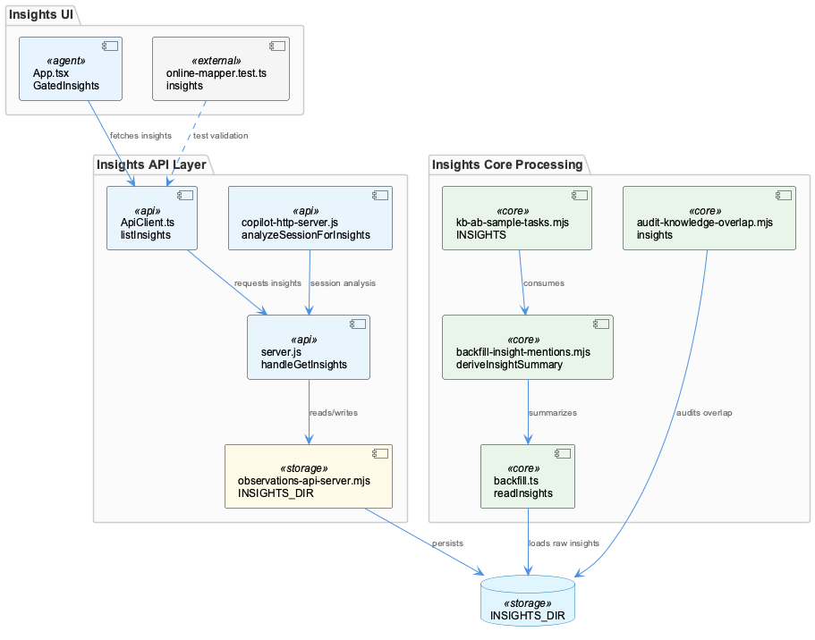
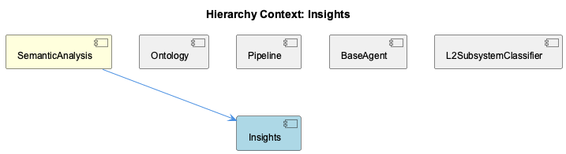

# Insights

**Type:** SubComponent

This sub-component sits downstream of both Pipeline persistence and Ontology classification, consuming their outputs rather than producing raw entities itself

# Insights — Technical Insight Document

## What It Is

Insights is a SubComponent of SemanticAnalysis that occupies the final stage of the batch-analysis pipeline. Unlike its siblings Pipeline and Ontology, Insights does not operate on raw extraction output from git history or LSL session data; instead, it consumes already-classified entities produced by the ontology classification stage, deriving higher-order patterns from structured, hierarchically-positioned knowledge rather than unstructured raw entities. Its core responsibilities are twofold: extracting a pattern catalog by aggregating recurring entity/relationship shapes across multiple analyzed sessions or commits, and authoring a knowledge report that compiles both the pattern catalog and generated insights into a human-readable artifact.

## Architecture and Design

The defining architectural decision behind Insights is its strict downstream positioning relative to Pipeline persistence and Ontology classification. This reflects the same separation-of-concerns philosophy established at the SemanticAnalysis level, where extraction (semantic-analysis-agent.ts) is decoupled from classification (ontology-classification-agent.ts). Insights extends this staged pipeline one step further: rather than reprocessing raw entities, it treats ontology-classified output as its sole input contract, ensuring that pattern detection and reporting logic remain agnostic to how entities were originally extracted or classified.

This layered design allows the pattern catalog and knowledge report stages to be tuned or replaced independently of the upstream agents, mirroring the coordinator-driven sequencing used elsewhere in the Pipeline component. The trade-off is that Insights is inherently dependent on the correctness and completeness of the ontology classification stage — any gaps or errors in hierarchical entity placement propagate directly into pattern detection and reporting quality.

## Implementation Details

Two functional steps constitute the implementation of Insights. The first, pattern catalog extraction, scans ontology-classified entities across multiple analyzed sessions or commits to identify recurring entity/relationship shapes — effectively building a catalog of structural motifs that recur throughout the codebase's history. The second, knowledge report authoring, consumes both this pattern catalog and the derived insights themselves, compiling them into a single human-readable output artifact. This two-step design cleanly separates pattern *detection* from pattern *presentation*, allowing each to evolve independently.

## Integration Points

Insights sits at the confluence of two upstream data flows: Pipeline (via its persistence layer) and Ontology (via ontology-classification-agent.ts). As a sibling to both Pipeline and Ontology under the SemanticAnalysis parent, Insights relies on the ontology hierarchy assignments produced by ontology-classification-agent.ts rather than interfacing directly with semantic-analysis-agent.ts's raw extraction output. This makes Insights the terminal consumer in the extraction → classification → insight-generation chain, with no components observed as consuming Insights' own output further downstream.

## Usage Guidelines

Developers extending Insights should preserve its consumption contract: it must only operate on ontology-classified entities, not raw extraction results, to maintain the decoupling that defines the SemanticAnalysis pipeline. When adding new pattern-detection logic, ensure it operates across multiple sessions/commits consistently with the existing pattern catalog extraction approach, and route any new report content through the knowledge report authoring step rather than introducing parallel output artifacts.

## Hierarchy Context

### Parent
- [SemanticAnalysis](./SemanticAnalysis.md) -- [LLM] The batch-analysis workflow is structured as a multi-stage pipeline where semantic-analysis-agent.ts is responsible for extracting raw entities and relationships from git history and LSL (likely 'Language/Session Log') session data, while ontology-classification-agent.ts takes those extracted entities and maps them into a hierarchical ontology structure. This separation of concerns means the extraction logic (identifying what something is—a function, a decision, a bug fix) is decoupled from the classification logic (determining where that entity fits in a broader knowledge hierarchy), allowing each agent to be independently tuned, tested, and potentially swapped out without affecting the other stage's implementation.

### Siblings
- [Pipeline](./Pipeline.md) -- Pipeline stages include a coordinator agent that sequences execution across semantic-analysis-agent.ts and ontology-classification-agent.ts, matching the two-stage extraction/classification split described for SemanticAnalysis
- [Ontology](./Ontology.md) -- ontology-classification-agent.ts consumes entities produced by semantic-analysis-agent.ts and assigns them positions within an upper/lower ontology hierarchy

---

*Generated from 4 observations*
