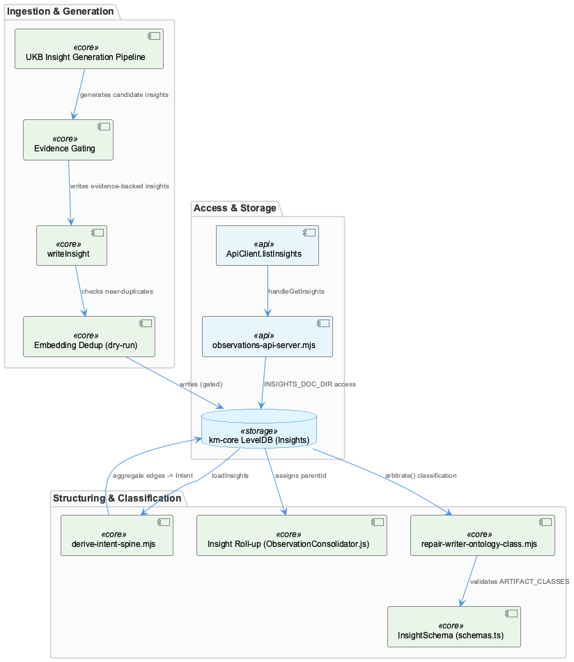
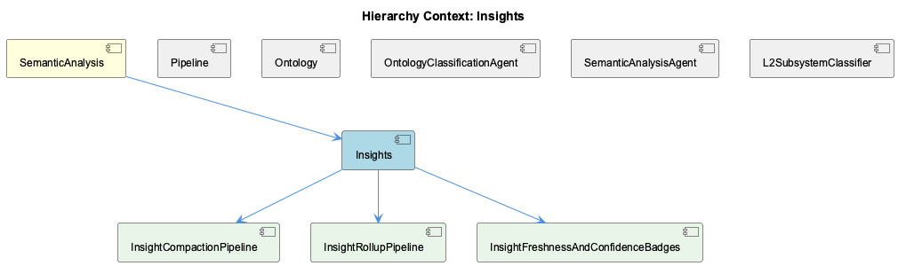

# Insights

**Type:** SubComponent

# Insights — Technical Insight Document

## What It Is

"Insights" is the SubComponent under SemanticAnalysis responsible for the entity type that captures learning artifacts derived from evidence in the knowledge base — distinct from the hierarchy of Project/Component/SubComponent/Detail entities. Critically, the observations reveal that **no retrieved code file implements the Insights write path itself**: there is no `writeInsight`, `InsightWriter`, or embedding-dedup module present in the supplied source. Instead, "Insight" surfaces indirectly, as one label among `ARTIFACT_CLASSES` in `scripts/repair-writer-ontology-class.mjs` (alongside System/Project/Component/SubComponent/Detail/Observation/Digest and their Online* variants), and as a variable/class name scattered across utility scripts (`backfill-insight-parents.mjs`, `delete-wave-insight-stubs.mjs`, `kb-ab-sample-tasks.mjs`, `online-mapper.test.ts`, `audit-knowledge-overlap.mjs`), an API surface (`handleGetInsights` in `server.js`, `listInsights` in `ApiClient.ts`, `InsightSchema` in `schemas.ts`, `INSIGHTS_DOC_DIR` in `observations-api-server.mjs`), and pipeline-derivation code (`loadInsights` in `derive-intent-spine.mjs`). The actual generation, deduplication, and roll-up logic lives in its child components — InsightCompactionPipeline, InsightRollupPipeline, and InsightFreshnessAndConfidenceBadges — and in session-level work records rather than in code checked into this retrieval set.

## Architecture and Design

The dominant architectural pattern visible here is **classification by structural signature rather than self-reported type**. `repair-writer-ontology-class.mjs`'s `arbitrate()` function determines whether a graph row is an Insight or a hierarchy entity by checking for the presence of `metadata.digest_ids`/`digestIds`, `decayBreakdown`, or `topic`, and — more decisively — by which edge type reaches the row: a row reachable only via a `has_insight` edge is treated as a learning artifact and can never resolve to `Detail`, while `contains`/parent-child edges indicate hierarchy membership. This design explicitly distrusts `entityType`/`ontologyClass` and `metadata.hierarchyLevel` as arbiters, having measured that hierarchyLevel backed the wrong field 13 times out of 36 disagreeing rows. This is a deliberate trade-off: graph topology is treated as ground truth over locally-stored classification fields, at the cost of requiring edge traversal for correct classification.

A second pattern is **evidence gating at generation time**: the UKB Insight Generation Pipeline only writes an Insight document when sufficient real evidence exists, preventing empty stub entities and machine-generated garbage from entering the KB — quality control is pushed upstream rather than filtered downstream. Related to this, `delete-wave-insight-stubs.mjs` exists as a corrective mechanism for stubs that slip through.

A third pattern is **derived taxonomy layering**: the Intent Spine Derivation Pipeline (`derive-intent-spine.mjs`, using `loadInsights`) clusters Insights into Intent entities via aggregate edges, producing an intent-first alternate hierarchy rendered in the unified viewer alongside the existing 8-branch code spine — these are compared at "stage 4" to decide enrichment/consolidation structure (UKB Insight Taxonomy). This dual-spine approach is conceptually related to sibling Ontology's exploration of adding an Intent class to the coding ontology itself, though the observations note these are distinct efforts.

## Implementation Details

Insight roll-up assignment — how individual insights/observations attach to SubComponent parents — is implemented in `src/live-logging/ObservationConsolidator.js` via `metadata.parentId`, per InsightRollupPipeline; this assignment directly shapes graph distribution (coverage-diversity vs. hub-concentration trade-offs in downstream KB views), though `ObservationConsolidator.js` itself was not present in retrieved files.

At the read/API layer, `handleGetInsights` (server.js) and `listInsights` (ApiClient.ts) expose Insight data to clients, validated against `InsightSchema` (schemas.ts). `INSIGHTS_DOC_DIR` (observations-api-server.mjs) suggests Insight documents are also persisted/served from a filesystem directory alongside the graph store. On the write side, dedup is currently primitive: the writeInsight Embedding-Based Dedup Integration effort is tracked as still-unlanded, gated behind a dry-run flag pending latency/precision validation — implying today's Insight writes rely on exact-match or ID-based dedup rather than semantic similarity, with helper functions like `_jaccard` and `_findSimilarInsightId` appearing in the call graph as candidate dedup machinery.

Downstream, InsightFreshnessAndConfidenceBadges implements `FreshnessBadge` (`integrations/system-health-dashboard/src/pages/insights.tsx`) over `metadata.codeVerification`, with a deliberate three-state contract: no badge when `cv` is undefined, an `UNVERIFIABLE` pill when `totalClaims === 0`, and `FRESH`/`PARTIAL`/`STALE` bands thresholded at 0.7/0.5 — explicitly avoiding a "green-by-default" illusion for zero-evidence insights.

## Integration Points

Insights sits under SemanticAnalysis, which also owns Pipeline, Ontology, OntologyClassificationAgent, SemanticAnalysisAgent, and L2SubsystemClassifier. The parent's known defect — CodingLowerOntologySource being emitted despite documentation forbidding it, a gap between the intended L2 refinement source model and actual emission — is flagged as most attributable to L2SubsystemClassifier, but since Insight entities are downstream consumers of classification output, anyone debugging unexpected source tags on Insight-adjacent output should not assume documented behavior matches reality. Ontology validation/classification wiring (`src/ontology/index.ts`, `createOntologySystem`, `LegacyOntologyAdapter`/`OntologyValidator`/`OntologyClassifier`) is shared infrastructure serving all entity classes, not Insights-specific. Access patterns follow a thin-client-over-HTTP convention against a single-owner km-core LevelDB store, with no direct store access from repair scripts.

## Usage Guidelines

Do not trust `entityType`/`ontologyClass`/`metadata.hierarchyLevel` alone to identify Insight rows in repair or migration tooling — follow the structural-signature and edge-traversal approach used in `arbitrate()`. Respect the evidence-gating contract: never write stub Insight entities without real backing evidence. When adding dedup logic to the write path, keep new embedding-based checks behind a dry-run flag until precision/latency are validated. When rendering freshness/confidence UI, preserve the three-state distinction (absent/UNVERIFIABLE/graded) rather than collapsing zero-evidence cases into a positive-looking default. Finally, treat repair/migration scripts as CLI tools following the dry-run/--apply/--all convention, and be aware that several utility scripts referencing Insight entities (`backfill-insight-parents.mjs`, `delete-wave-insight-stubs.mjs`, `kb-ab-sample-tasks.mjs`) exist but their internal logic remains unverified from this document's source set.

## Code Evidence

Key code artifacts grounding this entity's analysis:

**Structural:**
- INSIGHTS (class) in kb-ab-sample-tasks.mjs
- handleGetInsights (method) in server.js
- listInsights (method) in ApiClient.ts
- InsightSchema (class) in schemas.ts
- loadInsights (function) in derive-intent-spine.mjs
- INSIGHTS_DOC_DIR (class) in observations-api-server.mjs

**Relationships:**
- Calls: _forwardObsApi, get, has, e, _toLegacyDigestRow, _toLegacyInsightRow, _publishEmbeddingEvent, _getSanitizer, _jaccard, _findSimilarInsightId (+10 more)
- Imports: clipboard-button.tsx, ClipboardButton, consolidation-progress.tsx, ConsolidationProgress, InflightInfo, components/markdown-text.tsx, MarkdownText, system-health-dashboard/src/components/ui/badge.tsx, Badge, system-health-dashboard/src/components/ui/button.tsx (+10 more)

**Other:**
- insights (variable) in backfill-insight-parents.mjs
- insights (variable) in delete-wave-insight-stubs.mjs
- insights (variable) in online-mapper.test.ts
- insights (variable) in audit-knowledge-overlap.mjs
- The code graph's key_entities list names an `insights` variable in backfill-insight-parents.mjs, a separate `insights` variable in delete-wave-insight-stubs.mjs, and an `INSIGHTS` class in kb-ab-sample-tasks.mjs — three distinct scripts that read or construct Insight entity sets for parent-backfill, stub deletion, and A/B sample-task generation respectively — but none of their source was included in the retrieved files, so their actual read/write logic against the Insights entity type cannot be verified here.

## Work Record

What working sessions recorded about this entity — decisions taken, problems hit, and why things are the way they are:

- writeInsight Embedding-Based Dedup Integration tracks embedding-based near-duplicate detection being wired into the writeInsight path behind a dry-run flag so live writes are unaffected until latency/precision are validated.
- Intent Spine Derivation Pipeline clusters insights into Intent entities via aggregate edges, giving the KB an intent-first taxonomy layer renderable as an alternate hierarchy in the unified viewer.
- UKB Insight Generation Pipeline — Evidence Gating ensures insight documents are only written when sufficient real evidence exists, preventing empty stub 'Insight' entities from contaminating the knowledge base.
- Insight Roll-up Pipeline assigns observations/insights to SubComponent parent entities via metadata.parentId, implemented in src/live-logging/ObservationConsolidator.js, directly affecting distribution across the graph.
- UKB Insight Taxonomy compares an intent-derived category spine against an existing 8-branch code spine to decide enrichment/consolidation structure at stage 4.
- Pipeline CodingLowerOntologySource Emission Bug documents an unresolved defect where the pipeline's output contains a CodingLowerOntologySource reference despite project documentation stating this source type should never be produced by design, a live discrepancy between the intended L2 refinement source model (coding.lower.json feeding OntologyRegistry, feeding classification) and what the emission path actually surfaces. It is flagged as a genuine gap rather than a documentation error, so anyone investigating why Insight-adjacent output carries an unexpected source tag should not assume current emission behavior matches the documented contract.
- writeInsight Embedding-Based Dedup Integration tracks a recurring, still-unlanded effort to wire embedding-based near-duplicate detection into the writeInsight write path, gated behind a dry-run flag so live writes are unaffected until latency and precision are validated — indicating the Insights write path currently lacks semantic dedup and relies on whatever dedup exists today (e.g. exact-match or ID-based) until that gate is lifted.
- UKB Insight Generation Pipeline — Evidence Gating and Document Quality establishes that insight documents produced by the UKB wave pipeline are only written when sufficient real evidence exists, specifically to prevent empty stub 'Insight' entities and machine-generated garbage text from contaminating the knowledge base — a quality gate applied at generation time rather than filtered out downstream.

## Hierarchy Context

### Parent
- [SemanticAnalysis](./SemanticAnalysis.md) -- [SESSION] Pipeline CodingLowerOntologySource Emission Bug documents an unresolved defect where the pipeline emits a CodingLowerOntologySource reference in output despite documentation stating this source type should never be produced, indicating a gap between the L2 refinement design and current emission behavior

### Children
- [InsightCompactionPipeline](./InsightCompactionPipeline.md) -- [SESSION] writeInsight Embedding-Based Dedup Integration tracks a separate, still-unlanded effort to wire embedding-based near-duplicate detection directly into the writeInsight path behind a dry-run flag, distinct from this scheduled compaction job.
- [InsightRollupPipeline](./InsightRollupPipeline.md) -- [SESSION] Insight Roll-up Pipeline — Synthesis and Parent Visibility establishes that this component assigns observations/insights to SubComponent 'parent' entities via metadata.parentId, implemented in src/live-logging/ObservationConsolidator.js, and that this assignment directly controls distribution across the knowledge graph — the coverage-diversity-vs-hub-concentration trade-off downstream KB views exhibit. None of the retrieved code files are ObservationConsolidator.js or otherwise contain a parentId-assignment routine, so this observation is reportable only via the work record, not the supplied source.
- [InsightFreshnessAndConfidenceBadges](./InsightFreshnessAndConfidenceBadges.md) -- [LLM] `FreshnessBadge` (integrations/system-health-dashboard/src/pages/insights.tsx) implements a deliberate three-state rendering contract over `metadata.codeVerification`: no badge at all when `cv` is undefined (insight never went through the verifier), a solid-slate `UNVERIFIABLE` pill when `cv.totalClaims === 0` (zero backticked claims to check), and a `FRESH`/`PARTIAL`/`STALE` band from `freshnessClass`/`freshnessLabel` when `verificationRatio` is a number, thresholded at 0.7 and 0.5. The UNVERIFIABLE case is explicitly NOT folded into the FRESH band — the inline comment states this avoids 'the green-by-default illusion that a 0/0 insight is 100% true', i.e. absence of evidence is visually distinguished from strong evidence rather than defaulting to the best-looking state.

### Siblings
- [Pipeline](./Pipeline.md) -- [SESSION] Pipeline CodingLowerOntologySource Emission Bug tracks an unresolved defect where the pipeline emits a CodingLowerOntologySource reference in output despite documentation stating this source type should never be produced, indicating a gap between L2 refinement design and current emission behavior.
- [Ontology](./Ontology.md) -- [SESSION] Coding Ontology — Intent Class Addition explores adding a new Intent class to the coding ontology so entities can be classified by session intent, distinct from the KB's separate intent-spine taxonomy work.
- [OntologyClassificationAgent](./OntologyClassificationAgent.md) -- [SESSION] Coding Ontology — Intent Class Addition is scoped as a distinct ontology-file investigation, separate from classification agent logic but affects what classes this agent can assign.
- [SemanticAnalysisAgent](./SemanticAnalysisAgent.md) -- [SESSION] Taxonomy Stability Validation via Disjoint Sample Re-derivation validates that an intent-derived taxonomy is stable enough to serve as a fixed spine by re-deriving it independently from disjoint data samples and measuring agreement.
- [L2SubsystemClassifier](./L2SubsystemClassifier.md) -- [SESSION] Pipeline CodingLowerOntologySource Emission Bug is the unresolved defect most directly attributable to this component's L2 refinement design, since the classifier is meant to prevent CodingLowerOntologySource from ever being emitted.

---

*Generated from 26 observations*
