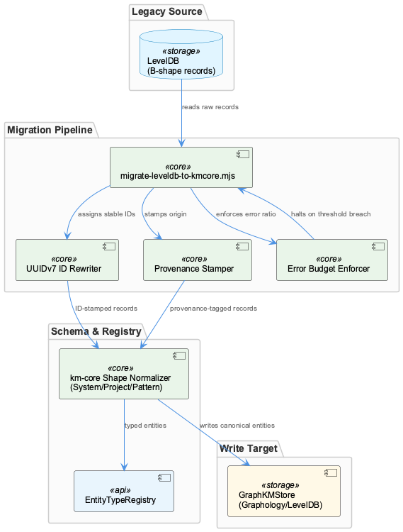
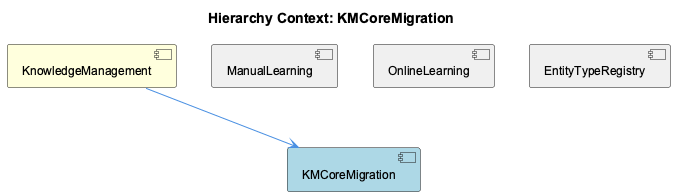

# KMCoreMigration

**Type:** SubComponent

Error budget enforcement within the migration script caps the acceptable ratio of malformed or unresolvable legacy records, halting the pipeline when the threshold is exceeded to prevent corrupt data propagation

## What It Is

KMCoreMigration is a one-time data migration subcomponent within the KnowledgeManagement system, implemented primarily in `migrate-leveldb-to-kmcore.mjs`. Its purpose is to bridge the gap between legacy LevelDB records stored in the "B-shape" format and the typed canonical schema required by the current KnowledgeManagement infrastructure. As documented in `docs/RELEASE-2.0.md`, this migration was a prerequisite for the ontology integration introduced in Release 2.0 — without it, legacy entities could not participate in the EntityTypeRegistry-governed type system (System/Project/Pattern) that the rest of KnowledgeManagement depends on.

The subcomponent sits alongside ManualLearning, OnlineLearning, and EntityTypeRegistry within KnowledgeManagement, but unlike those siblings it is not a continuous pipeline. It is a bounded transformation operation: read legacy records, normalize them, stamp them with provenance, assign stable identifiers, and write them into the same GraphKMStore that all other entity sources use.

---

## Architecture and Design

The migration is architected as a **linear transformation pipeline** with three clearly separated concerns: identity assignment, schema normalization, and write-target integration. These concerns map directly to the three structural problems any legacy migration must solve — "what is this entity called stably?", "what shape does it conform to?", and "where does it live after migration?".

**Identity assignment** is handled via UUIDv7, chosen deliberately over UUIDv4 or legacy B-shape keys. UUIDv7 is time-ordered, meaning migrated entities carry an inherent chronological sort key baked into their identifier. This is a meaningful design decision: it allows downstream graph consumers to order entities by creation time without a separate timestamp field, and it ensures that migrated-legacy entities do not collide with natively-authored entities that the ManualLearning or OnlineLearning pipelines produce after migration.

**Error budget enforcement** is a production-grade design choice that elevates this beyond a simple ETL script. Rather than silently skipping malformed records or propagating them, the pipeline tracks a ratio of unresolvable records and halts when that ratio exceeds a configured threshold. This is a deliberate trade-off: strict halting prevents corrupt data from entering GraphKMStore, at the cost of requiring human intervention when legacy data <USER_ID_REDACTED> is below threshold. The alternative — lenient continuation — would undermine the integrity guarantees that EntityTypeRegistry relies on when classifying entities.

---

## Implementation Details

The core logic lives in `migrate-leveldb-to-kmcore.mjs`. The script reads raw B-shape records from LevelDB — the same LevelDB backend that backs the Graphology in-memory graph described in `docs/architecture/memory-systems.md` — and subjects each record to the following transformation sequence:

1. **Shape normalization**: B-shape attribute structures were historically inconsistent across entity instances. The migration rewrites each record into the `km-core` canonical shape, which maps cleanly onto the three types EntityTypeRegistry recognizes: System, Project, and Pattern. This normalization is what makes migrated entities first-class citizens in the current ontology rather than opaque legacy blobs.

2. **Provenance stamping**: Each migrated entity receives a provenance marker recording its transformation origin. This is architecturally symmetric with how ManualLearning marks entities as human-authored — the same metadata field distinguishes source, but populated with a migration-pipeline value rather than a human-authorship value. This symmetry suggests a shared provenance metadata convention across the KnowledgeManagement system.

3. **UUIDv7 assignment**: The legacy B-shape key is replaced with a UUIDv7 identifier, providing stable, time-ordered identity that survives any future storage layer changes.

4. **Error budget tracking**: The script maintains a running ratio of malformed or unresolvable records. If this ratio crosses the configured threshold, the pipeline halts rather than writing a partially-migrated dataset.

---

## Integration Points

KMCoreMigration's write target is **GraphKMStore**, as documented in `docs/architecture/memory-systems.md`. This is architecturally significant: migrated entities do not go to a separate "legacy" store. They enter the same Graphology/LevelDB stack as entities created by OnlineLearning or ManualLearning. After migration, there is no storage-layer distinction between legacy and native entities — only the provenance stamp on each entity's metadata records its origin.

The migration's output schema is directly consumed by **EntityTypeRegistry**, which enforces the System/Project/Pattern ontology across all entities. The normalization step in the migration pipeline is therefore tightly coupled to EntityTypeRegistry's classification surface: any change to the three-type ontology would require a corresponding update to the migration's normalization logic. This coupling is acceptable given that the migration is a one-time operation, but it means the migration script should be treated as a historical artifact of the Release 2.0 ontology contract.

The relationship with **ManualLearning** is worth noting: both subcomponents produce provenance-stamped entities that enter GraphKMStore, but through different authorship paths. This shared provenance convention implies that whatever system reads provenance metadata — for filtering, auditing, or display — must handle at least three distinct provenance values: migration-pipeline, human-authored, and (via OnlineLearning) automated-online-learning.

---

## Usage Guidelines

Because KMCoreMigration is a one-time migration rather than a continuous subsystem, developers should treat `migrate-leveldb-to-kmcore.mjs` as a **migration artifact** rather than an operational component. It should not be re-run against a database that has already been migrated — doing so risks re-assigning new UUIDv7 identifiers to entities that already have stable IDs, breaking any references in the graph that depend on those IDs.

The error budget threshold deserves explicit configuration attention before any migration run. Since the pipeline halts when malformed-record ratio exceeds the threshold, operators must calibrate this value against the known <USER_ID_REDACTED> of the source LevelDB dataset. A threshold set too tightly will cause unnecessary halts on a dirty-but-recoverable dataset; set too loosely, it will allow corrupt data into GraphKMStore. The correct approach is to run the script in a dry-run or audit mode first to characterize the actual malformed-record ratio before committing to a live write.

Developers extending the EntityTypeRegistry type system beyond System/Project/Pattern must audit the normalization logic in `migrate-leveldb-to-kmcore.mjs` to determine whether any legacy B-shape attributes were mapped to the existing three types in ways that would be invalidated by type additions. Since the migration has presumably already run in production, this audit is about understanding historical data shape rather than modifying the script, but it is necessary for correct interpretation of migrated entities in the graph.

Finally, the provenance stamp written by this pipeline should be treated as immutable metadata. Downstream consumers that branch logic on provenance (distinguishing migrated-legacy from ManualLearning or OnlineLearning sources) depend on this value being stable. Any reprocessing or re-indexing pipeline that touches migrated entities should preserve the original provenance rather than overwriting it with its own stamp.

## Hierarchy Context

### Parent
- [KnowledgeManagement](./KnowledgeManagement.md) -- The KnowledgeManagement component provides the core knowledge graph infrastructure for the Coding project, encompassing persistent storage, entity lifecycle management, and graph query capabilities. It is built on a Graphology in-memory graph with LevelDB as the persistence backend, exposing entities with typed attributes (System, Project, Pattern) and relationships. The system supports both local graph operations and integration with external graph databases like Memgraph via the CodeGraphAgent, which uses Tree-sitter AST parsing to index repositories into a queryable knowledge graph.

### Siblings
- [ManualLearning](./ManualLearning.md) -- ManualLearning entities are distinguished by provenance metadata that marks their origin as human-authored, contrasting with the automated pipeline provenance stamps applied by KMCoreMigration
- [OnlineLearning](./OnlineLearning.md) -- docs/architecture/memory-systems.md describes the Graph-Based Knowledge Storage Architecture that OnlineLearning populates, with Graphology as the in-memory layer backed by LevelDB
- [EntityTypeRegistry](./EntityTypeRegistry.md) -- EntityTypeRegistry enforces a three-type ontology (System/Project/Pattern) as the canonical classification surface, with all incoming entity types mapped through this consolidation layer before graph insertion

---

*Generated from 6 observations*
