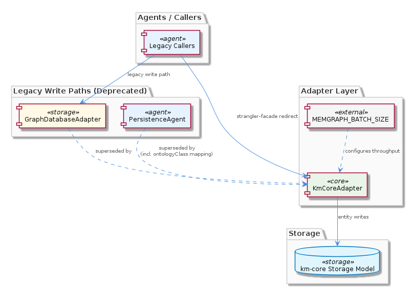
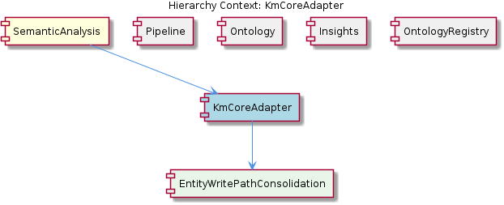

# KmCoreAdapter

**Type:** SubComponent

The strangler-facade pattern means legacy callers can be migrated incrementally: old call sites targeting GraphDatabaseAdapter are redirected to KmCoreAdapter without requiring a simultaneous rewrite of all agents

## What It Is

`KmCoreAdapter` is implemented in `storage/km-core-adapter.ts` and serves as the single canonical write path for entity persistence within the SemanticAnalysis pipeline. It was deliberately created to consolidate responsibilities that were previously fragmented across two legacy classes — `GraphDatabaseAdapter` and `PersistenceAgent` — into one cohesive adapter layer. Within the SemanticAnalysis parent component, it sits alongside sibling components like Pipeline, Ontology, and OntologyRegistry, but occupies a distinct role: while those siblings focus on classification, routing, and schema resolution, `KmCoreAdapter` owns the durability concern exclusively. Its single child component, EntityWritePathConsolidation, reflects this purpose structurally, naming the core architectural motivation directly.

---

## Architecture and Design

The dominant architectural pattern here is the **strangler facade**. Rather than requiring a wholesale rewrite of every agent that previously called `GraphDatabaseAdapter`, `KmCoreAdapter` intercepts those call sites incrementally, presenting a compatible surface while internally delegating to km-core's storage model. This is the same pattern employed by the sibling `LegacyOntologyAdapter`, which wraps the old ontology-loading interface around the new `OntologyRegistry`. The parallel is intentional: the codebase is undergoing a phased migration away from legacy infrastructure, and the facade pattern is the chosen instrument for managing that transition without big-bang rewrites.

The second key design decision is **responsibility absorption**. Previously, `PersistenceAgent` held `mapEntityToSharedMemory()`, which pre-populated `ontologyClass` fields before storage. With `KmCoreAdapter` absorbing the persistence path, that mapping logic has migrated into the adapter layer itself. This is a deliberate inversion: instead of agents being responsible for shaping data into a storage-ready form, the adapter accepts raw agent output and performs the normalization internally. The consequence is that agents in the Pipeline — each extending `BaseAgent<TInput,TOutput>` with its six-step template-method execute sequence — are relieved of storage-format concerns entirely.

A third design decision is **schema isolation**. By routing all writes through `storage/km-core-adapter.ts`, any schema evolution in the underlying km-core storage model is absorbed at this single boundary. Individual agents — `CodeGraphAgent`, `SemanticAnalysisAgent`, `OntologyClassificationAgent`, `ContentValidationAgent` — remain insulated from storage schema changes. This directly reduces the blast radius of km-core upgrades.

---

## Implementation Details

The EntityWritePathConsolidation child component represents the structural manifestation of the consolidation goal: all write paths that were formerly distributed across `GraphDatabaseAdapter` and `PersistenceAgent` now converge through `storage/km-core-adapter.ts`. The pre-existing coordination overhead — where both legacy classes had to be kept in sync on write operations — is eliminated by design, not by process discipline.

Batching behavior is governed by the `MEMGRAPH_BATCH_SIZE` environment variable, which controls throughput tuning at the adapter layer. This is a meaningful separation of concerns: pipeline agents define *what* to write, while the environment configuration defines *how much* to write per batch. Developers tuning pipeline throughput do not need to touch agent business logic, and agents do not need awareness of the underlying graph database's batching characteristics.

The `ontologyClass` field mapping — previously the responsibility of `PersistenceAgent.mapEntityToSharedMemory()` — now lives inside the adapter. Since the Insights sibling component consumes `AgentResponse` envelopes with populated `ontologyClass` fields produced by `OntologyClassificationAgent`, the adapter must ensure this mapping is applied correctly before committing entities, preserving the data contract that downstream insight generation depends on.

---

## Integration Points

`KmCoreAdapter` connects upward to the SemanticAnalysis coordinator, which orchestrates agents following the `BaseAgent` template-method contract. It connects downward to km-core's storage model, acting as the exclusive mediator for write operations. Legacy callers originally targeting `GraphDatabaseAdapter` are redirected here, meaning the adapter must maintain interface compatibility with the old write signatures during the incremental migration.

The sibling OntologyRegistry relationship is indirect but important: `OntologyClassificationAgent` resolves `ontologyClass` values via the registry before handing off an `AgentResponse`, and `KmCoreAdapter` subsequently maps those values into km-core's storage schema. A schema mismatch between what OntologyRegistry resolves and what km-core expects would surface at this adapter boundary. Similarly, the Insights sibling relies on correctly persisted entity data, making `KmCoreAdapter`'s write fidelity a prerequisite for downstream insight <USER_ID_REDACTED>.

---

## Usage Guidelines

Developers adding new entity types or modifying existing ones should treat `storage/km-core-adapter.ts` as the single entry point for all write operations — bypassing it in favor of direct `GraphDatabaseAdapter` calls reintroduces the synchronization problem the consolidation was designed to eliminate. Any agent that produces entities as output (within the six-step `BaseAgent` execute sequence) should hand those entities to `KmCoreAdapter` rather than managing persistence internally.

When km-core's storage schema changes, the change surface is intentionally limited to `storage/km-core-adapter.ts`. Developers should resist the temptation to push schema-specific logic into individual agents, as this would erode the isolation guarantee. Likewise, `MEMGRAPH_BATCH_SIZE` is the correct lever for throughput tuning — adjusting batch sizes inside agent logic is an anti-pattern that would couple agent behavior to infrastructure concerns.

During the ongoing strangler-facade migration, call sites should be redirected to `KmCoreAdapter` one agent at a time. The facade pattern tolerates this incremental pace by design, but teams should track which legacy call sites remain unredirected, as `GraphDatabaseAdapter` and `KmCoreAdapter` operating simultaneously on overlapping write paths risks partial duplication until the migration is complete.

---

## Architectural Patterns, Trade-offs, and Maintainability

**Patterns identified:** Strangler facade (incremental legacy migration), adapter/anti-corruption layer (km-core schema isolation), environment-driven configuration (MEMGRAPH_BATCH_SIZE).

**Key trade-off:** Centralizing all write paths into one file creates a high-value, high-risk boundary. The maintainability benefit — one place to update for schema changes — is real, but it also means bugs in `storage/km-core-adapter.ts` affect the entire write path. This is an accepted trade-off given the previous cost of keeping two legacy classes synchronized.

**Scalability:** The `MEMGRAPH_BATCH_SIZE` mechanism provides a meaningful tuning lever without requiring agent-level changes, which is appropriate for a pipeline that may need to scale batch throughput independently of classification or insight logic.

**Maintainability:** The consolidation pattern is a net positive. The ontology mapping migration into the adapter layer removes an implicit contract that previously existed between `PersistenceAgent` and consumers of `ontologyClass` fields, making that responsibility explicit and locatable. The strangler-facade approach ensures the migration can proceed without destabilizing the broader SemanticAnalysis pipeline.

## Hierarchy Context

### Parent
- [SemanticAnalysis](./SemanticAnalysis.md) -- [LLM] The SemanticAnalysis pipeline is structured around a coordinator pattern where specialized agents each extend BaseAgent<TInput,TOutput> defined in src/agents/base-agent.ts. This base class implements a strict template-method execute() that sequences six steps in order: process(), calculateConfidence(), detectIssues(), generateRouting(), applyCorrections(), and buildMetadata(). Every agent—CodeGraphAgent, SemanticAnalysisAgent, OntologyClassificationAgent, ContentValidationAgent—inherits this contract and returns a uniform AgentResponse envelope. This design means a new developer adding an agent only needs to implement the domain-specific process() logic; confidence scoring, issue detection, and metadata construction are guaranteed to run in a consistent order regardless of which agent is invoked. The tradeoff is that the template method imposes overhead steps even when an agent's output is trivially simple, and agents cannot short-circuit the sequence without throwing exceptions.

### Children
- [EntityWritePathConsolidation](./EntityWritePathConsolidation.md) -- According to the KmCoreAdapter sub-component description, storage/km-core-adapter.ts is the canonical file consolidating write paths that were formerly distributed across GraphDatabaseAdapter and PersistenceAgent, suggesting a deliberate architectural refactor to reduce write-path fragmentation.

### Siblings
- [Pipeline](./Pipeline.md) -- BaseAgent<TInput,TOutput> in src/agents/base-agent.ts enforces a six-step template-method execute() sequence (process, calculateConfidence, detectIssues, generateRouting, applyCorrections, buildMetadata) that all pipeline agents must follow without short-circuiting
- [Ontology](./Ontology.md) -- OntologyClassificationAgent extends BaseAgent and implements domain-specific process() logic for entity type resolution while relying on the base class for confidence scoring and metadata construction
- [Insights](./Insights.md) -- Insight generation runs after ontology classification, consuming AgentResponse envelopes with populated entityType and ontologyClass fields produced by OntologyClassificationAgent
- [OntologyRegistry](./OntologyRegistry.md) -- LegacyOntologyAdapter implements the strangler-facade pattern, exposing the old ontology-loading interface while delegating internally to km-core OntologyRegistry

---

*Generated from 6 observations*
