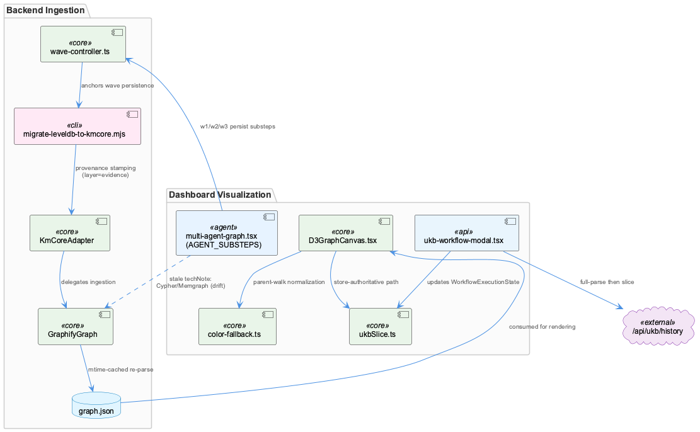
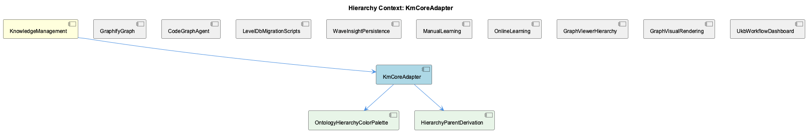

# KmCoreAdapter

**Type:** SubComponent

# KmCoreAdapter — Technical Insight Document

## What It Is

KmCoreAdapter is a SubComponent of KnowledgeManagement that sits conceptually adjacent to GraphifyGraph, the code-structure knowledge reader implemented in `integrations/semantic-analysis/src/agents/graphify-graph.ts`. Where GraphifyGraph normalizes raw graph edges and entities from a static `graph.json` artifact, KmCoreAdapter's two children — OntologyHierarchyColorPalette and HierarchyParentDerivation — implement the corresponding *presentation-layer* normalization, concretely realized in `integrations/unified-viewer/src/graph/color-fallback.ts`. Its role is to adapt an ontology class hierarchy (an arbitrary, potentially deep set of registered classes with parent links) into a small, fixed vocabulary of visual attributes (color, shape) usable by rendering code such as `D3GraphCanvas.tsx`.

## Architecture and Design

The dominant pattern here is **lossy canonicalization via parent-walk**, mirrored directly from GraphifyGraph's `mapRelation()` approach to edge-label collapsing. Both KmCoreAdapter's children and GraphifyGraph take a richer, more varied input space — ontology class hierarchies on one side, raw graphify edge labels on the other — and normalize them down to a small fixed set of outputs for downstream simplicity. In KmCoreAdapter's case, the output space is the five-tier hierarchy System/Project/Component/SubComponent/Detail, split further across two orthogonal families: BATCH_PALETTE (teal-to-light-blue, for batch/manually-imported/migrated entities) and ONLINE_PALETTE (red-to-pink, gated by `isOnlineLearned()` reading `metadata.source`).

This directly parallels the sibling GraphViewerHierarchy/GraphVisualRendering layer's needs and is consumed downstream by `D3GraphCanvas.tsx`, whose ancestry-trace reconciliation logic (`computeAncestryPath` via BFS vs. `deriveAncestryFromStorePath` trusting a store-authoritative path) is architecturally analogous: both prefer a fast, cached/precomputed answer and fall back to local recomputation only when the authoritative source is stale or absent. KmCoreAdapter's parent-walk falls back similarly — first checking a class's own declared style, then a static palette table, then walking to `reg.parent` — before terminating at a hardcoded default.

## Implementation Details

The concrete mechanics live in `color-fallback.ts`'s `nodeFillColor()` and `nodeShapeFor()`, both operating over a `ClassRegistryEntry` map (`registry: ReadonlyMap<string, ClassRegistryEntry>`). Given a `className`, each function resolves through three ordered tiers: (1) an explicit `display.color`/`display.shape` on the class itself, (2) the static `BATCH_PALETTE`/`SHAPE_PALETTE` lookup table, (3) a walk to `reg.parent` repeating the same checks, guarded by a `seen` Set to prevent infinite loops on cyclic registries. If no ancestor yields a match, resolution terminates at `DEFAULT_BATCH` (`#94a3b8`, slate) or `'circle'`.

This is precisely what HierarchyParentDerivation formalizes as a component: visual attributes are resolved not from a node's own declaration but by walking an externally-defined inheritance chain (`ClassRegistryEntry.parent`). OntologyHierarchyColorPalette supplies the actual color/shape tables and online/batch distinction that HierarchyParentDerivation's walk consults at each step. Notably, the two functions are structurally near-identical, and observations flag them as ripe for collapsing into a generic `resolveViaParentWalk(className, registry, extractor, palette, fallback)` higher-order function — a concrete refactor opportunity rather than a speculative one.

## Integration Points

KmCoreAdapter's output feeds directly into GraphVisualRendering and the D3GraphCanvas selection/ancestry model, meaning any change to the ClassRegistryEntry schema or palette tables has immediate, visible downstream effects in the unified-viewer UI. It sits alongside GraphifyGraph (source-of-truth graph data) and CodeGraphAgent within KnowledgeManagement, though notably its normalization logic is implemented entirely independently of the backend's own taxonomy simplification performed by LevelDbMigrationScripts (`migrate-graph-db-entity-types.js`, `migrate-leveldb-to-kmcore.mjs`). There is no shared type definition between the frontend registry-based hierarchy and backend entity-type taxonomy — a drift risk explicitly called out in the observations. Additionally, the wave-based persistence concept (WaveInsightPersistence's w1/w2/w3 substeps, `wave-controller.ts`) and dashboard AGENT_SUBSTEPS entries reflect a related but separate cross-cutting convention that KmCoreAdapter's rendering path does not itself participate in, though both are examples of the same project-wide provenance/classification philosophy (see also `ukbSlice.ts`'s provenance fields).

## Usage Guidelines

Developers modifying the ontology class registry should register `display.color`/`display.shape` explicitly for any new top-level class rather than relying on parent-walk fallback, since unregistered classes silently inherit ancestor styling — a deliberate anti-"grey blob" design, but one that can mask missing registrations. When extending BATCH_PALETTE/ONLINE_PALETTE, maintain the five-tier hierarchy consistently with backend entity-type taxonomy to avoid the drift risk noted above, given there is no enforced shared schema between `color-fallback.ts` and the backend's `kindOf`/`nameOf` migration logic. Given the near-duplication between `nodeFillColor` and `nodeShapeFor`, any future consolidation into a shared `resolveViaParentWalk` helper should preserve the `seen`-guarded cycle protection, as malformed or accidentally-cyclic registry data is the primary correctness risk in this component.

## Hierarchy Context

### Parent
- [KnowledgeManagement](./KnowledgeManagement.md) -- [LLM] The GraphifyGraph reader (integrations/semantic-analysis/src/agents/graphify-graph.ts) represents a deliberate architectural simplification: rather than maintaining a live graph database connection (Memgraph via Cypher), the component now treats a static graph.json artifact produced by the graphify service as the source of truth for code-structure knowledge. This file, a NetworkX node-link JSON export, can be tens of megabytes, so GraphifyGraph implements mtime-based lazy caching — it stat()s the file and only re-parses when the mtime has changed since the last load. This pattern trades real-time graph mutation capability for drastically simpler deployment (no separate DB process) and fast repeated reads, at the cost of only picking up graph changes when the underlying analysis pipeline re-writes graph.json.

### Children
- [OntologyHierarchyColorPalette](./OntologyHierarchyColorPalette.md) -- [LLM] color-fallback.ts implements a five-tier ontology hierarchy palette (System/Project/Component/SubComponent/Detail) split across two orthogonal color families: BATCH_PALETTE (teal-to-light-blue, for batch/manual/migration-imported entities) and ONLINE_PALETTE (red-to-pink, for entities where `isOnlineLearned()` returns true based on `metadata.source`). The `nodeFillColor()` and `nodeShapeFor()` functions both implement an identical parent-walk algorithm over a `ClassRegistryEntry` map: starting at a class name, check the registry's own `display.color`/`display.shape`, then fall back to the hardcoded palette table, then walk to `reg.parent` and repeat, with a `seen` Set guarding against cycles. This means an unregistered subclass (e.g. 'LiveLoggingSystem') inherits its nearest styled ancestor's color rather than falling through to the slate default — a deliberate anti-'grey blob' design documented in the surrounding comments as a fix for entities that used to render as `DEFAULT_BATCH` (#94a3b8).
- [HierarchyParentDerivation](./HierarchyParentDerivation.md) -- [LLM] `nodeFillColor` and `nodeShapeFor` in integrations/unified-viewer/src/graph/color-fallback.ts implement an identical two-function parent-walk pattern: each takes a `className`, a `registry: ReadonlyMap<string, ClassRegistryEntry>`, walks `cur = reg?.parent` in a `while (cur && !seen.has(cur))` loop with a `seen` Set guarding against cycles, and resolves through three tiers in strict order — explicit `display.color`/`display.shape` on the class or an ancestor, then the static `BATCH_PALETTE`/`SHAPE_PALETTE` table on the class or an ancestor, then a hardcoded terminal fallback (`DEFAULT_BATCH` slate / `'circle'`). This is a textbook 'HierarchyParentDerivation' component: it resolves a node's effective visual attribute not from its own declaration but by walking an inheritance chain defined externally in `ClassRegistryEntry.parent`, and the two functions are close enough in structure that a future refactor could trivially collapse them into one generic `resolveViaParentWalk(className, registry, extractor, palette, fallback)` higher-order function.

### Siblings
- [GraphifyGraph](./GraphifyGraph.md) -- [LLM] GraphifyGraph (integrations/semantic-analysis/src/agents/graphify-graph.ts) inverts the conventional graph-database architecture by treating a flat, periodically-regenerated graph.json file as the system of record instead of a live queryable store. The mtime-based lazy-caching strategy — stat() the file, compare against the last-seen mtime, and only re-parse the (potentially tens-of-megabytes) NetworkX node-link export when it changes — is a classic read-heavy optimization, but it also means GraphifyGraph is fundamentally a batch-consistency component: it cannot see a code-structure change until the separate graphify analysis pipeline finishes a full re-write of the JSON artifact. This is architecturally similar to the mtime/staleness problem the dashboard integration explicitly worked around elsewhere in this codebase (system-health-dashboard's bind-mount VirtioFS caching required a forced container restart to invalidate a stale read) — both are instances of 'a file on disk is the API' trading real-time correctness for operational simplicity.
- [CodeGraphAgent](./CodeGraphAgent.md) -- [LLM] There is a concrete documentation-drift artifact visible in integrations/system-health-dashboard/src/components/workflow/multi-agent-graph.tsx: the `AGENT_SUBSTEPS['code_graph']` array still describes its `query` sub-step with `techNote: 'Cypher queries on Memgraph'` (multi-agent-graph.tsx, code_graph entry, 'query' id). This directly contradicts the parent-context claim that CodeGraphAgent now delegates every call to GraphifyGraph's static graph.json reader and no longer speaks Cypher to a live Memgraph instance. Because this dashboard copy is what renders in the UKB workflow visualization modal (ukb-workflow-modal.tsx via MultiAgentGraph), any operator inspecting the live workflow graph is shown stale technology labels for a component whose backend was already migrated — exactly the kind of subtle trap the parent observation warned about with `checkMemgraphConnection` being a preserved-but-stubbed method name.
- [LevelDbMigrationScripts](./LevelDbMigrationScripts.md) -- [LLM] The two migration scripts referenced in the parent context — migrate-graph-db-entity-types.js and migrate-leveldb-to-kmcore.mjs — represent sequential, non-idempotent phases of the same underlying transition: first a taxonomy simplification (collapsing TransferablePattern/WorkflowPattern/TechnicalIssue into System/Project/Pattern) performed in-place against the live Graphology in-memory graph, then a structural re-platforming that assigns UUIDv7 identifiers, a layer='evidence' classification, and a legacyId.system='B' backward-reference tag to every entity. Because the second script depends on entities already conforming to the three-category taxonomy (any code still testing for the old fine-grained type strings would silently fail), these scripts form an implicit ordering contract that is not enforced by any shared orchestration file — a developer running migrate-leveldb-to-kmcore.mjs before migrate-graph-db-entity-types.js has completed would migrate stale/incorrect type data into the new km-core shape with no runtime error to signal the mistake.
- [WaveInsightPersistence](./WaveInsightPersistence.md) -- [LLM] The 'persistence' entry in AGENT_SUBSTEPS (integrations/system-health-dashboard/src/components/workflow/multi-agent-graph.tsx) models WaveInsightPersistence as three explicit, sequential sub-steps — w1 ('Wave 1 Persist', L0 Project + L1 Component entities), w2 ('Wave 2 Persist', L2 SubComponent entities), and w3 ('Wave 3 Persist', L3 Detail entities plus operator-refined fields and embeddings). All three declare llmUsage: 'none' and techNote: 'GraphDB + LevelDB storage', confirming that persistence itself is a pure storage operation with no LLM calls — the LLM work (pattern discovery, entity extraction, classification) happens upstream in kg_operators/semantic_analysis/insight_generation, and persistence's job is purely to commit already-synthesized entities. Notably w3's techNote uniquely adds 'direct attribute merge', implying Wave 3 does not simply insert new nodes but merges operator-enriched fields (e.g. embeddings) onto entities that may already exist from earlier waves — a detail not present in w1/w2, suggesting Wave 3 is where duplicate-entity reconciliation actually happens rather than at insight-generation time.
- [ManualLearning](./ManualLearning.md) -- [LLM] The ukb-workflow-modal.tsx file documents its own evolution through inline comments rather than commit messages — the HISTORY_PAGE_SIZE constant carries a multi-paragraph comment explaining that raising it from 50 to 500 was 'close to free' because /api/ukb/history parses every report regardless of limit and only slices at the end. This is a case of manual/institutional learning being encoded directly in source as a durable artifact: a future maintainer who considers lowering this constant for 'performance' will read the comment and understand the tradeoff (response size vs. server work) before making that mistake again, effectively preventing regression of a fix that had no automated test to catch it.
- [OnlineLearning](./OnlineLearning.md) -- [LLM] The 'OnlineLearning' distinction is implemented as a data-driven color/shape overlay rather than a structural entity type: `integrations/unified-viewer/src/graph/color-fallback.ts` defines two parallel palettes, `BATCH_PALETTE` (teal/blue shades keyed by hierarchy depth: System/Project/Component/SubComponent/Detail) and `ONLINE_PALETTE` (red/pink shades for the same hierarchy levels), and `classColor()` picks between them purely based on whether `isOnlineLearned({ metadata: { source } })` returns true. This means 'online-learned' is not a first-class ontology class but a metadata flag (`source: 'auto'` or `'online'`) riding along on any entity, decoupled from what class/type that entity otherwise has.
- [GraphViewerHierarchy](./GraphViewerHierarchy.md) -- [LLM] D3GraphCanvas.tsx (integrations/unified-viewer/src/graph/D3GraphCanvas.tsx) is an explicit, well-documented port of a Redux-based component (memory-visualizer's GraphVisualization.tsx) into a Zustand-store-driven architecture, but it does not simply swap state libraries — it re-derives a large amount of selection/ancestry logic to keep two independently-maintained rendering paths (this D3/SVG canvas and a parallel Sigma/WebGL canvas referenced in comments as 'graph-builder.ts') in sync. The `deriveAncestryFromStorePath()` function is the clearest evidence of this: rather than trusting either the store's `pathToSelected` set or its own inline `computeAncestryPath()` BFS in isolation, it runs both and reconciles them with a 'writer's intent wins' rule — nodes the store claims are in-path but the local BFS can't reach get a synthetic max-depth slot so they still render, while nodes the BFS finds but the store doesn't tag are dropped. This reconciliation is a symptom of maintaining two rendering engines against one shared selection model without a shared traversal implementation.
- [GraphVisualRendering](./GraphVisualRendering.md) -- [LLM] The GraphVisualRendering surface is split across two independently-evolved implementations that never share code: `integrations/system-health-dashboard/src/components/workflow/multi-agent-graph.tsx` renders the UKB workflow pipeline as a fixed-topology SVG (`WAVE_AGENTS`, `KG_OPERATOR_CHILDREN`, `MULTI_AGENT_EDGES` from `./constants`), while `integrations/unified-viewer/src/graph/D3GraphCanvas.tsx` renders the knowledge graph itself as a force-directed D3 simulation (`d3.forceSimulation` + `d3.forceLink(150)` + `d3.forceManyBody(-500)`). The former is a static, hand-authored process diagram; the latter is a dynamic layout engine over live entity/relation data pulled through `useGraphData`. They happen to share the word 'graph' and the general shape of node/edge rendering, but there is no common rendering abstraction, color resolver, or type between them — any visual-consistency fix (e.g. dark-mode palette) has to be applied twice.
- [UkbWorkflowDashboard](./UkbWorkflowDashboard.md) -- [LLM] The HISTORY_PAGE_SIZE constant in ukb-workflow-modal.tsx (currently 500, previously 50) documents a concrete production incident in its own comment block: with the old cap, `/api/ukb/history` silently truncated the report list at 50 entries even though 119+ reports existed, making the single most important run — the batch-analysis run whose Pipeline Totals card shows commits/sessions/entity counts — permanently unreachable from the UI because it sat at position ~51. The fix works because the API route reads and parses every report on every call regardless of `limit`, slicing only at the very end, so raising the page size costs response payload size (roughly 13 header fields per report) rather than server-side work. This is a case where a UI paging constant silently created a data-loss illusion — the data was never lost, just permanently unreachable — and the comment functions as a postmortem note baked directly into source rather than a separate incident doc.

---

*Generated from 10 observations*
