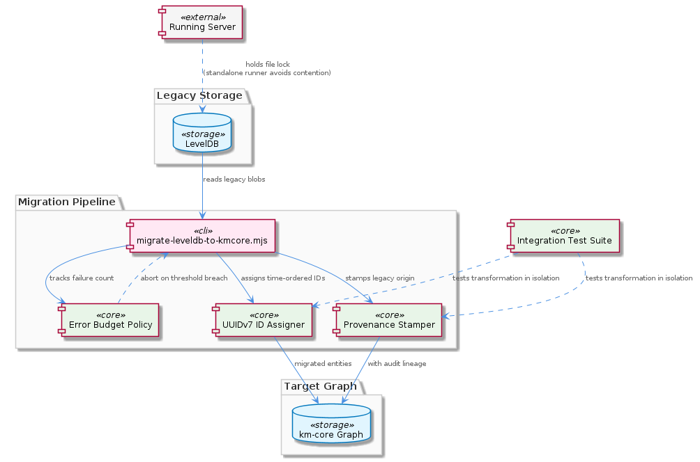
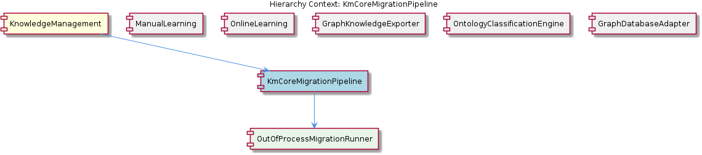

# KmCoreMigrationPipeline

**Type:** SubComponent

The error-budget exit policy — aborting migration after a configurable threshold of transformation failures — prevents silent partial migrations where some entities land in km-core shape while others remain as legacy blobs in the same graph

# KmCoreMigrationPipeline — Technical Insight Document

## What It Is

The `KmCoreMigrationPipeline` is a one-shot transformation pipeline that converts legacy LevelDB blob entities into the km-core graph shape used by the current `KnowledgeManagement` subsystem. Its primary implementation lives in `scripts/migrate-leveldb-to-kmcore.mjs`, which is the single executable entry point for the migration. Test coverage is provided by `src/migration/migrate-leveldb-to-kmcore.test.ts`, which exercises the transformation logic in isolation from the live graph database, confirming that the conversion rules are independently verifiable without standing up the full storage stack.

The pipeline exists to bridge two eras of the knowledge graph: the pre-km-core era, in which entities were stored as opaque LevelDB blobs, and the post-adoption era, in which entities carry canonical UUIDv7 identifiers and provenance metadata. As a `SubComponent` of `KnowledgeManagement`, it sits alongside runtime concerns like `ManualLearning` and `OnlineLearning` but is operationally distinct — it runs offline, outside the server process, and is invoked deliberately rather than triggered by user activity.

## Architecture and Design

The defining architectural decision of this pipeline is its **out-of-process execution model**. The migration runner is implemented as a standalone `.mjs` ES-module script (`scripts/migrate-leveldb-to-kmcore.mjs`) rather than as an importable library module within the running server. This is not a stylistic preference: it is a hard concurrency constraint. LevelDB enforces single-process file locking, and the parent `KnowledgeManagement` component's `GraphDatabaseAdapter` already has elaborate machinery (probing `VkbApiClient.isServerAvailable()` at initialization) to avoid double-ownership of that lock. The migration pipeline reinforces the same contract from the opposite direction — by being a separate process, it can never accidentally compete with the server for the LevelDB lock, because the operator must explicitly choose which one runs. The child `OutOfProcessMigrationRunner` makes this design choice explicit and documented.

This separation produces a clean two-layer architecture inside the pipeline: a **transformation core** (covered by `src/migration/migrate-leveldb-to-kmcore.test.ts`) that is pure, testable, and graph-database-agnostic, and a **runner shell** (`scripts/migrate-leveldb-to-kmcore.mjs`) that handles I/O, lock ownership, and process lifecycle. Because the transformation logic is decoupled from the live database, regression tests can pin its behavior without the cost or fragility of bootstrapping LevelDB or the VKB HTTP server.

A second architectural pillar is the **error-budget exit policy**: the migration aborts after a configurable threshold of transformation failures. This converts what could be a silently degraded partial migration into a loud, recoverable failure — preventing the catastrophic mixed-state scenario where some entities exist in km-core shape and others remain as untransformed legacy blobs in the same graph.

## Implementation Details

The pipeline performs three primary operations on each legacy entity it encounters:

1. **UUIDv7 ID assignment.** Every legacy blob is given a canonical UUIDv7 identifier. Because UUIDv7 embeds a millisecond timestamp into the leading bits, the assigned IDs are time-ordered. This enables two downstream properties that the post-migration graph relies on: chronological traversal (entities can be iterated in approximate creation order without a separate timestamp index) and deduplication (collisions become detectable because the same logical content cannot accidentally produce two non-overlapping IDs from independent runs).

2. **Provenance stamping.** Each migrated entity receives a provenance stamp that distinguishes it as a pre-existing legacy entity, separating it from entities created natively after km-core adoption. This audit lineage is preserved permanently in the graph and is the canonical way to answer "was this knowledge present before the migration?" without resorting to indirect heuristics.

3. **Error-budget gating.** As the runner processes blobs, it tracks transformation failures against a configurable threshold. Exceeding the threshold aborts the run rather than allowing the migration to limp forward. This is the safety mechanism that makes the all-or-nothing semantic actually enforceable in practice.

The `OutOfProcessMigrationRunner` child encapsulates the process-lifecycle aspects: opening LevelDB directly (since no server is running), iterating legacy entries, invoking the transformation core, writing km-core-shaped results, and tearing down cleanly. The `.mjs` extension and ES-module form are intentional — the runner is meant to be invoked via `node` directly, not imported.

## Integration Points

The pipeline integrates with the rest of `KnowledgeManagement` through the LevelDB store itself rather than through the runtime adapter layer. Where sibling components such as `ManualLearning` and `OnlineLearning` write through `GraphDatabaseAdapter` (which dynamically routes to either `VkbApiClient` REST endpoints or a direct `GraphDatabaseService`), the migration pipeline deliberately bypasses that adapter. It must own the LevelDB file lock outright for the duration of its run, which is incompatible with the adapter's dual-access design.

Downstream consumers — including the `GraphKnowledgeExporter` attached at adapter initialization, and the `OntologyClassificationEngine` living inside `PersistenceAgent` — observe the migrated entities transparently. They do not need to know whether a given entity came from the legacy blob world or was authored natively; the UUIDv7 IDs and provenance stamps make migrated entities indistinguishable in shape from native ones, with the audit lineage preserved as metadata.

The test integration point is `src/migration/migrate-leveldb-to-kmcore.test.ts`, which validates the transformation independently. This separation is what permits confident iteration on the transformation rules without requiring a full migration dry-run on real data.

## Usage Guidelines

**Stop the server before running the migration.** This is the cardinal rule. The migration script (`scripts/migrate-leveldb-to-kmcore.mjs`) opens LevelDB directly. The VKB HTTP server, if running, holds the same file lock via the path established by `GraphDatabaseAdapter`. Running both simultaneously will fail at best and corrupt data at worst. The out-of-process design is the structural safeguard, but the operational discipline must match.

**Treat the error budget as a tripwire, not a target.** The configurable failure threshold exists to abort the migration loudly when something is systematically wrong with the legacy data shape — not to tolerate a small number of "expected" failures. If the budget is exceeded, investigate the failing entities before rerunning. Do not raise the threshold to make the migration pass.

**Run the migration exactly once per data set.** The UUIDv7 IDs assigned during migration become canonical. Rerunning the migration on an already-migrated store will either no-op (if the runner detects migrated entities by their provenance stamps) or produce duplicates. Take a backup of the LevelDB directory before invoking the script so that a clean rerun is always possible.

**Trust the test suite for transformation correctness.** Because `src/migration/migrate-leveldb-to-kmcore.test.ts` covers the transformation logic in isolation, changes to mapping rules should be validated there first. Do not use the live migration as a debugging tool — its job is to apply correct rules to real data, not to discover what the correct rules are.

**Preserve provenance downstream.** The provenance stamps the migration writes are the only durable record that an entity predates km-core adoption. Subsequent processing — exports via `GraphKnowledgeExporter`, classification via `OntologyClassificationEngine`, edits via `ManualLearning` — must not strip these stamps, or the audit lineage is permanently lost.

---

### Summary of Architectural Insights

1. **Patterns identified:** out-of-process execution to avoid file-lock contention; separation of pure transformation core from I/O runner shell; error-budget circuit breaker for all-or-nothing migration semantics; time-ordered canonical IDs (UUIDv7) as a structural enabler for downstream traversal and deduplication; provenance stamping for permanent audit lineage.

2. **Design decisions and trade-offs:** Choosing `.mjs` standalone script over importable module trades convenience (no programmatic invocation from the server) for safety (no possible lock collision). The error-budget abort trades partial progress for consistency. Isolating tests from the live database trades end-to-end realism for fast, reliable regression coverage.

3. **System structure:** The pipeline is a peripheral, offline component of `KnowledgeManagement`, deliberately decoupled from the `GraphDatabaseAdapter` dual-access path used by `ManualLearning`, `OnlineLearning`, and `GraphKnowledgeExporter`. Its single child, `OutOfProcessMigrationRunner`, embodies the execution-isolation contract.

4. **Scalability considerations:** The migration is single-process and bounded by LevelDB read throughput. Because it is run once per data set, horizontal scaling is irrelevant; the error-budget mechanism is the primary defense against scale-induced failure modes (e.g., a small percentage of bad blobs in a large corpus).

5. **Maintainability assessment:** High. The transformation logic is independently testable, the runner is a small focused script, the failure mode is loud rather than silent, and provenance stamps allow post-hoc reasoning about migration outcomes indefinitely. The main maintenance risk is operational — forgetting to stop the server before invocation — which is mitigated by the structural separation but not eliminated.

## Hierarchy Context

### Parent
- [KnowledgeManagement](./KnowledgeManagement.md) -- [LLM] The `GraphDatabaseAdapter` in `storage/graph-database-adapter.ts` implements a lock-free dual-access architecture that elegantly solves a fundamental LevelDB limitation: only one process can hold the file lock at a time. At initialization, the adapter dynamically imports `VkbApiClient` and calls `isServerAvailable()` to probe whether the VKB HTTP server is running. If the probe succeeds, all subsequent entity reads and writes are routed through the REST API layer (`VkbApiClient`), effectively delegating the LevelDB ownership to the server process. If the probe fails — meaning the server is stopped or unreachable — the adapter falls back to constructing a direct `GraphDatabaseService` instance that opens LevelDB itself. This conditional initialization means the adapter never attempts to open the LevelDB file-lock when the server already holds it, preventing the silent data corruption or startup crash that would otherwise occur if both paths competed for the same lock. The dynamic import of `VkbApiClient` (rather than a static top-level import) is a deliberate design choice: it avoids loading unnecessary network client code when the fallback path is taken, and it ensures the availability check happens at runtime with real network state rather than at module-load time. A new developer should understand that this dual-access pattern is not a graceful-degradation afterthought — it is the primary concurrency contract of the entire storage layer.

### Children
- [OutOfProcessMigrationRunner](./OutOfProcessMigrationRunner.md) -- scripts/migrate-leveldb-to-kmcore.mjs is the single entry point for the migration, implemented as a top-level .mjs ES-module script rather than an importable library — this design choice is explicitly documented in the component description to avoid dual file-lock ownership between the migration and the live server process.

### Siblings
- [ManualLearning](./ManualLearning.md) -- GraphDatabaseAdapter routes manual entity writes through VkbApiClient REST endpoints when the VKB HTTP server is available, ensuring human-authored edits land in the server-owned LevelDB instance rather than a competing direct connection
- [OnlineLearning](./OnlineLearning.md) -- The batch analysis pipeline feeds extracted entities through GraphDatabaseAdapter, which at runtime selects the REST API path (VkbApiClient) or direct GraphDatabaseService path based on server availability probed in storage/graph-database-adapter.ts
- [GraphKnowledgeExporter](./GraphKnowledgeExporter.md) -- GraphDatabaseAdapter in storage/graph-database-adapter.ts attaches the exporter at initialization, meaning the export sync lifecycle is tied to the adapter's own lifetime rather than being independently managed
- [OntologyClassificationEngine](./OntologyClassificationEngine.md) -- The engine lives inside PersistenceAgent and wraps @fwornle/km-core's OntologyRegistry, meaning ontology classification is a persistence-time concern rather than an extraction-time concern
- [GraphDatabaseAdapter](./GraphDatabaseAdapter.md) -- storage/graph-database-adapter.ts probes server availability at initialization via VkbApiClient.isServerAvailable(), selecting the REST path or direct LevelDB path before any entity operations are attempted

---

*Generated from 5 observations*
