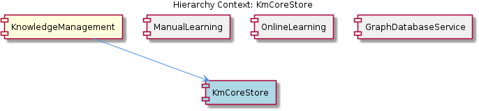
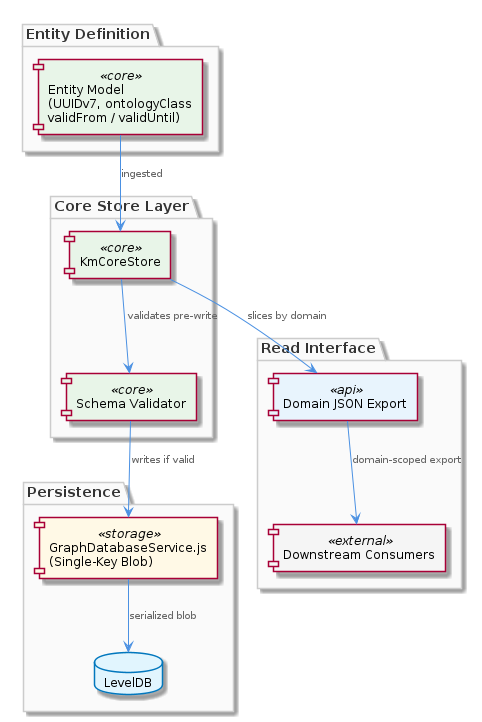

# KmCoreStore

**Type:** SubComponent

validFrom/validUntil decay fields on each entity implement a temporal validity model, allowing knowledge to expire without deletion — this is applied at the canonical store level before serialization into the LevelDB blob

# KmCoreStore — Technical Insight Document

## What It Is

KmCoreStore is a subcomponent within the KnowledgeManagement system responsible for canonical entity schema enforcement, temporal validity modeling, and domain-scoped read interfaces over the underlying graph storage. It sits between the raw persistence layer — implemented in `GraphDatabaseService.js` as a single-key LevelDB blob — and the consumers that write or read structured knowledge entities. Because the storage layer itself provides no schema enforcement (it serializes the entire Graphology graph as one opaque JSON blob under the key `'graph'`), KmCoreStore assumes responsibility for validating entity structure before any write reaches `GraphDatabaseService.js`.

KmCoreStore operates as the canonical contract layer for all entities entering the graph, defining what a well-formed entity looks like and ensuring that constraint is upheld application-side rather than database-side.

## Architecture and Design

The central architectural reality shaping KmCoreStore's design is that `GraphDatabaseService.js` enforces nothing — it accepts whatever Graphology graph state it is given and serializes it wholesale. This pushes all data integrity responsibility upward. KmCoreStore responds to this by acting as a pre-write validation and normalization gate. Schema validation must occur before write, not as a side effect of storage, which means KmCoreStore's validation logic is on the critical path for every mutation made by sibling components ManualLearning and OnlineLearning.

The canonical entity format KmCoreStore enforces carries three distinct structural requirements working together: a UUIDv7 identifier for each entity, ontology classification metadata (`entityType`, `metadata.ontologyClass`), and temporal validity fields (`validFrom`, `validUntil`). These are not independent features — they compose a design where entities are globally addressable, semantically typed, and time-bounded without requiring deletion workflows. The choice of UUIDv7 specifically (time-ordered UUIDs) reflects a decision to preserve insertion-time ordering information within the identifier itself, which is meaningful in a system where automated extraction pipelines (OnlineLearning) and manual edits (ManualLearning) both contribute entities asynchronously.

The temporal validity model (`validFrom`/`validUntil`) is applied at the KmCoreStore level before serialization into the LevelDB blob. This is a deliberate architectural decision: knowledge decay is modeled as a property of the entity, not as a deletion event, meaning the graph blob retains expired entities and validity filtering is a read-time concern. This trades storage compactness for auditability and reversibility.

## Implementation Details

KmCoreStore's schema validation operates application-side, enforcing that every entity carries its UUIDv7 identifier, its ontology classification fields, and its temporal validity range before the entity is handed off to `GraphDatabaseService.js` for inclusion in the in-memory Graphology graph. Since `GraphDatabaseService.js` defers actual LevelDB writes using the `isDirty` flag pattern — mutations mark the graph dirty but do not immediately call `_persistGraphToLevel()` — KmCoreStore's pre-write validation is the only guaranteed checkpoint before a potentially unvalidated entity could reside silently in memory awaiting a flush.

The ontology classification fields (`entityType` and `metadata.ontologyClass`) serve a dual purpose: they are required metadata enforced by KmCoreStore at write time, and they enable downstream consumers to filter or route entities by type without traversing the full graph. This is particularly relevant given that the entire graph is stored as one blob — per-entity type indexing does not exist at the storage layer, so encoding type directly on each entity is the only way to support type-aware reads without deserializing and traversing the full graph structure.

KmCoreStore also exposes per-domain JSON exports, providing a read interface that slices the monolithic graph blob into domain-scoped subsets. This partially addresses the single-key storage limitation of `GraphDatabaseService.js`: while writes remain coarse-grained (full graph serialization), reads can be scoped to a domain without exposing the full blob to consumers. The mechanics of this slicing rely on the ontology classification metadata being reliably present on every entity — which circles back to why that metadata is a required field rather than optional.

## Integration Points

KmCoreStore sits directly upstream of `GraphDatabaseService.js` in the write path and downstream of both ManualLearning and OnlineLearning, which are its two primary mutation sources. ManualLearning writes directly to the Graphology in-memory graph and relies on the `isDirty`/flush cycle; OnlineLearning's automated extraction pipelines follow the same pattern. In both cases, KmCoreStore's validation gate must be respected for the canonical entity format to be maintained — if either sibling bypasses KmCoreStore and writes directly to the graph, the blob may contain structurally non-conformant entities that will silently persist.

The relationship with the parent KnowledgeManagement system is one of constraint compensation: because KnowledgeManagement's chosen storage strategy (single-key LevelDB via `GraphDatabaseService.js`) provides no structural guarantees, KmCoreStore exists to supply them. The per-domain export interface KmCoreStore exposes also serves KnowledgeManagement-level consumers who need scoped reads without taking a dependency on the full graph blob.

## Usage Guidelines

Any code path that constructs or mutates an entity destined for the graph must pass through KmCoreStore's validation before calling into `GraphDatabaseService.js`. This is non-negotiable given that the storage layer will accept and persist whatever it receives. Entities must carry a UUIDv7 identifier (not UUIDv4 or a sequential integer), both `entityType` and `metadata.ontologyClass` must be populated, and `validFrom`/`validUntil` must be set even for entities intended to be indefinitely valid (use a far-future `validUntil` rather than omitting the field).

Developers should treat expired entities (where `validUntil` is in the past) as logically absent but physically present in the blob. Do not rely on deletion to remove expired knowledge — the temporal model is designed around expiry, and read-time filtering on `validUntil` is the correct pattern. When using per-domain JSON exports, ensure ontology classification fields are correctly set at write time, since the domain-scoping logic depends entirely on that metadata being present and accurate on every entity.

Given the `isDirty`/flush risk inherited from `GraphDatabaseService.js`, any workflow that writes through KmCoreStore must ensure the flush cycle is explicitly triggered downstream, or validated entities will remain only in memory. This is a shared concern with ManualLearning and OnlineLearning and represents the primary durability risk in the current architecture.

## Hierarchy Context

### Parent
- [KnowledgeManagement](./KnowledgeManagement.md) -- [LLM] The primary persistence mechanism in KnowledgeManagement is a single-key LevelDB strategy implemented in `src/knowledge-management/GraphDatabaseService.js`. Rather than storing each graph entity as a separate LevelDB key (which would enable partial reads and atomic per-entity updates), the entire Graphology in-memory graph is serialized as one JSON blob stored under the key `'graph'`. This blob contains all nodes, edges, and metadata. Writes are deferred using an `isDirty` flag — mutations to the graph set `isDirty = true`, and `_persistGraphToLevel()` is only called when a flush is explicitly triggered. This design optimizes for read-heavy, batch-write workloads but creates a risk of data loss if the process crashes between mutations and the next flush. New developers should be aware that any code path that modifies graph nodes or edges must ensure the flush cycle is triggered, or changes will silently remain only in memory.

### Siblings
- [ManualLearning](./ManualLearning.md) -- Manual edits write directly to the Graphology in-memory graph via GraphDatabaseService.js, setting the isDirty flag but not automatically triggering _persistGraphToLevel(), meaning unsaved manual edits are at risk of loss if flush is not explicitly called
- [OnlineLearning](./OnlineLearning.md) -- Automated extraction pipelines write nodes and edges into the Graphology graph managed by GraphDatabaseService.js, relying on the isDirty/flush cycle for durability rather than per-write persistence
- [GraphDatabaseService](./GraphDatabaseService.md) -- GraphDatabaseService.js implements a single-key LevelDB strategy storing the entire Graphology graph as one JSON blob under key 'graph', trading partial-read capability for simplicity

---

*Generated from 5 observations*
