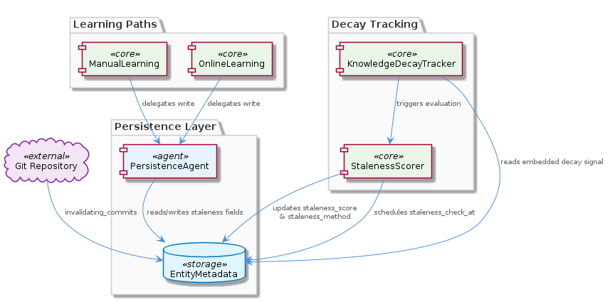
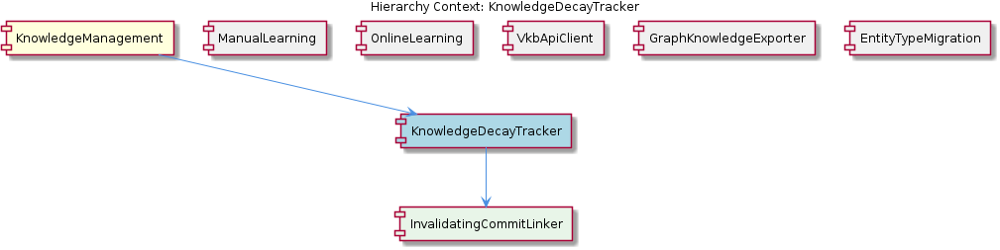

# KnowledgeDecayTracker

**Type:** SubComponent

PersistenceAgent manages reads and writes of staleness fields, centralizing the logic for updating decay state so that neither ManualLearning nor OnlineLearning write paths need to implement staleness logic directly

# KnowledgeDecayTracker — Technical Insight Document

## What It Is

KnowledgeDecayTracker is a SubComponent of the broader KnowledgeManagement system that tracks the validity and freshness of stored knowledge entities over time. Rather than existing as a standalone service with its own data store, it is implemented as a set of fields embedded directly within `EntityMetadata` — the metadata structure attached to every typed entity (Project, Component, SubComponent, Pattern, Detail, System) in the Graphology in-memory graph backed by GraphDatabaseService and LevelDB. The tracker's responsibility is to quantify how "stale" any given piece of recorded knowledge has become as the underlying code evolves, and to record the evidence and methodology behind that judgment.

The core fields managed by KnowledgeDecayTracker include `staleness_score` (a numeric value supporting range <USER_ID_REDACTED> and threshold-based policies), `staleness_check_at` (a timestamp recording when the last evaluation occurred), `staleness_method` (an identifier for the algorithm or heuristic that produced the current score), and `invalidating_commits` (a list linking specific git commits to the entity they may have invalidated). Together these fields turn every entity into a self-describing record of its own decay state, allowing downstream consumers to reason about knowledge freshness without performing additional lookups.

## Architecture and Design

The architectural approach is best described as **co-located metadata** rather than a separate decay tracking store. By embedding staleness state directly in `EntityMetadata`, KnowledgeDecayTracker ensures that every entity read returns its own decay signal as part of the same query. This eliminates the need for join-like operations across separate stores and aligns with the broader KnowledgeManagement design of returning rich, self-contained entity records from either the lock-free VKB HTTP API or the direct LevelDB fallback path.

A second key design decision is the separation of measurement from evidence. The numeric `staleness_score` exists alongside the structured `invalidating_commits` list, meaning the system records *both* a summary signal usable for fast range <USER_ID_REDACTED> and the underlying observations that justify it. The `staleness_method` field complements this by recording which algorithm produced a given score, supporting auditability and allowing different scoring methods to be compared or rolled out incrementally without losing historical context. This is a deliberate trade-off favoring transparency and methodological evolvability over schema simplicity.

The tracker also delegates population of `invalidating_commits` to its child component, InvalidatingCommitLinker. Without that commit linkage, staleness scores would be purely time-based and blind to actual code change history — so the parent/child split cleanly separates "what the score is" (KnowledgeDecayTracker) from "what evidence supports it" (InvalidatingCommitLinker).

## Implementation Details

The mechanics of staleness tracking are centralized in PersistenceAgent, which manages all reads and writes of the staleness fields. By funneling staleness mutations through a single agent, the codebase avoids duplicating decay logic across multiple write paths. Specifically, the sibling components ManualLearning and OnlineLearning — both of which create or update entities in the GraphDatabaseService-backed graph — do not need to implement staleness logic themselves. ManualLearning writes typed nodes using the same ontology classification as automated entities, and OnlineLearning's batch analysis pipeline (which ingests git history, LSL sessions, and code analysis outputs) produces entities through the same write surface. In both cases, the decay-related metadata is handled by PersistenceAgent.

The `staleness_score` field is numeric specifically to enable range <USER_ID_REDACTED> and threshold-based decay policies — for example, retrieving all entities above a given staleness threshold, or filtering by decay bands. The `staleness_check_at` timestamp supports scheduling: future decay evaluations can prioritize entities that have not been re-scored recently, enabling work-shedding and incremental re-evaluation rather than full graph passes.

The `invalidating_commits` field, populated via InvalidatingCommitLinker, ties knowledge validity directly to the git history of the underlying codebase. When a commit modifies files or symbols associated with an entity, the linker records that commit ID against the entity's metadata. This converts what would otherwise be an abstract "time has passed" signal into a concrete causal link: *this knowledge may be invalid because this specific commit changed the code it describes*.

## Integration Points

KnowledgeDecayTracker integrates with the rest of the system primarily through `EntityMetadata`, which is the shared shape used by all typed nodes in the GraphDatabaseService graph. Because staleness fields are part of this common metadata, any consumer of entities — including the VKB HTTP API exposed via VkbApiClient (located at `lib/ukb-unified/core/VkbApiClient.js` and dynamically imported with a fallback to direct LevelDB access) — receives decay state implicitly with every entity read.

The tracker integrates with write paths through PersistenceAgent rather than directly. ManualLearning and OnlineLearning, the two principal entity producers in KnowledgeManagement, both write through this agent, ensuring uniform application of staleness updates. The sibling GraphKnowledgeExporter, which subscribes to `entity:stored` events emitted by GraphDatabaseService, naturally picks up staleness fields as part of the exported entity payloads, propagating decay signals to downstream consumers in an eventually consistent manner.

The downward integration is with InvalidatingCommitLinker, which acts as the producer for the `invalidating_commits` field. The relationship is explicit: KnowledgeDecayTracker defines the field's location and semantics within `EntityMetadata`, and InvalidatingCommitLinker is responsible for populating it. This separation means that improvements to commit-linkage heuristics can evolve independently of the surrounding staleness scoring logic.

Note that KnowledgeDecayTracker is unrelated to sibling EntityTypeMigration (`scripts/migrate-graph-db-entity-types.js`), which is a one-shot consolidation script for legacy entity type names rather than a runtime decay mechanism — though the migration does ensure that staleness fields apply uniformly across the canonical six-type entity set.

## Usage Guidelines

Developers working with knowledge entities should treat the staleness fields as **read-anywhere, write-through-PersistenceAgent**. Because every entity read already includes `staleness_score`, `staleness_check_at`, `staleness_method`, and `invalidating_commits`, consumers should never need a separate query to determine an entity's decay state — and conversely, should not attempt to maintain a parallel staleness store. When filtering or sorting entities by freshness, use `staleness_score` directly in range <USER_ID_REDACTED>; when scheduling re-evaluation, use `staleness_check_at` to prioritize the oldest evaluations.

When introducing new write paths or learning pipelines, follow the convention established by ManualLearning and OnlineLearning: do not implement staleness logic inline. Instead, route writes through PersistenceAgent so that decay updates remain centralized and uniformly applied. This preserves the architectural invariant that staleness logic lives in exactly one place, which in turn keeps `staleness_method` values meaningful across all entities.

When evolving scoring algorithms, always update the `staleness_method` field alongside `staleness_score`. Because the method identifier is recorded with each score, the system can distinguish between scores produced by different algorithms over time. This supports A/B comparisons, gradual rollouts, and post-hoc auditing — but only if the method field is conscientiously updated whenever the scoring logic changes. Similarly, when modifying or extending the heuristics in InvalidatingCommitLinker, remember that the `invalidating_commits` field is the primary evidence record backing any score, and its semantics (potentially invalidating, not definitively invalidating) should be preserved by any new linkage strategy.

## Hierarchy Context

### Parent
- [KnowledgeManagement](./KnowledgeManagement.md) -- The KnowledgeManagement component provides graph-based knowledge storage, entity lifecycle management, and query capabilities for the Coding project. At its core it combines a Graphology in-memory graph with LevelDB persistent storage (via GraphDatabaseService), accessed either through a lock-free VKB HTTP API when the server is running or through direct file access as a fallback. The component manages typed entities (Project, Component, SubComponent, Pattern, Detail, System) with rich metadata including ontology classification, bi-temporal staleness tracking, embedding vectors, and hierarchy relationships.

### Children
- [InvalidatingCommitLinker](./InvalidatingCommitLinker.md) -- The parent analysis explicitly names the invalidating_commits field within EntityMetadata as the artifact this logic populates, establishing a direct dependency: without commit linkage, staleness scores would be purely time-based and blind to actual code change history.

### Siblings
- [ManualLearning](./ManualLearning.md) -- ManualLearning entities are stored as typed nodes (Project, Component, SubComponent, Pattern, Detail, System) in the GraphDatabaseService-backed graph, using the same ontology classification fields as automated entities
- [OnlineLearning](./OnlineLearning.md) -- The batch analysis pipeline ingests git history, LSL sessions, and code analysis outputs, mapping findings to the canonical typed entity set (Project, Component, SubComponent, Pattern, Detail, System) before writing to GraphDatabaseService
- [VkbApiClient](./VkbApiClient.md) -- VkbApiClient is located at lib/ukb-unified/core/VkbApiClient.js and is dynamically imported at runtime, so callers must handle the case where the import fails (server not running) and fall back to direct LevelDB access
- [GraphKnowledgeExporter](./GraphKnowledgeExporter.md) -- GraphKnowledgeExporter subscribes to entity:stored events emitted by GraphDatabaseService, making exports eventually consistent with writes rather than synchronously blocking them
- [EntityTypeMigration](./EntityTypeMigration.md) -- scripts/migrate-graph-db-entity-types.js consolidates legacy entity type names into the canonical six-type set (Project, Component, SubComponent, Pattern, Detail, System), rewriting node attributes in the Graphology graph

---

*Generated from 5 observations*
