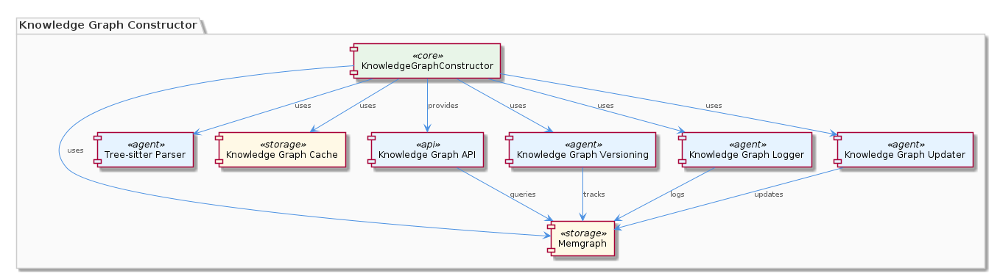
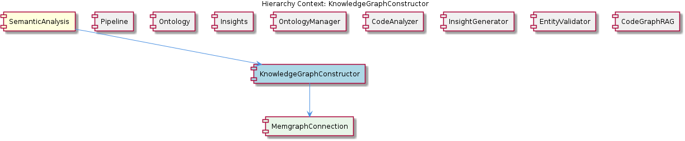

# KnowledgeGraphConstructor

**Type:** SubComponent

The KnowledgeGraphConstructor provides an API for querying the knowledge graph, allowing other sub-components to retrieve knowledge graph information, as referenced in the integrations/mcp-server-semantic-analysis/src/agents/knowledge-graph-constructor.ts file.

## What It Is  

The **KnowledgeGraphConstructor** lives under the SemanticAnalysis component and is implemented across a set of focused TypeScript modules in the `integrations/mcp-server-semantic-analysis/src/agents/` directory. The core orchestration lives in `knowledge-graph-constructor.ts`, which wires together a **MemgraphConnection** (its child) for persistence, a **Tree‑sitter parser** (`tree-sitter-parser.ts`) for AST extraction, a **cache layer** (`knowledge-graph-cache.ts`), a **versioning subsystem** (`knowledge-graph-versioning.ts`), a **logger** (`knowledge-graph-logger.ts`), and an **updater** (`knowledge-graph-updater.ts`). Together these modules expose an API that other sub‑components—such as the OntologyManager, InsightGenerator, or CodeGraphRAG—can call to query or mutate the knowledge graph.

> **Location of implementation**  
> - `integrations/mcp-server-semantic-analysis/src/agents/knowledge-graph-constructor.ts`  
> - `integrations/mcp-server-semantic-analysis/src/agents/tree-sitter-parser.ts`  
> - `integrations/mcp-server-semantic-analysis/src/agents/knowledge-graph-cache.ts`  
> - `integrations/mcp-server-semantic-analysis/src/agents/knowledge-graph-versioning.ts`  
> - `integrations/mcp-server-semantic-analysis/src/agents/knowledge-graph-logger.ts`  
> - `integrations/mcp-server-semantic-analysis/src/agents/knowledge-graph-updater.ts`

The constructor therefore acts as the **graph‑engine façade** for the broader multi‑agent SemanticAnalysis pipeline, translating raw code artefacts into a persisted, query‑able graph representation.

---

## Architecture and Design  

The design follows a **modular, layered architecture** that isolates distinct responsibilities into dedicated agents. The parent `SemanticAnalysis` component already adopts a multi‑agent pattern, and KnowledgeGraphConstructor extends this by treating each concern—parsing, persistence, caching, versioning, logging, and updating—as its own agent‑module.  

* **Persistence Layer** – `knowledge-graph-constructor.ts` creates and owns a `MemgraphConnection` instance, delegating all graph writes and reads to Memgraph, a native graph database optimized for high‑velocity edge traversal.  
* **Parsing Layer** – The `TreeSitterParser` (implemented in `tree-sitter-parser.ts`) leverages the Tree‑sitter library to produce language‑agnostic ASTs. These ASTs become the raw material for graph nodes and relationships.  
* **Caching Layer** – Frequently accessed metadata (e.g., node IDs, schema fragments) are stored in an in‑memory cache defined in `knowledge-graph-cache.ts`. The cache reduces round‑trips to Memgraph and speeds up read‑heavy workloads.  
* **Versioning Layer** – `knowledge-graph-versioning.ts` records each mutation as a versioned snapshot, enabling time‑travel queries and audit trails.  
* **Logging Layer** – `knowledge-graph-logger.ts` writes structured logs for every graph change, supporting observability and debugging.  
* **Update Layer** – `knowledge-graph-updater.ts` exposes mutation APIs that allow other agents to apply dynamic changes (e.g., adding new code entities after a git push).  

These layers interact through well‑defined TypeScript interfaces, with the constructor acting as the façade that other agents call. The **API** surface is declared in `knowledge-graph-constructor.ts`, offering methods such as `queryGraph()`, `addNode()`, and `getVersion()`.  

---

## Implementation Details  

### Core Orchestration (`knowledge-graph-constructor.ts`)  
The file defines a `KnowledgeGraphConstructor` class that holds references to all supporting agents. Its constructor instantiates `MemgraphConnection`, injects the `TreeSitterParser`, and wires the cache, versioning, logger, and updater. Typical workflow:  

1. **Parse** – Source files are fed to `TreeSitterParser.parse(fileContent)`, returning an AST.  
2. **Transform** – The AST is traversed to produce graph entities (nodes/edges).  
3. **Cache Check** – Before persisting, the constructor queries `KnowledgeGraphCache` for existing metadata to avoid duplicate inserts.  
4. **Persist** – Using `MemgraphConnection.executeCypher(query, params)`, the graph is updated.  
5. **Version & Log** – After a successful write, `KnowledgeGraphVersioning.recordChange()` creates a new version entry, and `KnowledgeGraphLogger.logChange()` emits a structured log entry.  

### Tree‑sitter Parser (`tree-sitter-parser.ts`)  
Exports a `TreeSitterParser` class with a `parse(content: string): ASTNode` method. The parser abstracts the underlying Tree‑sitter bindings, exposing a uniform AST shape that the constructor can consume regardless of the source language.

### Caching (`knowledge-graph-cache.ts`)  
Implements a simple LRU or TTL‑based in‑memory map (`Map<string, any>`). Public methods include `get(key)`, `set(key, value)`, and `invalidate(key)`. The cache is refreshed automatically after each successful graph mutation.

### Versioning (`knowledge-graph-versioning.ts`)  
Maintains a version counter stored in Memgraph (e.g., a `Version` node). Each mutation appends a `CHANGE` relationship from the previous version node to a new version node, preserving the full change history. The module provides `getCurrentVersion()` and `checkoutVersion(versionId)`.

### Logging (`knowledge-graph-logger.ts`)  
Wraps a structured logger (e.g., Winston) to emit JSON logs that include operation type, affected node IDs, timestamps, and version numbers. This log stream can be consumed by the broader Observability stack of the platform.

### Updater (`knowledge-graph-updater.ts`)  
Exposes high‑level mutation functions such as `addCodeEntity(entity)`, `removeObsoleteNode(nodeId)`, and `batchUpdate(changes[])`. These functions coordinate cache invalidation, version bumping, and logging, ensuring atomicity at the application level.

### Memgraph Connection (`MemgraphConnection`)  
Although not listed as a separate file, the child component encapsulates the low‑level driver for Memgraph, handling connection pooling, retry logic, and Cypher query execution. All other agents rely on this abstraction rather than speaking directly to the database.

---

## Integration Points  

* **Parent – SemanticAnalysis** – The constructor is instantiated by the SemanticAnalysis orchestrator and participates in its DAG‑based execution model. Other agents such as `OntologyClassificationAgent` or `CodeGraphAgent` invoke the constructor’s API to enrich the graph with classification results or code‑graph edges.  
* **Sibling Components** –  
  * **Pipeline** – The DAG scheduler may place the KnowledgeGraphConstructor step after code parsing, ensuring that the graph is built before downstream validation.  
  * **Ontology / OntologyManager** – These agents consume the graph via the constructor’s query API to align extracted entities with the hierarchical ontology definitions.  
  * **Insights / InsightGenerator** – Insight generation queries the graph for patterns (e.g., “high‑fan‑out nodes”) using the constructor’s read methods.  
  * **CodeAnalyzer & CodeGraphRAG** – These agents provide raw code artefacts that are parsed by the Tree‑sitter component before being fed into the graph.  
* **External Dependencies** – Memgraph (graph DB), Tree‑sitter (AST library), and the internal structured logger. The caching layer is internal but may be swapped for a distributed cache if needed.  

All interactions are mediated through TypeScript interfaces defined in `knowledge-graph-constructor.ts`, guaranteeing compile‑time safety across the component boundary.

---

## Usage Guidelines  

1. **Prefer the façade API** – Directly calling Memgraph or the cache from other agents bypasses versioning and logging. Always use the methods exposed by `KnowledgeGraphConstructor`.  
2. **Cache Discipline** – After any mutation, invoke the updater’s `invalidateCache(key)` (or rely on the updater’s built‑in invalidation) to keep the in‑memory view consistent.  
3. **Version Awareness** – When performing long‑running analyses, fetch the current version (`getCurrentVersion()`) before starting and re‑validate after the analysis completes to avoid stale reads.  
4. **Error Handling** – All async methods return promises that reject on Cypher errors or parsing failures. Wrap calls in `try/catch` and log via `KnowledgeGraphLogger` to maintain the audit trail.  
5. **Batch Updates** – For bulk code imports, use `KnowledgeGraphUpdater.batchUpdate(changes[])` to reduce round‑trips and trigger a single version bump.  
6. **Testing** – Mock `MemgraphConnection` and the cache when unit‑testing agents that depend on the constructor; integration tests should spin up a local Memgraph instance to verify Cypher semantics.  

---

## Summary of Architectural Insights  

| Item | Insight |
|------|---------|
| **Architectural patterns identified** | Modular layered design, façade pattern for graph access, separation of concerns via dedicated agents (parsing, caching, versioning, logging, updating). |
| **Design decisions and trade‑offs** | • Using Memgraph gives native graph performance but adds operational overhead. • Tree‑sitter provides language‑agnostic parsing at the cost of an additional native dependency. • In‑memory caching improves read latency but requires careful invalidation to avoid stale data. • Versioning enables auditability and time‑travel queries but increases storage and write complexity. |
| **System structure insights** | KnowledgeGraphConstructor sits under the parent `SemanticAnalysis` and owns a `MemgraphConnection` child. It interacts with sibling agents (Pipeline, OntologyManager, InsightGenerator, etc.) through a clean TypeScript API, fitting into the overall multi‑agent DAG workflow. |
| **Scalability considerations** | • Memgraph’s horizontal scaling (sharding) can handle large codebases. • Cache reduces read pressure, supporting high‑throughput query workloads. • Versioning may become a bottleneck for extremely frequent mutations; consider snapshot pruning. • The updater’s batch API mitigates write amplification. |
| **Maintainability assessment** | High maintainability thanks to single‑responsibility modules, explicit interfaces, and consistent naming. The clear separation of logging, versioning, and caching simplifies debugging. The main risk lies in cache coherence and version migration, which require disciplined testing and documentation. |

These observations provide a grounded view of how the **KnowledgeGraphConstructor** is architected, implemented, and integrated within the broader SemanticAnalysis ecosystem, while highlighting the key trade‑offs that influence its scalability and long‑term maintainability.

## Hierarchy Context

### Parent
- [SemanticAnalysis](./SemanticAnalysis.md) -- [LLM] The SemanticAnalysis component employs a multi-agent architecture, utilizing agents such as the OntologyClassificationAgent, SemanticAnalysisAgent, and CodeGraphAgent, to perform tasks such as code analysis, ontology classification, and insight generation. The OntologyClassificationAgent, for instance, is implemented in the file integrations/mcp-server-semantic-analysis/src/agents/ontology-classification-agent.ts and is responsible for classifying observations against the ontology system. This agent-based approach allows for a modular and scalable design, enabling the component to handle large-scale codebases and provide meaningful insights.

### Children
- [MemgraphConnection](./MemgraphConnection.md) -- The KnowledgeGraphConstructor utilizes Memgraph to store and manage the knowledge graph, as mentioned in the project context.

### Siblings
- [Pipeline](./Pipeline.md) -- The Pipeline coordinator uses a DAG-based execution model with topological sort in batch-analysis steps, each step declaring explicit depends_on edges, as seen in the integrations/mcp-server-semantic-analysis/src/agents/ontology-classification-agent.ts file.
- [Ontology](./Ontology.md) -- The OntologyManager uses a hierarchical structure to organize the ontology system, with upper and lower ontology definitions, as seen in the integrations/mcp-server-semantic-analysis/src/agents/ontology-manager.ts file.
- [Insights](./Insights.md) -- The InsightGenerator utilizes the CodeAnalyzer to extract meaningful insights from code files and git history, as referenced in the integrations/mcp-server-semantic-analysis/src/agents/insight-generator.ts file.
- [OntologyManager](./OntologyManager.md) -- The OntologyManager uses a hierarchical structure to organize the ontology system, with upper and lower ontology definitions, as seen in the integrations/mcp-server-semantic-analysis/src/agents/ontology-manager.ts file.
- [CodeAnalyzer](./CodeAnalyzer.md) -- The CodeAnalyzer utilizes a parsing mechanism to extract insights from code files, as implemented in the integrations/mcp-server-semantic-analysis/src/agents/code-analyzer.ts file.
- [InsightGenerator](./InsightGenerator.md) -- The InsightGenerator utilizes the CodeAnalyzer to extract meaningful insights from code files and git history, as referenced in the integrations/mcp-server-semantic-analysis/src/agents/insight-generator.ts file.
- [EntityValidator](./EntityValidator.md) -- The EntityValidator utilizes a set of predefined rules to validate entity content, as implemented in the integrations/mcp-server-semantic-analysis/src/agents/entity-validator.ts file.
- [CodeGraphRAG](./CodeGraphRAG.md) -- The CodeGraphRAG utilizes a graph database to store and manage the code graph, as implemented in the integrations/code-graph-rag/README.md file.

---

*Generated from 7 observations*
